

::: lede

**מרים בן הרוש, לבית דהן** — בפי המשפחה גם "מרי" — נולדה ב-1939 במכנאס שבמרוקו, בתם של **שלום ויקוט דהן**, ועלתה לישראל עם הוריה ב-1956. היא חיה בחולון. בעלה, **מרדכי בן הרוש** (1931–2010), הוא נושאו של [דף מחקר נלווה](../index.html#research-mordechai-benharoush).

המחקר איתר אותה ואת שתי אחיותיה, **רבקה ורחל**, בפנקסי התלמידות של בית הספר לבנות של רשת "כל ישראל חברים" (אליאנס) במכנאס — שלוש רשומות נפרדות מהשנים 1949, 1950 ו-1953, ובשלושתן שמות ההורים **Chalom** ו-**Yacot**. אצל מרי נרשמו גם מקצוע האב ומקום המגורים — בקיצורים שפענוחם, מתוך הפנקסים עצמם, הוא חייט והמלאח הישן. שנת הלידה שבתעודת הזהות, 1939, מתיישבת עם הגיל שנרשם בפנקס.

רשומת העלייה נמצאה: רשימת העולים של האונייה "ירושלים" מ-15.1.1956 רושמת את שלום (1920), יקוט (1921), מרי (1939), רבקה (1944) ורחל (1947); כולם נשלחו לקריית שמונה. מה שטרם נמצא: תיעוד ההורים בירושלים. **כל מסמך שנקרא מופיע פעמיים: קישור אל הרשומה בארכיון שממנו נלקח, וקישור אל עותק שמור בתוך התיקייה הזאת** (ערכי אינדקס וחיפושים מקוונים — בקישור חיצוני בלבד). מה שלא אומת מסומן ככזה, וגם ממצא שלילי נרשם.

:::

**מאיפה להתחיל**

- [מי היא מרים](#s1) — התמצית והנתונים שמסרה המשפחה.
- [שלוש הרשומות במכנאס](#s3) — הפנקסים, שורה-שורה, עם דירוג לכל תא.
- [הזיהוי ושאלת הגיל](#s4) — למה זו אותה משפחה, ואיך נסגר הפער בין 1941 ל-1939.
- [רשומת העלייה](#s5-1) — רשימת "ירושלים", 15.1.1956, שורה-שורה; ומה לא נמצא.
- [הפעולות הפתוחות](#s7) — מה יקדם את המחקר, לפי סדר התועלת.

---

## 1. תמצית

מרים בן הרוש (לבית דהן, בפי המשפחה גם "מרי") נולדה ב-1939 במכנאס שבמרוקו — כך בתעודת הזהות שלה (יום וחודש אינם רשומים), וכך גם עולה מפנקס אליאנס של 1949 — בתם של שלום ויקוט דהן, ועלתה לישראל ב-1956. המחקר איתר אותה ואת שתי אחיותיה, רבקה ורחל, בפנקסי התלמידות של בית הספר לבנות של אליאנס במכנאס, בשלוש רשומות נפרדות מהשנים 1949, 1950 ו-1953.[[1]][[2]][[3]] בשלוש הרשומות מופיעים שמות ההורים **Chalom** ו-**Yacot** — צירוף שאינו חוזר באף אחת משבע רשומות דהן ממכנאס אחרות שבהן נקראו שמות ההורים מהסריקה — עשר רשומות נקראו בסך הכול, ובהן שלוש הרשומות של המשפחה (ובהן משפחה שנייה במלאח הישן שאמה Yacot — אך אביה Salomon, ושניהם נפטרו עד 1949); ביתר 62 הרשומות שאותרו באינדקס שמות ההורים אינם מאונדקסים ולא נבדקו ([N-4](#s9-4)).[[10]] אצל מרי נרשמו גם קיצורים שפענוחם — מתוך הפנקסים עצמם — הוא מקצוע האב, חייט, ומקום המגורים, המלאח הישן של מכנאס (ראו [סעיף 3.1](#s3-1)).

הזיהוי של שלוש הרשומות כמשפחתה של מרים מדורג **כמעט ודאי**. ליבת שלוש הרשומות — שם, גיל ושמות ההורים — **מאומת** בקריאה ישירה מהסריקה; שדות משניים (מגורים, מקצוע, תאריכי כניסה ויציאה) מדורגים בנפרד ב[פרק 3](#s3). הגיל בפנקס 1949 ("10 ans", כלומר ילידת 1939 בקירוב) מתיישב עם שנת הלידה שבתעודת הזהות; הזיכרון המשפחתי של 1941 היה קירוב — ראו [פרק 4](#s4).

רשומת העלייה נמצאה: רשימת העולים של "ירושלים" מ-15.1.1956 (ארכיון המדינה) רושמת את חמשת בני הבית עם שנות לידה, ואת יעד הקליטה — קריית שמונה; באותו עמוד גם אביו של שלום, חביב, שני אחיו — מכלוף על משפחתו ושלומון — ודודתו צפורה ([סעיף 5.1](#s5-1)).[[6]] מה שטרם נמצא: תיעוד ההורים בירושלים. אלה מפורטים ב[פרק 7](#s7) יחד עם הצעדים הבאים. על מרדכי בן הרוש, בעלה, ראו את [הדף הנלווה](../index.html#research-mordechai-benharoush).

## 2. מה ידוע מהמשפחה

המידע שנמסר בפתח המחקר ובמהלכו, והוא הבסיס לזיהוי — לא ראיה בפני עצמו:

- מרים בן הרוש, לבית דהן, "מרי". נולדה במכנאס, מרוקו. בתחילה נמסר 1941; לאחר בדיקה בתעודת הזהות — 1939 (ללא יום וחודש: "00.00.1939"). רבקה (12.09.2026): נולדה **בדצמבר**, ו"שנת הלידה כפי שרשום במרוקו — 1941" — מול 1939 בשלושה מסמכים (תעודת הזהות, פנקס 1949 "10 ans", רשימת 1956); ראו [פרק 4](#s4).
- עלתה לישראל ב-1956 יחד עם הוריה: באונייה **"ירושלים"**, שהגיעה לארץ ב-**15.1.1956** (נמסר 11.09.2026).
- הוריה: שלום ויקוט דהן. שלום — שנת לידתו אינה ידועה למשפחה, וככל הנראה לא למד באליאנס; נפטר ב-15 ביוני, כנראה 1979 (נמסר 11.09.2026; השנה לא ודאית). יקוט — ככל הנראה לא למדה באליאנס; נפטרה ב-3 במרץ 1976 (נמסר 11.09.2026).
- הדרך: דרך **מרסיי**, שם שהו כחודש או יותר; אחרי ההגעה לארץ כחצי שנה בקריית שמונה, ואחר כך ירושלים — הכתובת, "כמדומני", **יוחנן הורקנוס 3** (רבקה, 12.09.2026; נמסר 11.09.2026).
- לא היו לשלום וליקוט ילדים נוספים מלבד מרים, רבקה ורחל — "רק 3 בנות" (אושר שוב 12.09.2026). גרו במלאח הישן (אושר).
- הוריו של שלום: **חביב ומרים דהן**. הוריה של יקוט: **יצחק ורבקה אבוטבול**; שם נעוריה של יקוט — **אבוטבול**. נמסר 11.09.2026. **חביב דהן עלה לארץ יחד עם כל המשפחה ב-1956**; מרים דהן (אשתו) ויצחק ורבקה אבוטבול לא עלו — ככל הנראה נפטרו במרוקו.
- אחיו של שלום: **מכלוף** ו**שלומון** דהן (אושר לאחר שנמצאו ברשימת העולים). **צפורה** שברשימה היא דודתו של שלום, ללא ילדים — לא אמו (נמסר 11.09.2026).
- רבקה (12.09.2026): **שלוש בנות רמת הדסה — מסעודי, רחל ולורט — הן בנות מכלוף, בנות דודתה**; ילדי מכלוף וסמחה כפי שברשימה — "נכון מאוד"; משפחת מכלוף התיישבה אחרי קריית שמונה ב**חיפה**. **שלומון לא נישא מעולם**; השאר לא ידוע. **חביב נקבר בירושלים**. **שלום נפטר ב-1979 בירושלים; שלום ויקוט נקברו בהר המנוחות, גבעת שאול.**
- **משפחת אבוטבול** (רבקה, 12.09.2026): יצחק ורבקה אבוטבול, הורי יקוט, נפטרו במכנאס הרבה לפני 1956 ונקברו שם. אחיה של יקוט: **חנה, ג'מילה ומיכאל מכלוף** אבוטבול. חנה ומיכאל מכלוף עלו לישראל בוודאות כמה שנים לפני 1956 — 1948 או 1949; חנה נישאה עוד במרוקו לבעלה **עזוז** ועלתה איתו. ענף חדש — [סעיף 5.4](#s5-4).
- **הערת זהירות:** גם אחיו הצעיר של מרדכי בן הרוש נמסר בשם "מיכאל מכלוף" ([הדף הנלווה](../index.html#research-mordechai-benharoush)). שני אנשים באותו צמד שמות בשתי המשפחות — אפשרי (מכלוף→מיכאל הוא עברות נפוץ), אבל ייתכן גם בלבול בזיכרון; שניהם מסומנים "טעון אימות" עד שיימצא מסמך לכל אחד.
- אחיות: רבקה ורחל.
- הכירו את מרדכי "באמצעות מכרים משותפים"; מקום החתונה לא ידוע; יש תמונות מהחתונה (רבקה, 12.09.2026).
- בעלה: מרדכי בן הרוש, יליד מכנאס 1928 (צו בית משפט 1990; 1931 בזיכרון המשפחה ובתעודת הזהות עד אז — הדף הנלווה), הוריו יונה ויקוט (פנינה), עלה לבדו בעליית הנוער ב-1947 או 1948; נישאו ב**תל אביב, בספטמבר 1960** (נמסר 12.09.2026); נפטר 2010, קבור בבית העלמין ירקון.
- יקוט דהן לא שינתה את שמה לנורית, למיטב ידיעת המשפחה.
- מרים בחיים, מתגוררת בחולון.

## 3. הממצאים במכנאס — פנקסי אליאנס

בית הספר לבנות של אליאנס במכנאס (École Primaire de Filles — "בית ספר יסודי לבנות") ניהל פנקסי רישום תלמידות. הפנקסים שמורים בארכיון המרכזי לתולדות העם היהודי (CAHJP) בירושלים, סימול AIU‑MA‑240, ואונדקסו על ידי העמותה הישראלית לחקר שורשי המשפחה (IGRA). כל שורה בפנקס רושמת: מספר סידורי, שם המשפחה והשם הפרטי, גיל (או תאריך לידה), שמות ההורים (או האפוטרופוסים), לאום, מקום מגורים ומקצוע ההורים, תאריכי כניסה ויציאה, סיבת היציאה והערות.

[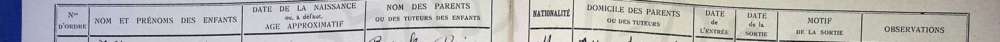](docs/AIU_MA_240.1_40.jpg)

*מפתח העמודות — כותרות הפנקס (1949). משמאל לימין, כסדר הצרפתית: מס' סידורי (Nos d'ordre) · שם ושם פרטי (Nom et prénoms des enfants) · תאריך לידה או גיל משוער (Date de la naissance ou, à défaut, âge approximatif) · שמות ההורים או האפוטרופוסים (Nom des parents ou des tuteurs des enfants) · לאום (Nationalité) · מגורי ההורים או האפוטרופוסים (Domicile des parents ou des tuteurs) · תאריך כניסה (Date de l'entrée) · תאריך יציאה (Date de la sortie) · סיבת היציאה (Motif de la sortie) · הערות (Observations). שלושה טפסים בסריקות: בכרך 1949/1950 — הכותרות שלעיל; בכרך 1953 (עמוד 00028) — "Domicile et profession des parents"; בעמודים המאוחרים של כרך 1953 (עמוד 00065) — "Date et lieu de naissance" ועמודה נוספת, "Dernière école fréquentée" (בית הספר הקודם) — ראו [פרק 4](#s4), הערה 1.*

### 3.1 מרי דהן — פנקס 1949

| שדה | קריאה | דירוג |
|---|---|---|
| מספר סידורי | 1617 (שורה 7 בעמוד) | **מאומת** |
| שם | Dahan Marie | **מאומת** |
| גיל | 10 ans (עשר שנים) | **מאומת** — קריאה ברורה |
| הורים | Chalom · Yacot | **מאומת** — קריאה ברורה |
| לאום | M. (Marocaine — מרוקאית) | **מאומת** |
| מגורים ומקצוע | A.M. · Tail. ind. | **כמעט ודאי** "Ancien Mellah" (המלאח הישן) · "Tailleur indigène" (חייט מקומי) — הפענוח נסמך על הפנקסים עצמם: באותה עמודה בעמוד 1949 מופיעים A.M. ו-N.M. זה לצד זה ו-"Tailleur" כתוב במלואו בשורה הסמוכה (1616); בפנקס 1953 העמודה, שכותרתה "Domicile et profession des parents", כותבת "A. Mellah" ו-"N. Mellah" במלואם |
| תאריך יציאה | 54 | **ככל הנראה** 1954; הספרות קטנות |

[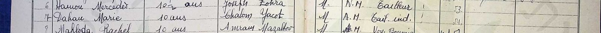](docs/AIU_MA_240.1_40.jpg)

*מרי דהן, פנקס 1949, מספר סידורי 1617 (שורה 7 בעמוד): «Dahan Marie · 10 ans · Chalom Yacot · M. · A.M. Tail. ind. · 54» — דהן מרי · בת 10 · שלום, יקוט · מרוקאית · המלאח הישן, חייט · [יציאה] 54. השורות שמעל ומתחת נשארו לעיגון. המקור: [פנקס אליאנס מכנאס 1949, AIU‑MA‑240.1](#src-1).*

### 3.2 רבקה (Rébéca) דהן — פנקס 1950

| שדה | קריאה | דירוג |
|---|---|---|
| מספר סידורי | 1878 (שורה 8 בעמוד) | **מאומת** |
| שם | Dahan Rébéca | **מאומת** |
| גיל | 7 ans (שבע שנים) | **מאומת** |
| הורים | Chalom · Yacot | **מאומת** — קריאה ברורה |
| כניסה | התא ריק. אין סימני "כנ"ל" בעמודה, ובשורות אחרות באותו עמוד נרשמו תאריכי כניסה עצמאיים ומאוחרים (1873 — "oct 53"; 1888 — "51"). הרישום סמוך לתחילת 1950 נגזר מהמיקום ברצף הסידורי (1871 — "Février 50") | **טעון אימות** — היקש מסדר הרישום, לא קריאה מהשורה |
| יציאה וסיבה | oct 55 · "a quitté" (עזבה) | **ככל הנראה** — כתב יד צפוף |

[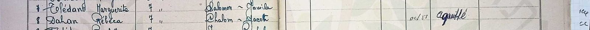](docs/AIU_MA_240.1_51.jpg)

*רבקה דהן, פנקס 1950, מספר סידורי 1878 (שורה 8 בעמוד): «Dahan Rébéca · 7 ans · Chalom ~ Jacot (בדוח מאוחד ל-Yacot — [9.3](#s9-3)) · … oct 55 · a quitté» — עזבה את בית הספר באוקטובר 1955. המקור: [פנקס אליאנס מכנאס 1950](#src-2).*

[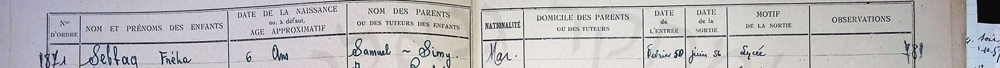](docs/AIU_MA_240.1_51.jpg)

*כותרת העמוד ושורה 1871 (Sebbag Fréha), שבעמודת הכניסה שלה רשום "Février 50". בשורות שאחריה, ובהן שורת רבקה, התא ריק; שורות 1873 ("oct 53") ו-1888 ("51") — בעמוד המלא, מחוץ לחיתוך — מראות שתא ריק אינו "כנ"ל" — ולכן ההיקש על תחילת 1950 נשען על הרצף הסידורי בלבד.*

### 3.3 רחל דהן — פנקס 1953

| שדה | קריאה | דירוג |
|---|---|---|
| מספר סידורי | 3054 (שורה 4 בעמוד); בשולי העמוד, בעיפרון, סדרת מספור ארכיונית (2351, 2352…) שהיא בסיס מספרי המסמכים באינדקס IGRA (מסמך 2354) | **מאומת** |
| שם | Dahan Rachel | **מאומת** |
| גיל | 6 ans (שש שנים) | **מאומת** |
| הורים | Chalom · Yacot | **מאומת** — קריאה ברורה |
| מגורים ומקצוע ההורים | "absente" (נעדרת) — אותה מילה, באותה יד, חוזרת בשורות 3061 ו-3064 באותו עמוד | **ככל הנראה** כקריאה; **טעון אימות** במשמעות — האם נעדרת האם, המידע או הכתובת |
| כניסה | Oct 53 (אוקטובר 1953, בסימן "כנ"ל" מהשורות שמעל) | **ככל הנראה** |

[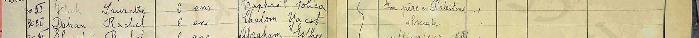](docs/AIU_MA_240.2_00028.jpg)

*רחל דהן, פנקס 1953, מספר סידורי 3054 (שורה 4 בעמוד): «Dahan Rachel · 6 ans · Chalom Yacot · [absente?] · Oct 53». עמודת הלאום מסומנת בסוגר "כנ"ל" מהשורה הראשונה (Marocaine). המקור: [פנקס אליאנס מכנאס 1953, AIU‑MA‑240.2](#src-3).*

### 3.4 מועמדות נוספות שנבדקו בסריקה

בפנקסי מכנאס אותרו באינדקס 69 רשומות של תלמידות בשם דהן מהשנים 1937–1960.[[10]] שלוש מהן דרשו בדיקה בסריקה עצמה (1807, 3289, 1661); רשומה רביעית — Dahan Esther 1636 — אינה בסקר כלל (שמה הפרטי לא נכלל בחיפוש) ונמצאה בקריאה ידנית של עמוד 1949, וכך גם 1802, 1882 ו-1897 ([9.4](#s9-4), N-4). שתיים נשללו לפי שמות ההורים: "Marie Dahan" בפנקס 1950 (מספר סידורי 1807, שורה 17 בעמוד, בת 7) — הוריה Aaron ו-Haciba;[[7]] ו"Rachel Dahan" ילידת 1948 בפנקס 1953 (מספר סידורי 3289, שורה 7 בעמוד) — הוריה Maklouf ו-Flory (ואחריהם שם נעוריה של האם, קטוע: "Guig…", ככל הנראה Guigui — העמוד המאוחר של כרך 1953 רושם גם שמות נעורים) (ואחריהם אסימון שלישי, קטוע בקצה העמודה — ככל הנראה שם נעוריה של Flory, כדפוס העמוד; לא פוענח).[[8]] השלישית, "Dahan Esther" בת 11 בפנקס 1949 (מספר סידורי 1636, באותו עמוד של מרי), הוריה "Salomon (décédé) — Yacot (décédée)" — סלומון ויקוט, שניהם נפטרו — מהמלאח הישן: משפחת דהן שנייה שאמה יקוט, אך אביה סלומון ולא שלום, ושני ההורים נפטרו עד 1949 — בעוד שלום ויקוט עלו ב-1956. **נשלל** כמשפחתה של מרים; נרשם כי הוא מסייג את טענת הייחודיות של הצירוף.[[1]] והרביעית התבררה, לאחר מציאת רשימת 1956, כלא-נשללת כלל: "Rachel Dahan" בפנקס 1949 (מספר סידורי 1661, שורה 21 בעמוד, בת 10) — הוריה Maklouf ו-Simha, האב חייט במלאח החדש, יצאה באוקטובר 1955 ("a quitté")[[9]] — היא רחל בת מכלוף וסמחה, בת-דודתה של מרים, שנרשמה ברשימת "ירושלים" 1956 (שם: ילידת 1941; [סעיף 5.1](#s5-1)) — **כמעט ודאי**: שני מסמכים עם אותם הורים, ואישור המשפחה (רבקה, 12.09.2026). הפירוט המלא ב[סעיף 9.4](#s9-4).

[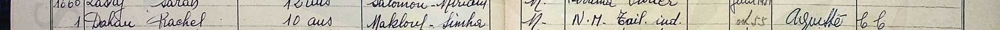](docs/AIU_MA_240.1_41.jpg)

*רחל דהן בת מכלוף וסמחה, פנקס 1949, מספר סידורי 1661: «Dahan Rachel · 10 ans · Maklouf – Simha · M. · N.M. Tail. ind. · oct 55 · a quitté» — בת 10 · מכלוף, סמחה · מרוקאית · המלאח החדש, חייט · יציאה אוקטובר 1955. ככל הנראה בת-דודתה של מרים. המקור: [פנקס אליאנס מכנאס 1949](#src-9).*

[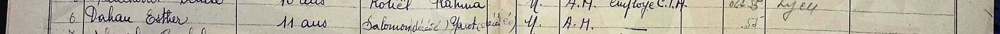](docs/AIU_MA_240.1_40.jpg)

*אסתר דהן, פנקס 1949, מספר סידורי 1636 — באותו עמוד של מרי: «Dahan Esther · 11 ans · Salomon (décédé) Yacot (décédée) · M. · A.M.» — הורים שנפטרו, סלומון ויקוט. משפחה אחרת. המקור: [פנקס אליאנס מכנאס 1949](#src-1).*

## 4. הזיהוי ושאלת הגיל

שלושת הפנקסים מצביעים על משפחה אחת: שלום ויקוט דהן במכנאס, שלוש בנות — מרי, רבקה ורחל — בהפרשי גיל של כארבע שנים (ילידות 1939, 1943 ו-1947 בקירוב, לפי הגילים הרשומים). צירוף השמות Chalom + Yacot אינו חוזר אצל אף משפחת דהן אחרת בפנקסים שנבדקו, ושמות הבנות זהים לשמות שמסרה המשפחה. הזיהוי מדורג **כמעט ודאי** על סמך שלוש הרשומות החיוביות המתכנסות יחד עם השמות שמסרה המשפחה; החיפוש השלילי ([סעיף 9.4](#s9-4)) בפנקסים חלקיים ומאונדקסים ביד תומך בו אך אינו הבסיס לו.

בפתח המחקר נמסר שמרים ילידת 1941, ואילו בפנקס 1949 נרשמה כבת עשר. הפער נסגר: בתעודת הזהות רשומה שנת הלידה 1939 (בלי יום וחודש), בהתאמה לפנקס.[[4]] שלוש ההערות הבאות נשמרות כרקע, כי הגיל בפנקס הוא הערכה גם כשהוא מתיישב:

1. עמודת הגיל בפנקס נושאת את הכותרת "date de la naissance ou, à défaut, âge approximatif" — תאריך לידה, ובהיעדרו גיל משוער. ברוב השורות בעמודי 1949–1950 שנבדקו נרשם גיל מעוגל (7, 8, 10, 10½), אך בחלק מהשורות באותם פנקסים כן נרשמה שנת לידה מדויקת (למשל 1942 בשורה האחרונה בעמוד 1949; בכרך 1953 נרשמים ברוב העמודים גילים — "6 ans" — ובעמודים אחרים שנת לידה בלבד: 1948, 1950, 1951; ובעמודים מאוחרים יותר של אותו כרך — למשל בעמוד 00065, ילידות 1952–1953 — נרשמים תאריכי לידה מלאים: 28-9-1952, 11-12-1952, 3-1-1952, ולצדם גם שם נעוריה של האם, תחת כותרת אחרת: "Date et lieu de naissance"). כלומר "10 ans" של מרי הוא הערכה של הרושם, לא נתון ממרשם; אבל הפנקסים עצמם, בכרכים מאוחרים יותר, כן מחזיקים תאריכי לידה מלאים — ולכן פנקסי הבנים/הבנות של אליאנס במכנאס מהשנים 1953–1956 הם יעד לתאריך הלידה המדויק של רחל (ילידת 1947) ואולי של רבקה ([פרק 7](#s7), פעולה 5).
2. גילים "מעוגלים כלפי מעלה" היו נהוגים ברישום לבתי ספר כדי לעמוד בגיל הקבלה.
3. התאריך המשפחתי 1941 היה קירוב; תעודת הזהות הכריעה.

מרישום "00.00.1939" בתעודת הזהות ניתן להסיק — **ככל הנראה** — שבעת הרישום בישראל לא היה בידי המשפחה תאריך לידה מלא; תאריך מלא, אם קיים, יימצא ברישום האזרחי הצרפתי של מכנאס ([פרק 7](#s7), פעולה 5).

## 5. רשומת העלייה — ומה לא נמצא

### 5.1 רשימת העולים של האונייה "ירושלים", 15.1.1956

ארכיון המדינה מחזיק את רשימות העולים של הסוכנות היהודית (חטיבה גל‑15498 עד גל‑15500).[[6]] בקובץ ינואר–פברואר 1956 (גל‑15498/9), בעמוד 8 של הרשימה שכותרתה «"ירושלים" מיום 15.1.56», נמצא בלוק המשפחה במלואו — בדיוק לפי מה שמסרה המשפחה: האונייה, התאריך, וחמשת בני הבית. עמודות הרשימה: המשפחה והשם · הגיל (שנת לידה) · אב/אם (שמות ההורים של ראש המשפחה) · ארץ מוצא · מס' ת.ע. (תעודת עולה) · בוטח לקופ"ח · בנמל נשלח ל-.

| שדה | קריאה | דירוג |
|---|---|---|
| ראש המשפחה | דהן שלום · 1920 | **מאומת** — מכונת כתיבה, קריאה ברורה |
| הורי ראש המשפחה | חביבי / צפורה | **מאומת** כקריאה; הפירוש — ראו להלן |
| ארץ מוצא · מס' ת.ע. · ביטוח | מרוקו · 91506 · כן | **מאומת** |
| בנמל נשלח ל- | קרית שמונה | **מאומת** |
| בני הבית — השנים | 1921 · 1944 · 1947 · 1939 | **מאומת** |
| בני הבית — השמות | רבקה · רחל · מרי — **מאומת**; יקוט (ושלום) — | **כמעט ודאי** — בסריקה השמורה (800px) הגליפים ט/ם/ש אינם נפרדים בבירור (השוו "בוטח" בכותרת), ולכן "יקוט" ו"שלום" נקראים גם בעזרת השמות שמסרה המשפחה |
| שורה נלווית | "אם: צפורה 1880" | **מאומת** כקריאה; זהותה — ראו להלן |
| ב.נ. | 104931 — מספר אחד לכל הבית, מודפס בסוף הבלוק (מכלוף — 104930; שלומון — 104929; באותו עמוד נכתב במפורש "למשפחה ב.נ. 104857") | **מאומת** |

[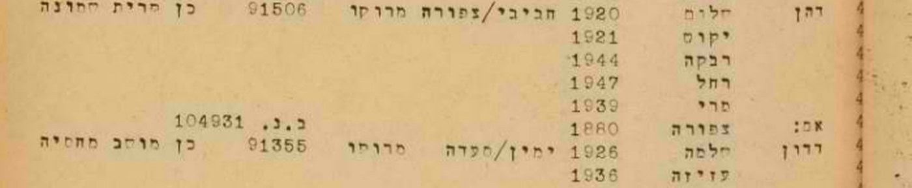](docs/1956-01-15_yerushalayim_p8.jpg)

*שורות משפחת דהן ברשימת "ירושלים" מיום 15.1.1956, עמוד 8: «דהן שלום · 1920 · חביבי/צפורה · מרוקו · 91506 · כן · קרית שמונה», ומתחת: יקוט 1921, רבקה 1944, רחל 1947, מרי 1939, ו"אם: צפורה 1880". המקור: [ארכיון המדינה, גל‑15498/9](#src-6).*

[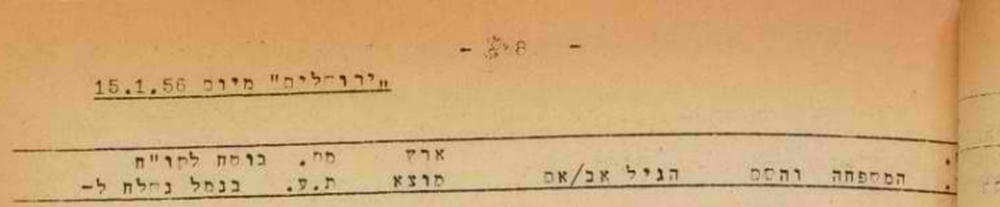](docs/1956-01-15_yerushalayim_p8.jpg)

*כותרת העמוד: «"ירושלים" מיום 15.1.56», מספר העמוד 8, וכותרות העמודות.*

**מה הרשומה קובעת.** זו הרשומה הרשמית הראשונה של המשפחה בישראל, והיא סוגרת את השאלה הפתוחה הראשונה של המחקר (T‑1). היא קובעת במסמך שנות לידה לראשונה: שלום 1920, יקוט 1921 (שהמשפחה לא ידעה), רבקה 1944, רחל 1947. לגבי מרים היא מתיישבת עם "10 ans" של 1949 ועם תעודת הזהות; לגבי רבקה היא מתקנת בשנה את הגיל שנרשם בפנקס (בת 7 בתחילת 1950 → ~1943) — פער של שנה, מאותו סוג שתואר ב[פרק 4](#s4); רחל מתיישבת (בת 6 ב-1953). והיא מאמתת את יעד הקליטה — קריית שמונה — שנמסר מהמשפחה באותו יום, לפני שהעמוד נקרא.[[4]]

**"צפורה" — דודה שנרשמה כאם.** בעמודת ההורים של שלום נכתב "חביבי/צפורה", ומתחת למשפחה שורת "אם: צפורה 1880" — אישה ילידת 1880 בקירוב שהפליגה איתם ונרשמה כנלווית למשפחתו. לפי המשפחה (11.09.2026, לאחר שהעמוד הוצג לה) צפורה היא **דודתו של שלום**, שלא היו לה ילדים — לא אמו; אמו, מרים, לא עלתה.[[4]] הרישום כ"אם" מתיישב עם זה כרישום מנהלי: קרובה מבוגרת וחשוכת ילדים שנלוותה למשפחת אחיינה נרשמה בעמודת ההורים ובשורת "אם"; התוצאה בפועל: היא נכללה בבלוק המשפחתי, בתעודת העולה של הבית (ת.ע. 91506) ובמספר ה-ב.נ. שלו (104931). כך "חביבי/צפורה" אינו זוג הורים ביולוגי אלא האב האמיתי לצד הקרובה הנלווית. **הפירוש מדורג ככל הנראה**: המסמך אומר "אם", המשפחה אומרת "דודה", ובשאלה שהמשפחה יודעת מכלי ראשון עדותה גוברת על רישום מנהלי.

**שני אחים באותו עמוד.** באותו עמוד רשומות עוד שתי משפחות דהן ממרוקו שנשלחו לקריית שמונה, ובשתיהן שמות ההורים "חביב/מרים" — כלומר הוריו של שלום כפי שמסרה המשפחה: **דהן מכלוף**, יליד 1903, עם סמחה 1912, חיים 1926, מרים 1938 וגאולה 1951 (ת.ע. 91496); ו**דהן שלומון**, יליד 1922 (ת.ע. 91497), שאליו נלווה "אב: חביב 1880". המשפחה אישרה: מכלוף ושלומון הם אחיו של שלום.[[4]] כלומר, ב-15.1.1956 ירדו מ"ירושלים" שלושת האחים דהן — מכלוף על משפחתו, שלום על משפחתו ושלומון — אביהם חביב (יליד ~1880) ודודתם צפורה (~1880) — שלוש-עשרה נפש בבלוקים האלה — וכולם נשלחו לקריית שמונה.

[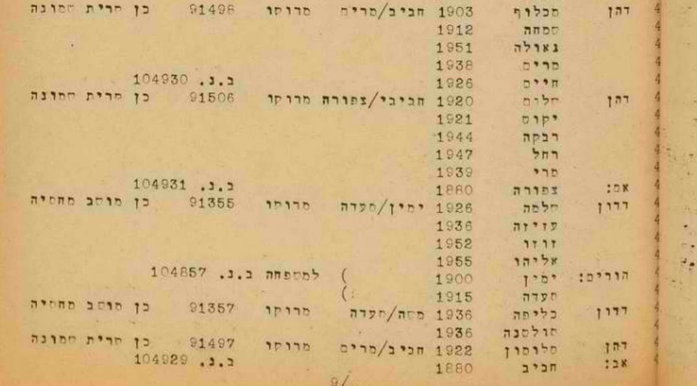](docs/1956-01-15_yerushalayim_p8.jpg)

*שלושת בלוקי האחים דהן ברשימת "ירושלים", עמוד 8: מכלוף (1903, חביב/מרים, ת.ע. 91496 — בחיתוך המוגדל הספרה האחרונה נראית כ-8; בעמוד המלא, בגודלו המקורי, כ-6; סריקת 800px — B-4), שלום (1920, "חביבי/צפורה", ת.ע. 91506) עם יקוט, רבקה, רחל, מרי ו"אם: צפורה 1880", ושלומון (1922, חביב/מרים, ת.ע. 91497) עם "אב: חביב 1880". בין הבלוקים שתי משפחות דדון (חלמה 1926; כליפה 1936) ושורת הוריהן — אינן קשורות.*

וגבוה יותר באותו עמוד, כעשר שורות מעל בלוק מכלוף, שלוש שורות דהן יחידניות: **מסעודי** 1944, **רחל** 1941 ו**לורט(?)** 1942 (מספרי תעודות העולה שלהן אינם מתפרסמים — בנות הדור החי, [9.6](#s9-6)) — שלושתן על שם ההורים "מכלוף/שמחה", מרוקו, "לא בוטחה" (נקבה — שלוש בנות; "מסעודי"/Messodie הוא שם בנות בפנקסים, ו"לורט" — Laurette — היא הקריאה הסבירה של הגליפים ט/ם שאינם נפרדים בסריקה), ונשלחו — לפי סימן "כנ"ל" מהשורה שמעליהן — ל**רמת הדסה**. "מכלוף/שמחה" הם שמות הזוג שבבלוק מכלוף (מכלוף 1903 · סמחה 1912), ולכן אלה שלוש בנות נוספות של מכלוף, בנות 11–15 — **כמעט ודאי**, לאחר שרבקה אישרה (12.09.2026) שהן בנות דודתה — שנשלחו לחוד למוסד נוער ולכן נרשמו בנפרד. רחל ילידת 1941 ברשימה מול "Dahan Rachel, 10 ans" בפנקס 1949 (כלומר ~1939) על שם Maklouf ו-Simha ([סעיף 3.4](#s3-4)) — **פער של שנתיים**, מאותו סוג שתואר בפרק 4 ובכיוון ההפוך; הזיהוי כאותה בת-דודה נשען על צירוף שמות ההורים ועל בת בשם רחל בשני המסמכים, ומאישור המשפחה — **כמעט ודאי**. בין הבלוקים גם דהן דוד (1915, מסעוד/אסתר, לאופקים) — משפחה אחרת. אם כך, ירדו מהאונייה לפחות שש-עשרה נפשות (16 שנספרו) ממשפחת חביב דהן. הזיהוי אושר במשפחה (רבקה, 12.09.2026): "כן, מאשרת"; ילדי מכלוף וסמחה כפי שברשימה — "נכון מאוד"; משפחת מכלוף התיישבה אחר כך בחיפה. הזיהוי של מכלוף ושלומון כאחים מדורג **כמעט ודאי**: שמות הורים זהים ברשומה, אותה אונייה ואותו יעד, ואישור המשפחה.

**מה שהסריקה הקודמת החמיצה.** הקובץ הזה נסרק גם בסבבים הקודמים, דרך ה-OCR בלבד, ולא נמצא — אי-ההבחנה בין ט/ם/ש בסריקה גררה תעתיק OCR שגוי: "חלום" ו"יקום". הרשומה אותרה רק כשחיפוש "חביב דהן" (השם שנמסר מהמשפחה) פגע בשורת מכלוף שבאותו עמוד, והעמוד נקרא מהסריקה עצמה. הלקח נרשם ב[סעיף 9.4](#s9-4), N‑1.

### 5.2 מרדכי בן הרוש

יליד מכנאס, 1928 (צו בית משפט 1990; המשפחה זכרה 1931), בן יונה ויקוט לבית אוחיון (בפי המשפחה: פנינה), עלה לבדו, לפני משפחתו (1947/48 לפי המשפחה; ככל הנראה יוני 1949 לפי רשומת קיבוץ רשפים). מרדכי עצמו תועד בשמונה מסמכים שהמשפחה שמרה (מכנאס 1949–1950, ישראל 1950–1990), ומשפחתו נמצאה בשני מסמכים נוספים: אחותו אסתר בפנקס אליאנס מכנאס 1953 — באותו עמוד פנקס שבו רשומה רחל דהן — וההורים יונה ויקוט, עם ארבעה ילדים והאח יעקב, ברשימת העולים של "ארצה" מ-11.6.1956, נשלחו לצפת. שתי המשפחות, דהן ובן הרוש, חיו אפוא באותה עיר ועלו באותה שנה, בהפרש חמישה חודשים. הפירוט, המועמדים והצעדים הבאים ב[דף הנלווה](../index.html#research-mordechai-benharoush).

### 5.3 מועמדות שנשללו בישראל

רשומת שינוי שם "מרים (מרי) בן-הרוש (הרוש)", חדרה, 21.9.1972[[5]] — נראתה בתחילה מבטיחה בגלל הכינוי "מרי", אך היא חלק מקבוצה של תשעה בני משפחה בשם הרוש שהחליפו יחד את שם משפחתם ל"בן-הרוש" בחדרה (רחמה נחמה, אפרת, סגלית, משה, מסעוד, שרה, מרים, מאיר ופנחס). מרים שם היא בת למשפחת הרוש, לא כלה לבית דהן, והמשפחה בחדרה ולא בחולון. **נשלל**.

רשומת שינוי שם "נורית (יקוט) דהן", ירושלים, 19.5.1970[[4]] — נבדקה מול המשפחה: יקוט לא שינתה את שמה. **נשלל** — ככל הנראה אישה אחרת.

### 5.4 ענף אבוטבול — אחיה של יקוט

רבקה מסרה (12.09.2026): ליקוט היו שלושה אחים — **חנה, ג'מילה ומיכאל מכלוף** אבוטבול; חנה נישאה במרוקו ל**עזוז** (שם משפחה, ככל הנראה) ועלתה איתו; חנה ומיכאל מכלוף עלו לישראל בוודאות כמה שנים לפני 1956 — 1948 או 1949. ההורים יצחק ורבקה אבוטבול נפטרו במכנאס הרבה לפני 1956 ונקברו שם. חיפוש ראשון (12.09.2026):[[12]]

- IGRA, שם משפחה אבוטבול + שם פרטי מכלוף (לא פונטי): שלוש רשומות, ואחת מהן — **«אבוטבול מכלוף → אבוטבול מיכאל», שינוי שם, מחוז הצפון, נפת צפת, רשימה 3/72 (אישורים 1.3.72–30.3.72), ילקוט הפרסומים 1920, עמ' 1710, 21.5.1973** — הגיליון הורד (olaw.org.il) והעמוד נשמר. שינוי "מכלוף" ל"מיכאל" הוא בדיוק צמד השמות שהמשפחה זוכרת — אבל זהו עברות נפוץ (באותו עמוד גם "הרוש מכלוף → מיכאל"), הרשימה אינה נושאת מספרי זהות או גיל, ואין קשר ידוע של המשפחה לצפת. **טעון אימות** — מועמד יחיד באינדקס, בלי ראיה מבחינה. השתיים האחרות (בוחרים ירושלים 1935; מועמדי הסתדרות בית שאן 1965) — לא נבדקו.
- Abitbol + Makhlouf/Michael במאגר העלייה 1948– ובמיקום מכנאס: אפס.
- טרם נבדק: רשימות העולים 1948–1949 ב-Pinpoint ("אבוטבול מכלוף", "אבוטבול חנה", "עזוז חנה"); פנקסי אליאנס מכנאס לבנות Abitbol עם אם Rebecca/Rivka; מסד עתלית.

[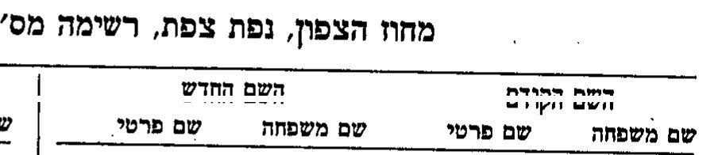](docs/yalkut_1920_p1710.jpg)

*ילקוט הפרסומים 1920 (21.5.1973), עמ' 1710 — כותרת רשימת נפת צפת ושורת «אבוטבול · מכלוף → אבוטבול · מיכאל». חיתוך מורכב: הכותרת ושורת הכותרות מראש הרשימה, מעל השורה. המקור: [ילקוט הפרסומים 1920](#src-12).*

## 6. עץ המשפחה

העץ מוצג בתרשים ב[מקטע העץ](#tree). בטקסט:

- **חביב דהן** — יליד 1880 בקירוב (רשימת 1956); אביו של שלום, מכלוף ושלומון; עלה ב"ירושלים" ב-1956, רשום כ"אב" הנלווה למשפחת שלומון — **כמעט ודאי**. **מרים דהן** — אשתו, אמם של השלושה ("חביב/מרים" בשורות מכלוף ושלומון); לא עלתה (משפחה).
- **צפורה דהן** — דודתו של שלום, ילידת 1880 בקירוב, ללא ילדים; עלתה איתם ונרשמה "אם" ליד משפחת שלום (משפחה; רשימת 1956) — ראו [סעיף 5.1](#s5-1).
- **מכלוף דהן** (1903) — אחיו של שלום; אשתו סמחה (1912), ילדיו חיים (1926), מרים (1938), גאולה (1951) — רשימת 1956, אישור המשפחה; וכן — כמעט ודאי, באישור המשפחה — בנותיו רחל (1941; גם בפנקס אליאנס 1949, "10 ans"), לורט(?) (1942) ומסעודי (1944), שנרשמו בנפרד לרמת הדסה; המשפחה התיישבה בחיפה. **שלומון דהן** (1922) — אחיו של שלום; עלה עם אביו חביב; לא נישא מעולם (משפחה).
- **יצחק אבוטבול** ו**רבקה אבוטבול** — הוריה של יקוט; לא עלו לארץ, נפטרו במכנאס הרבה לפני 1956 ונקברו שם (משפחה, 11–12.09.2026; טרם תועדו במסמך).
  - **חנה אבוטבול** (נישאה במרוקו ל**עזוז**; עלתה איתו לפני 1956), **ג'מילה אבוטבול**, **מיכאל מכלוף אבוטבול** (עלה 1948/49?) — אחיה של יקוט (רבקה, 12.09.2026) — **טעון אימות**; מועמד לרשומה: שינוי שם מכלוף→מיכאל אבוטבול, צפת 1972 ([5.4](#s5-4)). רבקה הנכדה נושאת, ככל הנראה, את שם סבתה.
- **שלום דהן** — יליד 1920 (רשימת העולים 1956); בן חביב ו— לפי הרשימה — צפורה (המשפחה: מרים; ראו [סעיף 5.1](#s5-1)); ככל הנראה חייט במלאח הישן של מכנאס (פענוח הקיצורים "Tail. ind." ו-"A.M." בפנקס 1949); נשלח מהנמל לקריית שמונה (רשימה, מאומת), כחצי שנה, ואז ירושלים (משפחה). נפטר ב-15 ביוני, כנראה 1979 (משפחה) — **טעון אימות**.
- **יקוט דהן לבית אבוטבול** — ילידת 1921 (רשימת העולים 1956); בת יצחק ורבקה; אשתו; קריית שמונה וירושלים. נפטרה ב-3 במרץ 1976 (משפחה) — **טעון אימות**.
  - **מרים (מרי) בן הרוש לבית דהן** — נולדה 1939 (תעודת זהות; פנקס 1949: "10 ans"; רשימת 1956: "מרי 1939"); עלתה 15.1.1956 עם הוריה באונייה "ירושלים" (רשימת העולים, מאומת); נישאה למרדכי בן הרוש בתל אביב, ספטמבר 1960 (משפחה); חולון.
  - **רבקה דהן** — 1944 (רשימת 1956; פנקס 1950: בת 7); עזבה את בית הספר באוקטובר 1955.
  - **רחל דהן** — 1947 (רשימת 1956; פנקס 1953: בת 6).
- **מרדכי בן הרוש** — בעלה של מרים; יליד 1928 (צו בית משפט 1990), בן יונה ויקוט (פנינה) לבית אוחיון, עלה לבדו (1947/48 לפי המשפחה; 1949 לפי רשומת רשפים), נפטר 2010 (מסמכיו ומשפחתו — בדף הנלווה) — [הדף הנלווה](../index.html#research-mordechai-benharoush).

## 7. פעולות פתוחות

לפי מידת השינוי שהממצא יחולל, לא לפי קלות החיפוש:

| # | פעולה | מה זה ישנה | מי |
|---|---|---|---|
| 1 | **ענפי מכלוף ושלומון דהן** — אושר: בנות רמת הדסה הן בנות מכלוף; משפחת מכלוף בחיפה, שלומון לא נישא. נותר: קבורות מכלוף וסמחה (חיפה), שמה המלא של צפורה (שם נעורים? אלמנה?) ומה עלה בגורלה | שני ענפים חדשים של המשפחה שנפתחו מהרשימה; צפורה — קרובה שאין לה צאצאים, ולכן זיכרונה תלוי ברישום הזה | משפחה, ואז ארכיון |
| 2 | **דור שלישי אחורה** — לחפש את **שלום דהן בן חביב** בפנקסי הבנים של אליאנס מכנאס (1917–1930) ואת **יקוט אבוטבול בת יצחק ורבקה** בפנקסי הבנות (Abitbol/Abitbul, Yacot) | הפנקסים רושמים שמות הורים, ולכן שורות "Dahan Chalom — Habib, Miriam" ו-"Abitbol Yacot — Isaac, Rebecca" יאמתו את הדור שנמסר בעל-פה | ארכיון |
| 3 | **פטירת ההורים** — שלום: 15 ביוני 1979; יקוט: 3 במרץ 1976; שניהם בהר המנוחות, גבעת שאול (רבקה) | חברה קדישא ירושלים (קהילת ירושלים / פרושים) — הר המנוחות; תעודות פטירה (רבקה כבת — אונליין, חינם), אתרי מצבות (גלעד, BillionGraves), עיתונות (ל-IGRA אין מסד קבורות ירושלים — [סעיף 9.5](#s9-5)). הרשומה תקבע שנת פטירה ולעיתים גם גיל ושם אב — כלומר אימות עצמאי של "חביב" | ארכיון |
| 3א | **חביב וצפורה דהן בישראל** — ילידי ~1880, עלו 1956 לקריית שמונה; חביב נקבר בירושלים (רבקה) | קבורת חביב — חברה קדישא ירושלים (הר המנוחות?); צפורה — ירושלים/קריית שמונה | ארכיון |
| 3ג | **ענף אבוטבול** — חנה (ועזוז), ג'מילה, מיכאל מכלוף ([5.4](#s5-4)) | רשימות העולים 1948–49 ב-Pinpoint; פנקסי אליאנס לבנות Abitbol; אימות מועמד צפת 1972 (מכלוף→מיכאל) — שם אב/גיל בתמצית רישום או בקבורה; ומהמשפחה: היכן גרו חנה ומיכאל בישראל, שמות ילדיהם | משפחה, ואז ארכיון |
| 3ב | **תעודת העולה 91506** — מספרה נרשם ברשימה | תיק העולה בארכיון הסוכנות/רשות האוכלוסין, לבן משפחה מדרגה ראשונה: פרטי לידה מלאים, כתובת במרוקו, תצלומים | משפחה (בקשה) |
| 4 | **מרדכי בן הרוש** | ראו [הדף הנלווה](../index.html#research-mordechai-benharoush) | — |
| 5 | **מכנאס לפני 1949** — רישום אזרחי צרפתי (état civil), פנקסי אליאנס מכנאס 1953–1956 (בכרכים המאוחרים נרשמים תאריכי לידה מלאים ושם נעורי האם — [פרק 4](#s4), הערה 1), ארכיון AIU בפריז | תאריך לידה מלא של רחל, אולי של רבקה; שם נעוריה של יקוט במסמך | ארכיון (FamilySearch — מחוץ להיקף, [סעיף 9.5](#s9-5)) |

## 8. סיכום המקורות

הרשימה המלאה, עם הקישור הכפול לכל ערך, ב[אינדקס המקורות](#index). בקצרה: שלושת פנקסי אליאנס (ערכים [1](#src-1), [2](#src-2), [3](#src-3)) הם הראיות החיוביות; ערכים [7](#src-7)–[8](#src-8) הם המועמדות שנשללו בסריקה, וערך [9](#src-9) הוסב במהדורה 16 לראיה על ענף מכלוף (בת-דודה); ערך [10](#src-10) הוא סקר הרשומות; ערך [6](#src-6) הוא רשומת העלייה — הראיה התיעודית השנייה בחשיבותה; ערך [4](#src-4) הוא המסירות המשפחתיות; ערך [5](#src-5) מועמדת שנשללה בישראל; ערך [11](#src-11) רקע על האונייה.

## 9. שיטה ומגבלות

### 9.1 בסיס הראיות

הדוח נשען על שלושה סוגי מקורות: פנקסי בית ספר של אליאנס (מקור ראשוני, בכתב יד, בצרפתית); מאגרי IGRA (אינדקס — מקור עזר שמוביל אל הסריקה); ורשימות העולים של ארכיון המדינה דרך אוסף Google Pinpoint (מקור ראשוני שנקרא מהסריקה; שכבת ה-OCR שימשה לאיתור בלבד והתבררה כלא אמינה — ראו [5.1](#s5-1) ו-N-1). המידע המשפחתי נרשם ב[פרק 2](#s2) ומדורג כזיכרון, לא כרשומה.

### 9.2 סולם הוודאות

חמש דרגות: **מאומת** — נקרא ישירות מהמסמך, קריאה ברורה; **כמעט ודאי** — מסמכים מתכנסים ללא סתירה; **ככל הנראה** — פרשנות סבירה או קריאה בכתב יד קשה; **טעון אימות** — לא פוענח או לא נבדק; **נשלל** — מועמד שהפרטים ברשומה סותרים. ממצא שלילי שהופרך בהמשך מסומן **בוטל**. מסמך מדורג בנפרד מן הזיהוי שנשען עליו: שורת הפנקס "מאומתת", ואילו הזיהוי שהיא שורתה של מרים — "כמעט ודאי".

### 9.3 מוסכמות הכתיב

בעברית: דהן, בן הרוש, מכנאס. בצרפתית של הפנקסים: Dahan, Chalom, Yacot, Marie, Rébéca, Rachel (בפנקס 1950 הכתיב נוטה ל-Jacot; בדוח מאוחד ל-Yacot). שמות המקומות: מכנאס = Meknès = مكناس. מספרי הפנקסים מצוטטים לפי "מספר סידורי N (שורה K בעמוד)".

### 9.4 ממצאים שליליים

| # | שאלה | מקור וכיסוי מדויק | תוצאה | דירוג |
|---|---|---|---|---|
| N-1 | משפחת דהן ברשימות העולים 1955–1957 | ארכיון המדינה, 19 קבצים, גל-15498/4 עד גל-15500/5, דרך OCR | **בוטל** — הבלוק נמצא בגל-15498/9 עמ' 8 ([5.1](#s5-1)); ה-OCR שיבש "שלום"→"חלום" ו"יקוט"→"יקום", ולכן החיפוש הטקסטואלי החמיץ אותו | **בוטל** |
| N-2 | "Marie Dahan" מכנאס 1950 | פנקס 1950, מספר סידורי 1807 (שורה 17 בעמוד)[[7]] | הורים Aaron/Haciba — משפחה אחרת | **נשלל** |
| N-3 | "Rachel Dahan" מכנאס 1953 | פנקס 1953 מס' 3289 (שורה 7)[[8]] | הורים Maklouf/Flory (ואחריהם שם נעוריה של האם, קטוע בקצה העמודה: "Guig…" — ככל הנראה Guigui, כדפוס העמוד) — משפחה אחרת. (רשומת 1949 מס' 1661, Maklouf/Simha, שנשללה בעבר, זוהתה במהדורה 16 כבת-דודה — [סעיף 3.4](#s3-4)) | **נשלל** |
| N-3א | "Dahan Esther" מכנאס 1949 — אם בשם Yacot | פנקס 1949 מס' 1636, באותו עמוד של מרי[[1]] | הורים Salomon (נפטר) / Yacot (נפטרה) — משפחה אחרת; מסייג את ייחודיות הצירוף | **נשלל** |
| N-4 | משפחת דהן נוספת במכנאס עם ההורים Chalom + Yacot | IGRA, "תלמידים 1917–1964 אליאנס מרוקו": 69 רשומות ייחודיות של תלמידות דהן שעירן מכנאס **הנושאות אחד מתשעה שמות פרטיים שנבדקו** (Marie/Mary/Miriam/Myriam/Meriem/Mimi/Rebecca/Rivka/Rachel; שנות הפנקסים בתוצאות 1937–1960) — האינדקס אינו כולל שמות הורים[[10]]; בנוסף, בששת עמודי הפנקס השמורים נקראו **כל** שורות דהן: עשר רשומות עם שמות הורים — שלוש של המשפחה (1617, 1878, 3054) ושבע אחרות: 1636 Salomon/Yacot (N-3א), 1661 Maklouf/Simha (בת-דודה), 1802 Juda/Simha, 1807 Aaron/Haciba, 1882 Raphaël/Robida, 1897 Jacob/Simy, 3289 Maklouf/Flory | הצירוף Chalom + Yacot נמצא רק בשלוש הרשומות של המשפחה; מבין 69 רשומות האינדקס נקראו שש (ארבע מהעשר — 1636, 1802, 1882, 1897 — נושאות שמות שאינם בסינון), וב-63 האחרות שמות ההורים לא נבדקו; בנות דהן בשמות פרטיים אחרים אינן מכוסות בסקר | **טעון אימות** — סקר לפי שם פרטי; נדרש סקר לפי שם משפחה בלבד |
| N-5 | מרים דהן/בן הרוש בחולון ב-IGRA | IGRA, שם משפחה בן הרוש + מרים, מיקום חולון | אפס — מרים אינה מופיעה במאגרי IGRA הפתוחים תחת שם נישואיה ומקום מגוריה; צפוי, שכן המאגרים אינם מכסים רשומות של אנשים חיים | **ככל הנראה** |
| N-6 | יקוט → נורית (ירושלים 1970) | IGRA, שינויי שמות (IGRA-1969-79-nc-NOIMAGES-46514)[[4]] | המשפחה: לא שינתה את שמה | **נשלל** |

### 9.5 חסמים

FamilySearch — מחוץ להיקף המחקר לבקשת המשתמש (12.09.2026; B-1 נסגר): חיפוש הטקסט המלא ברשומות מרוקו לא יבוצע. IGRA אינו מכיל מסד קבורות לירושלים, ולכן פטירות ההורים (1976, 1979) עדיין לא אותרו במסמך; JPress לא העלה מודעות אבל בשמות "יקוט דהן" (מרץ 1976) ו"שלום דהן" (יוני–יולי 1979). הרישום האזרחי הצרפתי במרוקו נגיש רק דרך ארכיונים בצרפת ובמרוקו.

### 9.6 מה הדוח אינו עושה

אינו מתעד מקומות קבורה מעבר לעיר; אינו מסתמך על עצים משפחתיים מקוונים. **פרטיות:** פרטיהם של בני הדור החי מובאים במידה מזערית — שם, שנת לידה ומה שנרשם עליהם ברשומות ארכיוניות פומביות (רשימות העולים, פנקסי אליאנס), בלי מספרי זיהוי מנהליים (תעודות עולה) של מי שלא אומת כנפטר או שנולד אחרי 1925 (מספרי המשפחה — ב.נ. — ומספרי תעודות העולה של הדור שנולד לפני כן מובאים, שכן הם על הסריקה המקושרת ממילא); מפרטים שנמסרו בעל-פה על הנושאת מובאים רק מועד ומקום הנישואין, בהסכמתה. הפרסום נעשה בהסכמת בני המשפחה שמסרו את הפרטים; מי שיבקש להסיר פרט הנוגע לו — יוסר.

