

::: lede

דף נלווה ל[מחקר על מרים לבית דהן](../index.html#research-miriam-benharoush): **מרדכי בן הרוש**, בעלה (מכנאס, **1928** — צו בית משפט השלום בת ים–חולון, 20.12.1990, שתיקן את שנת הלידה בתעודת הזהות; נפטר 2010).

**מה יש בדף.** **עשרה מסמכים של מרדכי עצמו** — תעודת הקהילה במכנאס עם תצלומו, כתב עדות על היותו רווק שעזב לארץ ישראל, תצלום שלו במדים מ-1949, לסה-פסה מירושלים, מכתב בכתב ידו ממעברת טירה, וצו בית משפט מ-1990 ([5.5](#s5-5)). **שתי רשומות של משפחתו** — פנקס אליאנס 1953 ורשימת "ארצה" 1956 ([5.2](#s5-2)–[5.3](#s5-3)), **כמעט ודאי**. **רשומת עלייה מועמדת** — קיבוץ רשפים, 22.6.1949, **ככל הנראה** ([5.4](#s5-4)). **מועמד אחד** לרישום שינוי שם: "בנערוש מרדושי" ממגדים, 1954, **ככל הנראה** ([פרק 3](#s3)); מועמד שני מירושלים 1963 — **ככל הנראה נשלל** לפי מספר זהות ([3.4](#s3-4)).

שבעה מועמדים נוספים נשללו ([פרק 4](#s4)). כל מסמך שנקרא מופיע פעמיים — קישור אל הרשומה בארכיון וקישור אל עותק שמור; גם ממצא שלילי נרשם, עם הכיסוי המדויק שלו ([9.4](#s9-4)).

:::

**מאיפה להתחיל**

- [מה ידוע מהמשפחה](#s2) — נקודת המוצא.
- [המועמד — מגדים 1954](#s3) — הרישום, מה תומך, מה עומד נגד, והמועמד השני שככל הנראה נשלל לפי מספר זהות.
- [מועמדים שנשללו](#s4) — שבע רשומות והנימוק לכל אחת, ואחת שהוחזרה למועמדות.
- [המשפחה במסמכים](#s5) — אחותו בפנקס אליאנס מכנאס 1953; ההורים והאח ברשימת "ארצה" 1956; **מרדכי עצמו במסמכי מכנאס 1949–1950** ([5.5](#s5-5)); ומה לא נמצא.
- [הפעולות הפתוחות](#s7) — השאלה שמכריעה, ומה אחריה.

---

## 1. תמצית

מרדכי בן הרוש, בעלה של מרים לבית דהן, נולד במכנאס שבמרוקו ב-**1928** — כך צו בית משפט השלום בת ים–חולון מ-20.12.1990, שתיקן את תעודת הזהות (שנשאה 1931, כזיכרון המשפחה),[[21]] ובהתאם ל"בן 22" במסמכי מכנאס 1949–1950 ול-1927 ברשומת רשפים ([סעיף 5.5](#s5-5), [מקור 3](#src-3)) — בנם של יונה ויקוט לבית אוחיון,[[15]][[16]] עלה לישראל לבדו (1947/48 לפי המשפחה; יוני 1949 לפי רשומת רשפים, ככל הנראה), ונפטר ב-2010.[[4]] דף זה מרכז את מה שנבדק עד כה בארכיונים הישראליים ובפנקסי אליאנס במרוקו, את המועמדים שנמצאו ואת מה שנשלל.

התמונה נכון להיום: **מרדכי עצמו תועד בעשרה פריטים שהמשפחה שמרה, 1949–1990** — תעודת הקהילה במכנאס עם תצלומו, כתב עדות על היותו רווק שעזב לארץ ישראל, תצלום במדים עם הקדשה חתומה בשמו מ-29.8.1949, אישור חברות בהסתדרות מחיפה (יולי 1950, "נולד 1931", סנדלר), לסה-פסה מירושלים 1950, מעטפה ומכתב מטירת הכרמל 1956, וצו בית משפט 1990 ([סעיף 5.5](#s5-5)) — ו**הוריו, אחיו ואחותו תועדו בשני מסמכים נוספים** — פנקס אליאנס מכנאס 1953 (אחותו אסתר, הורים Yona/Yacot)[[10]] ורשימת העולים של "ארצה", 11.6.1956 (יונה ויקוט עם ארבעה ילדים, והאח יעקב עם אשתו — לצפת)[[11]] — ראו [סעיפים 5.2–5.3](#s5-2). בהנחת הזיהוי — כמעט ודאי — עולה מהרשימה ששמות הוריו של יונה היו מרדכי ומרים, ומרדכי נקרא, ככל הנראה, על שם סבו (המסמך אומר רק שאביו של יונה נקרא מרדכי). לפי המשפחה מרדכי לא היה הבכור: קדמו לו ניסים (מקסים) ומרים, שנשארו במרוקו. ההורים היו במכנאס ב-1953 (פנקס אליאנס) ועלו ממרוקו ביוני 1956 — ומכאן, וכך גם מסרה המשפחה, שמרדכי עלה לבדו, לפני משפחתו — לפי זיכרון המשפחה נער בן 16–17 (על בסיס 1931); לפי 1928 ורשומת רשפים — בן 21. לרשומת **שינוי השם** שלו מועמד אחד בילקוט הפרסומים (ומועמד נפרד לרשומת **העלייה** — עתלית 39404, [סעיף 5.4](#s5-4)): "בנערוש מרדושי" ממושב מגדים, שקיבל את השם "בן הרוש מרדכי" ב-12.12.1954.[[1]] רישום שני באותו כינוי — "בן הראש מרדושה" מירושלים, ספטמבר 1963, מספר זהות 6419140[[13]] — **ככל הנראה נשלל**: מספר הזהות של מרדכי, שמסרה המשפחה (12.09.2026), שונה ([סעיף 3.4](#s3-4)). רישום מגדים **מאומת**; זיהויו כמרדכי בעלה של מרים — **ככל הנראה**: הכינוי אושר במשפחה, המשפחה אינה יודעת על מגדים ולא על שינוי שם, ו[פרק 3](#s3) מפרט מה תומך ומה עומד נגד.

מה שנשלל: שבעה מועמדים בשם דומה (ושמיני — רשפים — הוחזר למועמדות) או קרוב ב-IGRA וברשימות העולים, שפרטיהן (שנת לידה, הורים, מוצא) אינם מתיישבים עם הידוע ([פרק 4](#s4)).

## 2. מה ידוע מהמשפחה

המידע שנמסר, והוא הבסיס לזיהוי — לא ראיה בפני עצמו:[[4]]

- מרדכי בן הרוש. שנת לידה 1931 — כך נמסר (12.09.2026), ולפי המשפחה כך נשאה תעודת הזהות עד 1990 — וכך כבר באישור ההסתדרות מחיפה, יולי 1950 ([5.5](#s5-5), ח): צו בית משפט מ-20.12.1990 קבע שנולד ב-**1928** ותיקן אותה ([5.5](#s5-5), ה; הצו אינו מציין מה היה הרישום הקודם); המסמכים ממכנאס אומרים 1926/27–1927/28. מקום הלידה: **מכנאס** (נמסר 11.09.2026; מאומת במסמכים).
- המשפחה שמרה מסמכים מקוריים של מרדכי — ממכנאס 1949–1950 ומישראל 1950–1990 — ומסרה את צילומיהם (12–13.09.2026): עשרה פריטים, [סעיף 5.5](#s5-5).
- הוריו: יונה ופנינה. המשפחה (12.09.2026): "1912 לא הגיוני כשנת לידה של יונה" — מול הרשימה ([5.3](#s5-3)). במרוקו קראו לאמו **יקוט** — אושר (12.09.2026); ברשומות ממרוקו ומהנמל היא "יקוט"/Yacot; שם נעוריה — **אוחיון** (Ohayon / Hayoun), בת דוד — מהמסמכים ([5.5](#s5-5)). יונה נולד, "לפי הידוע", ב-**1898** (12.09.2026) — לעומת 1912/1918 ברשימת העולים ([סעיף 5.3](#s5-3)). ההורים עלו ביוני 1956 לצפת, לא נשארו שם ועברו ל**תל אביב–יפו**; קבורים ב**הר המנוחות** בירושלים; שנות הפטירה ייבדקו במשפחה.
- עלה ב-1947 או 1948, בגיל 16–17, **לבדו, ללא ההורים, במסגרת עליית הנוער** (אושר 12.09.2026). דרך העלייה (אונייה או מטוס), הנמל, ומעבר דרך קפריסין או עתלית — לא ידועים. הוסיף לגילו שנה-שנתיים והתגייס לצבא מיד עם עלייתו, ב-1947 או 1948, כשאמר שהוא בן 18.
- אחיו ואחיותיו (12.09.2026): המשפחה מכירה את כולם — יעקב ואשתו מרי, גבריאל (גבי), ז'וליט, סלומון ואסתר. מרדכי **לא היה הבכור**: קדמו לו **ניסים (מקסים)** ו**מרים**, שלא עלו לישראל. נמסר (12.09.2026, שנית): ניסים (מקסים) חי במרוקו כמעט עד יום מותו, עם אשתו; שלושת ילדיו חיים בצרפת. מרים עברה לפריז עם בעלה **שמואל רואש**; שניהם נפטרו בפריז ונקברו בישראל — שמואל בקריות (חיפה), מרים בהר המנוחות בירושלים; ארבעת ילדיה גדלו בפריז. (שמות בני הדור החי — לא מתפרסמים, [9.6](#s9-6).) ועוד אח צעיר ממנו, **מיכאל מכלוף**, שעלה לישראל — לא ברור מתי, עם כל המשפחה או לפניהם. הוא אינו ברשימת "ארצה" 1956 עם ההורים, ולכן — אם עלה — עלה בנפרד.
- מספר הזהות שלו נמסר מתעודותיו (12.09.2026); אינו מתפרסם, ושימש לשלילת המועמד מירושלים 1963 ([סעיף 3.4](#s3-4)).
- בילדותו כינו אותו **"מרדושי"** (אושר 12.09.2026). האם גר במגדים או בסביבת עתלית, ואם שינה אי-פעם את שם משפחתו במשרד הפנים — לא ידוע.
- נישואין קודמים: היה נשוי לאישה בשם **חנה (אניטה) לבית יפלח** (שם המשפחה נמסר 13.09.2026), ולהם בן, **יוני** — נקרא על שם אביו של מרדכי (נמסר 12.09.2026, "אם אני לא טועה"); נולד בשנות החמישים — רלוונטי רק לתיארוך הנישואין הראשונים. הנישואין — "1953 לערך", העיר לא ידועה; שם משפחתה של חנה ייבדק (12.09.2026, שנית). אין במשפחה תעודת נישואין (גם לא של הנישואין למרים), ואין מסמכי צבא. על משפחת יפלח (13.09.2026): לחנה כ-10–11 אחים ואחיות; אחד מאחיה היה, לפי זיכרון המשפחה, שחקן מפורסם מאוד בארץ ובחו"ל — שמו הפרטי לא ידוע. **הערת מחקר:** השחקן הבינלאומי **אהרן איפלה** (1941, מרוקו — 2016; הלוויה בחולון), שהשתתף בסרטים אמריקניים ובריטיים, הוא מועמד לפי צליל השם (Ipalé / יפלח) — **טעון אימות**: המשפחה לא מסרה שם, ולא נמצא מסמך המקשר בינו לבין חנה; לשאול את המשפחה.
- **מגורים במעברת טירה** (13.09.2026): לפי עדויות רבות במשפחה, מרדכי גר ב-1956 — ואולי שנה-שנתיים קודם — ב**מעברת טירה הצפונית, מחנה ד', צריף 171**, כשהיה נשוי לחנה. זה מתיישב עם המעטפה מ-1.8.1956 ("צריף מס' 171, מעב' טירה הכרמל") ועם מכתב ויינר ("למעברה שהיינו — טירה צפונית") — [5.5](#s5-5), ד. "טירה צפונית" במכתב היא אפוא שם המעברה (טירה הצפונית), לא כיוון גאוגרפי.
- **עבודה בסולל בונה באילת** (13.09.2026): מרדכי עבד כמה שנים בשנות החמישים בסולל בונה באילת; במשפחה מסמך מ-**1959** — טרם נמסר ([פרק 7](#s7), פעולה 8).
- נישא למרים דהן (ילידת מכנאס, 1939; עלתה 1956) ב**תל אביב, בספטמבר 1960** (12.09.2026) — [המחקר על מרים](../index.html#research-miriam-benharoush).
- פרטי בני הדור החי (אחיו ואחיותיו, אשתו הראשונה ובנו) מובאים כאן במידה מזערית, כפי שנמסרו ובהסכמת המוסר; ראו [סעיף 9.6](#s9-6).
- נפטר ב-2010; קבור בבית העלמין ירקון (משפחה).

## 3. המועמד לרשומת שינוי השם — ומועמד שני שנשלל

### 3.1 הרישום הראשון — "בנערוש מרדושי", מגדים, 1954

ילקוט הפרסומים 407, ח' בניסן תשט"ו (31.3.1955), עמ' 647, "הודעה בדבר שינויי שם", רשימה מס' 10, מחוז חיפה — נפת חדרה.[[1]] השורה:

| שדה | קריאה | דירוג |
|---|---|---|
| השם הקודם | בנערוש · מרדושי | **מאומת** — דפוס ברור |
| השם החדש | בן הרוש · מרדכי | **מאומת** |
| מקום המגורים | מגדים | **מאומת** |
| תאריך אישור השינוי | 12.12.54 | **מאומת** |
| מספר הזהות במרשם התושבים | ז/203321 (האות — ז או ג; הספרות חד-משמעיות) — נקרא מסריקת הגיליון באתר olaw.org.il; בסריקת IGRA העמודה מושחרת בכל שורות הרשימה | **מאומת** (הספרות) · **ככל הנראה** (האות) |

[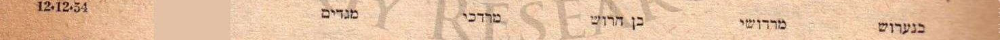](docs/yalkut_407_p647.jpg)

*השורה בילקוט הפרסומים 407, עמ' 647, רשימה 10 (מחוז חיפה, נפת חדרה): «בנערוש · מרדושי → בן הרוש · מרדכי · מגדים · 12.12.54». בסריקת IGRA עמודת מספר הזהות מושחרת בכל הרשימה. המקור: [ילקוט הפרסומים 407](#src-1).*

[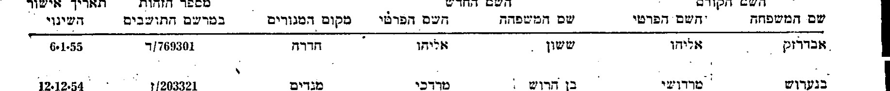](docs/yalkut_407_p647_olaw.jpg)

*חיתוך מורכב מסריקת הגיליון הלא-מוסתרת (olaw.org.il, עמ' 9 בקובץ = עמ' 647): שורת הכותרות של הרשימה ושורת מגדים — «בנערוש · מרדושי → בן הרוש · מרדכי · מגדים · ז/203321 · 12.12.54». מספר הזהות בפורמט הישן (אות + שש ספרות). המקור: [ילקוט הפרסומים 407](#src-1).*

[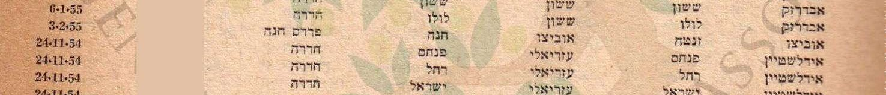](docs/yalkut_407_p647.jpg)

*כותרת הרשימה: «הודעה בדבר שינויי שם — שינויי שמות האנשים המפורטים להלן נרשמו ביחידות רישום התושבים, האגף למרשם התושבים, משרד הפנים» · רשימה מס' 10 · מחוז חיפה — נפת חדרה · העמודות: השם הקודם (שם המשפחה, השם הפרטי), השם החדש, מקום המגורים, מספר הזהות במרשם התושבים, תאריך אישור השינוי.*

[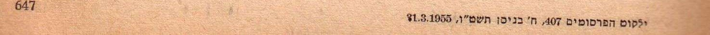](docs/yalkut_407_p647.jpg)

*תחתית העמוד: «ילקוט הפרסומים 407, ח' בניסן תשט"ו, 31.3.1955» · עמ' 647 — הציטוט הביבליוגרפי של הגיליון.*

### 3.2 מגדים — מה תומך

- **מגדים** הוא מושב ליד עתלית, שהוקם ב-1949 על ידי עולים מצפון אפריקה.[[7]] נער שעלה ממרוקו לבדו ב-1947/48 מתאים לפרופיל של מתיישבי המקום — נימוק נסיבתי אחד, והוא נמנה כאן פעם אחת.
- **"מרדושי"** — המשפחה אישרה (12.09.2026) שכך כינו את מרדכי בילדותו.[[4]] הרישום נושא את הכינוי, ולא את השם הרשמי; החלפתו ב"מרדכי" ו"בנערוש" ב"בן הרוש" היא תקנון כתיב, לא שינוי שם של ממש. (השאלה למשפחה נשאלה כשאלה סגורה — הכינוי הוצג לפני התשובה; ראו M-T1.) הראיה תקפה במידה שווה לשני המועמדים.
- **טירת הכרמל 1956:** באוגוסט 1956 גר במעברת טירת הכרמל (מעטפה רשומה, [5.5](#s5-5) ד) — חוף הכרמל, כ-15 ק"מ ממגדים; מגורים באותו אזור שנה וחצי אחרי הרישום — ראיה נסיבתית.
- בגיל 26 (יליד 1928) — גיל סביר לרישום כזה לקראת עבודה או נישואין (השערה, ללא מקור סטטיסטי); לפי המשפחה נישא לראשונה באמצע שנות החמישים.

### 3.3 מגדים — מה עומד נגד

- ההודעה אינה כוללת שנת לידה או שמות הורים; מספר הזהות שבה (ז/203321) הוא בפורמט הישן, ולא הושווה עדיין למספרו של מרדכי במרשם.
- **שכיחות הכינוי** (נבדקה 12.09.2026; הבדיקה הורחבה לכתיב "מרדושה" באותו יום — ראו יומן, מהדורה 11): במאגר שינויי השמות של IGRA "מרדושי" מופיע ב-19 רשומות ו"מרדושה" ב-17 נוספות — 36 בסך הכול (1954–1979), כינוי חיבה נפוץ בקרב יוצאי מרוקו, בשמות משפחה רבים (אלבז, שוקרון, לוי, מלכה, אוחנה, ביטון, אדרי ועוד); הצירוף כינוי + בן הרוש (על כתיביו) מופיע **פעמיים** — מגדים 1954 וירושלים 1963 (N-6).[[8]] המאגר מכיל רק מי ששינו את שמם, ולכן אינו אומד את שכיחות הצירוף באוכלוסייה.
- השם מרדכי בן הרוש נפוץ; חיפוש פונטי ב-IGRA (Harush + Mordekhai) מחזיר 13 תוצאות (1839–1960), שמונה מהן אכן בשם מרדכי הרוש/ארוש/חרוש — ואף אחת עם 1931 או יונה/יקוט ([פרק 4](#s4)).
- אין עדיין מסמך אחר שמקשר את מרדכי בעלה של מרים למגדים או לעתלית.
- המשפחה אינה מכירה מגורים במגדים ואינה יודעת על שינוי שם — שתי תשובות שליליות, לא רק היעדר ידיעה; ולפי אותה עדות היה בצבא מ-1947/48 ואב לילד קטן באמצע שנות החמישים — פרופיל שאינו בהכרח של מושבניק. השאלה על הכינוי נשאלה כשאלה מובילה.
- מועמד שני באותו כינוי ובאותו שם משפחה נבדק וככל הנראה נשלל לפי מספר זהות — [3.4](#s3-4); הצירוף כינוי + שם משפחה חוזר אפוא אצל אדם אחר, ולכן אינו מזהה.

### 3.4 הרישום השני — "בן הראש מרדושה", ירושלים, 1963 — נשלל

נמצא ב-12.09.2026, כשבדיקת שכיחות הכינוי הורחבה לכתיב "מרדושה": ילקוט הפרסומים 1144, כ"ה בטבת תשכ"ה (30.12.1964), עמ' 901, "הודעות בדבר שינוי-שם", מחוז ירושלים, נפת ירושלים, רשימה מס' 9/63 (אישורים מיום 1.9.63 עד 30.9.63), שורה 7.[[13]] ברשימה זו עמודת מספר הזהות **גלויה** — משום שהסריקה הורדה מאתר הגיליונות (olaw.org.il) ולא מ-IGRA, שמשחירה מספרי זהות בתמונות שהיא מגישה (ראו [9.1](#s9-1)). IGRA מתייגת את הרשומה לפי שנת הפרסום, 1964; האישור עצמו — ספטמבר 1963.

| שדה | קריאה | דירוג |
|---|---|---|
| השם הקודם | בן הראש · מרדושה | **מאומת** — דפוס ברור |
| השם החדש | בן הראש · מרדכי | **מאומת** |
| מס' הזהות במרשם התושבים | 6419140 | **מאומת** |
| מחוז ונפה | ירושלים | **מאומת** |
| תקופת האישור | 1.9.63 – 30.9.63 (כותרת הרשימה) | **מאומת** |

[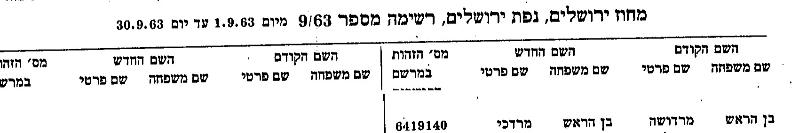](docs/yalkut_1144_p901.jpg)

*חיתוך מורכב: כותרת הרשימה («מחוז ירושלים, נפת ירושלים, רשימה מספר 9/63 מיום 1.9.63 עד יום 30.9.63») ושורת הכותרות — ומתחתן שורה 7: «בן הראש · מרדושה → בן הראש · מרדכי · 6419140». המקור: [ילקוט הפרסומים 1144](#src-13).*

**מה תמך:** אותו כינוי, אותו שם משפחה ("בן הראש" — כתיב שנוסף למוסכמות [9.3](#s9-3) במהדורה 11); ירושלים — עיר משפחתה של מרים מ-1956. **ההכרעה (12.09.2026):** המשפחה מסרה את מספר הזהות של מרדכי מתעודותיו — והוא **אינו** 6419140. המספר עצמו אינו נרשם בשום קובץ של המאגר ואינו מתפרסם; המחקר לא ראה את התעודה, ולכן ההשוואה אינה ניתנת לאימות חיצוני — והמועמד מדורג **ככל הנראה נשלל**, לא "נשלל" חלק: "בן הראש מרדושה" מירושלים הוא, ככל הנראה, אדם אחר נושא אותו כינוי ואותו שם משפחה. צילום התעודה או תמצית הרישום ([פרק 7](#s7), פעולה 1) יאמתו גם את ההכרעה הזו.

**סיכום פרק 3:** רישום מגדים 1954 חוזר להיות המועמד היחיד — **ככל הנראה**, לא יותר: הכינוי אושר (בשאלה מובילה) ונפוץ, כפי שמוכיח המועמד שנשלל; המשפחה אינה מכירה מגדים ולא שינוי שם; ואין מסמך שקושר את מרדכי למגדים. אבל יש עכשיו נתון חד: מספר הזהות שברישום, **ז/203321**, בפורמט הישן (אות + שש ספרות) — שאינו ניתן להשוואה ישירה למספר בן שבע הספרות שבידי המשפחה בלי מרשם התושבים. מה שיכריע: תמצית רישום של מרדכי ממרשם האוכלוסין "בתוספת פרטי כניסה לארץ, ישוב לידה ושמות קודמים"[[14]] — קרוב מדרגה ראשונה זכאי לה בלשכה ([פרק 7](#s7), פעולה 1) — שתאמר אם ז/203321 הוא מספרו הקודם ואם "בנערוש" הוא שמו הקודם; או תיקו האישי בארכיון צה"ל (כתובת 1954).

## 4. מועמדים שנשללו

| מקור | מה רשום | למה נשלל | דירוג |
|---|---|---|---|
| רשימת עולים אפריל 1949, גל-15493/6 מסמך 192 שורה 54 — "מרדכי בנארוש"[[2]] | יליד 1910 | פער של 21 שנה משנת הלידה המשפחתית | **נשלל** |
| רשימת עולי קיבוץ רשפים 1949 (יד יערי), עמ' 12 שורה 2 — "בן-ארוש מרדכי"[[3]] | יליד 1927 · מרוקו · הגיע 22.6.49 בחבורת עולים · בית עולים "סנט-לוקס"(?) · "הנמצא בקיבוץ: לא" · "לאן הלך: **צבא**" | **הוחזר למועמדות** במהדורה 15: 1927 מתיישב עם "בן 22" במסמכי מכנאס 1949–1950, והיציאה לצבא — עם עדות המשפחה. ראו [סעיף 5.4](#s5-4) | **ככל הנראה** — מועמד לרשומת העלייה |
| רשימת עולים אוקטובר 1949, גל-15494/5, עמ' 3 של הרשימה (עמ' 21 בקובץ ה-PDF, במניין מ-1), שורה 159 — "בן-ארוס מחלוף"[[5]] | יליד 1931 · הורים דוד/פרחה · ארץ מוצא: סימן דיטו, ששרשרתו מובילה לערך "ירן" בשורה 143 (כך מודפס; ככל הנראה "יון" או "איראן" — לא פוענח) — **טעון אימות** · מס' קופ"ח 112427 · ת.ע. 42267 · שער עלייה (נקרא מהסריקה, 12.09.2026; הקריאה תוקנה — ראו יומן, מהדורה 10) | ההורים דוד/פרחה, לא יונה/יקוט; ויליד 1931 — אינו צעיר ממרדכי, ולכן גם אינו האח מיכאל מכלוף | **נשלל** |
| ילקוט הפרסומים 1144 (30.12.1964), עמ' 901, ירושלים, רשימה 9/63 — "בן הראש מרדושה → בן הראש מרדכי"[[13]] | מס' זהות 6419140 · שינוי שם אושר 9/1963 | מספר הזהות של מרדכי (משפחה, מתעודותיו; לא נראה במחקר ואינו מתפרסם) שונה — [סעיף 3.4](#s3-4) | **ככל הנראה** נשלל |
| רשימת "ארצה" 11.6.1956, גל-15499/1, עמוד 4, בלוק יוסף בן-הרוש — "מרדכי"[[11]] | יליד 1936 · הורים יחיא/חנה · עלה 6/1956 | עלה ב-1956 ולא ב-1947/48; ההורים יחיא/חנה; בן 20 בעלייתו ביוני 1956, ובן 11–12 ב-1947/48 — [סעיף 5.3](#s5-3) | **נשלל** |
| רשימת עולים מרץ 1949 חלק ב, גל-15493/3, עמ' 45, שורות 199–202 — משפחת בן הרוש[[6]] | אסתר 1889 (יעקב/שמחה), יוסף 1901 (יצחק/מרי), אסתר 1913, אברהם 1947 | אין מרדכי; ההורים אחרים; "יקוט 1931" בשורה 198 שייכת למשפחת בן שמעון שמעליהם | **נשלל** |
| רשימת עולים יוני 1949, גל-15493/8, עמ' 150–151 — משפחת הרוש (יצחק, עמרם, חנה, רחל, ישראל, אליס, פרחה, רחמה, אסתר)[[5]] | תשע נפשות ממרוקו | אין מרדכי; אין יונה/יקוט בעמודת ההורים | **נשלל** |
| IGRA, "Harush" + "Mordekhai" (פונטי) — 13 תוצאות (1839–1960), שמונה מהן בשם מרדכי הרוש/ארוש/חרוש (נוטרים 1936/1947, שבויים 1948, שאלון עולה 1950 יליד קהיר, צפת 1839, אליאנס 1960 ועוד)[[8]] | — | אף אחת עם שנת לידה 1931 או הורים יונה/יקוט | **נשלל** |

[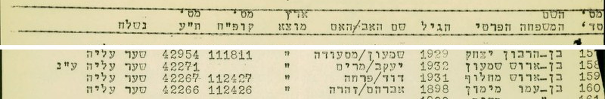](docs/1949-10_list_p3.jpg)

*רשימת אוקטובר 1949 (גל-15494/5), עמ' 3 של הרשימה — חיתוך מורכב: שורת הכותרות מראש העמוד, מעל שורות 157–160. שורת הכותרות — «מס' סד' · השם: המשפחה, הפרטי · הגיל · שם האב/האם · ארץ מוצא · מס' קופ"ח · מס' ת"ע · נשלח» — ושורות 157–160. שורה 159: «בן-ארוס מחלוף · 1931 · דוד/פרחה · " · 112427 · 42267 · שער עליה». בעמודת ארץ המוצא סימן דיטו. המקור: [ארכיון המדינה, גל-15494/5](#src-5).*

[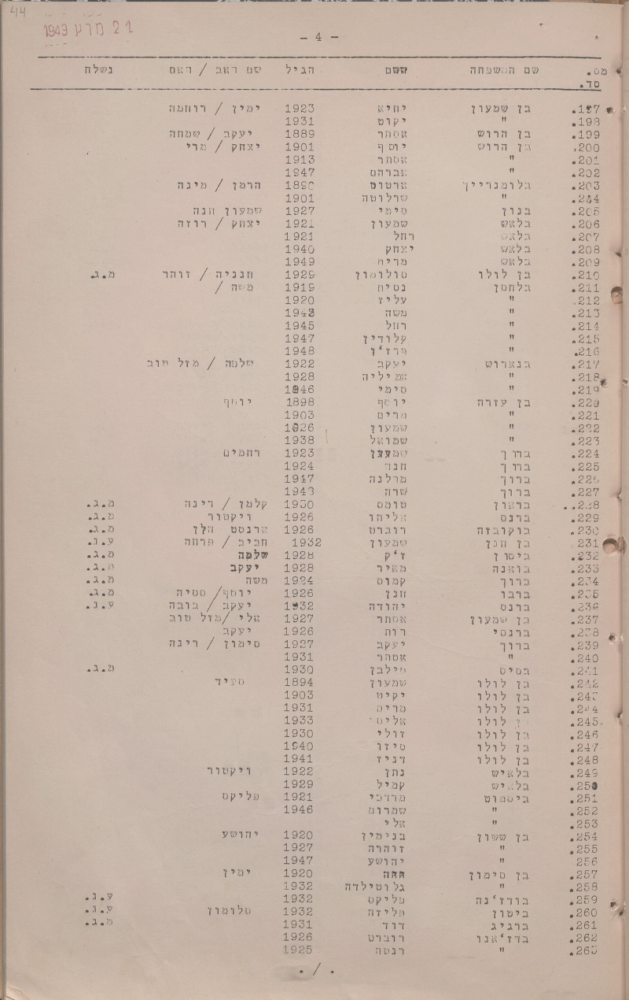](docs/1949-03_list_p45.png)

*רשימת העולים ממרץ 1949 (החותמת בעמוד: "21 מרץ 1949"), העמוד המלא — עמ' 4 של הרשימה (בפינת העמוד כתוב "44"; עמ' 45 בקובץ ה-PDF במניין מ-1): שורה 198 "יקוט, 1931" שייכת למשפחת בן שמעון (יחיא, 1923, ימין/רוחמה); שורות 199–202 הן משפחת בן הרוש — אסתר 1889 (יעקב/שמחה), יוסף 1901 (יצחק/מרי), אסתר 1913, אברהם 1947. אין מרדכי. המקור: [ארכיון המדינה, גל-15493/3](#src-6).*

## 5. המשפחה במסמכים — ומה לא נמצא

### 5.1 רשימות העולים 1947–1949

ארכיון המדינה, חטיבות S‑104 (1948) ו-גל‑15492 עד גל‑15494 (1947–1949), דרך אוסף Google Pinpoint:[[5]] 29 קבצים אותרו (חלקם מפוצלים לכמה חלקי-קובץ באוסף); ב-20 קבצים ארכיוניים (21 חלקי-קובץ, שלושה מהם נקראו חלקית) נקראו כל העמודים שבהם ה-OCR מזהה "הרוש", "ארוש" או "בנארוש"; ב-9 קבצים נוספים (ובהם ארבעה קבצי S-104 של 1948), וכן בחלקים שניים ושלישיים של שלושת הקבצים שנקראו חלקית, כלי האיתור לא החזיר עמודים כלל, והם **לא נקראו**; היחידה: קובץ ארכיוני — 20 מתוך 29. לא נמצא בלוק "בן הרוש מרדכי" עם ההורים יונה/יקוט. הממצא השלילי מדורג **ככל הנראה** בלבד: ה-OCR של הרשימות עמודתי ומשבש שיוך שורות, חיפוש ביטויים מדויקים אינו עובד בכלי, ותשעה מ-29 הקבצים (ושלושה חלקים) לא נקראו. פירוט הכיסוי ב[סעיף 9.4](#s9-4).

### 5.2 פנקס אליאנס מכנאס 1953 — אחותו אסתר

משנמסר שמרדכי נולד במכנאס, חיפוש ממוקד באינדקס IGRA לפנקסי אליאנס — שם משפחה מאשכול Benharoch עם שמות ההורים Yona ו-Yacot — העלה רשומה אחת, בפנקס בית הספר לבנות של אליאנס במכנאס לשנת 1953, מספר סידורי 3076 (שורה 26 בעמוד):[[10]]

| שדה | קריאה | דירוג |
|---|---|---|
| שם | Benarroch Esther | **מאומת** — קריאה ברורה |
| גיל | 5 ans (חמש שנים) | **מאומת** — הכותרת: «DATE DE LA NAISSANCE ou, à défaut, AGE APPROXIMATIF» (תאריך הלידה או, בהיעדרו, גיל משוער); שנת לידה ~1948 נגזרת — **ככל הנראה** |
| הורים | Yona · Yacot | **מאומת** — קריאה ברורה; העמודה: «NOM DES PARENTS OU DES TUTEURS DES ENFANTS» — הורים או אפוטרופוסים |
| מגורים ומקצוע ההורים («DOMICILE ET PROFESSION DES PARENTS OU DES TUTEURS») | <bdi dir="ltr">Commerçant V. Nouvelle</bdi> — סוחר, העיר החדשה (Ville Nouvelle) של מכנאס; העמודה היא של ההורים, לא של האב דווקא | **ככל הנראה** — קיצור |
| כניסה | "כנ"ל" מהשורות שמעל — אוקטובר 1953 | **ככל הנראה** |
| יציאה וסיבה | "55" (חודש לא פוענח) · a quitté (עזבה) | **ככל הנראה** — כתב יד קטן |

[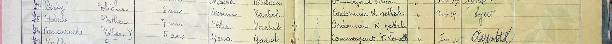](docs/AIU_MA_240.2_00028.jpg)

*אסתר בנארוש, פנקס 1953, מספר סידורי 3076 (שורה 26 בעמוד): <bdi dir="ltr">«Benarroch Esther · 5 ans · Yona Yacot · Commerçant V. Nouvelle · … 55 · a quitté»</bdi>. אותו עמוד פנקס שבו רשומה רחל דהן, אחותה של מרים (שורה 4). המקור: [פנקס אליאנס מכנאס 1953, AIU‑MA‑240.2](#src-10).*

הצירוף Yona + Yacot בשם משפחה בנארוש הוא היחיד מסוגו באינדקס (בין כ-455 רשומות של האשכול; IGRA, 11.09.2026)[[9]], והוא תואם את שמות ההורים שמסרה המשפחה. הזיהוי של אסתר כאחותו של מרדכי מדורג **כמעט ודאי**, ומתחזק ברשימת העולים שלהלן, שבה אסתר ילידת 1948 רשומה כבתם של יונה ויקוט — ובאישור המשפחה.

הערה על מה שלא נמצא: מרדכי עצמו לא אותר בפנקסי אליאנס. באשכולות Benharoch/Benarroch ו-Haroch/Harroch נבדקו כל הרשומות בשנים 1937–1946, עם השם הפרטי Mardochée ובלעדיו, ולא נמצא נער יליד 1929–1933 מהאשכול במכנאס.[[9]] ייתכן שלמד בבית ספר אחר (תלמוד תורה, "אם הבנים", או בית ספר צרפתי), או שנרשם בשם אחר. הממצא השלילי מדורג **ככל הנראה** (N-2).

### 5.3 רשימת העולים של "ארצה", 11.6.1956 — ההורים והאח

חיפוש "יונה יקוט" ברשימות העולים של ארכיון המדינה העלה את קובץ מאי–יוני 1956 (גל‑15499/1), ובו הרשימה שכותרתה «"ארצה" מיום 11.6.56» — ככל הנראה שם האונייה — עמוד 4, שורות 187–201:[[11]]

| # | שורה | קריאה | דירוג |
|---|---|---|---|
| 187–188 | **בן-הרוש יעקב** · 1933 · יונה/יקוט · מרוקו · ת.ע. 13785 · כן · צפת | **מרי** 1936 (הקרבה — ראו שורת "קרבה" להלן) | **מאומת** — הקריאה |
| 196–201 | **בן-הרוש יונה** · 1912 או 1918 · מרדכי/מרים · מרוקו · ת.ע. 13787 · כן · צפת | **יקוט** 1918 · **גבריאל** 1942 · **ז'וליט** 1943 · **סלומון** 1945 · **אסתר** 1948 (הקרבה — ראו שורת "קרבה" להלן) | **מאומת** — הקריאה; למעט הספרה האחרונה בשנת יונה, שמודפסת בהקשה כפולה: צורתה קרובה ל-2 של "1942" ושונה מה-8 הנקייה של "1918" ביקוט — **ככל הנראה 1912** |
| ב.נ. | המספרים 107492–107495 מודפסים בעמודה נפרדת ואינם מיושרים לשורות; לא ניתן לשייכם | **טעון אימות** |
| קרבה | לרשימה אין עמודת קרבה (העמודות: מס' סד' · המשפחה והשם · הגיל — ובה שנות לידה · אב/אם · ארץ מוצא · מס' ת.ע. · בוטח לקו"ח · בנמל נשלח ל-); "אשתו" ו"ילדיהם" נגזרים מרצף הבלוק וממספר ת.ע. משותף | **כמעט ודאי** — היקש מבני |

[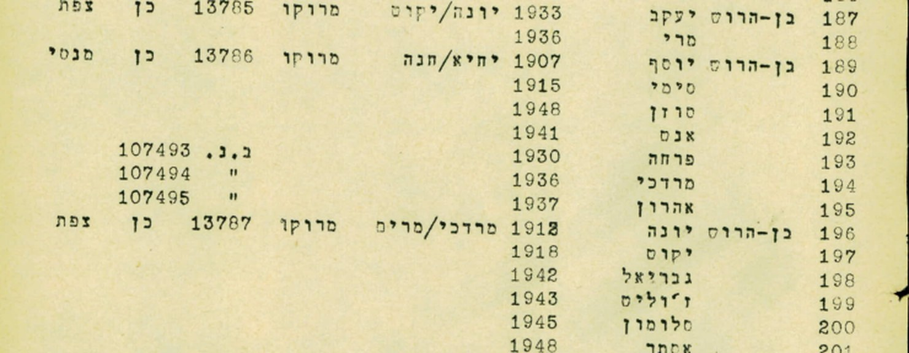](docs/1956-06-11_artza_p4.jpg)

*רשימת "ארצה" מיום 11.6.1956, עמוד 4: יעקב בן-הרוש (1933, הורים יונה/יקוט) עם מרי; יוסף בן-הרוש (1907, הורים יחיא/חנה — משפחה אחרת, ובה גם "מרדכי 1936") עם בני ביתו; יונה בן-הרוש (1912/1918, הורים מרדכי/מרים) עם יקוט, גבריאל, ז'וליט, סלומון ואסתר. המקור: [ארכיון המדינה, גל‑15499/1](#src-11).*

[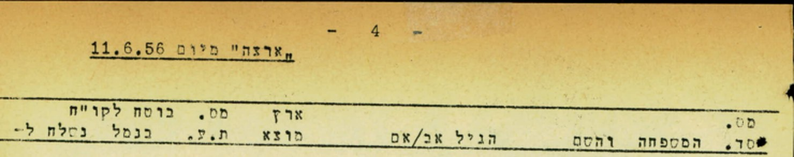](docs/1956-06-11_artza_p4.jpg)

*כותרת העמוד וכותרות העמודות: המשפחה והשם · הגיל · אב/אם · ארץ מוצא · מס' ת.ע. · בוטח לקו"ח · בנמל נשלח ל-.*

**מה הרשומה קובעת.** שני בלוקים סמוכים, שניהם ממרוקו ושניהם נשלחו לצפת: יעקב (1933), שהוריו יונה ויקוט, ויונה (1912/1918) ויקוט (1918) עצמם עם ארבעה ילדים — ובהם אסתר ילידת 1948, היא אסתר מפנקס אליאנס. הזיהוי של הבלוק כמשפחתו של מרדכי מדורג **כמעט ודאי**: שמות ההורים שמסרה המשפחה, עיר המוצא (דרך פנקס אליאנס), התאמת אסתר בין שני מסמכים בלתי תלויים — ואישור המשפחה, שזיהתה את גבי (גבריאל), יעקב ואסתר, "וכנראה גם השאר".[[4]] הרשומה מוסיפה **שנות לידה** לחמשת האחים והאחיות שהמשפחה מכירה — יעקב (1933, נשוי למרי ילידת 1936), גבריאל (1942), ז'וליט (1943), סלומון (1945) ואסתר (1948) — ואת **שמות הוריו של יונה — מרדכי ומרים**; ייתכן שמרדכי נקרא על שם סבו (ככל הנראה; אף שלפי המשפחה לא היה הבכור — קריאה על שם סב אינה שמורה לבכור); ותאריך העלייה של ההורים — יוני 1956, חמישה חודשים אחרי משפחת דהן.

**יקוט ופנינה.** המשפחה מסרה תחילה שאמו של מרדכי היא "יקוט", ולאחר מכן "פנינה", ולבסוף אישרה (12.09.2026): במרוקו קראו לה יקוט, בישראל פנינה. בשני המסמכים — פנקס 1953 ורשימת 1956 — היא Yacot / יקוט. (השם יָקוּת פירושו אבן חן, ופנינה הוא עברוּת מקובל שלו — ידע כללי, ללא מקור.) אותה אישה — **ככל הנראה** (המסמכים: יקוט; "פנינה" — מהמשפחה בלבד).

**מה היא מעוררת.** שנת הלידה של יונה: הספרה האחרונה מודפסת בהקשה כפולה ונקראת 1912 או 1918 — והמשפחה מוסרת **1898**. עם שני ילדים בכורים שלא עלו (ניסים ומרים) לפני מרדכי יליד 1928, שנת לידה סביב 1898–1905 סבירה יותר משתי הקריאות של הרשימה; שנות הלידה ברשימות נרשמו מפי העולים, ולעיתים בגיל "מעוגל". וכך גם **1918 של יקוט**: אישה ילידת 1918 הייתה בת 10 בלידת מרדכי (1928), ולפניו נולדו ניסים ומרים — הרשימה עיגלה, כנראה, את שני ההורים כלפי מטה; שנת לידתה — **טעון אימות**. השאלה פתוחה עד שיימצא מסמך — תעודת פטירה או רשומת קבורה בהר המנוחות (M-T5). המשפחה מסרה גם שמרדכי הוסיף לגילו שנה-שנתיים כדי להתגייס, אך לדבריה שנת הלידה במשרד הפנים היא כנראה 1931. באותו עמוד גם **יוסף בן-הרוש** (1907, הורים יחיא/חנה) עם בני ביתו — ובהם **מרדכי, יליד 1936**: שם זהה לנושא הדף, באותו עמוד ממש. הוא אינו מרדכי שלנו — עלה ב-1956 ולא ב-1947/48, הוריו יחיא/חנה ולא יונה/יקוט, בן 20 ביוני 1956 ובן 11–12 ב-1947/48 — **נשלל**; משפחת יוסף היא משפחה אחרת לפי שמות ההורים, ייתכן קרובה רחוקה — לא נבדק.

**ומה זה אומר על מרדכי.** אם ההורים היו במכנאס ב-1953 (אסתר בבית הספר) ועלו ממרוקו ביוני 1956, הרי שמרדכי — שעלה לפי המשפחה ב-1947 או ב-1948 — עלה **לבדו** — לפי המשפחה נער בן 16–17 (על בסיס 1931; לפי 1928 — בן 19–21); המשפחה אישרה: **בעליית הנוער**, ללא ההורים; דרך העלייה (אונייה או מטוס), הנמל, וקפריסין או עתלית — לא ידועים. זה מכוון את החיפוש אחר רשומת העלייה שלו: תיקי עליית הנוער בארכיון הציוני המרכזי (ובהם, בדרך כלל, כרטיס אישי עם תאריך לידה, שמות הורים וכתובת במרוקו), ורשומת עתלית 39404 — ולא רשימות משפחתיות בנמל חיפה. ההורים, לאחר צפת, עברו לתל אביב–יפו ונקברו בהר המנוחות בירושלים (משפחה). הנימוק הנסיבתי למועמד ממגדים (מושב עולים מצפון אפריקה, 1949) נשקל ב[פרק 3](#s3) — פעם אחת.

### 5.4 רשומת העלייה — רשפים, 22.6.1949, ועתלית

**רשפים.** רשימת "העולים שהגיעו אחרי 1 ליוני כחבורת עולים" של קיבוץ רשפים (השומר הצעיר, דואר עפולה), מסמך מ-19.9.1949:[[3]] שמונה צעירים ילידי 1924–1931 מטוניס וממרוקו, כולם הגיעו ב-22.6.1949, בית עולים "סנט-לוקס"(?); שורה 2 — **בן-ארוש מרדכי, 1927, מרוקו**; בעמודות "הנמצא בקיבוץ" — "לא", "לאן הלך" — "**צבא**". הרשומה נשללה במהדורות 1–14 בגלל פער של ארבע שנים מ-1931. משנמצאו מסמכי מכנאס — אביו מוסר באוקטובר 1949 שבנו **בן 22**, ותעודת הקהילה במרץ 1950 "כבן 22" ([5.5](#s5-5)) — 1927 הוא בדיוק הגיל שבמסמכים; והיציאה לצבא היא מה שהמשפחה זוכרת ("התגייס מיד"). כתב העדות אומר שמרדכי עזב את מכנאס "להתיישב בפלשתינה" — ניסוח שיהודי מרוקו המשיכו להשתמש בו גם אחרי 1948, ואינו מכריע לגבי המועד. הזיהוי — **ככל הנראה**: שם, שנת לידה, מוצא ויציאה לצבא מתיישבים; מה שחסר — שמות הורים (אין ברשימה) ומסמך נמל. מה שיכריע: רשימת העולים של ארכיון המדינה ליוני 1949 (גל-15493/8) בעמודי הגעת 22.6.1949 — הקובץ נקרא בעבר בחיפוש "הרוש/ארוש" ולא נמצא, וייבדק עכשיו עמוד-עמוד לפי התאריך ([פרק 7](#s7), פעולה 3); ותיקו האישי בארכיון צה"ל.

[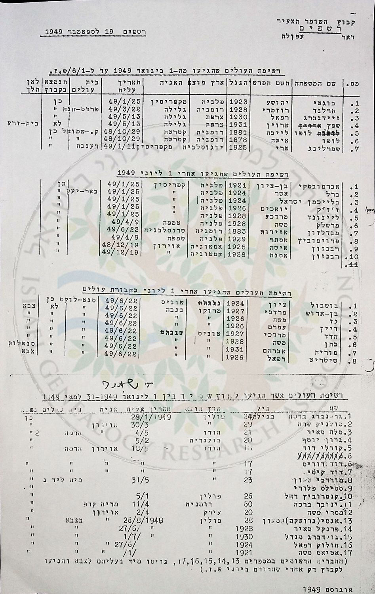](docs/1949_reshafim_p12.jpg)

*רשימות העולים של קיבוץ רשפים (ארכיון יד יערי, סריקת IGRA), עמ' 12: הרשימה השלישית — "העולים שהגיעו אחרי 1 ליוני כחבורת עולים" — שורה 2: «בן-ארוש · מרדכי · 1927 · מרוקו · 49/6/22 · סנט-לוקס(?) · לא · צבא». המקור: [רשימות יד יערי](#src-3).*

עיתונות (JPress, 2009–2011): אין מודעת אבל (N-4).[[8]] IGRA קבורות: אין.[[8]] IGRA, מסד המעפילים עתלית (1932–49): רשומה "מרדכי בן הרוש" (מסמך 39404), ללא שנה וללא פרטים באינדקס[[12]] — מועמד לרשומת **העלייה** של נער שעלה לבדו (להבדיל ממועמד מגדים, שהוא לרשומת **שינוי השם**); דורש פנייה לארכיון עתלית ([פרק 7](#s7), פעולה 3). אתר חברה קדישא תל אביב‑יפו: מחזיר נתוני דוגמה בלבד (מקום הקבורה, ירקון, ידוע מהמשפחה ואינו ממטרות הדף).

### 5.5 מסמכי מכנאס, 1949–1950 — מרדכי עצמו

המשפחה שמרה מסמכים מקוריים ומסרה את צילומיהם (12–13.09.2026): עשרה פריטים (מקורות 15–17, 19–25) בסעיפים (א)–(ט). שני הראשונים נערכו במכנאס **אחרי** שמרדכי כבר היה בארץ, וסביר שהוזמנו ממנו — או בשבילו: תעודת הקהילה (מרץ 1950) אולי לקראת הלסה-פסה של אוגוסט 1950 ([ו](#s5-5)), וכתב העדות על רווקותו — שאושר במכנאס רק אחרי מתן הלסה-פסה — ככל הנראה לנישואין. השאר נכתבו או ניתנו בישראל.

**(א) תעודת ועד הקהילה היהודית במכנאס, 7.3.1950**[[15]] — טופס בולים (20 פרנק, CV 94906), מכונת כתיבה, עם תצלום מהודק: «Je soussigné, Président de la Communauté Israélite de Meknes, certifie que Monsieur Mardoch BENARROCHE, fils de Yonas BENARROCHE et de Yacoth HAYOUN, âgé d'environ vingt deux ans, et dont photo ci-contre, est né à MEKNES (Maroc) et qu'il est de nationalité Marocaine» — "אני החתום מטה, נשיא הקהילה היהודית של מכנאס, מאשר שמר מרדוך בנארוש, בן יונאס בנארוש ויאקות חיון, כבן עשרים ושתיים, שתצלומו לצד, נולד במכנאס (מרוקו) והוא בעל אזרחות מרוקנית". חתום: סגן הנשיא, בשם הנשיא; חותמת "Comité de la Communauté Israélite de Meknès"; אימות חתימה של שירותי העירייה, 9.3.1950.

| שדה | קריאה | דירוג |
|---|---|---|
| שם | Mardoch BENARROCHE | **מאומת** — דפוס |
| הורים | Yonas BENARROCHE · Yacoth HAYOUN | **מאומת** |
| גיל | "כבן 22" במרץ 1950 → יליד 1927/28 | **מאומת** (הקריאה) · שנת הלידה — **ככל הנראה** (גיל משוער) |
| מקום לידה, אזרחות | מכנאס; מרוקנית | **מאומת** |
| תצלום | גבר צעיר בכובע רחב שוליים, חליפה ועניבה | — |

[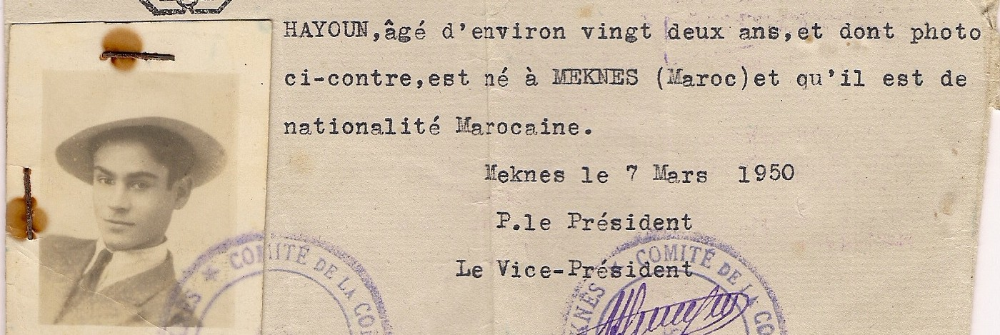](docs/1950-03-07_certificat_communaute.jpg)

*גוף התעודה, 7.3.1950. המקור: [תעודת הקהילה, באדיבות המשפחה](#src-15).*

[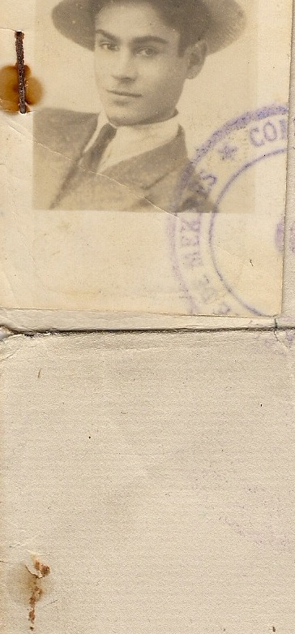](docs/1950-03-07_certificat_communaute.jpg)

*התצלום המהודק לתעודה — מרדכי כבן 22, מרץ 1950. באדיבות המשפחה.*

**(ב) תרגום צרפתי מאושר של כתב עדות עברי, 10.8.1950**[[16]] — שני דפי בולים (CX 62342), כתב יד, ובעמוד 1 תצלום מהודק (אותו תצלום עם הכובע כבתעודת הקהילה): «Traduction d'un acte hébraïque». תוכן: לפנינו — שלושה, ששניים מהם החתומים מטה («trois dont deux soussignés») — הופיעו **מסעוד דיין בן דוד המנוח** ו**סלומון בן מנחם בהלול**, והעידו בצורת עדות סדירה ומדויקת שידוע להם היטב כי **מרדכי בן יונה בנהרוש ובן יאקות בת דאוד אוחיון** («Mardochée fils de Yona Benharrosh et de Yakot Ben Daoud Ohayon») הוא יהודי יליד מכנאס, אזרח מרוקו, ו**מעולם לא נשא אישה עד היום שבו עזב את עירנו להתיישב בפלשתינה**. ועוד — יונה בנהרוש הצהיר לפנינו ש**בנו מרדכי בן עשרים ושתיים כיום**. נחתם במכנאס, **א' בחשוון תש"י (24.10.1949)**. חתמו: **שמואל חליווה, דוד משאש** (סופרי בית הדין). "לתרגום נאמן", מכנאס, 10.8.1950, מס' 2080, חותמת: מזכיר בית הדין הרבני, מתרגם מושבע, מכנאס ("Chalom …" — הקריאה חלקית); אימות חתימת "נחמני שלום"(?) בעירייה, 11.8.1950; אימות מזכירות מחוז מכנאס, 2[1?].8.1950 (הספרה השנייה מוסתרת בחותמת).

| שדה | קריאה | דירוג |
|---|---|---|
| הנושא | Mardochée fils de Yona Benharrosh et de Yakot Ben Daoud Ohayon | **מאומת** — כתב יד ברור |
| אמו | יאקות בת דאוד אוחיון — שם נעוריה **אוחיון**, אביה **דוד** | **מאומת** (במסמך) · הזיהוי כאמו של מרדכי — **כמעט ודאי** (Yona + Yacot, מכנאס, כמו בפנקס 1953 וברשימת 1956) |
| מצב אישי | רווק עד עזיבתו את מכנאס לארץ ישראל | **מאומת** (כעדות) |
| גיל | "בן 22" באוקטובר 1949, מפי אביו → יליד 1926/27 | **מאומת** (הקריאה); שנת הלידה — **ככל הנראה** |
| תאריך העדות | א' בחשוון תש"י = 24.10.1949 | **מאומת** |
| העדים והחותמים | מסעוד דיין בן דוד ז"ל; סלומון בן מנחם בהלול; שמואל חליווה; דוד משאש | **מאומת** |

[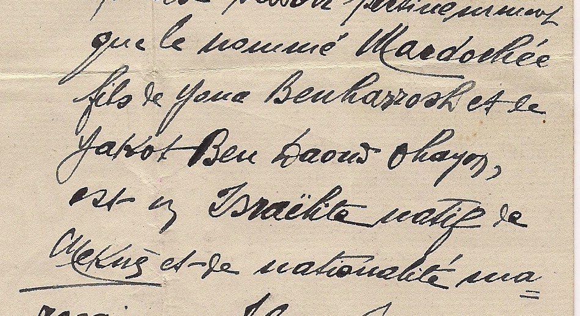](docs/1950-08-10_traduction_acte_p1.jpg)

*עמוד 1 של התרגום — שמות ההורים ושם נעוריה של האם. המקור: [תרגום כתב העדות, באדיבות המשפחה](#src-16).*

[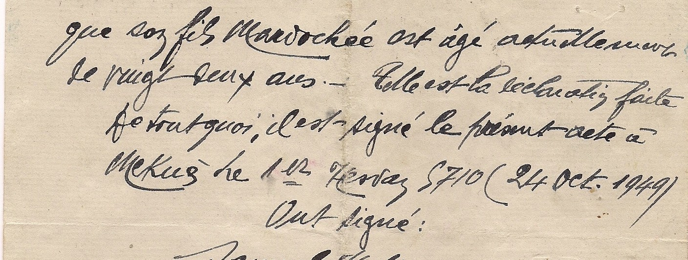](docs/1950-08-10_traduction_acte_p2.jpg)

*עמוד 2 — הצהרת יונה על גיל בנו, התאריך העברי והלועזי, והחותמים.*

**(ג) שתי הקדשות על גבי תצלומים — 29.8.1949 (חתומה "בן הרוש מרדכי") ו-1.7.1951**[[17]] — עיפרון, כתב רהוט עברי-מגרבי, שני פריטים. **הפריט הראשון** (צילום חד יותר נמסר 13.09.2026): שש–שבע שורות ב**יהודית-ערבית** (טרם תורגמו; השורה השלישית נראית כ«מן ענד מרדכי» — "מאת מרדכי" — לבדיקת המתרגם), ומתחתן «Le 29/8(?)/49» (ספרת החודש מכוסה בסלסול החתימה) ו**חתימה: בן הרוש מרדכי** — כלומר מרדכי חותם על הקדשה ב-29.8.1949, חודשיים אחרי הגעת חבורת רשפים (22.6.1949); לפי אותה רשימה (19.9.1949) כבר לא היה בקיבוץ ויצא לצבא — מועד היציאה אינו רשום. דירוג: **מאומת** (תאריך וחתימה); התוכן — טעון תרגום. **התצלום עצמו** נמסר 13.09.2026: מרדכי, צעיר, פוסע לעבר המצלמה ברחוב עירוני (מדרכה, חנויות עם שלטים, עצים, עוברי אורח) ב**חולצת חאקי עם כתפיות וכיסי חזה ומכנסי חאקי** — לפי המשפחה מדי צה"ל, ונשלח להוריו במרוקו; אין דרגות או סמל יחידה נראים, ולכן "מדים" — **ככל הנראה** (חולצה צבאית של התקופה; הכתובת על הגב). התאריך שעל הגב, 29.8.1949, נותן לתצלום תאריך-לכל-המאוחר: מרדכי בישראל, בלבוש צבאי, חודשיים אחרי הגעת חבורת רשפים ש"יצאה לצבא" — התמיכה החזקה ביותר עד כה ברשומת רשפים ובעדות המשפחה על גיוס מיידי. העיר לא זוהתה (שלט חנות חלקי באותיות לטיניות). **הפריט השני** — המשפחה קראה (12.09.2026): «**זאת תמונה אני והחברה של החבר שלי. אני נותן לכם אותה בתור מזכרת שלי ושלו, וגם הוא מהעיר שלנו** (חתימה) **1.7.51**». הכותב אינו מזוהה בוודאות: ייתכן שזה מרדכי, השולח להוריו תצלום שלו עם חברתו של חברו בן מכנאס; וייתכן שהכותב הוא חבר של מרדכי, והתצלום מראה את הכותב עם חברתו של מרדכי, ו"גם הוא מהעיר שלנו" מוסב על מרדכי. השפה ("אני נותן לכם אותה") מכוונת לנמענים רבים — משפחה. השוואת החתימות אינה מכריעה — בפריט הראשון שם קריא, בשני שרבוט בלולאה; מה שתומך במרדכי: אותו כתב רהוט עברי-מגרבי בעיפרון בשני הפריטים, והפנייה למשפחה. הכותב הוא **ככל הנראה** מרדכי; התאריך 1.7.1951 — **מאומת**. התצלומים עצמם — אם נשמרו — לא נמסרו ([פרק 7](#s7), פעולה 7).

[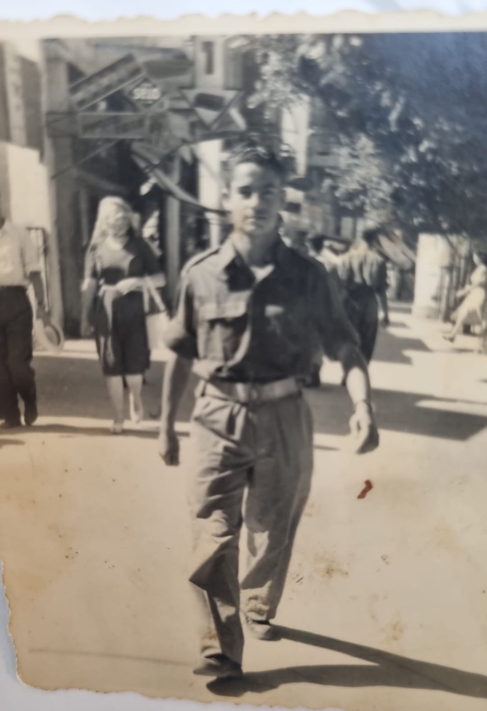](docs/1949-08-29_photo_front_uniform.jpg)

*חזית התצלום — מרדכי בלבוש צבאי, לכל המאוחר 29.8.1949. המקור: [באדיבות המשפחה](#src-17).*

[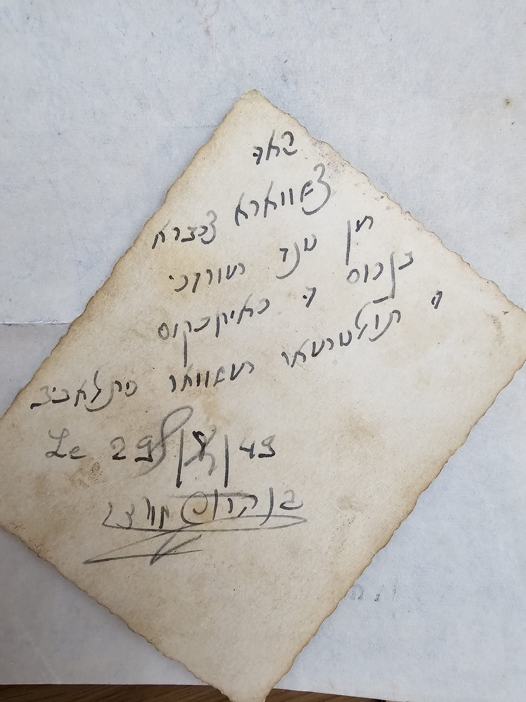](docs/1949-08-29_photo_dedication_b.jpg)

*גב התצלום — ההקדשה והחתימה. טרם תורגמה ([פרק 7](#s7), פעולה 7).*

**(ד) מעטפה רשומה, 1.8.1956 — הפועל המזרחי; ומכתב בכתב ידו למנהל מעברת טירה**[[19]][[20]] — מעטפה מודפסת של **"הפועל המזרחי בארץ ישראל, תל-אביב, רח' אחד העם 108, ת.ד. 431"**, ועליה בכתב יד: «לכבוד / בן הרוש מרדכי / צריף מס' 171 / מעב' טירה הכרמל»; תווית דואר רשום «בן דור · Ben Dor · 2684» וחותמת תאריך «בן דור · 1.8.56»; חותמת שנייה, חלקית. כלומר **באוגוסט 1956 מרדכי גר בצריף 171 במעברת טירת הכרמל** — חוף הכרמל, כ-15 ק"מ ממגדים ומעתלית; המשפחה (13.09.2026): מעברת טירה הצפונית, מחנה ד', 1956 ואולי שנה-שנתיים קודם, עם אשתו הראשונה חנה — וקיבל דואר רשום מהפועל המזרחי (תנועה שהפעילה מחלקות קליטה ודיור). עמו — מכתב בכתב ידו, לא מתוארך, בעברית טובה, אל «לכ' מר ויינר, מנהל **מעברת טירה צפונית**, שלום רב לך»: לאחר ארבעה חודשים מפגישתם, שבה הבטיח לטפל "בעניין הדיור שלי, מה שמגיע לי בתור עולה חדש כמו כל עולה חדש שמגיע לארץ"; הכותב "גר אצל הורי" ואינו יכול להמשיך כך, מבקש תשובה "אם יש לי איזה סיכויים או לא", ומסיים: «ואם לא תהיה לי ברירה אחרת, אני עלול לדרוש בחזרה **למעברה שהיינו — טירה צפונית**». בראש הדף, בשורת הסימוכין: "בתשובה נא להזכיר: בן הרוש מרדכי, רח' בית ה[—] 28 ת." (אולי "ת.א."; לא נקרא). אין חתימה — הדף נשאר בידי המשפחה, כנראה טיוטה או העתק. המכתב קושר את מרדכי, במילותיו שלו, למעברת טירה (טירת הכרמל) שבמעטפה, ומתוארך **אחרי שעזב אותה** — כלומר אחרי אוגוסט 1956 — ו"גר אצל הורי" (ההורים בארץ מיוני 1956). דירוג: המעטפה — **מאומת** (הכתובת, התאריך); שהמכתב הוא בכתב ידו של מרדכי — **כמעט ודאי** (בגוף ראשון, שמו וכתובתו בשורת הסימוכין, נשמר אצל המשפחה; אין חתימה להשוואה); מקום "בן דור" — **טעון בירור** (אולי שם משרד הדואר של טירת הכרמל עצמה בשנות החמישים — אם כן, המכתב נשלח מקומית).

[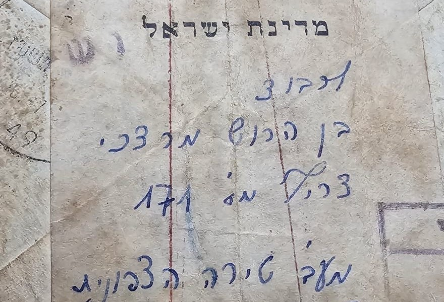](docs/1956-08-01_envelope_ben_dor.jpg)

*המעטפה — הנמען: «בן הרוש מרדכי · צריף מס' 171 · מעב' טירה הכרמל». המקור: [מעטפה, באדיבות המשפחה](#src-19).*

[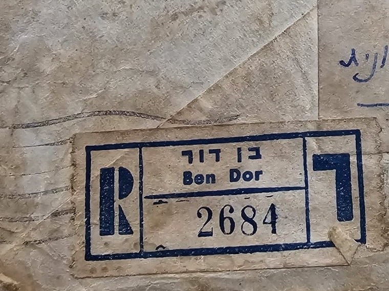](docs/1956-08-01_envelope_ben_dor.jpg)

*תווית הדואר הרשום «בן דור · Ben Dor · 2684»; חותמת התאריך «בן דור 1.8.56» — בעמוד המלא.*

[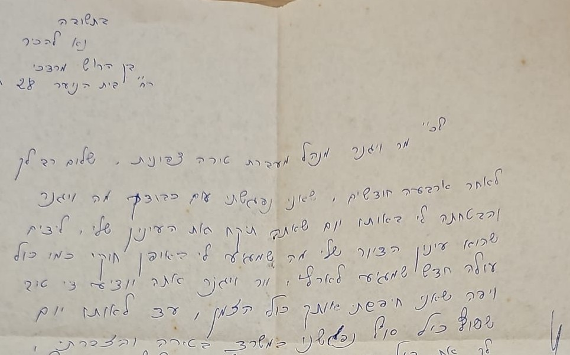](docs/letter_weiner_undated.jpg)

*ראש המכתב: «בתשובה נא להזכיר: בן הרוש מרדכי, רח' בית ה[—] 28 ת.» ו«לכ' מר ויינר מנהל מעברת טירה צפונית, שלום רב לך». המקור: [המכתב, באדיבות המשפחה](#src-20).*

**(ה) צו בית משפט השלום בת ים–חולון, 20.12.1990 — שנת הלידה 1928**[[21]] — «בבית משפט השלום בבת-ים · ת.א. 2535/90 · המבקש: בן-הרוש מרדכי · המשיב: היועץ המשפטי לממשלת ישראל · **צו** · לאחר עיון בבקשה ובתצהיר המצורף אליה ולאחר שמיעת המבקש ועדיו, ניתן היום צו הקובע, שהמבקש נולד בשנת **1928**. תעודת הזהות (מס' [—]) תתוקן בהתאם. ניתן היום 20.12.90 — שופט בית משפט השלום»; חותמות "העתקה נכונה, 20.12.1990". מספר הזהות שבמסמך מושחר בעותק המקומי ([9.6](#s9-6)). דירוג: הצו — **מאומת** (מסמך שיפוטי); שנת הלידה 1928 — **כמעט ודאי**: הכרעה שיפוטית על סמך תצהיר ועדים, 62 שנה אחרי הלידה, ללא מסמך לידה — אך מתיישבת עם מסמכי 1949–1950 (22; "présumé 1928") ועם רשפים (1927). הצו אינו אומר מה היה כתוב בתעודת הזהות קודם; "1931" — מזיכרון המשפחה, ומאישור ההסתדרות מיולי 1950 ([ח](#s5-5)), שבו כבר נרשם 1931.

[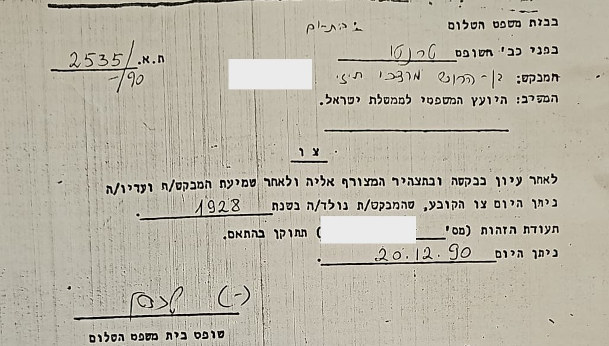](docs/1990-12-20_court_order_birth_year.jpg)

*הצו — הכותרת, הצדדים וגוף הצו; מספר הזהות מושחר. המקור: [צו בית המשפט, באדיבות המשפחה](#src-21).*

**(ו) לסה-פסה (Laissez-passer) מס' 340, הקונסוליה הכללית של צרפת בירושלים, 11.8.1950**[[22]] — טופס מודפס של הקונסוליה, מכונת כתיבה, תצלום (ללא כובע, חולצה משובצת), בולי "Affaires étrangères" 100 ו-500 פרנק, חותמות הקונסוליה, חתימת סגן הקונסול: «Laissez-passer valable pour un seul voyage · Monsieur Mardoché BENARROCHE, né présumé en 1928 à Meknès (Maroc), de nationalité marocaine, protégé français. Profession: cordonnier. Le présent laissez-passer est valable six mois et pour un seul voyage de retour au Maroc, via la France, pour permettre à l'intéressé de regagner son domicile à Meknès, rue du cimetière, nouveau Mellah» — "לנסיעה אחת בלבד: מר מרדושה בנארוש, נולד כמשוער ב-1928 במכנאס (מרוקו), אזרח מרוקו, בן-חסות צרפתי. מקצוע: סנדלר. תקף שישה חודשים ולנסיעת חזרה אחת למרוקו, דרך צרפת, כדי לאפשר למבקש לשוב לביתו במכנאס, רחוב בית הקברות, המלאח החדש." נעשה בירושלים, 11.8.1950.

| שדה | קריאה | דירוג |
|---|---|---|
| שם | Mardoché BENARROCHE | **מאומת** |
| לידה | "né présumé en 1928" — נולד, כמשוער, ב-1928, מכנאס | **מאומת** (הקריאה); 1928 — עולה בקנה אחד עם צו 1990 |
| מעמד | אזרח מרוקו, בן-חסות צרפתי (protégé français) | **מאומת** |
| מקצוע | סנדלר (cordonnier) | **מאומת** — נתון חדש |
| כתובת במכנאס | rue du Cimetière, nouveau Mellah — רחוב בית הקברות, המלאח החדש | **מאומת** — כתובת הבית במכנאס, 1950 |
| מטרה | נסיעה חד-פעמית **חזרה למרוקו דרך צרפת**, תוקף שישה חודשים | **מאומת** |
| מקום ותאריך | ירושלים, 11.8.1950 | **מאומת** |

[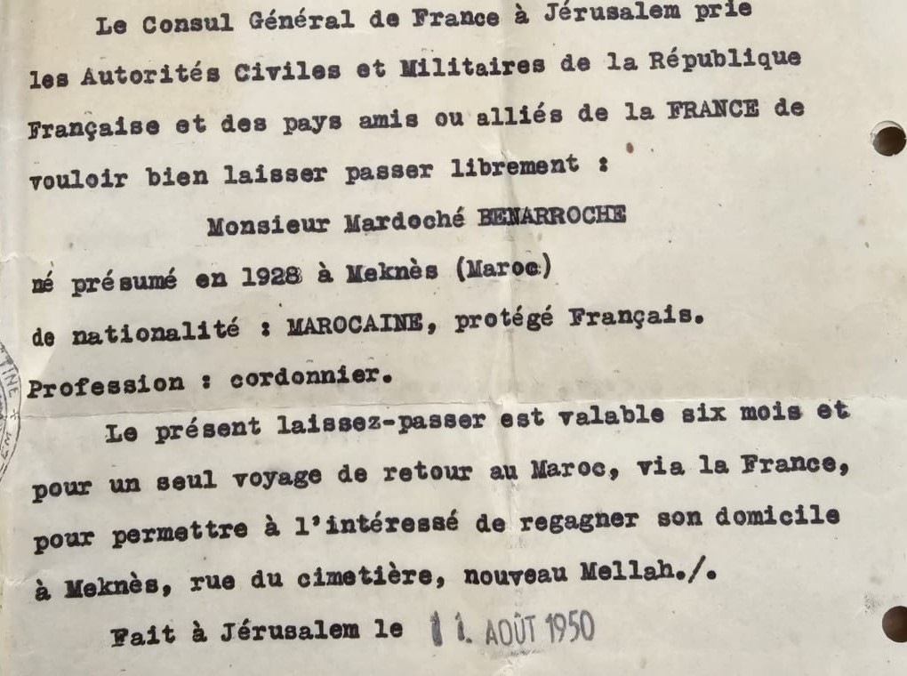](docs/1950-08-11_laissez-passer_consulat_jerusalem.jpg)

*גוף הלסה-פסה. המקור: [לסה-פסה, באדיבות המשפחה](#src-22).*

*התצלום שבלסה-פסה — מרדכי, קיץ 1950. באדיבות המשפחה.*

**מה זה משנה.** באוגוסט 1950 מרדכי — בישראל (המסמך הונפק בירושלים) — הצטייד במסמך נסיעה **לחזרה למרוקו**. תעודת הקהילה (מרץ 1950) יכולה הייתה לשמש לבקשה; כתב העדות לא — תרגומו נחתם במכנאס ב-10.8.1950 ואושר בעירייה ב-11.8 ובמזכירות המחוז אחר כך, כלומר עוד היה במכנאס ביום שהלסה-פסה כבר ניתן בירושלים; הוא נועד ככל הנראה לנישואין (כתב העדות הוא על רווקותו). כלומר ייתכן שמרדכי **חזר למרוקו בסתיו 1950** ושב לישראל אחר כך — ואז רשומת רשפים (יוני 1949) היא העלייה הראשונה, ויש רשומת עלייה שנייה שטרם נמצאה (בין 1951 ל-1954, לפני רישום מגדים). ההקדשה מ-1.7.1951 ([ג](#s5-5)) — אם היא שלו — נכתבה אולי במרוקו. ואולי גם "עולה חדש" במכתב לוויינר (אם כי ב-1956 הביטוי מתאים גם למי שעלה ב-1949). חיפוש ראשון (13.09.2026): Pinpoint "בן ארוש מרדכי" + 1928 / + יונה — אין הגעה שנייה 1950–1955 ([פרק 7](#s7), פעולה 3ב). **הבית במכנאס:** רחוב בית הקברות, המלאח החדש — הכתובת הראשונה של המשפחה שיש לנו (פנקס 1953: "V. Nouvelle" — העיר החדשה; שתי הכתובות יכולות להתיישב: משפחה במלאח החדש ועסק בעיר החדשה, או מעבר בין 1950 ל-1953).

**(ח) אישור חברות זמני בהסתדרות הכללית — לשכת המס בחיפה, "מחנה עולים", 25.7.1950**[[24]] — טופס מודפס «ההסתדרות הכללית של העובדים העברים בארץ-ישראל · לשכת המס ב-חיפה מחנה עולים · אישור חברות זמני מס' 33247», ממולא ביד: «המשפחה: בן הרוש · השם: מרדכי · שם האב: יונה · שם האם: יקוט · נולד בשנת: **1931** · המקצוע: **סנדלר** · נרשם ביום 25 לחודש יולי(?) שנת 50»; חותמת «לשכת המס חיפה» וחתימת ב"כ לשכת המס. (הפנקס עצמו — קופת חולים של ההסתדרות, לפי המשפחה — לא צולם בשלמותו.) **מה הוא מוסיף:** (1) המסמך הישראלי **המוקדם ביותר** שבידינו, ובו כבר **1931** — חודש לפני שהקונסוליה הצרפתית בירושלים כתבה "présumé 1928" (11.8.1950): שתי שנות הלידה נמסרו במקביל, באותו קיץ, לשני גופים שונים; "1931" הישראלי אינו אפוא טעות מאוחרת של משרד הפנים אלא הצהרה מ-1950. (2) שמות ההורים יונה ויקוט ומקצוע סנדלר — כמו בלסה-פסה — **מאומת**: זה אותו אדם. (3) הרישום נעשה ב**לשכת המס של "מחנה עולים" בחיפה** ביולי 1950 — כלומר בקיץ 1950 מרדכי היה במסגרת של עולים בחיפה, אחרי השירות הצבאי (אוגוסט 1949) ולפני הלסה-פסה; מתיישב עם מעבר דרך מחנה עולים (ואולי עם עלייה שנייה — M-T2). דירוג: המסמך — **מאומת**; הזיהוי — **מאומת** (שם, הורים, מקצוע).

[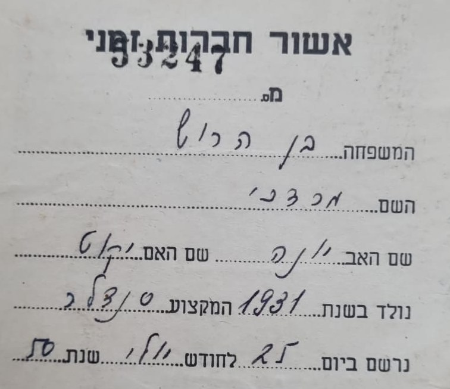](docs/1950-07-25_histadrut_membership_haifa.jpg)

*אישור החברות — השדות הממולאים. המקור: [באדיבות המשפחה](#src-24).*

**(ט) מעטפה רשומה שנייה — חיפה, 1956, אל "מעברת טירה הצפונית, צריף 171, מחנה ד'"**[[25]] — מעטפה רשמית «מדינת ישראל», תווית דואר רשום «חיפה · HAIFA · 28317», חותמת דואר «חיפה 4 · HAIFA 4 · 1?-?-56»; בכתב יד: «מר [מרדכי] בן הרוש / מעברת טירה הצפונית / צריף 171 מחנה ד'»; בגב — חותמת השולח (דהויה): «משרד ה[דתות?] · [בית] הדין [הרבני] האזורי חיפה(?) · 17 [חודש] 1956 · ת.ד. 716 · טלפון …» וחתימה. **מה היא מוסיפה:** אישור עצמאי, ממקור שני, לכתובת שבמעטפת "בן דור" — ובנוסף "**מחנה ד'**" ו"**הצפונית**", בדיוק כפי שמסרה המשפחה (13.09.2026). אם קריאת חותמת השולח נכונה — בית הדין הרבני האזורי חיפה כתב אליו ב-1956 — הדבר נוגע כנראה לנישואיו הראשונים או לגירושיו (M-T9); **טעון אימות** (החותמת דהויה). דירוג: הכתובת — **מאומת**; השולח — **טעון אימות**.

[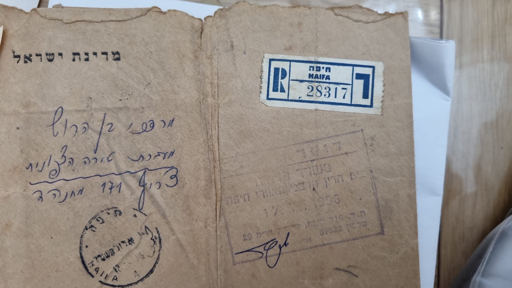](docs/1956_envelope_haifa_registered.jpg)

*המעטפה השנייה — «מעברת טירה הצפונית · צריף 171 מחנה ד'». המקור: [באדיבות המשפחה](#src-25).*

**(ז) מכתב ביהודית-ערבית, שני עמודים, לא מתוארך**[[23]] — דיו כחולה, כתב רהוט מגרבי, על גב נייר מכתבים מודפס; הכיתוב, השקוף מבעד לנייר, נקרא בהיפוך (13.09.2026): «JACOB G[…] M.A. · ADVOCATE · 33 MONTEFIORE STREET · P.O.B. 2296 · TEL-AVIV», ובעברית «יעקב ג[…] · עורך-דין · רח' מונטיפיורי 33 · ת.ד. 2296 · תל-אביב» — נייר של משרד עורכי דין **בתל אביב**, כלומר המכתב נכתב ככל הנראה **בישראל**, לא במכנאס; פותח «נוה[?]» ובגוף מופיעים מספר שמות; טרם תורגם. הכותב — **טעון אימות** (מרדכי? קרוב? — ההימצאות אצל המשפחה מתיישבת עם טיוטה או העתק שנשאר אצל הכותב); ולכן הפריט נמנה בין שמונת הפריטים כ"טרם זוהה". דירוג התוכן — טרם ([פרק 7](#s7), פעולה 7).

[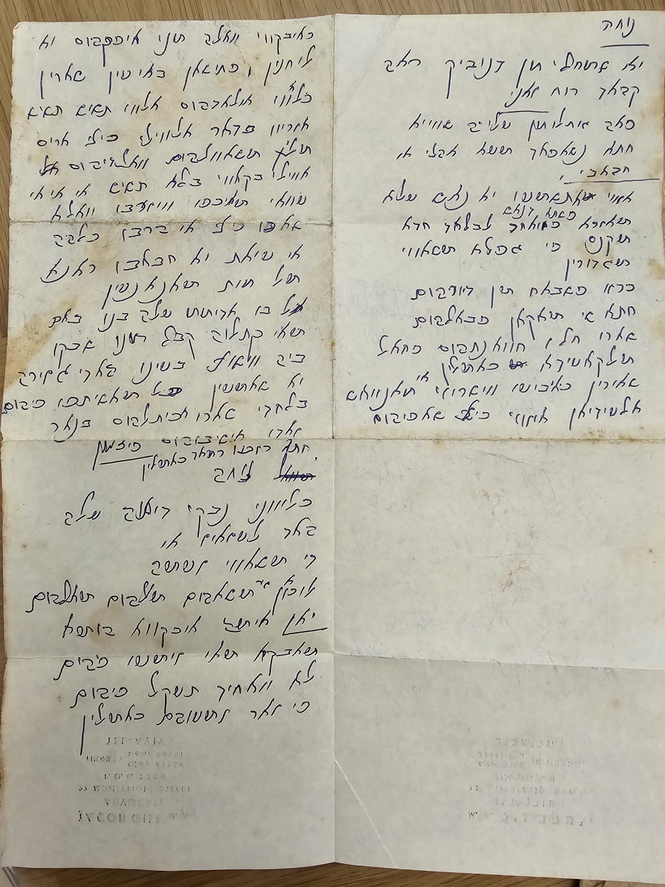](docs/letter_judeo-arabic_undated.jpg)

*המכתב ביהודית-ערבית — טרם תורגם. המקור: [באדיבות המשפחה](#src-23).*

**מה המסמכים משנים.** (1) **שם נעוריה של האם — אוחיון (Ohayon; בתעודת הקהילה Hayoun), בת דוד** — נתון חדש, ממסמך, ומכאן דור נוסף: דוד אוחיון, סבו של מרדכי. (2) **שנת הלידה:** שלושה מסמכים בלתי תלויים — אביו (אוקטובר 1949: 22), ועד הקהילה (מרץ 1950: כבן 22) ורשימת רשפים (1927) — מתכנסים ל-**1926/27–1927/28**; המשפחה זוכרת 1931 וכי "הוסיף לגילו שנה-שנתיים כדי להתגייס". ההכרעה הגיעה מהמשפחה עצמה: **צו בית משפט השלום בת ים–חולון, 20.12.1990** ([ה](#s5-5)) קובע שנולד ב-**1928** ומתקן את תעודת הזהות — 1931, לפי המשפחה, היה הרישום הישראלי המוקדם; המסמכים ממכנאס ורשפים והצו מתיישבים בקירוב: "22" באוקטובר 1949 = יליד 1926/27, "כבן 22" במרץ 1950 = 1927/28, "présumé 1928", רשפים 1927 — הכול בטווח 1927–1928, ו-1928 הוא קצהו. (3) **הרווקות** עד העזיבה — מתיישבת עם נישואיו הראשונים בישראל (חנה) ומסבירה כנראה את הזמנת המסמך. (4) **"עזב את עירנו להתיישב בפלשתינה"** — עזיבה לבדו, לפני המשפחה, ממסמך בן התקופה: **מאומת**. (5) יונה בנהרוש חי ופעיל במכנאס באוקטובר 1949; ביולי 1951 מגיע אל המשפחה תצלום עם הקדשה — ממרדכי או מחבר בן עירו. (6) כתיבי השם במקור: Benharrosh, BENARROCHE, Yonas, Yacoth, HAYOUN. (7) **טירת הכרמל, אוגוסט 1956** — מגורים בחוף הכרמל, האזור של מגדים ועתלית, שנה וחצי אחרי רישום מגדים: ראיה נסיבתית חדשה למועמד מגדים ([3.2](#s3-2)). (8) **1928** — צו 1990 מכריע את שאלת שנת הלידה (כמעט ודאי), והלסה-פסה של 1950 ("né présumé en 1928") מאשר שכך הצהיר כבר אז. (9) **מקצוע — סנדלר** (1950). (10) **נסיעה חזרה למרוקו, 1950** — אפשרות של שתי עליות. (11) **29.8.1949 — מרדכי במדים, בישראל**: התצלום שעל גבו ההקדשה החתומה מראה אותו בלבוש צבאי ברחוב עירוני — חודשיים אחרי הגעת חבורת רשפים ויציאתה לצבא: תמיכה חזקה ברשומת רשפים ובעדות המשפחה על גיוס מיידי; ושהתצלום נשלח להוריו במרוקו (משפחה) — מתיישב עם "אני נותן לכם" בהקדשה מ-1951.

## 6. עץ המשפחה

העץ מוצג בתרשים ב[מקטע העץ](#tree). בטקסט:

- **מרדכי ומרים בן הרוש** — הוריו של יונה (רשימת העולים 1956, עמודת אב/אם) — **כמעט ודאי**; לא ידוע אם עלו.
- **דוד אוחיון** — אביה של יקוט (כתב העדות 1949: "יאקות בת דאוד אוחיון") — **כמעט ודאי**; לא ידוע עליו יותר.
- **יונה בן הרוש** — אביו; שנת לידה: 1898 (משפחה) / 1912 או 1918 (רשימת 1956, ספרה מוכה כפול) — **טעון אימות**; מקצוע ההורים: סוחר, העיר החדשה של מכנאס (פנקס 1953 — עמודת "הורים או אפוטרופוסים"); עלה ב"ארצה" ב-11.6.1956, נשלח לצפת; לימים תל אביב–יפו; קבור בהר המנוחות (משפחה). פטירה — **טעון אימות**.
- **יקוט (פנינה) בן הרוש לבית אוחיון** — אמו; ילידת 1918 לפי רשימת 1956 — אינו מתיישב עם בן יליד 1928 ושני ילדים בכורים לפניו, **טעון אימות** ([5.3](#s5-3)); שם נעוריה אוחיון/חיון, בת דוד (מסמכי מכנאס 1949–1950); "יקוט" במרוקו ובמסמכים, "פנינה" בישראל (משפחה בלבד — ככל הנראה); עלתה עם יונה; תל אביב–יפו; קבורה בהר המנוחות (משפחה). פטירה — **טעון אימות**.
  - **ניסים (מקסים)** — הבכור; חי במרוקו כמעט עד מותו, נשוי; שלושה ילדים, בצרפת (משפחה, 12.09.2026) — **טעון אימות**; אינו ברשימת 1956.
  - **מרים** — אחותו הבכורה; נישאה ל**שמואל רואש**; פריז; שניהם נפטרו בפריז ונקברו בישראל — הוא בקריות (חיפה), היא בהר המנוחות, ירושלים; ארבעה ילדים (משפחה, 12.09.2026) — **טעון אימות**; אינה ברשימת 1956.
  - **מיכאל מכלוף** — אח צעיר ממרדכי; עלה לישראל, לא ידוע מתי (משפחה, 12.09.2026) — **טעון אימות**; אינו ברשימת "ארצה" 1956, ולכן עלה בנפרד; מקומו בסדר הלידה לא ידוע. מועמד לרשומה: «הרוש מכלוף → הרוש מיכאל», שינוי שם, נפת **צפת** (העיר שאליה הגיעו ההורים ב-1956), רשימה 3/72, ילקוט הפרסומים 1920 עמ' 1710[[18]] — **טעון אימות**: "מכלוף→מיכאל" הוא עברות נפוץ (IGRA: חמישה "מיכאל (מכלוף) הרוש" בשינויי שם 1962–1974 — צפת, חיפה ×2, באר שבע, תל אביב), ואין ברשימה גיל או מספר זהות. **הערת זהירות:** גם אחיה של יקוט דהן, אמה של מרים, נמסר בשם "מיכאל מכלוף" (אבוטבול) — ובאותו עמוד ילקוט, באותה נפה, גם "אבוטבול מכלוף → מיכאל". שני אנשים בשני הענפים, או בלבול בזיכרון — לבדוק בשתי המשפחות.
  - **מרדכי בן הרוש** — **1928** (צו בית משפט 1990; מסמכי מכנאס 1949–1950 ורשפים 1949: 1927/28; תעודת הזהות עד 1990: 1931) – 2010 (משפחה). מעברת טירת הכרמל, צריף 171 (אוגוסט 1956). כינויו "מרדושי". עזב את מכנאס רווק ולבדו (כתב העדות 1949 — מאומת); לפי המשפחה 1947/48 בעליית הנוער; לפי רשומת רשפים (ככל הנראה) הגיע 22.6.1949 ויצא לצבא. ככל הנראה "מרדושי בנערוש" ממגדים (1954); "מרדושה בן הראש" מירושלים (1963) ככל הנראה נשלל לפי מספר זהות.
    - נישואין ראשונים: **חנה (אניטה) לבית יפלח** (~1953; משפחה — טעון אימות; כ-10–11 אחים ואחיות, אחד מהם שחקן ידוע — ייתכן אהרן איפלה, טעון אימות); בנם **יוני** (פרטים מזעריים — [9.6](#s9-6)).
    - נישואין שניים: **מרים לבית דהן** (1939, מכנאס), תל אביב, ספטמבר 1960 (משפחה) — [המחקר על מרים](../index.html#research-miriam-benharoush).
  - **יעקב בן הרוש** — 1933 (רשימת 1956); אשתו מרי (1936); עלו ב"ארצה" 1956 לצפת.
  - **גבריאל (גבי)** (1942), **ז'וליט** (1943), **סלומון** (1945), **אסתר** (1948) — רשימת 1956; אסתר גם בפנקס אליאנס מכנאס 1953; המשפחה מזהה את גבי, יעקב ואסתר.

::: note
יקוט הוא גם שם אמה של מרים (יקוט דהן לבית אבוטבול). אלו שתי נשים שונות — חמות וכלה בעלות אותו שם פרטי, שם מרוקאי נפוץ; אמו של מרדכי נודעה בישראל, לפי המשפחה, כפנינה.
:::

## 7. פעולות פתוחות

| # | פעולה | מה זה ישנה | מי |
|---|---|---|---|
| 1 | **תמצית רישום של מרדכי ממרשם האוכלוסין** "בתוספת פרטי כניסה לארץ, ישוב לידה ושמות קודמים" (נוהל רשות האוכלוסין 2.17.0001, סעיף 4.7)[[14]] — מכריעה את מועמד מגדים | השאלה ללשכה חדה: האם **ז/203321** (מספר הזהות ברישום מגדים, [3.1](#s3-1)) הוא מספרו הקודם של מרדכי, והאם "בנערוש" שם קודם שלו? מגישים בלשכה: בת זוג או ילד (קרבה ראשונה), טופס מר/2, ללא תשלום. במקביל: תעודת פטירה (אונליין, קרבה ראשונה) — שמות ההורים ותאריך הלידה הרשום; וצילום התעודה יאמת גם את שלילת מועמד ירושלים ([3.4](#s3-4)) | משפחה (קרוב מדרגה ראשונה) |
| 2 | **שנות הפטירה של יונה ופנינה** (הר המנוחות, ירושלים) | רשומת קבורה בהר המנוחות תיתן תאריך פטירה, גיל ושם אב — ותכריע בין 1898 ל-1912/1918; חברה קדישא ירושלים / אתרי מצבות | משפחה, ואז ארכיון |
| 2א | **נישואי מרדכי ומרים — תל אביב, ספטמבר 1960** | רישומי הרבנות תל אביב (תעודת נישואין: שנות לידה, שמות הורים, כתובות); עיתונות ספטמבר 1960 | משפחה (תעודה בבית?) / ארכיון |
| 2ד | **משפחת אוחיון** — דוד אוחיון, אביה של יקוט (מכנאס) | פנקסי אליאנס מכנאס (Ohayon/Hayoun עם אם Yacot? — אחיה של יקוט), רשימות עולים; דור נוסף בעץ | ארכיון |
| 2ה | **מרים ושמואל רואש** — קבורות בקריות ובהר המנוחות | רשומת הקבורה של מרים רואש לבית בן הרוש תיתן תאריך לידה ושם אב (יונה) — כלומר גם מסמך על יונה; חברה קדישא חיפה/הקריות (IGRA מכסה חלק מבתי העלמין בחיפה) וירושלים | ארכיון |
| 2ב | **הנישואין הראשונים** — חנה (אניטה) לבית יפלח, הבן יוני; נישאו ~1953 | שנת נישואין ועיר (חיפה/טירת הכרמל?) — יאתרו רישום רבנות; משפחת יפלח: מוצא, עלייה, שמות ההורים והאחים — ובהם השחקן (אהרן איפלה?); IGRA "יפלח": 87 רשומות, רובן ירושלים — לא נמצאה משפחה בטירת הכרמל (13.09.2026); ניסים (מקסים) ומרים — מה עלה בגורלם במרוקו/צרפת | משפחה |
| 2ג | **מיכאל מכלוף בן הרוש** — האח הצעיר שעלה בנפרד; מועמד: שינוי שם מכלוף→מיכאל הרוש, צפת 1972 | לשאול: האם מיכאל גר בצפת בשנות השבעים? האם באמת אח של מרדכי — או שמא "מיכאל מכלוף" הוא דודה של מרים (אבוטבול)? שנת לידה ושנת עלייה משוערות → רשימות העולים (חיפוש "בן הרוש מיכאל"/"מכלוף" — טרם נמצא ב-Pinpoint); אולי גם הוא בעליית הנוער | משפחה, ואז ארכיון |
| 3 | **רשומת העלייה: 22.6.1949?** — רשומת רשפים ([5.4](#s5-4)) מול זיכרון המשפחה (1947/48, עליית הנוער) | רשימת העולים של ארכיון המדינה, יוני 1949 (גל-15493/8) — קריאה עמוד-עמוד של הגעות 22.6.1949 (הקובץ נקרא בעבר רק לפי "הרוש/ארוש"); אם אינו שם — תיק עליית הנוער |
| 3ב | **עלייה שנייה, 1951–1954?** — הלסה-פסה מ-11.8.1950 לחזרה למרוקו ([5.5](#s5-5), ו) | האם נסע? רשימות העולים 1951–1954 (Pinpoint, כתיבי בן הרוש/בנארוש, יליד 1928); רשימות נוסעים; לשאול את המשפחה אם ידוע על חזרה למרוקו | ארכיון / משפחה |
| 3א | **תיק עליית הנוער של מרדכי** — אם אכן עלה במסגרתה | הארכיון הציוני המרכזי, תיקי חניכי עליית הנוער (כרטיס אישי: תאריך לידה, הורים, כתובת במכנאס, מוסד הקליטה) — פנייה של בן משפחה; במקביל רשומת עתלית 39404 ([מקור 12](#src-12)) | משפחה (בקשה) / ארכיון |
| 4 | **9 הקבצים (ושלושת החלקים) שלא נקראו** ברשימות 1947–49 | קריאה עמוד-עמוד (כ-3,000 עמודים) — כדאי אחרי שיהיו חודש עלייה או שם אונייה | ארכיון |
| 4א | **13 הנערים ילידי 1929–1933 באשכול Benharoch בפנקסי אליאנס** (N-2) | פתיחת הסריקות ובדיקת שמות ההורים — אם אחד מהם Yona/Yacot, נמצא מרדכי בשם אחר; ובמקביל פנקסי בתי ספר אחרים במכנאס | ארכיון |
| 8 | **מסמך סולל בונה, אילת, 1959** ובנוסף: תקופת העבודה באילת (שנות החמישים) | צילום המסמך — תאריכים, תפקיד, כתובת; ארכיון סולל בונה / ארכיון העבודה (מכון לבון) — כרטיס עובד | משפחה / ארכיון |
| 7 | **ההקדשות מ-29.8.1949 ומ-1.7.1951** ([5.5](#s5-5), ג) והמכתב ביהודית-ערבית ([ז](#s5-5)) | תרגום היהודית-ערבית (קורא של כתב סופרים מרוקאי): ההקדשה מ-1949 והמכתב — תוכן, נמענים, תאריך, שם הכותב; האם התצלומים עצמם נשמרו | משפחה / חוקר |
| 5 | **תעודת פטירה של מרדכי** | שמות ההורים וכתיב השם כפי שנרשמו בישראל (שנת הלידה — הוכרעה בצו 1990); קובע את כתיב השם לחיפושים הבאים | משפחה |
| 5א | **רישומי הגיוס** — התגייס מיד עם עלייתו, 1947/48 (משפחה) | ארכיון צה"ל ומערכת הביטחון — תיק אישי לבן משפחה; יקבע את שנת הלידה שהצהיר עליה ואת כתובתו בשנות החמישים (מגדים?) | משפחה (בקשה) |
| 6 | **תעודות העולה 13785 ו-13787** (יעקב; יונה ויקוט) | תיקי העולה ברשות האוכלוסין — תאריכי לידה מלאים, כתובת במכנאס; בן משפחה מדרגה ראשונה | משפחה (בקשה) |

## 8. סיכום המקורות

ערכים [15](#src-15)–[17](#src-17) ו-[19](#src-19)–[23](#src-23) — המסמכים שהמשפחה שמרה, ממכנאס 1949–1950 ומישראל 1950–1990 — הם המסמכים של מרדכי עצמו (ערך 23 — כותבו טרם זוהה); ערך [3](#src-3) — רשומת רשפים — מועמד לרשומת העלייה; ערכים [10](#src-10) ו-[11](#src-11) — פנקס אליאנס מכנאס 1953 ורשימת "ארצה" 1956 — הרשומות של משפחתו; ערך [12](#src-12) הוא רשומת עתלית שטרם נפתחה.

הרשימה המלאה ב[אינדקס המקורות](#index). ערך [1](#src-1) הוא המועמד לרשומת שינוי השם, וערך [13](#src-13) — מועמד שני באותו כינוי, שככל הנראה נשלל לפי מספר זהות; ערכים [2](#src-2), [5](#src-5), [6](#src-6), [8](#src-8), [11](#src-11) ו-[13](#src-13) נושאים את המועמדים שנשללו; ערכים [5](#src-5) ו-[9](#src-9) — הסריקות השליליות; ערך [7](#src-7) — מקור העזר על מגדים.

## 9. שיטה ומגבלות

### 9.1 בסיס הראיות

מסמכים מקוריים ממכנאס 1949–1950 שבידי המשפחה (מקור ראשוני — סריקות שמסרה המשפחה); ילקוט הפרסומים (מקור ראשוני מודפס — דרך סריקת IGRA, שמשחירה את עמודת מספרי הזהות בתמונות שהיא מגישה, ודרך סריקות הגיליונות המלאות באתר olaw.org.il, שבהן העמודה גלויה); רשימות העולים של ארכיון המדינה (מקור ראשוני שנקרא דרך OCR רועש); אינדקסים של IGRA (מקור עזר); מידע משפחתי ([פרק 2](#s2)).

### 9.2 סולם הוודאות

חמש דרגות: **מאומת** — נקרא ישירות מהמסמך; **כמעט ודאי** — מסמכים מתכנסים ללא סתירה; **ככל הנראה** — פרשנות סבירה או קריאה קשה; **טעון אימות** — לא פוענח או לא נבדק; **נשלל** — הפרטים ברשומה סותרים. "ככל הנראה נשלל" — סתירה חזקה שאינה מוחלטת. מסמך מדורג בנפרד מן הזיהוי שנשען עליו.

### 9.3 מוסכמות הכתיב

בן הרוש · בנהרוש · בן-הרוש · בן הראש · בנערוש · בנארוש · בן-ארוס · הרוש — כולם אותו שם בכתיבים שונים; Benharoch / Benharroch / Benarroch בצרפתית של הפנקסים; Benharrosh / BENARROCHE במסמכי מכנאס 1949–1950. אוחיון · חיון — Ohayon / Hayoun. "מרדושי" / "מרדושה" — כינוי חיבה נפוץ של מרדכי בקרב יוצאי מרוקו.

### 9.4 ממצאים שליליים

| # | שאלה | מקור וכיסוי מדויק | תוצאה | דירוג |
|---|---|---|---|---|
| N-1 | "בן הרוש מרדכי" (~1928; 1931 ברישום הישראלי עד 1990; יונה/יקוט) ברשימות העולים 1947–1949 | ארכיון המדינה/Pinpoint, 29 קבצים ארכיוניים; נקראו עמודי "הרוש/ארוש/בנארוש" ב-20 קבצים (21 חלקי-קובץ): S-104-607/612/613/614; גל-15492/1; 15492/2 (חלק א בלבד); 15492/5 (חלקים א–ב בלבד); 15493/1; 15493/2 (חלק א בלבד); 15493/3–8; 15494/1, /2, /5, /6, /7. 9 קבצים לא נקראו כלל (15492/3, 15492/4, 15494/3, /4, /8, וארבעה קבצי S-104 של 1948: 608–611), וכן החלקים שלא נקראו של 15492/2, 15492/5, 15493/2[[5]] | אין בלוק תואם | **ככל הנראה** — סריקה חלקית |
| N-2 | Mardochée Ben Haroch (~1931) בפנקסי אליאנס מרוקו | IGRA: אשכול Benharoch/Benarroch (455 רשומות; 1940, 1941, 1943, 1944, 1946 שנה-שנה + Mardochée בכל השנים) ואשכול Haroch/Harroch (1937–1946 שנה-שנה)[[9]] | אין Mardochée יליד 1929–1933; 13 נערים ילידי 1929–1933 בשמות אחרים (שמות הורים לא נבדקו). לעומת זאת נמצאה אחותו אסתר (1953, Yona/Yacot) — [5.2](#s5-2) | **ככל הנראה** — חלקי; מרדכי עצמו לא בפנקס |
| N-3 | "יונה בן הרוש" ב-IGRA | כל המאגרים, עברית ולטינית[[8]] | אפס ב-IGRA; נמצא ברשימות העולים של ארכיון המדינה ("ארצה" 11.6.1956) שאינן מאונדקסות ב-IGRA — [5.3](#s5-3) | **ככל הנראה** (ל-IGRA בלבד) |
| N-4 | מודעת אבל 2010 | JPress, כל העיתונים, 2009–2011[[8]] | אפס | **ככל הנראה** |
| N-5 | "מרדכי בן הרוש" במסד המעפילים עתלית | IGRA, Immigration Atlit Database — רשומה 39404 קיימת, ללא שנה ופרטים[[12]] | לא נפתחה — מועמד לרשומת העלייה | **טעון אימות** |
| N-6 | שכיחות הכינוי "מרדושי" — האם יש "מרדושי בן הרוש" נוסף | IGRA, 12.09.2026, כל המאגרים, לא פונטי: שם פרטי "מרדושי" — 25 רשומות (19 במאגר שינויי השמות); "מרדושה" — 29 (17 בשינויי שמות); שם משפחה "בנערוש" — 1; אשכול Harush (פונטי) בשינויי שמות — 26; פונטי Benharosh + Mordechai — 7[[8]] | הכינוי נפוץ — 36 רשומות שינוי שם בשמות משפחה רבים; הצירוף כינוי + בן הרוש/בן הראש/בנערוש — **שתי** רשומות: מגדים 1954 ([מקור 1](#src-1)) וירושלים 1963 ([מקור 13](#src-13)) — האחרונה נשללה לפי מספר זהות, ומוכיחה שהצירוף אינו ייחודי | **ככל הנראה** — כיסוי לפי כתיב (9.3); אינדקס של מי ששינו שם בלבד |
| N-7 | "בן הראש מרדושה", ירושלים 1963 — האם זה מרדכי? | מספר הזהות ברשומה (6419140, [מקור 13](#src-13)) מול מספר הזהות של מרדכי שמסרה המשפחה מתעודותיו ([מקור 4](#src-4); לא נראה במחקר, אינו מתפרסם), 12.09.2026 | שונה — אדם אחר | **ככל הנראה** נשלל — השוואה שאינה ניתנת לאימות חיצוני |
| N-8 | "בן הראש" באזור עתלית–מגדים: «דינה בן הראש», ילידת 1924, פנקס בוחרים לכנסת 1949, פרדס חנה | IGRA-1949-National-Elections-123533 (עלתה בחיפוש הפונטי Benharosh), 12.09.2026[[8]] | אין קשר ידוע למשפחה (השם אינו מוכר); לא נמשך | **טעון אימות** — לא נבדק לעומק |

### 9.5 חסמים

שלושה חסמים פעילים, כרשום ב-BLOCKERS: תמצית הרישום של מרדכי (ובה השוואת ז/203321 ו"שמות קודמים") ניתנת לבקשה רק על ידי בן משפחה מדרגה ראשונה (B-1); ב-9 מקובצי רשימות העולים 1947–49 (ובחלקים של שלושה נוספים) כלי האיתור לא עבד, והם דורשים קריאה עמוד-עמוד (B-2); פוסט פייסבוק על אזכרת מרדכי — טרם נפתח (B-4). B-3 (FamilySearch) נסגר ב-12.09.2026 כמחוץ להיקף — לא ייבדק.

### 9.6 מה הדף אינו עושה

מקום הקבורה מוזכר רק כשהוא נדרש לאיתור רשומה (הר המנוחות — תאריכי הפטירה של ההורים; ירקון — מודעת אבל); הדף אינו מתעד חלקות וקברים. אינו מסתמך על עצים משפחתיים מקוונים; אינו מכריע על סמך שם בלבד. **פרטיות:** מספרי זהות מצוטטים רק כשהם מופיעים בפרסום רשמי (ילקוט הפרסומים); מספר שנמסר מהמשפחה אינו נרשם באף קובץ של המאגר ואינו מתפרסם. פרטיהם של בני הדור החי — אחיו ואחיותיו של מרדכי, אשתו הראשונה ובנו — מובאים במידה מזערית, כפי שנמסרו מהמשפחה ובהסכמתה; שמות פרטיים בלבד כשאין ברירה, ובלי שנות לידה שאינן מרשומה ארכיונית; בקשה של בן משפחה להסרת פרט — תכובד.

