

# רחל צדוק לבית רפפורט-סטרולוביץ — סיפור חיים ומחקר גנאלוגי מקיף

**נערך: 18.08.2026**

רחל צדוק לבית סטרולוביץ-רפפורט (1929–2021), ילידת וולובה שבקרפטים (בהונגרית: אוקרמזו, Ökörmező; היום מיז'יריה שבאוקראינה), שרדה את אושוויץ, שטוטהוף, מחנות העבודה של טורן וצעדת המוות, עלתה ארצה ב-1946 וחיה בחולון. מסמך זה מסכם מחקר גנאלוגי ותיעודי על חייה ועל משפחתה. מבנהו: פרקים א'–ג' — הזהות, העיירה ועץ המשפחה; פרקים ד'–ז' — מסלול הרדיפה, תיקי המחנות, העדות וסיפור הצלתו של האח גדליה; פרקים ח'–ט' — מה מאומת ומה נותר פתוח; ובסוף — עץ המשפחה הגרפי, תצלומי מסמכי המפתח ואינדקס המקורות (נספחים א'–ג') ויומן השינויים (נספח ד').

---

## פרק א' — מי הייתה רחל: השמות והזהות

שמה המצטבר בכל הרשומות: **רחל ("רוצי") צדוק, לבית סטרולוביץ-רפפורט (וברישום האזרחי: פרקש)**. תאריך לידה: **16.04.1929** (ברשומת הלידה האזרחית: **12.04.1929** — על הפער וההסבר ראו בהמשך הפרק), בוולובה — הוא השם היהודי-צ'כי של העיירה שנקראת היום **מיז'יריה** (ובהונגרית Ökörmező). מדובר באותו מקום בדיוק: "נולדה בוולובה" ו"נולדה במיז'יריה" הן אותה אמירה בשמות מתקופות שונות.

ריבוי השמות הוא מפתח להבנת המסמכים — והמחקר הנוכחי פענח אותו סופית:

- **סטרולוביץ (Strulovits/Sztrulovics; ברשומות הלידה האזרחיות בתעתיק "Struljovic", וברשומת הלידה של גיטה — "Strulovic")** — שם המשפחה מצד האב: סבהּ של רחל היה יעקב סטרולוביץ מקושלובו, בנם של לייב וריבקה סטרולוביץ.
- **רפפורט (Rappaport)** — שם נעוריה של **סבתהּ שרה**, ילידת וולובה, בת למשפחת בעלי האחוזות המקומית. בני המשפחה השתמשו בו לצד סטרולוביץ (ובוולובה — בעיקר בו). התופעה מוכרת ביהדות הקרפטים: נישואים דתיים ללא רישום אזרחי גרמו לכך שילדים נרשמו על שם משפחת האם, ושני השמות נדדו יחד דורות.
- **פרקש (Farkas)** — שם נעורי אמהּ רבקה-רוזה. מאותה סיבה, ברישומים רשמיים (כולל רשומת העדות ביד ושם) רחל מופיעה גם כ"פרקש".
- **צדוק** — שם נישואיה בישראל.

ברשומות שטוטהוף היא רשומה "Strulowits Ruci, ילידת 16.04.**1927**" — יום וחודש מדויקים, שנה "מוקדמת" בשנתיים: הוספת גיל מכוונת בסלקציה, כדי להיראות כשירה לעבודה (היא הייתה בת 15). הדבר מתועד במפורש בעדותה: בסלקציה באושוויץ ענתה רחל שהיא בת 15 — וקאפו נתנה לה מכה, אמרה למנגלה "בת שמונה עשרה", ואחר כך רדפה אחריה: "תזכרי, את בת שמונה עשרה" [01:12:43] (פרק ו'1).

### רשומת הלידה האזרחית של רחל — והפער בן ארבעת הימים

רשומת הלידה האזרחית של רחל עצמה שמורה במאגר JewishGen תחת האיות **"Struljovic"** — התעתיק שבו נרשם שם המשפחה בספרי הלידות האזרחיים (על ההפניה לאיות זה נתונה תודה ללארה דיאמונד, ראשת פרויקט תת-הקרפטים ב-JewishGen):

> **Ruchlja**, נולדה **12.04.1929** בוולובה (Volove/Mizhhirya); האב: **STRULJOVIC Leba**, האם: **FARKAS Rifka**; הערה: "Father claimed paternity" (האב הכיר באבהותו — הרישום המנהלי המקובל לילדי זוגות שנישאו בנישואים דתיים בלבד). מקור: ספר הלידות של אזור מיז'יריה 1928–1931, ארכיון DAZO, **פונד 1606, אופוס 6, דלו 118, רשומה 104/1929**.

[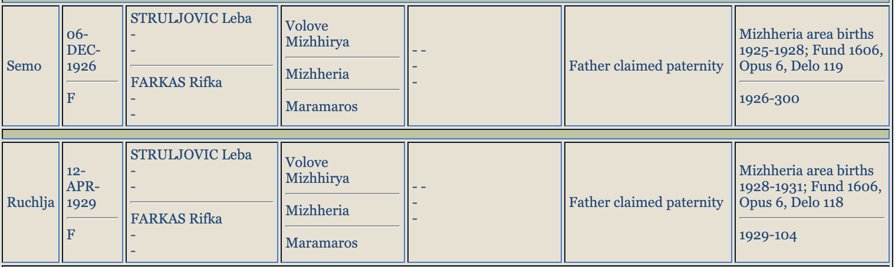](https://www.jewishgen.org/databases/hungary/)

*רשומות הלידה האזרחיות של סימה ("Semo", 06.12.1926) ורחל ("Ruchlja", 12.04.1929) — צילום מסך מתוצאות החיפוש "Struljovic" במאגר JewishGen (18.08.2026).*

באותו חיפוש אותרה גם רשומת הלידה של **אחותה סימה**: "Semo, נולדה 06.12.1926 בוולובה", אותם הורים ואותה הערה (דלו 119, רשומה 300/1926).

**הפער בתאריכים — ומה משמעותו:** הרשומה האזרחית נוקבת **12.04.1929**, ואילו כל התיעוד המאוחר — רישומי שטוטהוף (יום וחודש), כרטיס ארולסן, רשומת יד ושם והמסורת המשפחתית — נוקב **16.04.1929**. פער בכיוון דומה — התאריך האזרחי מוקדם מתאריך המסורת — קיים גם אצל סימה, אך בהיקף אחר: הרשומה האזרחית 06.12.1926, מול 26.12.1926 ברישום שטוטהוף. ההסברים האפשריים: התאריך האזרחי הוא המדויק, והמשפחה שימרה תאריך אחר (למשל המרה מתאריך עברי, או יום שנקבע בטעות ברבות השנים); או טעות מפענח באינדקס — אצל סימה במיוחד, היפוך ספרות 06↔26 הוא חשד מתבקש. יוער שהפער אינו יכול להיות תוצאה של רישום מאוחר: רישום באיחור היה מפיק תאריך אזרחי מאוחר מהאמיתי, וכאן הוא המוקדם מבין השניים. הדוח ממשיך לנקוב 16.04.1929 — התאריך שרחל עצמה מסרה כל חייה — בציון הפער; העתק מאושר של הרשומה מ-DAZO (ההפניה המדויקת ידועה כעת) יוכל להכריע.

**רשומת הלידה של גיטה — אותרה מצד האם:** חיפוש "Farkas" במאגר (18.08.2026) העלה גם את רשומת הלידה של האחות הצעירה: "**Gizela**", נולדה **26.03.1936** בוולובה; האב: **STRULOVIC Leopold** מקושלובו, האם: **FARKAS Roza** מקרייניקובו; הערה: "Father claimed paternity" — בדיוק כברשומות של רחל וסימה. מקור: ספר הלידות של אזור מיז'יריה 1934–1937, פונד 1606, אופוס 6, דלו 258 (שורה 86 לשנת 1936) — [תצלום הרשומה](docs/evidence/jewishgen_gita_gizela_1936_birth_zoom.png). שם האב נרשם כאן בתעתיק שלישי — "Strulovic" — ולכן הרשומה חמקה מסריקות שני הסלים הקודמים.

**מה עדיין אינו באינדקס:** סריקה חוזרת ומלאה של שני "הסלים הפונטיים" (252 רשומות "Strulovits" ו-5 רשומות "Struljovic", 18.08.2026) העלתה שאין באינדקס רשומות לידה לדב (~1924) ולגדליה (03.03.1931) — אף שספרי מיז'יריה מפוענחים לפחות עד 1931 (ולשנים 1934–1937). ייתכן שנרשמו באיחור, בספרים שטרם פוענחו, או כלל לא. אגב הסריקה תועדו בוולובה גם לידות לאימהות אחרות לבית סטרולוביץ — פאני/פייגה (נשואה לאלתר באומגרטן) ושרה/לנקה (נשואה לפנחס נוימן), ילדים ילידי 1922–1930 (דלו 84/110; [תצלום](docs/evidence/jewishgen_strulovits_volove_other_families_zoom.png)) — קרובות משפחה אפשריות של לייב שטרם זוהו.

---

## פרק ב' — העיירה: וולובה / Ökörmező / מיז'יריה

העיירה נקראה בפי יהודיה **וולובה** (יידיש: Volovo), בהונגרית **Ökörmező** ("שדה השוורים"), בצ'כית **Volové**, והיום **מיז'יריה (Міжгір'я)**, מחוז זקרפטיה, אוקראינה — עיירה הררית על נהר הריקה, כ-60 ק"מ צפונית לחוסט. (לא להתבלבל עם **וולובץ/Volóc** — עיירה אחרת, טעות שנפלה במחקר מוקדם.)

### הקהילה היהודית

יהודים בוולובה מאמצע המאה ה-18: 11 נפשות ב-1768, 130 ב-1830, 269 ב-1877, 766 ב-1921 — ו-**942 ב-1941**. קהילה חסידית דוברת יידיש, עם **שני בתי כנסת** (כך מתועד בעיתונות ההונגרית של 1940), מקווה ובית עלמין הקיים עד היום. כתבה בשבועון היהודי-הונגרי "Egyenlőség" מ-1911 מונה בעיירה **120 משפחות יהודיות** ומפרטת את משלחי ידן — מקור עשיר במיוחד על כלכלת הקהילה. ב-1937: 39 מ-45 החנויות בעיירה בבעלות יהודית, 23 בעלי מלאכה, בנק חיסכון, מנסרת קיטור וטחנה, ו"אגודת אשראי יהודית" (שרישומה ההונגרי מ-1942, כולל פנקס חיסכון על שם ה"חברה קדישא", אותר בעיתונים הרשמיים).

רבני העיירה (מספר מרמרוש): ר' אהרן מאיר פרידלנדר, ר' אלכסנדר צבי קלינברג, ר' מרדכי אליעזר ובר, ר' ישראל יעקב יוקל טייטלבוים ("הרב מוולובה", כיהן 1894–1924), בנו ר' אהרן (נרצח 25.05.1944) ונכדו ר' יצחק (נספה 11.04.1945).

### משפחת רפפורט — מבעלי הקרקעות הגדולים של העיירה

העיתונות והמרשמים ההונגריים מתעדים ברצף את אחוזת רפפורט באוקרמזו לאורך יותר מ-40 שנה:

| שנה | תיעוד | מקור |
|---|---|---|
| 1893 | "Rapaport Gedajlo" — אחוזה של **2,174 הולד** (≈ 1,250 הקטר ≈ 12,500 דונם), מהם 1,672 הולד יער, 340 מרעה, 56 אחו, 38 שדה | מרשם בעלי הקרקעות של הונגריה 1893, עמ' 408 · [העמוד המקורי](docs/arcanum_full/gazdacimtar_1893_p408_gedajlo_okormezo.pdf) |
| 1896 | יערות סביב אוקרמזו בבעלות "בעלי האחוזות הגדולים אגושטון, איז'ק, **רפפורט וקראוס**" | ספר סחר הרכבות ההונגריות, 1896 (העמוד המלא טרם הורד מ-Arcanum) |
| 1897 | "Rappaport Gedálya, בעל קרקע (tulajdonos)", אוקרמזו — במפקד המשקים החקלאיים | Gazdacímtár 1897 (הסטטיסטיקה החקלאית של כתר הונגריה), מחוז אוקרמזו · [העמוד המקורי](docs/arcanum_full/gazdacimtar_1897_okormezo_jaras_gedalya.pdf) |
| 1897 | מכירה פומבית נגד רכושו (ספר האחוזה מס' 1370 באוקרמזו); אשתו מגישה הצעת נגד | Budapesti Közlöny 10.12.1897 · [העמוד המקורי](docs/arcanum_full/budapesti_kozlony_1897-12-10_arveres_1370.pdf); הידיעה גם ב-Magyar Ujság 08.12.1897 · [העמוד](docs/arcanum_full/magyar_ujsag_1897-12-08_arveres.pdf) |
| 1900 | "Rappaport Gedálya" — 3,810 הולד (כ-2,190 הקטר ≈ 21,900 דונם) | מרשם בעלי הקרקעות 1899–1900 · [העמוד המקורי](docs/arcanum_full/foldbirtokosok_1899-1900_gedalya_3810hold.pdf) |
| 1910 | "רפפורט גדיילו נפטר לא מכבר, ובספרי האחוזה של אוקרמזו רשומות על שמו 120 חלקות" | Görög katholikus szemle 25.12.1910 · [העמוד המקורי](docs/arcanum_full/gorog_kath_szemle_1910-12-25_gedajlo_death_120plots.pdf); הכתבה הארצית שקדמה לה — Budapesti Hírlap 23.12.1910 · [העמוד](docs/arcanum_full/budapesti_hirlap_1910-12-23_verchovina_polemic.pdf) |
| 1912 | "**יורשי** רפפורט גדיילו" (Rappaport Gedajló örök.) — 2,176 הולד, אוקרמזו; ולצדם "**האלמנה** רפפורט גדיילו" (Özv. Rappaport Gedajlóné) — 435 הולד | מרשם המשקים Gazdacímtár 1912, עמ' 444 · [העמוד המקורי](docs/arcanum_full/gazdacimtar_1912_p444_gedajlo_orokosok_ozvegy.pdf) |
| 1928 | האחוזה הגדולה באוקרמזו (וולובה): 4,515 הקטר (≈ 45,150 דונם), מהם 2,573 הקטר יער (≈ 25,730 דונם) — בבעלות **Krausz, Farkas, Rappaport** | לשכת הקרקעות הצ'כוסלובקית ([מאמר Koblasa — שמור בתיקייה](docs/koblasa_1928_estates_podkarpatska_rus.pdf)) |

*מקורות הטבלה: המרשמים והעיתונות ההונגרית — בארכיון העיתונות [Arcanum/ADT](https://adt.arcanum.com); סריקות העמודים המלאות הורדו במנוי ושמורות ב-docs/arcanum_full/ (מקושרות מכל שורה). שורת 1928 — מאמר Koblasa ([המאמר בתיקייה](docs/koblasa_1928_estates_podkarpatska_rus.pdf) · [תצלום השורה](docs/evidence/koblasa_1928_row_zoom.png) · [PDF במקור](https://www.nacr.cz/wp-content/uploads/2024/04/PH_23_2_2015_Koblasa.pdf)). מרשם 1912 — המסמך היחיד המתעד ישירות את חלוקת האחוזה אחרי מות גדליה (1908/9): הקרקע רשומה על שם היורשים והאלמנה.*

*הערת קנה מידה והמרה: בהונגריה שימשו היסטורית שתי מידות "הולד" — ההולד ההונגרי הישן (1,200 עמות מרובעות ≈ 4,316 מ"ר) וההולד הקדסטרלי (1,600 עמות = 5,755 מ"ר ≈ 5.75 דונם). המרשמים כאן נוקבים במפורש בהולד הקדסטרלי — בכותרת הטבלה של מרשם 1893 כתוב "Kataszteri holdakban (kikerekitve)" (ראו [העמוד המקורי](docs/arcanum_full/gazdacimtar_1893_p408_gedajlo_okormezo.pdf)); מכאן 2,174 הולד ≈ 12.5 קמ"ר ו-3,810 הולד ≈ 22 קמ"ר (וגם לפי המידה הישנה הקטנה — סדר הגודל דומה). ההיקפים גדולים אך אופייניים לאחוזות יער הרריות בקרפטים — כמעט כל השטח יער ומרעה, לא קרקע חקלאית: באותו עמוד עצמו של מרשם 1893 רשומים בכפר גם קהילת אוקרמזו (6,684 הולד) ואוצר המדינה (3,267 הולד), ואחוזת רפפורט (2,174) גדולה משל משפחת הרוזן טלקי (573) ומשל קראוס דוד (1,574) — הגדולה בין בעלי הקרקע הפרטיים. אחוזת 1928 (45,150 דונם) אינה של רפפורט לבדם אלא משותפת לשלוש משפחות (קראוס, פרקש, רפפורט), ורובה יער.*

**הרשומות האזרחיות (ספרי מיז'יריה, JewishGen) קובעות: גדליה רפפורט היה אביה של סבתא שרה.** אלה הפרטים המלאים העולים מהרשומות:

- **גדליה (Gedajlo/Gedálya) רפפורט נולד ב-01.04.1846 באוקרמזו** (כך ברישום האזרחי המאוחר של נישואיו, 1903), בן **משה (Mozes) רפפורט ויֶנטה לבית שפיגל (Spiegel)** — דור נוסף אחורה, אל תחילת המאה ה-19. ברשומה נרשם "בעל אחוזה" (foldbirtokos/Homesteader).
- גדליה נשא שלוש נשים: **ריבקה לבית גרוסמן** (בתם **שיינדל נולדה 15.10.1869**, נישאה ללזר זיסוביץ — ומכאן משפחת זיסוביץ-רפפורט של וולובה); **אסתר לבית כץ (Katz Ester)** — אמם של **שרה ("Sura", ינואר 1876 — סבתה של רחל!)** ושל **נתן (Nuszen Nathan, 12.11.1879**, סוחר עצים); וב-06.08.1884, בקרצ'ונפלבה (Karácsonyfalva) שבמרמרוש — **מינדל (Mindje) לבית ברקוביץ**, ילידת 04.01.1865 (נפטרה לפני אוגוסט 1944 — מצוינת "המנוחה" בהודעת ה"מבוקש" נגד בנה מאיר, ראו בהמשך), שילדה לו את **אלדר (נובמבר 1885 — "בעל קרקע", הוא "רפפורט אלדר" ממועצת בנק החיסכון!), ברטה (05.02.1889), פרידריקה (20.12.1894), זלמן (08.03.1897), הרמן (01.04.1904, נפטר בן 7 שבועות) ומאיר (28.01.1908)**.
- **גדליה נפטר בין 1908 ל-1909**: בנו האחרון נולד בינואר 1908, ובין דצמבר 1909 לפברואר 1911 נולדו **שלושה נכדים ששמם גדליה** — בן לשיינדל וזיסוביץ (20.12.1909), בן לנתן (05.06.1910) ובן לשרה ויעקב (02.02.1911) — מנהג האשכנזים לקרוא על שם סב שנפטר. זה מתלכד עם הידיעה בעיתונות מדצמבר 1910: "רפפורט גדיילו נפטר לא מכבר... 120 חלקות על שמו".
- השם "גדליה" חוזר מאז בכל ענף: אחיו של אריה גדליה (1911), אחיה של רחל גדליה (1931), בן-הדוד גדליה בן מנדל (1936) — כולם על שם אבי השושלת.
- **מאיר, בן הזקונים — הודעת ה"מבוקש" מ-1944 (אותרה מחדש והעמוד הורד):** בעלון החיפושים המשטרתי Bűnügyi Körözések Lapja (גיליון 39, 23.09.1944, עמ' 1188) פרסם בית המשפט המלכותי בחוסט שתי הודעות סמוכות. **הודעה 8678 — "Rapaport Májer** alaposan gyanúsítható zsarolás vétségével" ("רפפורט מאיר חשוד באופן מבוסס בעבירת סחיטה"): נולד אוקרמזו, 28.01.1908; שפותיו הונגרית, רותנית ויידיש; דתו ישראלית; נשוי ל**רוזה לבית נוילינגר**; מקצועו **טכנאי שיניים**; אביו "néhai Rapaport Gedejlan" (רפפורט גדיילן **המנוח**) ואמו "néhai Berkovics Mengye" (ברקוביץ מנגייה [מינדל] **המנוחה**) — ומכאן ש**מינדל נפטרה לפני אוגוסט 1944**. **הודעה 8679 — אשתו רוזה** (נ' חוסט 13.09.1912, עקרת בית, שמות הוריה "לא ידועים") — נחשדת באותה עבירה. מספר התיק (1942.B.1936) מלמד שהפרשה נפתחה עוד ב-1942; הצו הוצא ב-**14.08.1944** ופורסם ב-23.09.1944 — חודשים אחרי שיהודי המחוז כבר גורשו: בית המשפט ההונגרי המשיך לרדוף על הנייר אנשים שלא היו עוד. [העמוד המקורי](docs/arcanum_full/bkl_1944-09-23_p1188_korozes_rapaport_majer.pdf) · [תצלום שתי ההודעות](docs/evidence/bkl_1944_korozes_rapaport_majer_neulinger_roza_zoom.png) · [בצפיין Arcanum](https://adt.arcanum.com/hu/view/BunugyiKorozesekLapja_1944/?query=Rapaport&pg=1185&layout=s)

רפפורטים נוספים בחיי הכלכלה של העיירה — כולם ממוקמים במשפחה. לצד כל קביעה: המקור המדויק (ארכיון העיתונות Arcanum), ומתחתיה תצלום קטע המקור (הקבצים ב-[docs/evidence/](docs/evidence/arcanum_gedajlo_death_1910_gorog_szemle_zoom.png)).

**סריקות המקור המלאות:** כל עמודי המקור ההונגריים שצוטטו בפרק זה הורדו במלואם מארכיון [Arcanum/ADT](https://adt.arcanum.com) (במנוי) ושמורים בתיקיית [docs/arcanum_full/](docs/arcanum_full/gazdacimtar_1893_p408_gedajlo_okormezo.pdf) — 16 עמודי PDF באיכות מלאה (ובהם עמוד ה-BKL מ-1944); ליד כל קביעה בהמשך מופיע קישור לעמוד המקורי.

**רפפורט אלדר** (בנו של גדליה, כאמור) — בחבר המנהלים המייסד של "בנק החיסכון של אוקרמזו בע"מ" (Ökörmezői Takarékpénztár Rt., נוסד 15.09.1910, הון יסוד 100,000 כתר): רישום הייסוד ב-Központi Értesítő (עיתון מרשם החברות), 09.10.1910, מונה אותו בין שמונת חברי הדירקטוריון · [העמוד המקורי](docs/arcanum_full/kozponti_ertesito_1910-10-09_takarekpenztar_founding.pdf); וכך גם שנתון Mihók-féle Magyar Compass 38/2 לשנת 1910/11, עמ' 1146 · [העמוד המקורי](docs/arcanum_full/mihok_compass_1910-11_p1146_okormezo_takarekpenztar.pdf). בהמשך התקדם: שנתוני Magyar Pénzügyi Compass מתעדים אותו כ-**"vezérigazgató" — מנכ"ל הבנק הכלכלי של נאג'סלש** (Nagyszőllősi közgazdasági bank rt., נוסד 1912) — הן ב-1915 (עמ' 645 · [העמוד המקורי](docs/arcanum_full/penzugyi_compass_1915_p645_nagyszollosi_bank.pdf)) הן ב-1917–18 (עמ' 678 · [העמוד המקורי](docs/arcanum_full/penzugyi_compass_1917-18_p678_nagyszollosi_bank.pdf)); בבנק החיסכון של אוקרמזו עצמו כיהן באותה עת כמנכ"ל קון אדולף · [העמוד המקורי](docs/arcanum_full/penzugyi_compass_1917-18_p739_okormezoi_takarekpenztar.pdf). ב-1909 נשא בחוסט את חוה-אווה וייס — ואחיו נתן נשא ב-1906 את אחותה ברטה וייס (רשומות הנישואים — JewishGen, ספרי חוסט).

[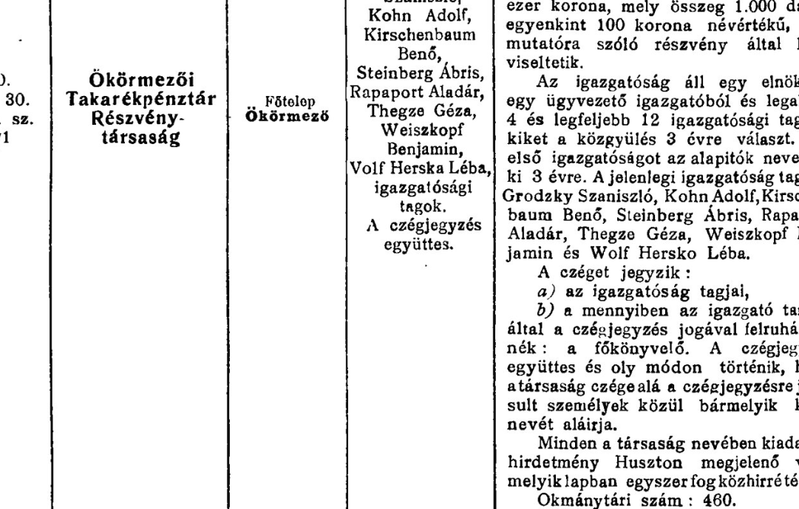](docs/arcanum_full/kozponti_ertesito_1910-10-09_takarekpenztar_founding.pdf)

*רישום הייסוד המקורי, Központi Értesítő 09.10.1910 (לחיצה — עמוד המקור המלא). בהונגרית: "Ökörmezői Takarékpénztár Részvénytársaság... Főtelep: Ökörmező... A jelenlegi igazgatóság tagjai: Grodzky Szaniszló, Kohn Adolf, Kirschenbaum Benő, Steinberg Ábris, **Rapaport Aladár**, Thegze Géza, Weiszkopf Benjamin és Wolf Hersko Léba" — ובעברית: "בנק החיסכון של אוקרמזו, חברת מניות... המושב הראשי: אוקרמזו... חברי הדירקטוריון הנוכחיים: גרודזקי סניסלב, קון אדולף, קירשנבאום בנו, שטיינברג אבריש, **רפפורט אלדר**, תגזה גזה, וייסקופף בנימין ווולף הרשקו לייבה". החברה נוסדה באסיפה המכוננת של 15.09.1910; הון היסוד — 100,000 כתר.*

[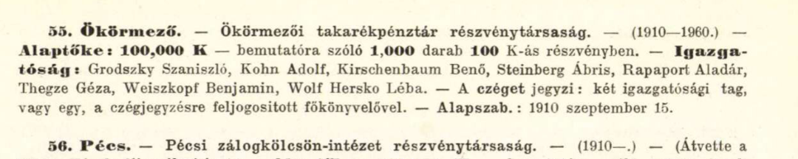](docs/arcanum_full/mihok_compass_1910-11_p1146_okormezo_takarekpenztar.pdf)

*שנתון Mihók-féle Magyar Compass 1910/11, ערך 55 (לחיצה — עמוד המקור המלא). בהונגרית: "55. Ökörmező. — Ökörmezői takarékpénztár részvénytársaság (1910–1960). Alaptőke: 100,000 K... Igazgatóság: ...Rapaport Aladár... Alapszab.: 1910 szeptember 15" — ובעברית: "55. אוקרמזו. — בנק החיסכון של אוקרמזו, חברת מניות. הון יסוד: 100,000 כתר... דירקטוריון: ...רפפורט אלדר... התקנון: 15 בספטמבר 1910".*

[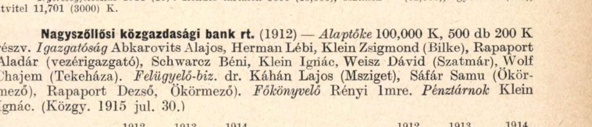](docs/arcanum_full/penzugyi_compass_1915_p645_nagyszollosi_bank.pdf)

*שנתון Pénzügyi Compass 1915, עמ' 645 (לחיצה — עמוד המקור המלא). בהונגרית: "Nagyszőllősi közgazdasági bank rt. (1912) — Alaptőke 100,000 K... Igazgatóság: Abkarovits Alajos, Herman Lébi, Klein Zsigmond (Bilke), **Rapaport Aladár (vezérigazgató)**... Felügyelő-biz.: dr. Káhán Lajos (Msziget), Sáfár Samu (Ökörmező), **Rapaport Dezső, Ökörmező**" — ובעברית: "הבנק הכלכלי של נאג'סלש בע"מ (נוסד 1912) — הון יסוד 100,000 כתר... דירקטוריון: ...**רפפורט אלדר (מנכ"ל)**... ועדת הפיקוח: ...**רפפורט דז'ה, אוקרמזו**".*

**רפפורט דז'ה (Dezső)**, תושב אוקרמזו — נושא משרה באותו בנק נאג'סלשי שאלדר עמד בראשו: ב-1915 בוועדת הפיקוח (Felügyelő-bizottság; עמ' 645 · [העמוד המקורי](docs/arcanum_full/penzugyi_compass_1915_p645_nagyszollosi_bank.pdf)), וב-1917–18 כבר בדירקטוריון (Igazgatóság; עמ' 678 · [העמוד המקורי](docs/arcanum_full/penzugyi_compass_1917-18_p678_nagyszollosi_bank.pdf)); מופיע כעד בחתונת פרידריקה בת גדליה (1914, רשומת הנישואים) — ככל הנראה בן משפחה קרוב, אולי בן נוסף של גדליה.

[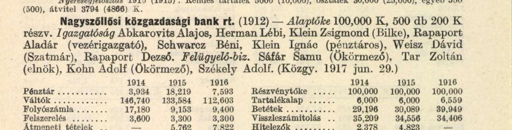](docs/arcanum_full/penzugyi_compass_1917-18_p678_nagyszollosi_bank.pdf)

*שנתון Pénzügyi Compass 1917–18, עמ' 678 (לחיצה — עמוד המקור המלא). בהונגרית: "Igazgatóság: ...Rapaport Aladár (vezérigazgató)... Weisz Dávid (Szatmár), **Rapaport Dezső**. Felügyelő-biz.: Sáfár Samu (Ökörmező), Tar Zoltán (elnök), Kohn Adolf (Ökörmező), Székely Adolf. (Közgy. 1917 jun. 29.)" — ובעברית: "דירקטוריון: ...רפפורט אלדר (מנכ"ל)... וייס דוד (סאטמר), **רפפורט דז'ה**. ועדת הפיקוח: שפר שמו (אוקרמזו), טר זולטן (יו"ר), קון אדולף (אוקרמזו), סקיי אדולף. (האסיפה הכללית: 29 ביוני 1917)".*

**רפפורט שאול** — בדירקטוריון (Igazgatóság) ובוועדת הפיקוח של **חברת רפסודות העצים של גדות הטיסה** (Tiszavidéki tutajtársulat rt., מרמרוש-סיגט; נוסדה 1911), שאתריה (Telepek) **באוקרמזו ובמיידנקה** ובה כ-200 פועלים והון של 300,000 כתר: Nagy Magyar Compass 43/2 לשנת 1916 (עמ' 430, מדור "Iparos-részvénytársulatok" — חברות מניות תעשייתיות · [העמוד המקורי](docs/arcanum_full/nagy_magyar_compass_1916_p430_tutajtarsulat_saul.pdf)) ו-46-47/2 לשנת 1920 (עמ' 581 · [העמוד המקורי](docs/arcanum_full/nagy_magyar_compass_1920_p581_tutajtarsulat_saul.pdf)) — זיהוי החברה הושלם עם הורדת העמודים המלאים. קשרו המשפחתי של שאול לגדליה לא הוכח: הוא אינו בין ילדי גדליה שברשומות. חיפוש רשומת לידה עבורו העלה מועמד — **"Soel", נ' 03.11.1873 במרמרוש-סיגט, בן יוסל (Joszel) ומרים רפפורט** (מאגר לידות מרמרוש, JewishGen; [תצלום הרשומה](docs/evidence/jewishgen_rapaport_soel_1873_sziget_zoom.png)); ההתאמה למושב החברה (מרמרוש-סיגט) מרמזת שמדובר בענף רפפורט של סיגט, לא בענף האוקרמזואי — הזיהוי טעון אימות.

[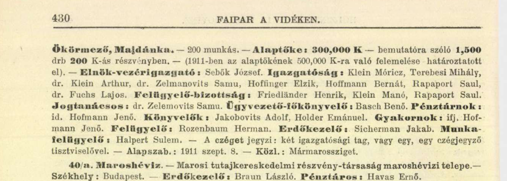](docs/arcanum_full/nagy_magyar_compass_1916_p430_tutajtarsulat_saul.pdf)

*שנתון Nagy Magyar Compass 1916, עמ' 430, מדור "חברות מניות תעשייתיות" (לחיצה — עמוד המקור המלא). בהונגרית: "Ökörmező, Majdánka — 200 munkás — Alaptőke: 300,000 K... Igazgatóság: Klein Móricz... Hoffmann Bernát, **Rapaport Saul**, dr. Fuchs Lajos. Felügyelő-bizottság: Friedländer Henrik, Klein Manó, **Rapaport Saul**" — ובעברית: "[אתרי החברה:] אוקרמזו, מיידנקה — 200 פועלים — הון יסוד: 300,000 כתר... דירקטוריון: ...**רפפורט שאול**, ד"ר פוקש לאיוש. ועדת הפיקוח: ...**רפפורט שאול**". (הרישום זהה גם במהדורת 1920, עמ' 581 · [העמוד](docs/arcanum_full/nagy_magyar_compass_1920_p581_tutajtarsulat_saul.pdf).)*

**סלומון (Salamon, ובעברית שלמה) רפפורט, יליד 1856 וולובה** — אפשר שאחיו של גדליה, טעון אימות — קיים ענף מקביל בעיירה (נשותיו פרל וייס ושורה אייזלר; ביתו תועד במפקד 1921, בית 127 — JewishGen/Hungaricana). ובדור קודם: **חיה רפפורט, ילידת ~1836 אוקרמזו, בת מוסקו (משה?) רפפורט ומלכה לבית סטרולוביץ** (רשומת פטירתה, 1904 — JewishGen; [תצלום המקור](docs/evidence/jewishgen_rapaport_chaja_okormezo_1904_zoom.png)) — עדות לקשרי רפפורט-סטרולוביץ עוד בדור שלפני יעקב ושרה. חיזוק עצמאי נוסף: יוסף-דוד רפפורט, יליד וולובה 16.10.1891, שנספה באושוויץ ב-1942 — אביו רשום בדף העד: **גדלי (Gedali)** (יד ושם — [הרשומה](docs/yadvashem_records/name_5380436.json)) — אפשר שבן נוסף של גדליה, טעון אימות.

גם הידיעה על מות גדליה שמורה במקורה: **"Görög katholikus szemle" (הביטאון הגרקו-קתולי, אונגוואר), גיליון 25.12.1910**.

[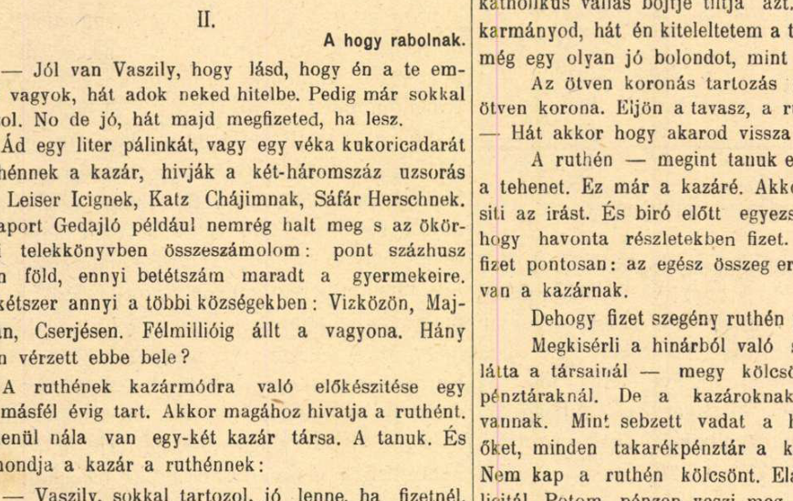](docs/arcanum_full/gorog_kath_szemle_1910-12-25_gedajlo_death_120plots.pdf)

*עמוד המקור (לחיצה — העמוד המלא), מתוך המאמר "Hegyvidéki emberek — A hogy rabolnak" ("אנשי ההר — איך שודדים"; טור אנטישמי נגד "הכוזרים"). בהונגרית: "**Rappaport Gedajló** például nemrég halt meg s az ökörmezői telekkönyvben összeszámolom: pont százhusz ruthén föld, ennyi betétszám maradt a gyermekeire" — ובעברית: "**רפפורט גדיילו**, למשל, נפטר לא מכבר — ובספר האחוזה של אוקרמזו אני מונה: בדיוק מאה ועשרים אדמות רותניות, זה מספר הרישומים שנותרו לילדיו". הכתבה הארצית שקדמה לפולמוס — Budapesti Hírlap 23.12.1910 ("Rappaport Gedájló és társai birtokszerzése nem mai keletű" — "רכישת הקרקעות של רפפורט גדיילו ושותפיו אינה מהיום") · [העמוד המלא](docs/arcanum_full/budapesti_hirlap_1910-12-23_verchovina_polemic.pdf).*

### הבית והעסק של המשפחה

למשפחה היה **הבית הדו-קומתי הראשון בוולובה**; בקומה השנייה פעלה תנועת נוער (על פי דפוס האזור — כנראה קן "המזרחי"/תורה-ועבודה, שממנו צמח גרעין בני עקיבא שאליו הצטרף גדליה אחרי המלחמה). האב אריה היה **סוחר עורות** — בדף העד שמילאה רחל בכתב ידה: "סוחר — עורות לפרוות"; ברשומת יד ושם: "מנהל". במדריכי העסקים של Volové ([הסריקות בתיקייה](docs/directory_1937CarpRuth-Okormezo-0056.pdf)) מדור העורות (Kůže—Leder) מונה את Eizner ו-Katz — ייתכן שעסק המשפחה נרשם בשם אחר, פעל בלי רישום במדריך, או הופיע במהדורה שטרם אותרה (אזכור "Strulovič Leba" שעלה בחיפוש טקסט בספרייה הצ'כית אינו נראה בסריקות שבידינו, ולכן אינו נמנה כאן עם הראיות). מעדותה של רחל: למשפחה הייתה גם **תחנת דלק** ואחוזה חקלאית עם עדר כבשים. תחת השלטון ההונגרי הוחרם עסק האב (עדות רחל), וב-1943–44 תועד בעיירה תהליך ה"החלפה" — לשכת "בָרוש" המקומית של הסוחרים הנוצרים בראשות חוכר המנסרה.

שורשי ההורים: משפחת האב מ**קושלובו (Keselymező)** — שם תועד בעיתונות עוד ב-1913 "סטרולוביץ לזר, החנווני מקושלובו"; משפחת האם מ**קרייניקובו (Mihálka)** ומ**דנילובו** הסמוכה.

---

## פרק ג' — עץ המשפחה המורחב

*(מבוסס על הרשומות האזרחיות של מחוז מרמרוש במאגר JewishGen ההונגרי, גיליון מפקד 1921 המקורי, 46 רשומות שמיות, שתי רשומות קטלוג של העדות ו-44 סריקות דפי עד מיד ושם, רשימות הוועדה הסובייטית 1946, רשומות שטוטהוף וארולסן, עלון קרפטורוס 137 ואתרי הנצחה. כל הרשומות שמורות בתיקיות docs/)*

**הערת מפתח לקריאת הרשומות:** יעקב ושרה נישאו בנישואים דתיים בלבד (שנת נישואיהם אינה מתועדת; ההערכה ~1892 שבעץ הגרפי נגזרת מלידת הבכור ב-1894), ולכן ברשומות האזרחיות חלק מילדיהם רשומים על שם האם — "Rapaport" — לעיתים בלי שם האב כלל. כך נולד הכפל "סטרולוביץ-רפפורט" שליווה את המשפחה, וכך גם אריה-לייב מופיע ברשומת לידתו כ"Leib, בן Rapaport Szura".

### דור 0 — אבות השושלת (תחילת המאה ה-19)

- **משה (Mozes) רפפורט ויֶנטה לבית שפיגל** — אוקרמזו/וולובה. הוריו של גדליה (נ' 1846). ייתכן שהוא "מוסקו רפפורט" שאשתו (האחרת?) מלכה לבית סטרולוביץ ילדה את חיה (~1836).

### דור 1 — הסבים של אריה ורבקה (סבי-סביה של רחל)

- **לייב (Leba) סטרולוביץ וריבקה (Rifke)** — קושלובו (שם נעוריה נרשם פעם "Najovics" ופעם "Sapszovics"). ילדיהם המתועדים: **אסתר** (נ' ~1849, אלמנת דוד פוקס, נפטרה בקושלובו 13.07.1939 בגיל 90 — בבית מס' 83), **משה** (נ' 01.07.1861, בעל נכסים, נשוי לחיה-הנדל לבית הרשקוביץ — נישואיהם נרשמו אזרחית רק ב-1942, בגיל 80!), **לזר** (נ' 1864 — "סטרולוביץ לזר החנווני מקושלובו" מהעיתונות של 1913; נישא בשנית ב-1939), **יעקב** (נ' 1870) — סבה של רחל, ו**חנה (Hani)** (נ' 1872, נישאה להרמן יעקובוביץ מסוואליאבה; בנה לייבה נ' 1905).
- **גדליה רפפורט (נ' 01.04.1846, אוקרמזו) ואסתר לבית כץ** — הורי סבתא שרה. בעל האחוזות הגדול של וולובה (הפירוט המלא — פרק ב'). ילדי גדליה משלוש נשותיו: שיינדל (1869), **שרה (ינואר 1876)**, נתן (1879), אלדר (1885), ברטה (1889), יוסף-דוד? (1891), פרידריקה (1894), זלמן (1897), הרמן (1904, נפטר תינוק), מאיר (1908).
- **ברל (דב) פרקש וגיטל** — דנילובו. ילדיהם הידועים: **בצלאל** (סבה של רחל), **מלכה אדלר** (נ' 1876, נישאה להרשל אדלר, גרה בסלדובוש), **שמואל** (גר בחוסט).

### דור 2 — הסבים של רחל

| | פרטים | גורל |
|---|---|---|
| **(ישראל) יעקב סטרולוביץ** | **נ' 1870 בקושלובו** (מפקד 1921: יליד 15.01.1870), בן לייב וריבקה; חקלאי-סוחר, בית מס' 30 בקושלובו | **הסתתר ביערות ושרד את המלחמה; מת בחוסט ב-1945** |
| **שרה סטרולוביץ לבית רפפורט** | **נ' ינואר 1876 בוולובה, בת גדליה רפפורט ואסתר כץ** (רשומת לידה, נרשמה 1931) | הסתתרה ביער עם בעלה; שבה לכפר לאחר יומיים — **גורשה מקושלובו לאושוויץ ונרצחה** |
| **בצלאל פרקש** | נ' 1873/74 בדנילובו; בעל קרקע וסוחר בקרייניקובו. ברשומות האזרחיות של ילדיו שמו נכתב **"Czallo"/"Czulo"/"Calo"** (צאלו — כינוי של בצלאל), איש "Sofalva" (דנילובו) | **נרצח באושוויץ, 1944** (בן ~70) |
| **אסתר פרקש לבית שטיינר** | נ' 1879 בקירלהאזה (קורולבו) | **נרצחה באושוויץ, 1944** |

בית המשפחה בקושלובו תועד ב**גיליון מפקד האוכלוסין הצ'כוסלובקי מ-16.02.1921** (בית מס' 30; [הגיליון המקורי, בכתב יד — שמור בתיקייה](docs/hungaricana_1921_census_koselovo_house30_pages299-300_original.pdf)): יעקב ראש הבית, שרה ("Rapaport Sura") אשתו — ו-13 ילדים בבית, כולם "Žid, izrael" (יהודים בני דת ישראל), המבוגרים שבהם רשומים "Zemledelec" (חקלאי) ו"robotník" (פועל). מבין 14 הילדים, היחידה שאינה מופיעה בגיליון היא **שרה (נ' 1912, אז כבת 8)** — היעדרות שטרם הוסברה (אולי שהתה אצל קרובים ביום המפקד; ראוי לבדיקה חוזרת מול הגיליון). מנגד, **רוחלה (הדודה רחל, נ' 1899) מופיעה במפקד פעמיים** — גם בבית ההורים וגם כדיירת בבית הדוד נתן רפפורט בחוסט; כפילות ברישום חד-יומי שנותרה בלתי מיושבת (רישום כפול, או שתי נשים בשם זהה).

### דור 3 — ההורים, הדודים והדודות

**אחי ואחיות האב — כל 14 ילדי יעקב ושרה, על פי רשומות הלידה האזרחיות (Iza-Koshelovo/מיז'יריה) ומפקד 1921:**

1. **אריה-לייב** (**מרס 1894**, נולד באוקרמזו — בעיירת אמו; רשומת הלידה נרשמה באיחור ב-1941 על שם האם "Rapaport Szura". גיליון המפקד: "Leba, נ' 18.04.1893") — אבי רחל. סוחר עורות ומנהל. נספה (ראו פרק ה').
2. **ריבקה (Refka/Regina)** (נ' **24.05.1896**, קושלובו; רשומת הלידה: "Regina בת Rappaport Szura מאוקרמזו, בת 22, עקרת בית" — ללא שם אב; גיל האם ברשומה [22] אינו מתיישב במדויק עם לידתה בינואר 1876 [כ-20] — כנראה עיגול גיל, שהיה שכיח) — נישאה ליצחק (Icik) גדלוביץ' (Gedalovits — "בן-גדל"!) מאפשה התחתונה; בניהם מרדכי-אנשל (1933), לייב (1936), שמיל-אייזיק (1938) ופרקש (1940). נרצחה באושוויץ 1944. בתה **אסתר גוטמן-רפפורט שרדה** והגישה דפי עד. (דף עד שהוגש עליה בידי בת-דודה, אסתר רוזנברג, נוקב פרטים שונים במקצת — לידה 1898, מגורים באזור רחוב, רצח ב-1942; הרשומות האזרחיות ודפי העד של בתה עדיפים.)
3. **אסתר** (נ' **20.08.1897**; ברשומה: בת "Sztrulyovics Jakab" ו"Rappaport Janina" [=שרה]) — בתה רגינה נ' 1927; נרצחה 1942.
4. **רחל (Ruchla)** (נ' **26.08.1899**) — במפקד 1921 מופיעה גם כדיירת בבית דודהּ נתן רפפורט בחוסט; נישאה לדוד קליין, גרו במונקץ'/קרצקי; שניהם נרצחו באושוויץ.
5. **מנדל** (נ' **29.09.1900**) — בעל מכולת בקושלובו; נשא ב-20.05.1938 ברישום האזרחי את רוחל (לאה) הרשקוביץ מקופשנובו (נ' 28.09.1910) — שני הבכורים נולדו לפני הרישום, כמנהג זוגות שנישאו תחילה בנישואים דתיים בלבד (ראו אריה-לייב, פרק ג' לעיל); ילדיהם: **גדליה (נ' 04.12.1936), משה (נ' 25.12.1938), התאומות רגינה ואסתר (נ' 26.09.1939**; רגינה נפטרה בת שלושה שבועות), ואחריהן עוד ילד וילדה ילידי 1940–41 (באינדקס: מרטון ורבקה; באחת הרשומות מופיעה גם "אסתר" — כפילות מול התאומה, שטרם יושבה מול הרשומות עצמן) — בני דודיה הקטנים של רחל, שנרצחו כולם עם הוריהם.
6. **גיטל (Githel)** (נ' **01.12.1902**) — נישאה ב-**10.02.1933 באיזה לאלכסנדר וולף** (נ' 1903, טקובו, חקלאי; העד: אחיה יצחק); בעל מכולת בטקהאזה; שניהם נרצחו.
7. **סימה (Szima)** (נ' **10.08.1904**) — גורלה לא תועד. אם נפטרה צעירה, לפני 1926, ייתכן שאחותה של רחל נקראה על שמה (כמנהג הקריאה על שם נפטר) — אך רשומת פטירה שתבסס זאת טרם אותרה.
8. **יצחק (Icik)** (נ' **19.12.1905**) — רווק, סוחר ויערן; **נספה במאוטהאוזן 1944**.
9. **חיה (Chaja/Helena)** (נ' **23.08.1907**) — גורלה לא תועד.
10. **נתן (Neso)** (נ' **1908**) — **שרד!** מופיע ברשימות החוזרים בקושלובו אחרי המלחמה. ייתכנו צאצאים.
11. **גדליה** (נ' **02.02.1911** — הראשון מילדי יעקב ושרה שנולד אחרי מות הסב גדליה רפפורט, ונקרא על שמו; השלישי מבין שלושת הנכדים שנקראו כך — פרק ב') — רווק, יערן; נרצח.
12. **שרה** (נ' **מאי 1912**) — נישאה ליוזף פוירוורקר; בנם גיולה נ' 20.06.1943; גרו בנאג'בוצ'קו.
13. **פייגה (פאני)** (נ' **26.02.1914**, תאומה) — הצעירה שבאחים יחד עם תאומתה פפי. לפי עדות רחל, התאומות **הסתתרו עם סבא יעקב ושרדו איתו**. פאני נישאה (לבוביץ) והגישה אחרי המלחמה דפי עד על אחיה — ייתכנו צאצאים.
14. **פפי** (נ' **26.02.1914**, תאומתה של פאני) — הסתתרה ושרדה אף היא; אחת מהתאומות **נספתה בתאונה מחרידה דווקא אחרי השחרור** — מאחר שפאני היא שנישאה והגישה דפי עד אחרי המלחמה, ככל הנראה מדובר בפפי.

*הערת פער מקורות לתאומות: רשומות הלידה האזרחיות נוקבות 26.02.1914, ואילו גיליון מפקד 1921 רושם להן 13.03.1915 — פער של יותר משנה בין שני מקורות ראשוניים (בדומה לפער אצל אריה-לייב: 1894 ברשומה, 1893 במפקד). הדוח מאמץ את תאריך רשומת הלידה, שנרשם בסמוך לאירוע; נתוני המפקד נמסרו בעל-פה שבע שנים אחריו.*

*(במסורת המשפחה דובר על "13 אחים ואחיות לאבא" — 14 ילדים בסך הכול, בדיוק כפי שמתועד כאן.)*

**אחי ואחיות האם (ילדי בצלאל ואסתר) — כל 14 הילדים, על פי הרשומות האזרחיות של אזור דנילובו** (אותרו 18.08.2026 בחיפוש "Farkas" במאגר JewishGen — רשומות לידה, נישואים ופטירה; פונד 1606, אופוס 13 בארכיון DAZO):

המשפחה גרה ב**מיהלקה (Mihálka) — השם ההונגרי של קרייניקובו** (Krajnikovo), כפר סמוך לדנילובו. בכל הרשומות: האב "FARKAS Czallo/Czulo" איש סופאלווה (דנילובו), האם "STEINER Eszter" ילידת קירלהאזה (קורולבו). שישה מן הילדים מתו בינקותם או בילדותם — שיעור אופייני לכפרי ההרים בתקופה — ולגבי שניים (מנדל והרמן) לא נמצא תיעוד מעבר ללידתם:

1. **לאיה** (נ' ~1895) — נפטרה בינקותה (1896).
2. **מנדל** (נ' **26.04.1897**) — גורלו לא תועד. [תצלום רשומות הלידה שלו ושל ארנקה](docs/evidence/jewishgen_farkas_steiner_children_births_zoom.png)
3. **גולדה-ארנקה (Aranka)** (נ' **02.01.1899** ברשומה האזרחית; בדפי העד: 15.01.1899) — נישאה לשמואל (ארנה) פוקס, גרו בווישק; נרצחה באושוויץ 05/1944. חמישה מילדיה נספו (חיים, גיטו, פרל ויצחק נרצחו; ברל-בלה נספה בגרמניה 1945) — אך **שתי בנותיה שרדו: לילי שפרינגר ושרה וולף**. לילי מסרה עדות בקרן שפילברג (קטע ביוטיוב: "Arriving at Auschwitz | Lili Springer") והגישה ב-1999 עשרות דפי עד על שתי המשפחות.
4. **אליהו (Elias)** (נ' **30.05.1901**) — בעל מכולת בדנילובו; נשא ב-**04.04.1932** את **רוז'נה (רייזל) זלמנוביץ** (נ' 01.05.1902, בת מוז'יס ואסתר). ברשומות: בתם גולדה (נ' 1935) נפטרה תינוקת, ובנם איגנץ נ' 1939; לפי דפי העד נרצח עם ארבעה ילדים.
5. **הלנה הראשונה** (נ' **13.05.1903**) — נפטרה בילדותה; שמה ניתן שוב לאחות ילידת 1909 (מנהג הקריאה על שם נפטר).
6. **רבקה-רוזה (Roza)** (נ' **25.04.1904** ברשומה האזרחית; בדפי העד: 1905/06 — הדוח מאמץ את הרשומה, שנכתבה בסמוך לאירוע) — **אמה של רחל**.
7. **זיסל-לייב (Lipót)** (נ' **07.10.1906**) — ירקן; נשא ב-**09.02.1930** את **סרנה (שרה) פוקס** (נ' 22.03.1906, בת יעקב ופרידה). בנם הרמן (נ' 1941) נפטר תינוק; לפי דפי העד נרצח עם שתי בנותיו. [תצלום ארבע רשומות הנישואים של האחים](docs/evidence/jewishgen_farkas_siblings_marriages_zoom.png)
8. **חנה (Helena)** (נ' **09.02.1909**) — נישאה ב-**1928** ל**יוסף פרקש** מחוסט (נ' 04.09.1903, בן לזר ואטי רוזנברג; זהות שמות המשפחה — צירוף מקרים או קרבה שטרם הוכרעה; תאריך החתונה הודפס באינדקס "30-DEP-1928" — שיבוש הקלדה, כנראה ספטמבר או דצמבר). גרו בחוסט; בנם דוד (נ' 1936) נפטר תינוק; לפי דפי העד נרצחה עם בנה חיים.
9. **רגינה** (נ' **18.02.1911**) — נפטרה בינקותה.
10. **בן ללא שם** (נ' **27.01.1912**) — נפטר סמוך ללידתו.
11. **זלמן** (נ' **30.10.1912**) — נפטר בינקותו.
12. **רחל** (נ' **22.11.1913**) — נישאה ב-**11.03.1935** ל**הרש (הרשל) איצקוביץ** (נ' 12.05.1909 ברוסקה פולה — "אורמזובה" שבפי המשפחה; בן איציק ורוז'נה פרוימוביץ); ילדיהם: ברל (נ' 17.11.1936) ושרה (נ' 31.07.1938). נרצחה. (ייתכן שהיא "רחל פרקש" שלפי העדות חזרה בחורף מטורן לשטוטהוף ולא שרדה — פרקים ד' ו-ו'1; רשומת הנישואים מאשרת את מגוריה ברוסקה פולה ואת גילה — כבת 31 ב-1944, גיל סביר לעובדת כפייה — ומחזקת את הזיהוי. אם הוא נכון, מקום מותה שטוטהוף, 1944/45.)
13. **הרמן** (נ' **14.02.1918**) — גורלו לא תועד.
14. **צינה** (נ' **22.03.1920**) — נפטרה בינקותה.

*(עד איתור הרשומות היו ידועים רק שישה מהאחים — מדפי העד; הרשומות האזרחיות הוסיפו את תאריכי הלידה המדויקים, שמונה אחים לא מוכרים, את פרטי בני הזוג והחתונות — כולן בדנילובו (Husztsofalva) — ואת שמות הנכדים.)*

### דור 4 — רחל ואחיה

| שם | לידה | גורל |
|---|---|---|
| **דב** | 1924 (ואולי 1926 — ראו פרק ו'1) | פלוגות עבודה → בריחה לפרטיזנים; שרד. חי ברמתיים; בנותיו אורית ומרב; נפטר 1998 |
| **סימה (Sari)** | 26.12.1926 (כברישום שטוטהוף וברשימת קלרספלד; הרשומה האזרחית: 06.12.1926 — ראו פרק א'; בדף העד שמילאה רחל ב-2013 נכתב "1927") | אושוויץ → שטוטהוף (אסירה מס' **38443**); מתה שם ממחלה ורעב בחודשיה האחרונים של 1944 או בתחילת 1945, בת 17–18 (כמעט ודאי — פרק ח'): "אני כבר לא אהיה בת שמונה עשרה" |
| **רחל ("רוצי")** | 16.04.1929 (רשומת הלידה האזרחית: 12.04.1929 — פרק א') | אושוויץ → שטוטהוף (אסירה מס' **38444**) → טורן → צעדת מוות → שוחררה 02/1945; עלתה 05/1946; נפטרה 01/2021 בחולון |
| **גדליה (גיולה)** | 03.03.1931 | אושוויץ → בוכנוולד → ברגה → בריחה מצעדת מוות → הוסתר אצל משפחת קרשק; עלה, שינה שמו ל**גדליהו רף**, ממקימי אילניה; נפטר 2008 |
| **גיטה (Gizela)** | **26.03.1936** (רשומת הלידה האזרחית — פרק א') | **נרצחה באושוויץ 1944**, בת שמונה |

### דור 5 — הדור הבא

- לרחל ולבעלה **אברהם צדוק**: **עדו וזיו**.
- לדב: אורית ומרב.
- לגדליה ולרעייתו חוה (יוכבד): **אריה, זאב — ורבקה ("ריקה") רף**, ילידת אילניה 10.08.1958, רב"ט בחיל החינוך, **נפלה בעת שירותה ב-12.05.1977** וקבורה באילניה ([רשומת ההנצחה באתר "יזכור" של משרד הביטחון](https://www.izkor.gov.il/%D7%A8%D7%91%D7%A7%D7%94%20%D7%A8%D7%A3/en_c78f31596e88feca277077738dcc3c9a)).

### קרובים אפשריים נוספים (בבירור)

סול רפפורט (נ' 1928 אוקרמזו — שרד: סקלנצה→אושוויץ→גלייביץ→בוכנוולד, חייט); הרמן סטרולוביץ (נ' 1924 קושלובו — שרד: איזה→אושוויץ→מונוביץ→דורה→ברגן-בלזן, אופה); סמואל (נ' 1920) והרמן (נ' 1895) סטרולוביץ — שרדו; משפחות רפפורט נוספות בוולובה (אברהם, חנה, פייגה, עקיבא, שיינדל, דבורה, וגדליה בן ניסן); "חיה בק" מגישת דפי עד — כנראה מחוג משפחת הדודה ריבקה באפשה; לייבה סטרולוביץ' — ברשימה הסובייטית מ-29.03.1946 מופיעה משפחתו (6 נפשות) בכתובת **רחוב שבצ'נקו 43, וולובה** — ייתכן שזו כתובת הבית המשפחתי עצמו.

**משפחות רפפורט בוולובה במפקד 1921 — גיליונות הבית המקוריים (אותרו והורדו 18.08.2026):** דפדוף באינדקס מפקד 1921 של כרך אוקרמזו העלה שבוולובה עצמה נפקדו בדיוק **שני** משקי בית בשם רפפורט, ושני הגיליונות המקוריים ("Popisný hárok") הורדו מספריית Hungaricana:

- **בית 127 — משפחת רפופורט סלומון** (בעל הבית): סלומון, נשוי, יליד **1856** וולובה — **בן דורו של גדליה (נ' 1846); אפשר שאחיו — טעון אימות**; אשתו שׂוּרה (נ' 1866, ניז'ני סינוויר; בבית מ-1890 — ככל הנראה שנת הנישואים), והילדים רגינה (1904), חנה (1906) ואברם (1908). [הגיליון המקורי](docs/hungaricana_1921_census_volove_house127_page605_original.pdf) · [תצלום](docs/evidence/hungaricana_1921_census_volove_house127_rapoport_salamon_zoom.png) · [בצפיין Hungaricana](https://library.hungaricana.hu/hu/view/KANepszaml_002_Okormezo_Okormezo__033_Volove-Okormezo/?pg=604&layout=s)
- **בית 106a — משפחת רפופורט מוזס** (דיירי משנה בבית משפחת ארדן): מוזס (Moises), נשוי, יליד **1882** וולובה; אשתו ברטה (נ' 1896, טיושקה) והבנות פאני (1918) ויולי (1919). [הגיליון המקורי](docs/hungaricana_1921_census_volove_house106a_page582_original.pdf) · [תצלום](docs/evidence/hungaricana_1921_census_volove_house106a_rapoport_moises_zoom.png) · [בצפיין Hungaricana](https://library.hungaricana.hu/hu/view/KANepszaml_002_Okormezo_Okormezo__033_Volove-Okormezo/?pg=581&layout=s)

ממצא שלילי משלים: **ענף גדליה עצמו אינו מופיע במפקד וולובה 1921** — לא אלמנתו מינדל (גם לא תחת "ברקוביץ") ולא בנה מאיר (אז בן 13). הדבר מתיישב עם התפזרות הענף הידועה: נתן בחוסט, אלדר בנאג'סלש; היכן חיו מינדל ומאיר ב-1921 — שאלה פתוחה.

---

## פרק ד' — ציר הזמן: מוולובה לחולון

**16.04.1929** — רחל נולדת בוולובה שבצ'כוסלובקיה, שלישית מבין חמישה (ברשומת הלידה האזרחית: 12.04.1929 — פרק א').

**1938–1939** — צ'כוסלובקיה מתפרקת; במרץ 1939 הצבא ההונגרי מספח את האזור. תחת השלטון ההונגרי: חקיקה אנטי-יהודית, **החרמת עסק האב**, איסור שחיטה כשרה, גיוס לפלוגות עבודה; פליטים יהודים מפולין מגיעים לעיירה (עדות רחל). ב-1943–44 העיתונות מתעדת את "ההחלפה הכלכלית" באוקרמזו — התארגנות הסוחרים הנוצרים בראשות חוכר המנסרה (שהייתה בבעלות יהודית).

**1941** — גירוש חסרי הנתינות לגליציה (רבים נרצחו בקמנץ-פודולסקי). המשפחה ניצלת בזכות תושייתה של האם רבקה.

**19.03.1944** — גרמניה כובשת את הונגריה. **14.04.1944** — רחל נעצרת בביתה ("Verhaftet am 14.4.44, am Orte" — שאלון הקליטה בשטוטהוף), יומיים לפני יום הולדתה ה-15; לפי עדות בת העיירה ריטה שניידר-פולק (Rita Pollack לבית Schneider), ב-16.04.1944, מהשעה שבע בבוקר, אספה הגסטפו את יהודי וולובה במשאיות — משפחתה הייתה השלישית שנאספה — וריכזה אותם בבית הכנסת, נעולים, לשלושה ימים; משם הועברו במשאיות ל**גטו סוקירניצה (סקלנצה)** — כפר שרוקן קודם לכן מתושביו הלא-יהודים — כ-30 נפש בחדר, לשלושה שבועות, ואז הוצעדו ברגל לעיירה הסמוכה והועמסו בקרונות בקר, כ-80 בקרון, עד אושוויץ — אליה הגיעו, גם לדבריה, ב-19 במאי. העדות מופיעה בעמוד השואה של אתר קהילת מיז'יריה (KehilaLinks): [המקור](https://kehilalinks.jewishgen.org/Mizhhirya/Mizhhirya-Holocaust.htm) · [תצלום](docs/evidence/kehilalinks_rita_schneider_pollack_testimony_zoom.png). (הערת ביקורת: היא זוכרת "כעשרה ימים ברכבת" — ואילו רשימת קושיצה מתעדת יציאה ב-17.05 והגעה ב-19.05; ככל הנראה נצטברו בזיכרון גם ימי ההמתנה.)

**15–17.05.1944** — חיסול הגטו: ב-15.05 רוכזו התושבים בחצר בית ספר, נערך עליהם חיפוש והם הוצעדו לתחנת סלדובוש (מאגר הגטאות של יד ושם). **רכבת "אוקרמזו" חצתה את תחנת קושיצה ב-17.05.1944 ובה 3,052 מגורשים** (רשימת מפקד התחנה — המסמך המרכזי על רכבות הגירוש ההונגריות).

[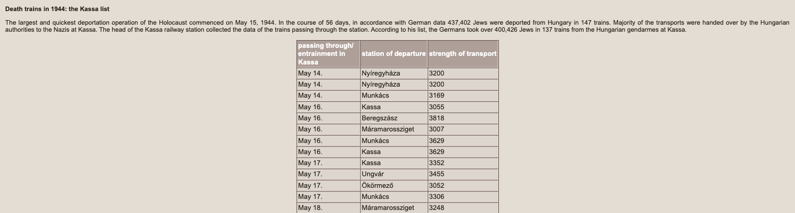](https://degob.org/tables/kassa.html)

*רשימת תחנת קושיצה (degob.org): "May 17. — Ökörmező — 3052".*

**19.05.1944** — **הגעה לאושוויץ-בירקנאו.** נתוני הסלקציה של רכבת זו (רשימת גלזר): **507 גברים ו-558 נשים נבחרו לעבודה; 1,987 נרצחו בו ביום.**

[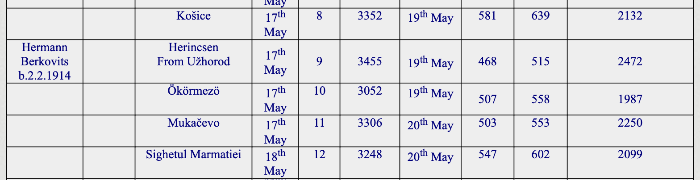](https://zchor.org/hungaria.htm)

*טבלת הרכבות של גלזר (zchor.org): רכבת מס' 10 — Ökörmezö, יציאה 17 במאי, 3,052 נפש, הגעה 19 במאי; 507 גברים ו-558 נשים נבחרו, 1,987 נרצחו.* רחל (15) וסימה (17) נבחרות לעבודה — את חיי רחל מצילה קאפו שמכריזה למנגלה "בת שמונה עשרה" ורודפת אחריה: "תזכרי, את בת שמונה עשרה" (מקור שנת 1927 ברישומי שטוטהוף). גיטה בת השמונה נרצחת, וככל הנראה גם האם רבקה (אך ראו הסתייגות בפרק ה'); האב אריה — על פי עד הראייה שפגשה רחל — עבר את הסלקציה, נרשם ככל הנראה כאסיר A-8557, ומת במחנה מרעב (פרקים ה'–ו'1). גדליה בן ה-13 עובר לבוכנוולד ולברגה. במחנה הנשים: מסדרים אינסופיים, בלי עבודה (עדות רחל).

**29.06.1944** — רחל וסימה מגיעות ל**שטוטהוף** שליד דנציג **במשלוח הראשון של הנשים היהודיות ההונגריות מאושוויץ** (2,502 נשים; על פי ספרות המחקר על שטוטהוף הועברו אליו מאושוויץ בסך הכול 23,566 אסירים ב-11 משלוחים, מהם 21,817 נשים — נתון שההפניה המדויקת אליו טרם תועדה בתיק). תאריך ההגעה מתועד בכרטיסי האסירה שלהן: "Eingewiesen am 29.6.44 durch KL. Auschwitz". האחיות נרשמות יחד: **סימה — אסירה 38443, רחל — אסירה 38444**. בקליטה רחל מוסרת ששני הוריה נמצאים "כעת באושוויץ", וחותמת בכתב ידה: "Sztrulovics Ruci". במחנה: סלקציות, רעב.

**~סוף אוגוסט–ספטמבר 1944 (ואולי מאוחר יותר) — היציאה לטורן, בסלקציה השלישית.** בשטוטהוף, מעידה רחל, שהו "די הרבה זמן... חודשיים, שלושה" [01:34:14] בלי לעבוד — עד שהחלו הסלקציות למחנות העבודה. סימה חלתה ושכבה בחדר החולים שבצריף; שם, מבעד לחלון, אמרה את המשפט "אני כבר לא אהיה בת שמונה עשרה" [01:35:40]. רחל נבחרה לעבודה **שלוש פעמים** — ופעמיים חילצה אותה מזכירה יהודייה ("השרייברין") שאף הסתירה אותה בחדר החולים, כדי שתישאר עם אחותה [01:34:41]. בפעם השלישית אמרה המזכירה: "אני לא משחררת אותך, לא מחביאה אותך" [01:36:12] — וגם סימה הסבירה לה שהיא חייבת לצאת [01:40:25]. "חודשיים, שלושה" אחרי ההגעה ב-29.06 פירושם סוף אוגוסט עד סוף ספטמבר — והאומדן הוא אומדן זיכרון, לא מדידה. "חודשיים" בדיוק מתיישב עם שלושת המשלוחים המתועדים לטורן ב-24–26.08.1944 — אם כי לפי דריווה הורכבו משלוחים אלה מנשים שהגיעו לשטוטהוף מקאונס, מריגה ומאושוויץ באמצע אוגוסט (ולא ממשלוח 29.06 שבו הגיעה רחל); "שלושה חודשים" ומעלה מחייב משלוח מאוחר יותר — שאינו מתועד ברשימות שבידי המוזיאון (גל התגבור המתועד הבא: נובמבר). שיוך מסמכי אינו אפשרי כיום, שכן בידי מוזיאון שטוטהוף אין את כל רשימות הנשים שנשלחו לתתי-המחנות (פרק ה' סעיף 8). **בהעברה זו רחל נפרדת מסימה — ולא תראה אותה עוד.**

**טורן (Thorn)** — "Baukommando Weichsel" (OT Thorn) של ארגון טודט, שהוקם ב-24.08.1944: כ-5,000 יהודיות שנשלחו משטוטהוף בשלושה טרנספורטים ב-24–26.08.1944 (כ-1,700, כ-1,600 וכ-1,700 נשים), ובהמשך תגבורים — כ-1,000 משטוטהוף בנובמבר וכ-1,000 מיוצאות גטו לודז' (שהגיעו לשטוטהוף ב-27.09.1944) שצורפו במחנה גרודנו — כ-6,000 בסך הכול, לחפירת תעלות נ"ט ובונקרים באזור טורון. "טורון זה מחנה עבודה... אוהלים. גרים באוהלים ועובדים בתעלות קשר בחוץ" [01:44:06]. פרקי המחקר של ד"ר דנוטה דריווה (שנמסרו לתיק זה — פרק ה' סעיף 8) מתארים השכמה בשלוש לפנות בוקר, טיפוס ודיזנטריה, קור עד ‎28°C- ורצח חולות; רוב הנספות היו יהודיות הונגריות. על מטרת המערך כותבת דריווה: "The sole aim was extermination" — "מטרתו היחידה הייתה השמדה". בחורף הגיעה פקודה שמי שאינה מסוגלת עוד לעבוד רשאית "לחזור לשטוטהוף" — ודודתה של רחל, רחל פרקש, הרימה יד וחזרה, למרות הפצרותיה: "עכשיו אני יודעת שזה ישר להשמדה" [01:47:03]. 

**ינואר 1945** — פינוי מחנות טורן: **צעדות מוות** שבהן נרצחים המפגרים והחלשים. מחקרה של דריווה מתעד סלקציה במחנה גרודנו (Grodno) ב-19.01.1945 שבה נרצחו כ-200 אסירות, וצעדת מוות בת כעשרה ימים שבה נרצחו עוד כ-150. רחל צועדת כעשרה ימים ומגיעה ל**פראוסט (Praust)** שליד דנציג — תת-מחנה של שטוטהוף ליד שדה התעופה — לעבודות חפירה, ברעב ובמגיפת טיפוס. (פראוסט מתועדת אצל דריווה גם כתחנת לינה של טורי הפינוי מהמחנה המרכזי ב-27–28.01.1945; פינוי אסירות פראוסט עצמו החל רק ב-13.02.1945, וקבוצות הפינוי שוחררו לפי דריווה ב-10–11 במרץ 1945.)

**פברואר 1945** — **שחרור בידי הצבא האדום**, באזור דנציג; רחל בת 15 ועשרה חודשים. התאריך נשען על העדות ("פברואר. התחלת פברואר" [02:16:53]) ועל התקציר הקטלוגי של יד ושם; יצוין שלפי דריווה, שחרורי שרשרת הפינוי של אזור פראוסט–דנציג תועדו ב-10–11 במרץ 1945, והצבא האדום כבש את אזור דנציג בסוף מרץ — ייתכן שהזיכרון "תחילת פברואר" מקדים בכמה שבועות, או שרחל שוחררה בנקודה אחרת בשרשרת הפינוי.

**1945–1946** — השיבה לחיים. ברכבת אחרי המלחמה רחל פוגשת במקרה חייל ששוכן בבית המשפחה — והוא מחזיר לה את **תמונת המשפחה מ-1944** (צולמה ביוזמת דב כשבוע לפני הגירוש; היום אצל עדו).

**מחנה העקורים ליפהיים:** כרטיס מרשם השמות המרכזי של ארכיון Arolsen ([הכרטיס — שמור בתיקייה](docs/arolsen_dp/cni_farkas_rachel_001.jpg)) מתעד: "FARKAS Rachel, נולדה 16.IV.1929, מקום לידה Volove, מגורים אחרונים Volove — כתובת נוכחית: **Leipheim, בלוק 24**" — מחנה העקורים ליפהיים שליד אולם, בוואריה, באזור הכיבוש האמריקני. כלומר, אחרי השחרור נדדה רחל מערבה ושהתה במחנה עקורים בגרמניה — פרק שלא היה מוכר במסורת המשפחתית. בגב הכרטיס: חותמת "SENT TO FILE No. T/394234" (07.01.1955) — קיים בארולסן **תיק אישי T/D מס' 394234 על שמה**, ובו כנראה התכתבות משנות ה-50, קורות חיים ואולי תמונות — טרם הוזמן (ראו "צעדים פתוחים").

**מאי 1946** — עלייה ארצה **בסרטיפיקט** (עדותה: "קיבלו שלושה סרטיפיקטים, אז אני ועוד שני בחורים הגענו לארץ" [02:30:07]) — היישר אל **מקווה ישראל**. המסלול לפני כן: חוסט → קיבוץ בני עקיבא בבוקרשט (שם נודע לה שגדליה חי) → בית בני עקיבא בבודפשט (כולל כחודשיים אשפוז בבודה) → גרמניה (ליפהיים), "וכל הזמן עם אחי". רחל אינה מופיעה ברשימת נוסעי "מקס נורדאו" (תיק S-104/601 בארכיון המדינה): עלייתה הייתה חוקית, בסרטיפיקט — לא בספינת מעפילים.

**המסורת על מחנה מעבר בקפריסין — מול התיעוד:** בזיכרון המשפחתי נשמר שרחל שהתה במחנה מעבר בקפריסין, אך הדבר **אינו מתיישב עם התיעוד לגבי רחל עצמה**: (1) בעדותה המלאה (2:41 שעות, שתומללה מילה במילה) קפריסין אינה מוזכרת כלל — רחל מתארת מסלול רצוף: בודפשט → גרמניה → "קיבלו שלושה סרטיפיקטים... הגענו לארץ למקווה" במאי 1946; (2) מחנות הגירוש בקפריסין נפתחו רק ב**אוגוסט 1946** — שלושה חודשים אחרי עלייתה — ונשלחו אליהם מעפילים שנתפסו בספינות בלתי לגליות, ואילו בעלי סרטיפיקטים נכנסו ארצה כחוק; (3) כרטיס ארולסן מתעד את תחנתה האחרונה באירופה: מחנה העקורים ליפהיים שבגרמניה. ההסבר הסביר: הזיכרון המשפחתי "מחנה מעבר בחו"ל" מתייחס כנראה **לליפהיים** (או שהתערבב עם סיפורו של קרוב אחר — למשל מי מבני הדודים ששרדו ועלו בהעפלה). אם קיים במשפחה פרט קונקרטי (שם ספינה, תאריך, תמונה מקפריסין) — יש בסיס לבדיקה חוזרת.

**בישראל** — במקווה ישראל רחל פוגשת את **אברהם צדוק, יליד המוסד**, נכד לאחד מתלמידיו הראשונים; נישואים, חיים בחולון (גורדון 34), שני בנים: עדו וזיו. ב-23.12.2009 — עדות וידאו מלאה ביד ושם. ב-2013 — הגשת דפי עד על הוריה, אחיותיה וסבתהּ. **נפטרה בינואר 2021**, כבת 91, שבעת ימים ומוקפת משפחה — נצר יחיד כמעט לשושלת שהחלה באחוזות אוקרמזו.

---

## פרק ה' — תיקי שטוטהוף המקוריים: מה הם מגלים

תיקי המחנה מצויים בידינו משני מקורות משלימים: הסריקות מארכיון Arolsen (14 סריקות — [docs/arolsen_stutthof/](docs/arolsen_stutthof/105591047_001.jpg)), והמסמכים שמסר **ארכיון מוזיאון שטוטהוף עצמו** באמצעות ראשת הארכיון, ד"ר דנוטה דריווה (18 קבצים — [docs/stutthof_museum_2026/](docs/stutthof_museum_2026/POL-AMS-I-IIb-10-099.jpg) — סעיף 8 להלן). אלו המסמכים האותנטיים החזקים ביותר בתיק, והם מדייקים את הסיפור בכמה נקודות:

**1. תאריך המעצר במסמך: 14 באפריל 1944** (שתי עדויות מתיישבות דווקא עם 16.04 — ראו פרק ו'1). בשאלון הקליטה של רחל בשטוטהוף (Häftlings-Personal-Bogen, מסמך 105591037) כתוב: "Verhaftet am: 14.4.44, wo: am Orte" — נעצרה ב-14.04.1944, במקום מגוריה. יומיים לפני יום הולדתה ה-15.

**2. תאריך ההגעה לשטוטהוף: 29 ביוני 1944, מאושוויץ.** בכרטיסי האסירה של רחל ושל סימה: "Eingewiesen am: 29.6.44, durch: KL. Auschwitz" — כלומר האחיות הגיעו **במשלוח הראשון של הנשים היהודיות ההונגריות מאושוויץ לשטוטהוף** (2,502 נשים, 29.06.1944), בדיוק "כחודש אחרי" ההגעה לאושוויץ, כמו בעדות רחל.

**3. ההורים היו רשומים כ"נמצאים כעת באושוויץ".** זה הממצא הדרמטי ביותר: בשאלון של רחל, בשדה "Name der Eltern" (שמות ההורים) כתוב: **"Lajos S., Rose Farkas" — ומקום מגוריהם: "KL. Auschwitz"**. גם בכרטיס של סימה: "Vater: Lajos S. z.Zt. Auschwitz" (האב — כעת באושוויץ). כלומר, ב-29.06.1944 שתי הבנות מסרו ששני הוריהן נמצאים באותו רגע באושוויץ. פירוש זהיר: ייתכן שהבנות ידעו שההורים חיים ועברו את הסלקציה — וייתכן שמסרו את המקום האחרון שבו ראו אותם. אבל בצירוף הרישום במאגר מוזיאון אושוויץ של "Strulovics Lejba" עם מספר אסיר **A-8557** (סדרת הגברים ההונגרים של מאי 1944) — מסתמנת אפשרות ממשית שהאב, ואולי גם האם, עברו את הסלקציה וחיו באושוויץ עוד שבועות לאחר ההגעה. נדרש אימות סופי מול מוזיאון אושוויץ. יצוין שהרשומה במאגר המקוון דלה: שם, "Isr." (יהודי) ומספר אסיר בלבד — ללא תאריך לידה, מקום או גורל.

[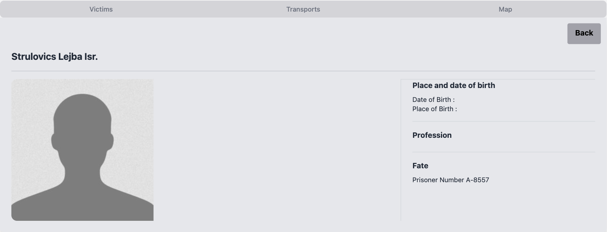](https://victims.auschwitz.org/victims/222687)

*הרשומה במאגר הקורבנות של מוזיאון אושוויץ (victims.auschwitz.org, רשומה 222687), כפי שנצפתה ב-18.08.2026: "Strulovics Lejba Isr. — Fate: Prisoner Number A-8557".*

**4. "כרטיס Rose" — כרטיס הפניה, לא תיק אסירה.** המסמך 105590980 איננו תיק אסירה של האם — זהו **כרטיס הפניה (Hinweiskarte)** של מרשם שטוטהוף: "STRULAWITS geb. FARKAS, Rose — K.L. Au. — ראו: STRULAWITS Ruci, 38444". כלומר, פקידי הרישום יצרו כרטיס על שם האם (שמקומה צוין "מחנה אושוויץ") שמפנה לתיק של בתה. האם עצמה **לא הייתה רשומה בשטוטהוף**. כרטיס הפניה זהה קיים גם על שם האב ("STRULAWITS, Lajos — K.L. Au. — ראו: Ruci 38444", מסמך 105590973). שני הכרטיסים הם עדות מנהלית לכך שרחל מסרה בקליטה ששני הוריה באושוויץ.

**5. החתימה של רחל, בת 15, בשטוטהוף.** בתחתית שאלון הקליטה מופיעה חתימתה בכתב ידה: **"Sztrulovics Ruci"** — כנראה המסמך האישי המוקדם ביותר בכתב ידה ששרד.

**6. תיאורה של רחל במסמכי המחנה:** מבנה גוף חסון, פנים סגלגלות, עיניים שחורות, שיער חום כהה, שיניים טובות — **דוברת הונגרית וגרמנית**. מקצוע: משק בית. השכלה: בית ספר עממי. סימה: גוף צנום, עיניים חומות, שיער חום, דוברת הונגרית ורוסית (כנראה רותנית), מקצוע: משק בית. "מצב גופני: טוב" — אצל שתיהן, ביום הקליטה.

**7. על מות סימה אין מסמך בתיק.** במעטפת התיק של סימה, המשבצות "Todesmeldung" (הודעת פטירה) ו-"Sterbeurkunde" (תעודת פטירה) אינן מסומנות — בתיק יש רק את כרטיס האסירה. פירוש הדבר: מותה בשטוטהוף לא תועד בתיק האישי (תופעה שכיחה בחודשי הכאוס של סוף 1944 – תחילת 1945). גם תשובת ארכיון המוזיאון (סעיף 8) לא כללה רשומת מוות מספרי המתים — כך שמותה נותר מתועד בעדויות בלבד ("כמעט ודאי", פרק ח').

**8. המסמכים מארכיון מוזיאון שטוטהוף עצמו.** ראשת הארכיון, ד"ר דנוטה דריווה, העבירה 18 מסמכים (docs/stutthof_museum_2026), ובהם שלושה מסמכי מקור שלא היו בידינו:

- **רשימת הטרנספורט המקורית מ-29.06.1944** (סימול הארכיון POL-AMS-I-IIb-10-099, עמ' 13 של הרשימה): רשימה שמית במכונת כתיבה של הנשים שהגיעו מאושוויץ, ובה, בשורות עוקבות — **"802. Strulowits Sary, 26.12.26, אסירה 38 443" ו-"803. Strulowits Ruci, 16.4.27, אסירה 38 444"** — שתיהן בסיווג "Sch.H.pol." (אסירת מגן פוליטית), "Ungarn", מוצא: KL. Auschwitz. זהו המסמך שממנו נגזרו כרטיסי האסירה, והוא קובע סופית את מקומן של האחיות במשלוח.

[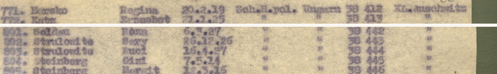](docs/stutthof_museum_2026/POL-AMS-I-IIb-10-099.jpg)

*מתוך רשימת הטרנספורט המקורית (ארכיון מוזיאון שטוטהוף, POL-AMS-I-IIb-10-099): למעלה — שורת הכותרת של העמוד; למטה — השורות 801–805, ובהן סימה (802) ורחל (803) ברצף.*

- **המקור הצבעוני של כרטיסי האסירה** של שתי האחיות (סימולי הארכיון I-III-24771 ו-I-III-24772) ושל שאלון הקליטה החתום של רחל (I-III-15117) — עותקי הארכיון הפולני של המסמכים שסריקותיהם האפורות התקבלו מארולסן, באיכות גבוהה ובצבע, כולל חותמת "Jude" הסגולה והמשולש.
- **פרקי המחקר על OT Thorn ועל פינוי האסירות** מתוך ספרה של ד"ר דריווה על השמדת היהודים בשטוטהוף — 14 עמודים (עמ' 192–201, 232–235) ששולבו בפרק ד' ([תקציר בעברית](docs/stutthof_museum_2026/dok_pages_summary.md) · [העמודים עצמם, החל מ-dok_1](docs/stutthof_museum_2026/dok_1.JPG)).

לצד המסמכים מסרה ד"ר דריווה שתי קביעות חשובות: **"Their documents indicate that their parents remained in Auschwitz, so they were likely murdered there"** — "מסמכיהן מלמדים שהוריהן נותרו באושוויץ, ולכן ככל הנראה נרצחו שם" — הערכת המומחית של ראשת הארכיון, המתיישבת עם התרחיש שההורים לא נרצחו בהגעה אלא נותרו באושוויץ (ולגבי האב — עם רישומו כאסיר A-8557); וכן: **בידי המוזיאון אין את כל רשימות האסירות שנשלחו לתתי-המחנות** — ולכן שיוכה של רחל לטרנספורט מסוים לטורן אינו ניתן כיום לאימות מסמכי, ונשען על עדותה.

### למה אין "תעודת פטירה" על ההורים — ומה כן אפשר להשיג

יהודי הונגריה שנרצחו בסלקציה באושוויץ לא נרשמו כלל — בלי מספר, בלי תיק, בלי תעודת פטירה. ספרי המתים של אושוויץ (Sterbebücher) מתעדים רק אסירים רשומים, וגם הם השתמרו בעיקר לשנים 1941–1943. לכן, אם ההורים נרצחו בהגעה — לא יהיה על כך מסמך מחנה לעולם; התיעוד הוא נתוני הסלקציה של הרכבת (1,987 נרצחו ב-19.05.1944) ודפי העד. אבל ממצאי סעיף 3 לעיל פותחים תרחיש אחר: אם האב (ואולי האם) נרשמו כאסירים — קיים שובל מסמכים פוטנציאלי (רישום, מספר, ואולי תיעוד מוות) — וזו בדיוק השאלה שהפנייה למוזיאון אושוויץ (אסיר A-8557) אמורה להכריע.

## פרק ו' — העדות של רחל: התקציר הרשמי המלא

עדות הווידאו (יד ושם, חטיבה O.3, פריט 8424116) נמשכת **שעתיים ו-41 דקות**, הוקלטה בישראל ב-23.12.2009. התקציר הרשמי:

> ילדות ב-Volove; כיבוש [Volove] בידי הצבא ההונגרי ב-1939; הגעת פליטים מפולין; גירוש תושבים חסרי נתינות ב-1941; החיים תחת הכיבוש ההונגרי כולל חקיקה אנטי-יהודית, החרמת עסק האב ואיסור שחיטה כשרה; כיבוש [Volove] בידי הצבא הגרמני במרס 1944; גירוש לגטו Sekernice; העברה ל-Auschwitz לאחר כחודש; החיים במחנה ללא עבודה כולל מסדרים; העברה ל-Stutthof לאחר חודש; החיים במחנה ללא עבודה כולל סלקציות; העברה ל-Thorn; ניתוק מהאחות החולה; החיים במחנה כולל רעב ועבודה בחפירות; התקרבות [צבא] החזית; צעדת מוות; רצח אנשים במהלך צעדת המוות; הגעה ל-Praust לאחר כעשרה ימים; החיים ב-Danzig כולל עבודה בחפירות, רעב ומחלת הטיפוס; שחרור בידי הצבא האדום בפברואר 1945; החיים לאחר המלחמה; עלייה לארץ ישראל במאי 1946.

צפייה: [העדות המלאה ביוטיוב (ערוץ יד ושם)](https://www.youtube.com/watch?v=GhHKFgl81AU) — **העדות תומללה במלואה: [התמליל המתוזמן השלם](תמליל_העדות_המלא.txt), וניתוח הממצאים בפרק ו'1 וב[קובץ ניתוח העדות](ניתוח_העדות.md).**

---

## פרק ו'1 — מה חושף התמלול המלא של העדות

העדות תומללה במלואה (2:41 שעות) — [צפייה בעדות ביוטיוב](https://www.youtube.com/watch?v=GhHKFgl81AU) · פנימי: [התמליל המלא](תמליל_העדות_המלא.txt), [ניתוח מפורט](ניתוח_העדות.md). המראיינת: סיגל הולצמן; הראיון נערך בביתה של רחל. **בגרסת האתר, כל חותמת זמן [שעה:דקה:שנייה] בפרק זה היא קישור לרגע המדויק בעדות ביוטיוב.** אלה הממצאים המרכזיים שהעדות מוסיפה:

**גורל האב.** ברכבת הביתה אחרי השחרור ניגש אל רחל בחור ואמר: "אבא שלך נפטר, ואני בטוח, מפני שהייתי איתו. הוא מכר את המנת אוכל שלו בשביל סיגריה, והוא מת מרעב" [02:24:44]. כלומר: האב אריה-לייב **עבר את הסלקציה, חי במחנה תקופה — ומת שם מרעב**. זה מתלכד במדויק עם רישום "z.Zt. KL Auschwitz" בכרטיסי הבנות ועם האסיר A-8557 במאגר אושוויץ. האם, לעומת זאת, ירדה מהקרון **כשתינוקהּ של אחותה בידיה** — כדי לעזור לדודה; לשאלת המראיינת "את מבינה היום שזה שאמא החזיקה תינוק על הידיים זה גזר דין מוות היה בשבילך" השיבה רחל: "בהחלט, בהחלט" [01:13:44].

**הרגע שהציל את חייה:** בסלקציה ("עכשיו אני יודעת שזה מנגלה") ענתה רחל שהיא בת 15 — **וקאפו נתנה לה מכה, אמרה למנגלה "בת שמונה עשרה", ואחר כך רדפה אחריה: "תזכרי, את בת שמונה עשרה"** [01:12:43]. זהו ככל הנראה ההסבר לשנת הלידה המוקדמת ברישומי שטוטהוף — אם כי בדקדוק החשבון נותר פער קטן: "בת שמונה עשרה" מתיישבת עם 1926, ואילו נרשם 1927 (גיל 17). הדמות האחרונה מהמשפחה שראתה באושוויץ: סבא בצלאל, גבוה שני מטר, מנופף בידו אל הנכדות — "עד היום אני רואה אותו" [01:15:46].

**הפרידה מסימה — כפויה.** מזכירת המחנה (שרייברין) היהודייה בשטוטהוף שחררה את רחל פעמיים מסלקציות-עבודה כדי שתישאר ליד סימה החולה (כנראה דלקת ריאות); בפעם השלישית אמרה: "אני לא משחררת אותך... את הולכת לעבודה, תגידי שלום לאחותך" — "ויותר לא ראיתי אותה" [01:36:17]. סימה, מחדר החולים: **"אני כבר לא אהיה בת שמונה עשרה"** [01:35:40].

**משפחת האב:** לאב היו **13 אחים ואחיות** — וכל 14 הילדים מתועדים ברשומות הלידה האזרחיות, כולל סימה (1904), חיה (1907) ושרה (1912), שנשתמרו רק ברשומות — ראו פרק ג'; שתי הצעירות שבהם — **התאומות פייגה ופפי (נ' 26.02.1914)** — הסתתרו עם סבא יעקב ושרדו איתו; אחת התאומות נספתה דווקא אחרי השחרור, כשחייל רוסי הטריד אותה בזמן שמכרה דלק — הדלק נשפך והיא נשרפה [02:26:06]. את סבא יעקב מצאה רחל **חי בחוסט** בשובה [02:25:17] (הוא נפטר שם ב-1945, כמתועד בדף העד). דודה נוספת מן העדות: **רחל פרקש** — ככל הנראה אחות האם, רחל (נ' 22.11.1913, נישאה ב-1935 להרש איצקוביץ מרוסקה פולה — רשומת הנישואים אותרה, פרק ג') — שוויתרה בחורף בטורן, חזרה לשטוטהוף ולא שרדה [01:47:39].

**מסלול העלייה:** לא ספינת מעפילים. אחרי השחרור: חוסט → קיבוץ בני עקיבא **בבוקרשט** (שם נודע לה שגדליה חי: "איך הוא שרד? הוא היה כזה קטן, רזה ומפונק") → בית בני עקיבא **בבודפשט** (כחודשיים אשפוז בבית חולים בבודה) → **גרמניה** "איזשהו זמן, וכל הזמן עם אחי" (= מחנה העקורים ליפהיים, כמתועד בכרטיס ארולסן) → **עלייה בסרטיפיקט** ("קיבלו שלושה סרטיפיקטים, אז אני ועוד שני בחורים הגענו לארץ") → **מקווה ישראל, מאי 1946** [02:29:57–02:30:31].

**ההיכרות עם סבא אברהם:** במקווה ישראל. אברהם צדוק — **יליד מקווה ישראל, בן למשפחה שסבהּ היה מתלמידי המוסד הראשונים**; יתום שגויס אליו בשכנוע "אתה אוהב אבטיח? אתה רוצה לגדל אבטיח?", ונשא יהודייה מיפו [02:33:18].

**פרטים נוספים מן העדות:** תנועת הנוער בקומה השנייה הייתה **קן בני עקיבא**; לבית קראו בכפר "המבצר" (קירות בעומק מטר — רחל שחזרה את החלון העמוק בביתה בחולון); למשפחה הייתה גם **תחנת דלק** (שהוחרמה בחקיקה ההונגרית) ואחוזה חקלאית עם עדר כבשים שנוהלה בידי שתי משפחות אוקראיניות; ב-1941 המשפחה **החביאה במחסניה יהודים שנמלטו חזרה מהגירוש לגליציה**; לפני היציאה לגטו ירד האב למרתף, **הטמין כלי כסף ותכשיטים מאחורי לבנים בתקרה ואמר: "מי שיחזור — שיוכל..."** [00:59:02]; בצעדת המוות מטורן יצאו כ-1,200 נשים והגיעו כ-500 [02:10:29]; אחרי השחרור — ניסיונות אונס ליליים של חיילים רוסים, שרחל עצמה ניצלה מהם בנס [02:20:26]; היא כתבה יומן — **שאבד במעבר דירה** [02:34:44]; שישה נכדים, והנכדה אמרה: "סבתא, ביום השואה אני אזמין אותך ואני אתגאה בך" [02:36:37].

**הערות בדיקה שהעדות מעלה:** דב אולי נולד ב-1926 ונרשם "מבוגר בשנתיים" (גויס בן 16); בעדות מוזכר מחנה "אלבינג" (Elbląg, מחנה-בת של שטוטהוף) וגם "בידגושץ'" — מקומו המדויק של אלבינג במסלול אינו ברור מהעדות (לפני שטוטהוף או אחריו; ראו גם ניתוח_העדות), וייתכן שמדובר בתחנת ביניים בדרך לטורן; "יום אחרי פסח עצרו אותנו" — פסח תש"ד הסתיים ב-15.04.1944, כך ששתי העדויות (רחל וריטה שניידר-פולק) מתיישבות יותר עם 16.04, ואילו שאלון שטוטהוף — שנרשם חודשיים מאוחר יותר — נוקב 14.04, יום שעדיין בתוך החג; פער קטן שנותר פתוח.

---

## פרק ז' — סיפור ההצלה של גדליה

גדליה (גיולה), יליד 03.03.1931, גורש עם המשפחה, עבר את אושוויץ ובוכנוולד, ובדצמבר 1944 הועבר לתת-המחנה **ברגה על האלסטר**. באפריל 1945 נמלט מצעדת המוות עם אדולף ("בומי") שפינצן מסיגט (יליד 1930). השניים הסתתרו באסם של **יוסף ואנה קרשק (Karásek)** בכפר קרשוב שליד פלזן; אנה גילתה אותם והמשפחה — שבסביבתה שהו פליטים גרמנים — החביאה והאכילה אותם **22 ימים עד השחרור**. גדליה עלה ארצה עם גרעין בני עקיבא מבודפשט, עיברת את שמו ל**גדליהו רף**, היה ממקימי אילניה, וחידש את הקשר עם מציליו. ב-**21.11.2004** הוכרו יוסף ואנה קרשק כחסידי אומות העולם (תיק 10412; בטקס באפריל 2005 השתתף בנם מילוסלב — הודעת יד ושם הרשמית אותרה). גדליה נפטר ב-2008; כשבועיים אחרי מותו הגיע מכתב שבישר כי אדולף, שאותו חיפש כל חייו, אותר באריזונה. עדותו (2:24 שעות, עברית) — קרן שפילברג, ראיון 34728; לצדה ארבעה ראיונות ביתיים ביוטיוב (ערוץ Dror Raf).

---

## פרק ח' — מה מאומת, מה כמעט ודאי, ומה פתוח

**מאומת במסמכים:** הזהות ותאריך הלידה (16.04.1929 בכל התיעוד המאוחר ובמסורת; הכרעת הפער מול הרשומה האזרחית 12.04 — ראו "פתוח"); **רשומת הלידה האזרחית של רחל עצמה** (Ruchlja, 12.04.1929, וולובה — בת Struljovic Leba ו-Farkas Rifka; דלו 118, רשומה 104/1929) ושל אחותה סימה (Semo, 06.12.1926; דלו 119, רשומה 300/1926); עץ המשפחה ל**שבעה דורות** (מרשומות אזרחיות, מפקד 1921, דפי עד ורשומות שמיות) — כולל רשומת הלידה של האב אריה-לייב (מרס 1894), רשומות הלידה של 13 מדודי רחל מצד האב, רשומות הלידה של כל 14 ילדי בצלאל ואסתר פרקש מצד האם (ובכללן רשומת האם רבקה-רוזה, 25.04.1904) וארבע רשומות נישואים של אחיה, רשומת הלידה של גיטה (26.03.1936), רשומת לידתה של סבתא שרה (ינואר 1876) המוכיחה שהיא בת גדליה רפפורט ואסתר כץ, נישואי גדליה (1884/1903) והוריו משה ויֶנטה; גיליון מפקד 1921 של בית המשפחה בקושלובו; נישואי הדודה גיטל לאלכסנדר וולף (1933); מסלול הרדיפה עד שטוטהוף (מהמעצר ועד הקליטה ב-29.06.1944 — במסמכים; מטורן ואילך — על פי עדות רחל, בהלימה כללית לספרות המחקר על Baukommando Weichsel ופראוסט; ראו הסתייגות מועד השחרור בפרק ד'); רישומי שטוטהוף של רחל וסימה עם מספרי אסירות עוקבים; רכבת אוקרמזו 17.05.1944 ונתוני הסלקציה שלה (שיוך המשפחה לרכבת זו דווקא — ראו "כמעט ודאי"); שושלת רפפורט כבעלי אחוזות מ-1893; ההצלה של גדליה בידי משפחת קרשק והכרת המצילים.

**כמעט ודאי — עם פירוט המקורות של כל קביעה:**

- **מות סימה בשטוטהוף.** מקורות: עדות רחל (נפרדו בהעברה לטורן; עד ראייה סיפר על מותה); דפי העד שהגישה רחל ב-2013; היעדרה מרשימות החוזרים של 1946. מסמך מחנה על מותה אין בתיק האישי (פרק ה'), וההפנייה לספרי המתים של שטוטהוף תלויה ועומדת — לכן "כמעט ודאי" ולא "מאומת".
- **רצח גיטה (1944) והישרדות הסב יעקב ומותו בחוסט 1945.** מקורות: דפי עד (על גיטה — בכתב ידה של רחל; על יעקב — של נכדתו אסתר גוטמן-רפפורט) ועדות רחל (לידת גיטה עצמה — מאומתת כעת ברשומה האזרחית, פרק א'; הסיווג כאן נוגע לרצח). לנרצחת הגעה בת שמונה לא ייתכן מסמך מחנה (פרק ה'), ולמות יעקב ב-1945 לא צפוי רישום מנהלי זמין — דפי העד הם התיעוד המיטבי האפשרי; ובכל זאת, באמת-מידה אחידה עם מות סימה, הסיווג הוא "כמעט ודאי".

- **רשומת שטוטהוף 38444 = רחל.** מקורות: כרטיס האסירה והשאלון המקוריים (docs/arolsen_stutthof/105591047, 105591037) — שם "Strulowits Ruci", ילידת Ökörmező, 16.04 (שנה 1927 — ראו הסבר הקאפו), הורים "Lajos S. + Rose Farkas" — כל הפרטים תואמים; רשומת USHMM/ארולסן אוסף 1.1.41.2; רשימת קלרספלד "Nevek" (1995). ההסתייגות היחידה: אין תעודת זהות עם תמונה שמקשרת פיזית — ולכן "כמעט ודאי" ולא "מאומת".
- **הרכבת מ-17.05.1944 היא רכבת המשפחה.** מקורות משולבים: (1) רשימת מפקד תחנת קושיצה — רכבת "Ökörmező" ב-17.05.1944, 3,052 מגורשים ([degob.org/tables/kassa.html](https://degob.org/tables/kassa.html)); (2) רשימת גלזר על הסלקציות בבירקנאו — אותה רכבת, הגעה 19.05 ([zchor.org/hungaria.htm](https://zchor.org/hungaria.htm)); (3) [מאגר הגטאות של יד ושם](https://www.yadvashem.org/research/ghettos-encyclopedia.html) — חיסול גטו סקלנצה 15.05.1944 דרך תחנת סלדובוש (רשומה 6663078); (4) עדות רחל: "כחודש בגטו" אחרי מעצר 14.04 (שאלון שטוטהוף). ההסתייגות: אין רשימה שמית של נוסעי הרכבת — ייתכן תאורטית שהמשפחה צורפה לרכבת חוסט של 24.05.
- **ההעברה לשטוטהוף במשלוח 29.06.1944.** מקורות: "Eingewiesen am 29.6.44 durch KL. Auschwitz" בכרטיסי שתי האחיות (המסמכים בתיקייה; [תצלום](docs/evidence/stutthof_eingewiesen_zoom.png)); ספרות המחקר על משלוח 2,502 הנשים ההונגריות הראשון מאושוויץ לשטוטהוף בתאריך זה (אנציקלופדיית USHMM, ערך Stutthof). כאן הוודאות למעשה מלאה.
- **מות גדליה רפפורט 1908–1909.** מקורות: לידת בנו האחרון מאיר 28.01.1908 (רשומת לידה, JewishGen); שלושה נכדים בשם גדליה שנולדו 12/1909–02/1911 (רשומות לידה, JewishGen) — על פי מנהג הקריאה על שם נפטר; הידיעה "נפטר לא מכבר" ב-Görög katholikus szemle, 25.12.1910 ([העמוד המקורי](docs/arcanum_full/gorog_kath_szemle_1910-12-25_gedajlo_death_120plots.pdf)); ומרשם 1912 שבו האחוזה רשומה כבר על שם "יורשי רפפורט גדיילו" והאלמנה ([העמוד המקורי](docs/arcanum_full/gazdacimtar_1912_p444_gedajlo_orokosok_ozvegy.pdf)).

**פתוח:** הכרעת פער התאריכים 12.04/16.04.1929 (העתק מאושר של רשומת הלידה מ-DAZO — ההפניה המדויקת ידועה); רשומות לידה של דב וגדליה (אינן באינדקס JewishGen באף אחד מהאיותים); אימות סופי של A-8557 (גורל האב באושוויץ); תוכן תיק T/D 394234 ותקופת ליפהיים; השלמת פרטי הסב אברהם צדוק (תאריכי חייו, מוצאו); איתור צאצאי הדודים ששרדו (נתן, פאני/פפי, אסתר גוטמן-רפפורט, לילי שפרינגר ושרה וולף); זהות "יוסף-דוד רפפורט בן גדלי" (נ' 1891) — האם בן נוסף של גדליה.

---

## פרק ט' — צעדים פתוחים להמשך המחקר

**מצב הפניות לארכיונים (נשלחו 08/2026):**

- **מוזיאון שטוטהוף** — **השיבה (18.08.2026) ראשת הארכיון, ד"ר דנוטה דריווה:** 18 מסמכים, ובהם רשימת הטרנספורט המקורית של 29.06.1944, עותקי הצבע של כרטיסי האסירות ופרקי מחקר על OT Thorn (פרק ה' סעיף 8). רשומת מוות של סימה לא צורפה, ובידי המוזיאון אין את כל רשימות האסירות לתתי-המחנות. **נשלח מכתב המשך (18.08.2026):** בדיקת ספרי המתים (Totenbücher) לגבי סימה, ורשימות שמיות של משלוחי טורן (24–26.08.1944 וכל משלוח מאוחר).
- **ארכיון ארולסן** — **נשלחה בקשה מקוונת (18.08.2026):** תיק T/D 394234 על שם רחל (על פי החותמת בכרטיס ה-CNI) + מסמכי שהותה במחנה העקורים ליפהיים (UNRRA/IRO, 1945–46). זמן התגובה המוצהר של הארכיון: עד 13 חודשים.
- **לשכת האסירים לשעבר, מוזיאון אושוויץ** (בירור האסיר A-8557 "Strulovics Lejba" וכל רישום על בני המשפחה) — התקבל אישור קבלה אוטומטי; הפנייה בתור לטיפול.
- **הארכיון הלאומי בפראג** (גיליון משק הבית של המשפחה במפקד 1930, Volové) — נקלט ונרשם 18.08.2026, מס' תיק NACRX006QIPA.
- **ארכיון DAZO בברהובו** — לפנייה הראשונה (17.08) טרם התקבל מענה; **נשלחה בקשת המשך (18.08.2026, אוקראינית ואנגלית):** העתקים מאושרים של רשומות הלידה של רחל (פונד 1606, אופוס 6, דלו 118, רשומה 104/1929) ושל סימה (דלו 119, רשומה 300/1926), כולל נכונות לשלם אגרה.
- **לארה דיאמונד, ראשת פרויקט תת-הקרפטים ב-JewishGen** — **השיבה (18.08.2026):** כל הספרים שבידי הפרויקט כבר מפוענחים ונמצאים במאגר; היא שהפנתה לרשומת הלידה של רחל תחת האיות "Struljovic". ספרי קהילה מלפני 1895 לנפת חוסט (שאליה השתייכה קושלובו) טרם אותרו — והיא ממשיכה לחפש.

**פעולות פתוחות:**

1. **דפדוף בכרך אוקרמזו של מפקד 1921 — בוצע (18.08.2026):** אותרו שני משקי הבית היחידים בשם רפפורט בוולובה (בית 127 — סלומון נ' 1856, אפשר שאחיו של גדליה — טעון אימות; בית 106a — מוזס נ' 1882), ושני הגיליונות המקוריים הורדו (פרק ב', "קרובים אפשריים נוספים"). ענף גדליה עצמו אינו במפקד וולובה. המשך אפשרי: בירור קשרם של סלומון ומוזס לגדליה מול רשומות הלידה.
2. **חיפוש "פרקש" במאגר JewishGen — בוצע (18.08.2026):** נסרקו כל רשומות "Farkas" של תת-הקרפטים — 4,925 לידות, 1,003 נישואים ו-1,837 פטירות. התוצאה: תיעוד אזרחי מלא של משפחת האם — כל 14 ילדי בצלאל ואסתר (פרק ג'), ארבע רשומות נישואים של האחים — ורשומת הלידה של גיטה (פרק א'). המשך אפשרי: איתור רשומות הפטירה של ששת הילדים שמתו בינקותם ורשומות פטירה/לידה נוספות של הענף אחרי 1937.
3. **השלמות משפחתיות:** סריקה איכותית של תמונת המשפחה מ-1944 שאצל עדו; פרטי אברהם צדוק (תאריכי חייו, משפחתו); קשר עם רותי פיקסלר (ארגון יוצאי קרפטורוס) ועם אריה וזאב רף באילניה — תמונות ותעודות נוספות; איתור צאצאי הדודים ששרדו (נתן, פאני, אסתר גוטמן-רפפורט, לילי שפרינגר, שרה וולף).
4. **עדויות להזמנה:** ראיונות הבית של גדליה — [ערוץ היוטיוב Dror Raf](https://www.youtube.com/@drorraf/videos) (ניתן להוריד ולתמלל); עדות גדליה בקרן שפילברג — [רשומת הקטלוג, ראיון 34728](https://vhaonline.usc.edu/viewingPage?testimonyID=34728) (צפייה מלאה — בעמדת VHA ביד ושם בלבד); עדות לילי שפרינגר — הקטע הפומבי: "Arriving at Auschwitz | Lili Springer" בערוץ USC Shoah Foundation ביוטיוב; המלאה — VHA.
5. **איתור מחדש של הודעת ה"מבוקש" נגד מאיר רפפורט — בוצע (18.08.2026):** ההודעה אותרה בחיפוש "Rapaport" (p אחת) בתוך אוסף ה-BKL ב-Arcanum — גיליון 23.09.1944 — והעמוד המקורי הורד. ההודעה העלתה פרטים חדשים: מאיר היה טכנאי שיניים, נשוי לרוזה לבית נוילינגר מחוסט (שנגדה פורסמה הודעה נפרדת), האישום — סחיטה (תיק מ-1942), ואמו מינדל מצוינת "המנוחה" — נפטרה לפני 08/1944. הפירוט המלא — פרק ב'.
6. **שחזור ההפניה לעדות ריטה שניידר-פולק — בוצע (18.08.2026):** העדות אותרה מחדש בעמוד השואה של אתר קהילת מיז'יריה (KehilaLinks) — היא ממקימות דף הקהילה; ההפניה, פרטים חדשים מהעדות (שבע בבוקר, המשפחה השלישית, הצעדה לקרונות, 80 בקרון) והתצלום שולבו בפרק ד' ובאינדקס. באותו עמוד — העתק פומבי של רשימת Nevek לאוקרמזו, ובה "STRULOVICS, RUHEL 1927" — רחל עצמה.
7. **ביטול מנוי Arcanum ([adt.arcanum.com](https://adt.arcanum.com)) בתום המחקר** — תזכורות הוגדרו ל-08.09.2026 (ביומן ובמערכת).

---

## מקורות עיקריים

- **עדות הווידאו של רחל (2:41 שעות, 23.12.2009)** — [צפייה ביוטיוב (ערוץ יד ושם)](https://www.youtube.com/watch?v=GhHKFgl81AU) · [הרשומה הקטלוגית ביד ושם](https://collections.yadvashem.org/en/documents/8424116) · פנימי: [תמליל מלא](תמליל_העדות_המלא.txt), [רשומת הקטלוג](docs/yadvashem_records/testimony_8424116_he.json)
- **עלון יוצאי קרפטורוס 137** (08/2025), עמ' 11–12 — [carpati.org.il](https://carpati.org.il) · פנימי: [עברית](docs/carpati_alon_137_he.pdf), [אנגלית](docs/carpati_bulletin_137_en.pdf)
- **יד ושם — מאגר השמות המרכזי**: 46 רשומות שמיות ושתי רשומות קטלוג ([מאגר השמות](https://names.yadvashem.org); צפייה ברשומה: `collections.yadvashem.org/en/names/<המספר>`) · פנימי: [docs/yadvashem_records/](docs/yadvashem_records/name_15952725.json) (48 קובצי JSON) ו-44 [סריקות דפי עד](docs/yadvashem_pot_scans/10846653_04122013_8915_158.jpg); [מאגר הגטאות](https://www.yadvashem.org/research/ghettos-encyclopedia.html) (הוסט 5686791, איזה 5686963, סקלנצה 6663078); [חסידי אומות העולם — רשימת צ'כיה](https://www.yadvashem.org/righteous.html) (תיק 10412) · פנימי: [הרשימה](docs/yadvashem_righteous_czech_list.pdf)
- **רשימת קושיצה** — [degob.org/tables/kassa.html](https://degob.org/tables/kassa.html) · פנימי: [תצלום השורה](docs/evidence/degob_kassa_list_okormezo_row_zoom.png); **רשימת גלזר** — [zchor.org/hungaria.htm](https://zchor.org/hungaria.htm) · פנימי: [תצלום השורה](docs/evidence/zchor_glazer_okormezo_selection_row_zoom.png)
- **מאגר מוזיאון אושוויץ** — [victims.auschwitz.org](https://victims.auschwitz.org) — רשומות [222687 (A-8557)](https://victims.auschwitz.org/victims/222687) · פנימי: [תצלום](docs/evidence/auschwitz_victims_db_lejba_a8557_zoom.png); 188170 (יוסף רפפורט 33088); טרנספורט 360
- **ארכיון Arolsen** — [collections.arolsen-archives.org](https://collections.arolsen-archives.org) (צפייה במסמך: `/en/document/<המספר>`) · פנימי: [docs/arolsen_stutthof/](docs/arolsen_stutthof/105591047_001.jpg) (14 סריקות), [docs/arolsen_dp/](docs/arolsen_dp/cni_farkas_rachel_001.jpg)
- **ארכיון מוזיאון שטוטהוף** — נמסר בדוא"ל מד"ר דנוטה דריווה (18.08.2026; אין עותק מקוון פומבי) · פנימי: [docs/stutthof_museum_2026/](docs/stutthof_museum_2026/POL-AMS-I-IIb-10-099.jpg) (18 קבצים + [תקציר עברי](docs/stutthof_museum_2026/dok_pages_summary.md))
- **USHMM**: [מאגר הניצולים והקורבנות](https://www.ushmm.org/remember/resources-holocaust-survivors-victims/database-of-holocaust-survivor-and-victim-names) (רשומות שטוטהוף, אוסף 1.1.41.2); [אנציקלופדיית המחנות והגטאות כרך I](https://www.ushmm.org/research/publications/encyclopedia-camps-ghettos) (ערכי Stutthof, Thorn, Thorn-Winkenau)
- **רשימת קלרספלד "Nevek"** (1995) — נשים יהודיות הונגריות בשטוטהוף; נגישה דרך רשומות יד ושם (פנימי: [רשומת רחל](docs/yadvashem_records/name_5310417.json), [רשומת סימה](docs/yadvashem_records/name_5310416.json)); העתק פומבי של רשימת אוקרמזו — ובה "STRULOVICS, RUHEL 1927" — ב[עמוד השואה של KehilaLinks מיז'יריה](https://kehilalinks.jewishgen.org/Mizhhirya/Mizhhirya-Holocaust.htm) (שם גם עדות ריטה שניידר-פולק — פרק ד')
- **ארכיוני עיתונות**: [Arcanum/ADT](https://adt.arcanum.com) (מרשמי בעלי הקרקעות והמשקים 1893 / 1897 / 1899–1900 / 1912, Budapesti Közlöny, Magyar Ujság, Budapesti Hírlap, Görög katholikus szemle, Központi Értesítő, Egyenlőség 1911, שנתוני Compass — **16 עמודי המקור המלאים (כולל Bűnügyi Körözések Lapja 1944) ב-[docs/arcanum_full/](docs/arcanum_full/gazdacimtar_1893_p408_gedajlo_okormezo.pdf)**; תצלומי קטעים ב-[docs/evidence/](docs/evidence/arcanum_gedajlo_death_1910_gorog_szemle_zoom.png)); [Kramerius](https://www.digitalniknihovna.cz) (מדריכי העסקים של Volové 1928–1938 · פנימי: [docs/directory_1937...](docs/directory_1937CarpRuth-Okormezo-0056.pdf))
- **Koblasa, Paginae Historiae 23/2 (2015)** — [PDF במקור (הארכיון הלאומי הצ'כי)](https://www.nacr.cz/wp-content/uploads/2024/04/PH_23_2_2015_Koblasa.pdf) · פנימי: [המאמר](docs/koblasa_1928_estates_podkarpatska_rus.pdf)
- **JewishGen — מאגר הונגריה** — [jewishgen.org/databases/hungary](https://www.jewishgen.org/databases/hungary/) (נסרק במלואו בשלושה חיפושים: הסלים הפונטיים Strulovits ו-Struljovic, וכן "Farkas" — צד האם): Subcarpathia and Vicinity Births/Deaths/Marriages (פונד 1606 בארכיון DAZO), מפקד קרפטליה 1921, מפקד צ'כוסלובקיה 1930, Claims Conference · פנימי: תצלומי הרשומות ב-[docs/evidence/](docs/evidence/jewishgen_rachel_sima_own_birth_records_zoom.png); [פרויקט תת-הקרפטים](https://www.jewishgen.org/subcarpathia/), [KehilaLinks מיז'יריה](https://kehilalinks.jewishgen.org/mizhhirya/)
- **ספריית Hungaricana** — [הכרך המקוון (pg=298)](https://library.hungaricana.hu/hu/view/KANepszaml_006_Huszt_Keselyumezo__097_Koseleve-Keselymezo/?pg=298&layout=s) — גיליון מפקד 1921 של בית 30 קושלובו (עמ' 299–300 בכרך) · פנימי: [PDF מקורי](docs/hungaricana_1921_census_koselovo_house30_pages299-300_original.pdf), [קומפוזיציה](docs/hungaricana_1921_census_koselovo_house30_full.png); גיליונות רפפורט בוולובה מ[כרך אוקרמזו](https://library.hungaricana.hu/hu/view/KANepszaml_002_Okormezo_Okormezo__033_Volove-Okormezo/?pg=604&layout=s) · פנימי: [בית 127](docs/hungaricana_1921_census_volove_house127_page605_original.pdf), [בית 106a](docs/hungaricana_1921_census_volove_house106a_page582_original.pdf)
- **אתרי הנצחה**: [יזכור — רב"ט רבקה ("ריקה") רף, בת גדליהו וחוה, אילניה](https://www.izkor.gov.il/%D7%A8%D7%91%D7%A7%D7%94%20%D7%A8%D7%A3/en_c78f31596e88feca277077738dcc3c9a)

*קישורים מלאים ותיאור כל קובץ — ב[אינדקס המקורות](אינדקס_מקורות.md).*

---

## נספח ד' — יומן שינויים (Changelog)

- **מהדורה 1 (16.08.2026):** ביסוס הזהות ותאריך הלידה; איתור עדות הווידאו ביד ושם, רשומות שטוטהוף ודפי העד; עץ משפחה ראשוני; זיהוי רכבת הגירוש מאוקרמזו.
- **מהדורה 2 (17.08.2026):** הורדת תיקי שטוטהוף המקוריים מארולסן (14 סריקות) וכרטיס העקורים מליפהיים; תמלול מלא של העדות (2:41 שעות) ושילוב ממצאיה; תיעוד שושלת רפפורט בעיתונות ההונגרית; נשלחו חמש פניות לארכיונים. תיקונים: הובהר ש"וולובץ/Volóc" היא עיירה אחרת; רשומת אינדקס "Lajos Strulawits, אסיר 13708" זוהתה כשגויה (הכרטיס בפועל — כרטיס הפניה ללא תאריך לידה); נשללה השתתפות רחל בהפלגת "מקס נורדאו".
- **מהדורה 3 (17.08.2026):** סריקה מלאה של מאגר JewishGen ההונגרי (סטרולוביץ + רפפורט) ושל מפקד 1921: רשומות הלידה של האב ושל 13 מדודי רחל (14 ילדים — תואם העדות); רשומת לידת סבתא שרה המוכיחה שהיא בת גדליה רפפורט ואסתר כץ; משפחת גדליה המלאה (הוריו, שלוש נשיו, ילדיו) ותיחום מותו ל-1908/9; גיליון מפקד 1921 המקורי של בית המשפחה (הורד בהמשך גם כ-PDF באיכות מלאה); נישואי הדודה גיטל לוולף (1933). אומתו מחדש מול Arcanum כל הקביעות על רפפורט אלדר, דז'ה ושאול, בצירוף צילומי מקור. תיקונים: אזכור "Strulovič Leba" ממדריכי העסקים הוסר מהראיות (לא אומת בסריקות); המסורת על מחנה מעבר בקפריסין נבחנה ונמצאה בלתי מתיישבת עם התיעוד; עץ המשפחה עוצב מחדש במתכונת גנאלוגית תקנית.
- **מהדורה 4 (18.08.2026):** אותרו רשומות הלידה האזרחיות של רחל ("Ruchlja", 12.04.1929) ושל סימה ("Semo", 06.12.1926) — תחת האיות "Struljovic", בעקבות תשובתה של לארה דיאמונד; נוסף דיון בפער התאריכים מול המסורת (16.04 / 26.12). סריקה חוזרת מלאה של 252 רשומות "Strulovits" אישרה שאין באינדקס רשומות לדב, גדליה וגיטה, ותיעדה משפחות סטרולוביץ נוספות בוולובה (באומגרטן, נוימן). עודכן מצב הפניות (פראג — נרשם; אושוויץ — אישור קבלה; לארה דיאמונד — השיבה). הגלריה עודכנה לצילום המלא של גיליון מפקד 1921 מה-PDF המקורי; עץ המשפחה עוצב מחדש בכתב גדול משמעותית (סבב האחים בשלוש שורות); רשימת 14 הילדים תוקנה כך שהתאומות מופיעות כפריטים 13–14 נפרדים; נוסף הסבר על תצוגת Arcanum (קטע ה-OCR הוא תוכן העמוד; הסריקה המלאה דורשת מנוי — נוסף כצעד פתוח).
- **מהדורה 5 (18.08.2026):** תיקונים בעקבות ביקורת חיצונית מלאה (דוח_ביקורת_פערים.md): תוקנה שגיאת שם הנעורים של ריבקה אשת לייב בעץ ("גרוסמן"→"נאיוביץ/שפשוביץ?"); נוספה הערת פער מקורות לתאריך לידת התאומות (1914/1915); "מות סימה בשטוטהוף" הועבר מ"מאומת" ל"כמעט ודאי"; זוהתה שרה כילדה החסרה בגיליון המפקד וצוינה כפילות רוחלה; נוסח מחדש ההסבר לפערי התאריכים (12.04/16.04, 06.12/26.12); יושרו דרגות הוודאות לגורל האב, האם ופפי בכל המופעים ובעץ; נוספו תצלומי מקור לרשומת A-8557, לרשימת קושיצה ולרשימת גלזר; תוקנו עשרה קישורים שבורים בקובץ המאוחד ובאג הזרקת תמונות בתוך רשימות; האינדקס סונכרן (רשומות Struljovic, שמות קבצים בפועל, הפניות מיושנות); תיקוני ניסוח ותעתיק.
- **מהדורה 6 (18.08.2026):** תיקוני סבב ביקורת שני (דוח_ביקורת_סבב2.md): יושרה סתירת-כיוון בגורל האב בפרק ד'; רצח גיטה וגורל הסב יעקב הועברו ל"כמעט ודאי" באמת-מידה אחידה; "תאריך המעצר במסמך" במקום "המדויק"; תוקנו שאריות שמות קבצים באינדקס; דויק מניין הרשומות (46+2); סויגה ונוסחה מחדש השערת הקריאה על שם הדודה סימה; תועד שבדף העד של סימה נכתב "1927"; המקרא והערות השוליים של העץ נוספו לקובץ המאוחד.
- **מהדורה 7 (18.08.2026):** שיפורי מבנה והנגשה בעקבות סבב ביקורת שלישי (דוח_ביקורת_סבב3.md): נוספו תוכן עניינים מקושר ועוגני ניווט לקובץ המאוחד; נקודות הצבע במקרא העץ; כיתובים לתמונות שנסמכו על alt בלבד; פסקת פתיחה ("מפת דרכים") לפני התקציר; "פרק" במקום "חלק" בכל הכותרות; יומן השינויים הוגדר "נספח ד'" והועבר לסוף הקובץ המאוחד.
- **מהדורה 8 (18.08.2026):** בקובץ המאוחד: עץ המשפחה מוצג כעת כתצוגה מקדימה מצומצמת המזמינה לחיצה, ולחיצה עליה פותחת חלון תצוגה מלאה (מודאל) עם העץ בגודלו המקורי, גלילה וגרירה לכל הכיוונים וסגירה ב-Esc.
- **מהדורה 9 (18.08.2026):** התקבלה תשובת ארכיון מוזיאון שטוטהוף (ד"ר דנוטה דריווה, ראשת הארכיון) ובה 18 מסמכים: רשימת הטרנספורט המקורית של 29.06.1944 עם האחיות בשורות 802–803 (משובצת בפרק ה'), עותקי הצבע של כרטיסי האסירות ושאלון הקליטה החתום, ופרקי מחקר על OT Thorn ופינוי האסירות ששולבו בפרק ד'. נוספו: הערכת דריווה על גורל ההורים ("נותרו באושוויץ וככל הנראה נרצחו שם"), העובדה שאין בידי המוזיאון את כל רשימות תתי-המחנות, ועדכון סעיף 7 (אין רשומת מוות לסימה גם בתשובת המוזיאון). כל המסמכים בתיקיית docs/stutthof_museum_2026.
- **מהדורה 10 (18.08.2026):** עודכנה תוכנית הפעולה (פרק ט') בעקבות תשובות הארכיונים: הוסרה פעולת תמצית הרישום ממרשם האוכלוסין; נוספו בקשת העתקים מאושרים מ-DAZO (בהפניות המדויקות שאותרו) ומכתב המשך לארכיון שטוטהוף (ספרי המתים לגבי סימה; רשימות טרנספורטים לטורן מספטמבר–נובמבר 1944, בהתאם לעדות על יציאה בסלקציה השלישית).
- **מהדורה 11 (18.08.2026):** קישור מקורות כפול בכל המסמך — כל אזכור מקור חיצוני מקושר לרשומה המקוונת המדויקת (יד ושם — 46 רשומות שמיות; ארולסן — לפי מספר מסמך; יוטיוב — כל חותמת זמן בפרק העדות מקושרת לרגע המדויק בעדות המצולמת) ולצדו קישור פנימי יחסי לעותק שבתיקייה; פרק "מקורות עיקריים" קושר במלואו. נוסף מבנה אתר סטטי (site/ עם index.html) שכל קישוריו יחסיים — מוכן להעלאה כמות שהוא לאחסון סטטי (S3 וכדומה).
- **מהדורה 12 (18.08.2026):** דיוק פרק ד' על פי התמלול: היציאה לטורן תוארכה ל~ספטמבר-אוקטובר 1944 ("חודשיים, שלושה" בשטוטהוף) — בסלקציה השלישית, לאחר שמזכירה יהודייה חילצה את רחל פעמיים והסתירה אותה בחדר החולים; נוספו דחיקתה של סימה ("את חייבת לצאת"), תיאור טורן מפי רחל, וסיפור הדודה רחל פרקש שחזרה בחורף מטורן לשטוטהוף ולא שרדה.
- **מהדורה 13 (18.08.2026):** תצלומי הראיות בקובץ המאוחד אינם מוטמעים עוד (base64) אלא נטענים בהפניה ישירה לקובצי המקור שבתיקיות docs/‏ (עם תמבניילים בקובצי docs/thumbs/‏ לגלריה ולתצלומים הגדולים); לחיצה על כל תצלום פותחת את קובץ המקור המלא. הקובץ ירד מ-2MB ל-232KB, ותנאי השימוש עודכן: יש לפתוח אותו מתוך התיקייה או מהאתר הסטטי.
- **מהדורה 14 (18.08.2026):** המסמך המאוחד נשאר בשמו המקורי — רחל_צדוק_המחקר_המלא.html; נוסף index.html כשלד הפניה אוטומטית (redirect) המפנה אליו, לצורך פתיחה ישירה של האתר באחסון סטטי (S3).
- **מהדורה 15 (18.08.2026):** הוסר פרק "תקציר: עיקרי הממצאים" מפתיחת המסמך; המסמך נפתח כעת ישירות בפרק א'.
- **מהדורה 16 (18.08.2026):** תיקוני סבב ביקורת חמישי (דוח_ביקורת_סבב5.md): תוקן תיארוך היציאה לטורן (~סוף אוגוסט–ספטמבר 1944, ואולי מאוחר יותר — הוצגו שתי האפשרויות מול המשלוחים המתועדים, ועודכנה בהתאם פעולה 3 בפרק ט'); יושרו נתוני OT Thorn מול מקור דריווה (כ-5,000 בשלושת משלוחי 24–26.08; כ-6,000 עם התגבורים; יוצאות לודז' הגיעו לשטוטהוף 27.09); נוספה הסתייגות למועד השחרור (לפי דריווה — שחרורי אזור פראוסט–דנציג במרץ 1945) ורוככה "הלימה מלאה" בפרק ח'; עדות ריטה שניידר-פולק סומנה כעדות שהפנייתה טרם שוחזרה (פעולה 10 חדשה בפרק ט'); נוספה שורת מקורות לטבלת שושלת רפפורט ותוקן "מרשם 1912" ברשימות המקורות; תוקן מניין ילדי גולדה-ארנקה (חמישה); דיוקי ציטוטים מהעדות (נוסח סימה אוחד; "גזר דין מוות" יוחס למראיינת; עוגן ציטוט הנכדה 02:36:37); סויג מות סימה בטבלת פרק ג' ובעץ; קושר זיהוי הדודה רחל פרקש בפרק ג'; תוקנו הערת נתן בעץ, ניסוח "הראשון שנולד אחרי מות הסב" ומשפט ילדי מנדל; חותמת טווח זמן מומרת כעת לקישור; קישור מדויק לרשומת "יזכור" של רבקה רף; נתון 23,566/21,817 סומן כטעון הפניה; הוראות ההעלאה ל-S3 נכתבו מחדש ונמחק קובץ ה-zip המיושן; ניתוח_העדות.md סונכרן עם פרקים ד'/ו'1; הושלמה טבלת הקבצים באינדקס.
- **מהדורה 17 (18.08.2026):** שיפורי בהירות בפרקים א'–ב': הערת תאריך הרשומה האזרחית (12.04.1929) נוספה כבר בפתיחת פרק א'; התעתיק "Struljovic" של רשומות הלידה נוסף לשורת סטרולוביץ ברשימת השמות; הקביעה על הוספת הגיל ברישומי שטוטהוף (1927) חוזקה — היא מתועדת במפורש בעדות (סיפור הקאפו) והפניה אליו נוספה במקום; פסקת איתור הרשומה האזרחית נוסחה מחדש לקורא ראשון (הוסר תיאור תהליך החיפוש); נוספו המרות לדונם לכל שטחי האחוזה בטבלת רפפורט (1,672 הולד ≈ 9,600 דונם; 3,810 הולד ≈ 21,900 דונם; 4,515 הקטר ≈ 45,150 דונם, מהם יער ≈ 25,730 דונם).
- **מהדורה 18 (18.08.2026):** הורדו מ-Arcanum (במנוי) 15 עמודי המקור ההונגריים המלאים — תיקיית docs/arcanum_full/ — וקושרו מכל שורה בטבלת רפפורט ומסעיפי אלדר/דז'ה/שאול. תיקונים ותוספות שעלו מהעמודים המלאים: (א) מרשם 1893 — האחוזה 2,174 הולד בסך הכול (מהם 1,672 יער; קודם צוטט היער כסך הכול); (ב) נוסף מפקד המשקים 1897 ("Rappaport Gedálya, tulajdonos"); (ג) אותר מרשם 1912: "יורשי רפפורט גדיילו" (2,176 הולד) והאלמנה (435 הולד) — תיעוד ישיר של חלוקת האחוזה אחרי מותו, והוחזר לרשימות המקורות; (ד) תוקן ייחוס תואר המנכ"ל של אלדר: הוא היה vezérigazgató של הבנק הכלכלי של נאג'סלש (נוסד 1912) ב-1915–1918 — לא של בנק החיסכון של אוקרמזו (שם כיהן קון אדולף); באוקרמזו היה אלדר חבר דירקטוריון מייסד (1910); (ה) דויק דז'ה: ועדת הפיקוח (1915) ואחר כך הדירקטוריון (1917–18) של הבנק הנאג'סלשי; (ו) זוהתה סופית חברת שאול: Tiszavidéki tutajtársulat (חברת רפסודות העצים, מרמרוש-סיגט; אתרים: אוקרמזו ומיידנקה); (ז) אותרה הכתבה הארצית המקורית של פולמוס 1910 (Budapesti Hírlap 23.12.1910) והורדה; (ח) פעולה 9 בפרק ט' עודכנה — נותר רק איתור מחדש של צו החיפוש נגד מאיר (BKL 1944).
- **מהדורה 19 (18.08.2026):** בעקבות שאלה על סבירות השטחים — אומתו חשבונית כל המרות הדונם (הולד קדסטרלי = 5,755 מ"ר; 2,174 הולד ≈ 12,511 דונם; 3,810 ≈ 21,925; 4,515 הקטר = 45,150) ונוספה לטבלת רפפורט הערת קנה מידה: השוואה לבעלי הקרקע האחרים באותו עמוד מרשם (הקהילה 6,684 הולד; האוצר 3,267; טלקי 573; קראוס 1,574), הבהרה שמדובר באחוזות יער הרריות, והבהרה שאחוזת 1928 משותפת לשלוש משפחות.
- **מהדורה 20 (18.08.2026):** תצלומי כרטיסי החיפוש של Arcanum בפרק ב' הוחלפו בחיתוכים מעמודי המקור המלאים (docs/arcanum_full/previews; לחיצה פותחת את ה-PDF המלא), ולכל ציטוט הונגרי נוסף תרגום מלא לעברית בכיתוב שמתחת לתמונה; אלדר רפפורט נוסף לעץ המשפחה כקופסה בדור סבתא שרה (מחובר לגדליה), והערת השוליים של העץ עודכנה — שאול נותר מחוץ לעץ עד שיוכח קשרו המשפחתי.
- **מהדורה 21 (18.08.2026):** נבנה **העץ המלא** (עץ_משפחה_מורחב.html, מקושר מנספח א'): כל בני המשפחה המתועדים — תשעת ילדי גדליה רפפורט מכל נשותיו (בשורה ייעודית), כל 14 האחים עם ילדיהם בתוך התיבות, ששת אחי האם עם ילדיהם, והדורות עד נכדי רחל. חיפוש רשומת לידה לשאול רפפורט העלה מועמד — "Soel", נ' 03.11.1873 במרמרוש-סיגט, בן יוסל ומרים — המרמז על ענף סיגט (נוסף לפרק ב' ולאינדקס); שאול נותר מחוץ לעץ. שיפורי פרק ט': מצב הפניות לארכיונים עומד כעת בנקודות; נמחקה פעולת מקום הקבורה (ידוע למשפחה); נוספו קישורים ישירים לעדויות (ערוץ Dror Raf, קטלוג VHA); נוסח ההסבר על הודעת ה"מבוקש" (körözés) נגד מאיר; נוספה פעולה 10 — ביטול מנוי Arcanum בתום המחקר (תזכורות הוגדרו ביומן Google ובמערכת ל-08.09.2026).
- **מהדורה 22 (18.08.2026):** בוצעו שלוש פעולות מתוכנית הפעולה: (א) הוגשה בקשה מקוונת לארכיון ארולסן — תיק T/D 394234 + מסמכי ליפהיים (זמן תגובה מוצהר: עד 13 חודשים); (ב) נשלח מכתב המשך לד"ר דריווה (Totenbücher לגבי סימה; רשימות שמיות של משלוחי טורן); (ג) נשלחה ל-DAZO בקשת העתקים מאושרים של שתי רשומות הלידה (אוקראינית ואנגלית). שלוש הפעולות הועברו מ"פעולות פתוחות" אל "מצב הפניות", והרשימה מוספרה מחדש (1–7).
- **מהדורה 23 (18.08.2026):** בוצעה פעולה 2 — חיפוש "Farkas" במאגר JewishGen (4,925 לידות, 1,003 נישואים, 1,837 פטירות) — עם שתי תגליות מרכזיות: (א) **תיעוד אזרחי מלא של משפחת האם** — לבצלאל ואסתר פרקש נולדו **14 ילדים** (ולא שישה כפי שהיה ידוע מדפי העד): נוספו מנדל (1897) והרמן (1918) ששרידתם לא תועדה ושישה שמתו בילדותם; תאריכי לידה מדויקים לכל האחים — ובראשם **האם רבקה-רוזה: 25.04.1904** (במקום 1905/06 מדפי העד), אליהו 1901, זיסל-לייב 1906, חנה 1909 ורחל 1913; אותרו ארבע רשומות נישואים (חתונות דנילובו 1928–1935) עם פרטי בני הזוג, הוריהם ונכדים — רשומת רחל ⚭ הרש איצקוביץ מרוסקה פולה (1935) מחזקת את זיהוי "רחל פרקש" מעדות טורן. (ב) **אותרה רשומת הלידה של גיטה** — "Gizela", 26.03.1936, וולובה, תחת תעתיק שלישי "Strulovic" (פונד 1606, אופוס 6, דלו 258) — נסגרה אחת הלקונות בפרק א'. עודכנו: פרק א' (סעיף חדש + "מה עדיין אינו באינדקס"), פרק ג' (רשימת 14 הילדים; טבלאות דור 2 ודור 4), פרק ו'1 (זיהוי הדודה), פרק ח' ("מאומת"/"פתוח"), פרק ט' (פעולה 2 — בוצעה), שני עצי המשפחה והאינדקס; שלושה תצלומי ראיות חדשים ב-docs/evidence.
- **מהדורה 24 (18.08.2026):** בוצעו פעולות 1 ו-6. (א) **מפקד 1921 בוולובה:** אותרו שני משקי הבית היחידים בשם רפפורט בעיירה — בית 127 (סלומון, נ' 1856 — אפשר שאחיו של גדליה; אשתו שורה וילדיהם רגינה, חנה ואברם) ובית 106a (מוזס, נ' 1882, דייר משנה; אשתו ברטה ובנותיו) — ושני הגיליונות המקוריים הורדו מ-Hungaricana (בסיוע המשתמש באישור ה-reCAPTCHA) ושולבו בפרק ב' עם תצלומים; תועד גם הממצא השלילי — ענף גדליה (מינדל ומאיר) אינו במפקד וולובה. (ב) **עדות ריטה שניידר-פולק אותרה מחדש** — בעמוד השואה של KehilaLinks מיז'יריה; פרק ד' הועשר בפרטיה (שבע בבוקר, המשפחה השלישית, נעולים שלושה ימים, הצעדה לקרונות, 80 בקרון, הגעה 19.05 — בהלימה לרשימת קושיצה, עם הערת ביקורת על "עשרת הימים" שבזיכרונה); באותו עמוד אותר העתק פומבי של רשימת Nevek ובו "STRULOVICS, RUHEL 1927" — רחל עצמה (נוסף לשורת המקורות).
- **מהדורה 25 (18.08.2026):** (א) **בוצעה פעולה 5 — הודעת ה"מבוקש" נגד מאיר רפפורט אותרה מחדש והורדה:** החיפוש שהצליח היה "Rapaport" (p אחת) בתוך אוסף ה-BKL — הודעות 8678–8679 בגיליון 23.09.1944: מאיר, טכנאי שיניים יליד אוקרמזו 28.01.1908, בן "רפפורט גדיילן המנוח" — ואשתו רוזה לבית נוילינגר (נ' חוסט 1912), שניהם חשודים בסחיטה (תיק מ-1942; הצו מ-14.08.1944 — אחרי הגירוש). פרטים חדשים: נישואי מאיר; ואמו **מינדל ברקוביץ מצוינת "המנוחה" — נפטרה לפני אוגוסט 1944** (עודכן בפרק ב' ובשני העצים). העמוד המקורי נוסף ל-docs/arcanum_full (קובץ 16) עם תצלום ראיה. (ב) לבקשת המשתמש, **נספח א' מציג כעת את העץ המלא** (עץ_משפחה_מורחב) במקום הגרסה התמציתית; הגרסה התמציתית נותרה כקובץ מקושר.
- **מהדורה 26 (19.08.2026):** הדוח פורסם כריפו ציבורי ב-GitHub עם אתר חי ב-GitHub Pages — ובעקבות בדיקת האתר, סבב ביקורת שישי (דוח_ביקורת_סבב6.md) שהוקדש לשלמות הקישורים: (א) **תוקנו 29 קישורים שבורים באתר** — קבצים ששמם בתיקייה המשוקפת נשא סיומות תיאוריות ישנות (arolsen_stutthof, arolsen_dp, yadvashem_pot_scans, yadvashem_records) הועלו מחדש בשמות הקנוניים, ותבנית `.gitignore` שהחריגה בטעות את קובצי רשומת העדות תוקנה; (ב) **כל אזכורי הקבצים והכתובות בטקסט חופשי הומרו לקישורים** — בדוח הראשי (תקציר דריווה, קישורי היוטיוב/תמליל/ניתוח, "שמור בתיקייה" בשש נקודות, degob/zchor, אינדקס המקורות) ובאינדקס כולו (35 המרות + קישור 96 שמות קבצים בטבלאות); (ג) יושרו דרגות הוודאות לסלומון וליוסף-דוד ("אפשר ש... — טעון אימות"); (ד) הוסר "מקום קבורתה" מרשימת "פתוח" (ידוע למשפחה — מהדורה 21); (ה) תאריכי דודי-האם באינדקס הוערו ברשומות האזרחיות; (ו) נוספו תרגומים עבריים לציטוטים באנגלית (דריווה) ולציטוט הונגרי באינדקס, ויושר תרגום "Iparos-részvénytársulatok"; (ז) מות מינדל דויק בעצים ל"לפני 8.1944"; (ח) שורת 1896 סומנה "העמוד המלא טרם הורד"; (ט) האינדקס עודכן למציאות GitHub Pages (ריפו, אתר חי, קובצי פרסום), ותוארך 19.08.2026; (י) סויג נוסח מהדורה 6 לגבי השערת סימה, ותוקן ייחוס הדוחות באינדקס ("5–7, 16, 26").

