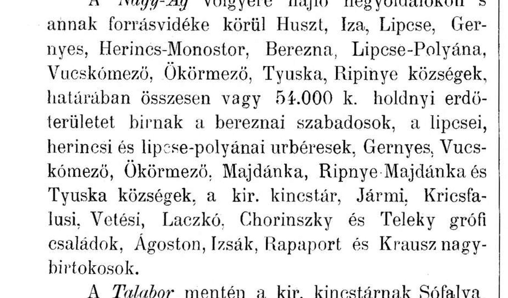
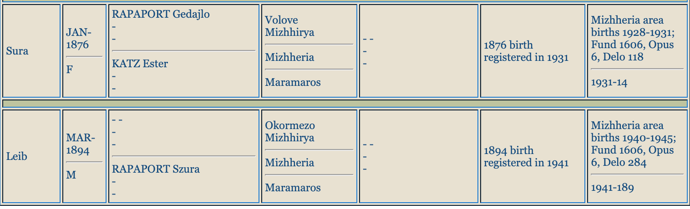
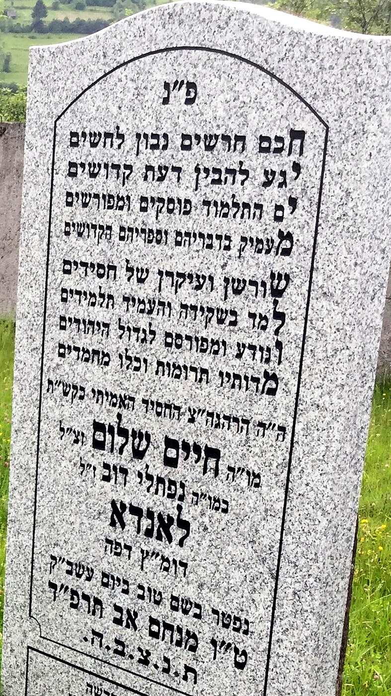
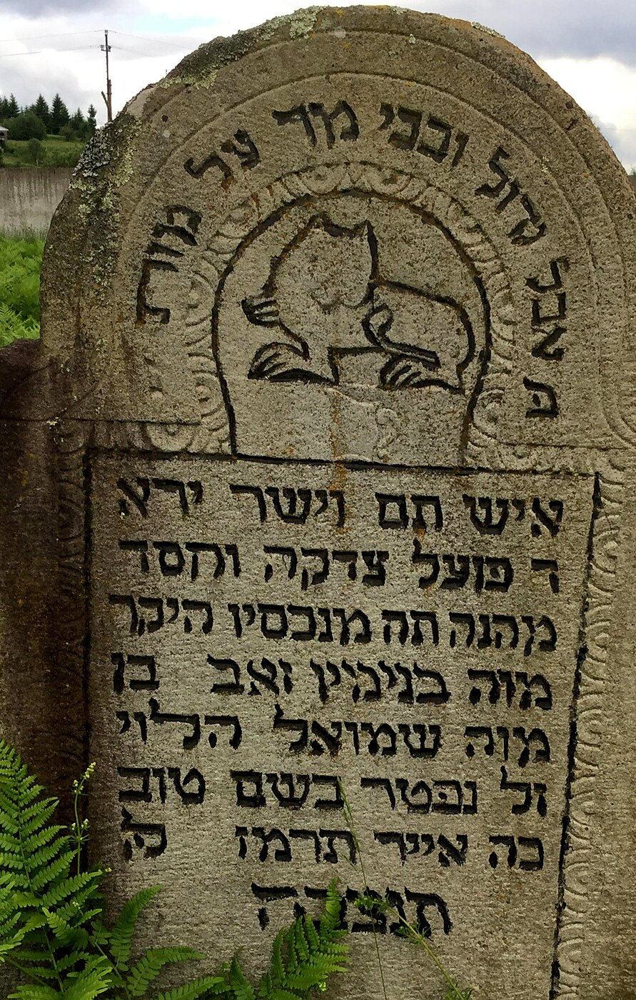
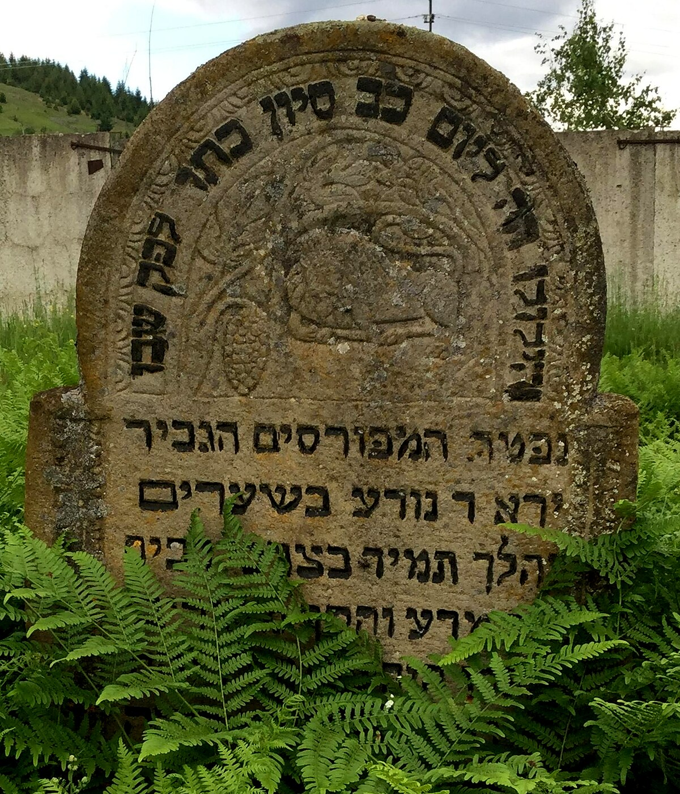
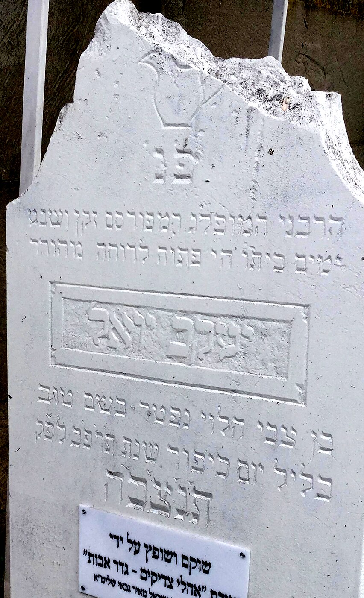
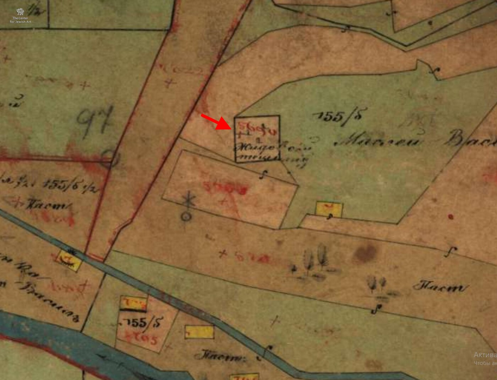
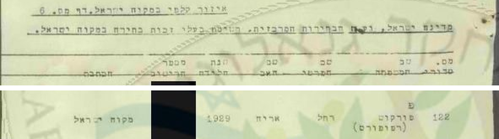
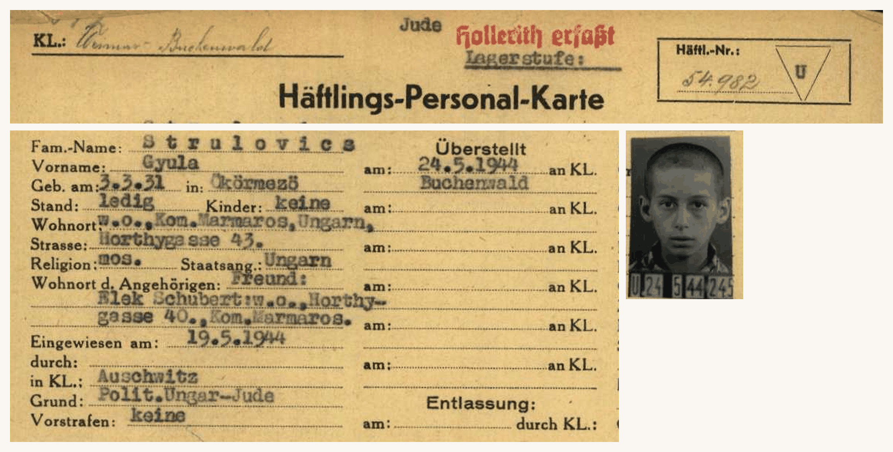
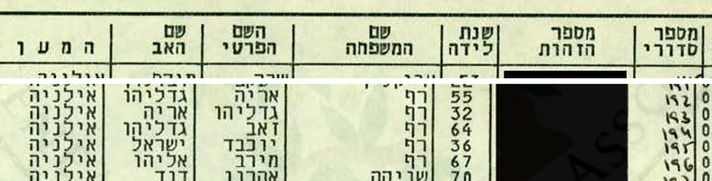

::: lede
**רחל צדוק, שנקראה בבית "רוצי", נולדה ב-16 באפריל 1929 בוולובה שבהרי הקרפטים** — עיירה הונגרית ששמה אוקרמזו (Ökörmező) וכיום מיז'יריה שבאוקראינה. אביה היה סוחר עורות; אמה באה מכפר הררי סמוך; היו לה שני אחים ושתי אחיות. **ב-16 באפריל 1944, יומיים לפני יום הולדתה החמישה-עשר, נאספה המשפחה מביתה.** ארבעה שבועות בגטו, רכבת אחת, וב-19 במאי הם על הרמפה באושוויץ. **מתוך שבע נפשות הבית שרדו שלוש.** רחל עברה את אושוויץ, את שטוטהוף כאסירה מספר 38444, את מחנה העבודה בטורן ואת צעדת המוות; עלתה ארצה ב-1946, נישאה לאברהם צדוק, וחיה בחולון עד פטירתה בינואר 2021.

**מה המסמך הזה עושה.** הוא מנסה לענות, מסמך אחר מסמך, על שאלה אחת: מי בדיוק היו האנשים האלה, ומה בדיוק קרה להם. כל קביעה שבו נשענת על מקור — קישור חיצוני אל הארכיון שממנו נלקח, וקישור פנימי אל עותק שמור שלו כאן. מה שלא אומת מסומן ככזה, בסולם קבוע של ארבע דרגות. מה שנבדק ולא נמצא — נרשם גם הוא.
:::

**מאיפה להתחיל, לפי מה שמעניין אתכם:**

- **רוצים את הסיפור** — [ציר הזמן, מוולובה לחולון](#פרק-ד'-ציר-הזמן-מוולובה-לחולון), ואחריו [סיפור ההצלה של גדליהו](#פרק-ז'-סיפור-ההצלה-של-גדליהו).
- **רוצים לדעת מי קרוב למי** — [עץ המשפחה](#tree) ו[אינדקס האנשים](#people), ואז [עץ המשפחה המורחב](#פרק-ג'-עץ-המשפחה-המורחב) לפירוט דור אחר דור.
- **רוצים לדעת מה באמת הוכח** — [מה מאומת, מה כמעט ודאי, ומה פתוח](#פרק-ח'-מה-מאומת-מה-כמעט-ודאי-ומה-פתוח). זהו הפרק שקובע את מעמדה של כל טענה בדוח.
- **רוצים לבדוק אותנו** — [גלריית המסמכים](#gallery), [אינדקס המקורות](#index), ו[על המחקר: שיטה, מקורות ומגבלות](#פרק-י'-על-המחקר-שיטה-מקורות-ומגבלות).
- **רוצים להמשיך מכאן** — [צעדים פתוחים](#פרק-ט'-צעדים-פתוחים-להמשך-המחקר), מדורגים לפי מה שאפשר לעשות היום ומה מחייב פנייה לארכיון.

---

## פרק א' — מי הייתה רחל: השמות והזהות

שמה המצטבר בכל הרשומות: **רחל ("רוצי") צדוק, לבית סטרולוביץ-רפפורט (וברישום האזרחי: פרקש)**. תאריך לידה: **16.04.1929** (ברשומת הלידה האזרחית: **12.04.1929** — על הפער וההסבר ראו בהמשך הפרק), בוולובה — הוא השם היהודי-צ'כי של העיירה שנקראת היום **מיז'יריה** (ובהונגרית Ökörmező). מדובר באותו מקום בדיוק: "נולדה בוולובה" ו"נולדה במיז'יריה" הן אותה אמירה בשמות מתקופות שונות.

ריבוי השמות הוא מפתח להבנת המסמכים — והמחקר הנוכחי פענח אותו סופית:

- **סטרולוביץ (Strulovits/Sztrulovics; ברשומות הלידה האזרחיות בתעתיק "Struljovic", וברשומת הלידה של גיטה — "Strulovic")** — שם המשפחה מצד האב: סבהּ של רחל היה יעקב סטרולוביץ מקושלובו, בנם של לייב וריבקה סטרולוביץ.
- **רפפורט (Rappaport)** — שם נעוריה של **סבתהּ שרה**, ילידת וולובה, בת למשפחת בעלי האחוזות המקומית. בני המשפחה השתמשו בו לצד סטרולוביץ (ובוולובה — בעיקר בו). התופעה מוכרת ביהדות הקרפטים: נישואים דתיים ללא רישום אזרחי גרמו לכך שילדים נרשמו על שם משפחת האם, ושני השמות נדדו יחד דורות.
- **פרקש (Farkas)** — שם נעורי אמהּ רבקה-רוזה. מאותה סיבה, ברישומים רשמיים (כולל רשומת העדות ביד ושם) רחל מופיעה גם כ"פרקש".
- **צדוק** — שם נישואיה בישראל.

ברשומות שטוטהוף היא רשומה "Strulowits Ruci, ילידת 16.04.**1927**" — יום וחודש מדויקים, שנה "מוקדמת" בשנתיים: הוספת גיל מכוונת בסלקציה, כדי להיראות כשירה לעבודה (היא הייתה בת 15). הדבר מתועד במפורש בעדותה: בסלקציה באושוויץ ענתה רחל שהיא בת 15 — וקאפו נתנה לה מכה, אמרה למנגלה "בת שמונה עשרה", ואחר כך רדפה אחריה: "תזכרי, את בת שמונה עשרה" [01:12:43] (פרק ו'1).

### רשומת הלידה האזרחית של רחל — והפער בן ארבעת הימים

רשומת הלידה האזרחית של רחל עצמה שמורה במאגר JewishGen תחת האיות **"Struljovic"** — התעתיק שבו נרשם שם המשפחה בספרי הלידות האזרחיים (על ההפניה לאיות זה נתונה תודה ללארה דיאמונד, ראשת פרויקט תת-הקרפטים ב-JewishGen):

> **Ruchlja**, נולדה **12.04.1929** בוולובה (Volove/Mizhhirya); האב: **STRULJOVIC Leba**, האם: **FARKAS Rifka**; הערה: "Father claimed paternity" (האב הכיר באבהותו — הרישום המנהלי המקובל לילדי זוגות שנישאו בנישואים דתיים בלבד). מקור: ספר הלידות של אזור מיז'יריה 1928–1931, ארכיון DAZO, **פונד 1606, אופוס 6, דלו 118, רשומה 104/1929**.

*רשומות הלידה האזרחיות של סימה ("Semo", 06.12.1926) ורחל ("Ruchlja", 12.04.1929) — צילום מסך מתוצאות החיפוש "Struljovic" במאגר JewishGen (18.08.2026).*

באותו חיפוש אותרה גם רשומת הלידה של **אחותה סימה**: "Semo, נולדה 06.12.1926 בוולובה", אותם הורים ואותה הערה (דלו 119, רשומה 300/1926).

**הפער בתאריכים — ומה משמעותו:** הרשומה האזרחית נוקבת **12.04.1929**, ואילו כל התיעוד המאוחר — רישומי שטוטהוף (יום וחודש), כרטיס ארולסן, רשומת יד ושם והמסורת המשפחתית — נוקב **16.04.1929**. פער בכיוון דומה — התאריך האזרחי מוקדם מתאריך המסורת — קיים גם אצל סימה, אך בהיקף אחר: הרשומה האזרחית 06.12.1926, מול 26.12.1926 ברישום שטוטהוף. ההסברים האפשריים: התאריך האזרחי הוא המדויק, והמשפחה שימרה תאריך אחר (למשל המרה מתאריך עברי, או יום שנקבע בטעות ברבות השנים); או טעות מפענח באינדקס — אצל סימה במיוחד, היפוך ספרות 06↔26 הוא חשד מתבקש. יוער שהפער אינו יכול להיות תוצאה של רישום מאוחר: רישום באיחור היה מפיק תאריך אזרחי מאוחר מהאמיתי, וכאן הוא המוקדם מבין השניים. הדוח ממשיך לנקוב 16.04.1929 — התאריך שרחל עצמה מסרה כל חייה — בציון הפער; העתק מאושר של הרשומה מ-DAZO (ההפניה המדויקת ידועה כעת) יוכל להכריע.

**רשומת הלידה של גיטה — אותרה מצד האם:** חיפוש "Farkas" במאגר (18.08.2026) העלה גם את רשומת הלידה של האחות הצעירה: "**Gizela**", נולדה **26.03.1936** בוולובה; האב: **STRULOVIC Leopold** מקושלובו, האם: **FARKAS Roza** מקרייניקובו; הערה: "Father claimed paternity" — בדיוק כברשומות של רחל וסימה. מקור: ספר הלידות של אזור מיז'יריה 1934–1937, פונד 1606, אופוס 6, דלו 258 (שורה 86 לשנת 1936) — [תצלום הרשומה](docs/evidence/jewishgen_gita_gizela_1936_birth_zoom.png). שם האב נרשם כאן בתעתיק שלישי — "Strulovic" — ולכן הרשומה חמקה מסריקות שני הסלים הקודמים.

**מה עדיין אינו באינדקס:** סריקה חוזרת ומלאה של שני "הסלים הפונטיים" (466 רשומות בסל "Strulovits" — מהן 252 רשומות לידה — ו-5 רשומות בסל "Struljovic", 18.08.2026) העלתה שאין באינדקס רשומות לידה לדב (~1924) ולגדליה (03.03.1931) — אף שספרי מיז'יריה מפוענחים לפחות עד 1931 (ולשנים 1934–1937). ייתכן שנרשמו באיחור, בספרים שטרם פוענחו, או כלל לא. אגב הסריקה תועדו בוולובה גם לידות לאימהות אחרות לבית סטרולוביץ — פאני/פייגה (נשואה לאלתר באומגרטן) ושרה/לנקה (נשואה לפנחס נוימן), ילדים ילידי 1922–1930 (דלו 84/110; [תצלום](docs/evidence/jewishgen_strulovits_volove_other_families_zoom.png)) — קרובות משפחה אפשריות של לייב שטרם זוהו.

---

## פרק ב' — העיירה: וולובה / Ökörmező / מיז'יריה

העיירה נקראה בפי יהודיה **וולובה** (יידיש: Volovo), בהונגרית **Ökörmező** ("שדה השוורים"), בצ'כית **Volové**, והיום **מיז'יריה (Міжгір'я)**, מחוז זקרפטיה, אוקראינה — עיירה הררית על נהר הריקה, כ-60 ק"מ צפונית לחוסט. (לא להתבלבל עם **וולובץ/Volóc** — עיירה אחרת.)

### הקהילה היהודית

יהודים בוולובה מאמצע המאה ה-18: 11 נפשות ב-1768, 130 ב-1830, 269 ב-1877, 766 ב-1921 — ו-**942 ב-1941**. קהילה חסידית דוברת יידיש, עם בית כנסת (בספרות הקהילה מוזכרים שניים), מקווה ובית עלמין הקיים עד היום. כתבה בשבועון היהודי-הונגרי **"Egyenlőség" מ-7 במאי 1911** מונה בעיירה **120 משפחות יהודיות** ומפרטת את משלחי ידן: 24 עגלונים, 18 פועלי יום, 18 חנוונים, 15 בעלי משק זעיר, 7 חייטים, 7 מוזגים, 5 סנדלרים, 5 סוחרי עצים, 5 בנאים, 3 קצבים, 2 שענים, 2 אופים, ואחד מכל אחד מאלה: נפח, נגר, פחח, כורך ספרים וסוחר יין ([העמוד המקורי](docs/arcanum_full/egyenloseg_1911-05-07_p2_okormezo_120_families.pdf) · [בצפיין Arcanum](https://adt.arcanum.com/en/view/Egyenloseg_1911_1/?pg=389)). בהונגרית: "kitűnik, hogy Ökörmezőn lakik 120 zsidó család" — "מתברר שבאוקרמזו מתגוררות 120 משפחות יהודיות". הכתבה נכתבה כהגנה על יהודי הוורחובינה מפני עלילת ה"כוזרים" המלווים בריבית, והיא מוסרת גם שמתוך 958 משפחות יהודיות בכל אזור ההר, מאה היגרו לאמריקה.

ב-1921: 39 מ-45 החנויות בעיירה בבעלות יהודית, 23 בעלי מלאכה, בנק וכמה בתי חרושת ([KehilaLinks מיז'יריה](https://kehilalinks.jewishgen.org/Mizhhirya/)). ולצדם **"אגודת האשראי היהודית" של אוקרמזו** — שרישומה בעיתון הרשמי ההונגרי (Központi Értesítő, 26.11.1942) אותר במלואו: "Zsidó Hitelszövetkezet, Ökörmező" ("אגודת אשראי יהודית, אוקרמזו"), נוסדה באספה מכוננת ב-11.03.1923, נרשמה מחדש בבית המשפט המלכותי בחוסט ב-19.11.1941 בעקבות צו ראש הממשלה 6060/1939, ומטרתה בלשון התקנון: <bdi dir="ltr">"a kizárólag zsidó tagok anyagi helyzetének javítása"</bdi> — "שיפור מצבם החומרי של חבריה, שכולם יהודים". ברשימת ההנהלה שבהודעה: ציקרמן זולטן, דוידוביץ' איגנץ, לנדאו יוסף, כץ איגנץ, ד"ר רקוש ינו, שפר אברהם ונוימן שנדור מאוקרמזו, גרינברג הרמן ממיידנקה, גרוס שלמה מאלשוהידגפטק וחיימוביץ' הרמן מטורוניה; ההודעות פורסמו ב"עיתון יהודי הונגריה" או ב"עיתון היהודי האורתודוקסי", ובשמות הצ'כוסלובקיים הקודמים — "Židovské úvěrní družstvo ve Volovém" ("אגודת האשראי היהודית בוולובה") ([העמוד המקורי](docs/arcanum_full/kozponti_ertesito_1942-11-26_zsido_hitelszovetkezet_okormezo.pdf) · [בצפיין Arcanum](https://adt.arcanum.com/en/view/Kozponti_Ertesito_1942_2/?pg=1097)).

נתוני האוכלוסייה, מניין בתי הכנסת, נתוני 1921 ורשימת רבני העיירה שלהלן מובאים מספרות הקהילה ([עלון יוצאי קרפטורוס](docs/carpati_alon_137_he.pdf) ו[KehilaLinks מיז'יריה](https://kehilalinks.jewishgen.org/Mizhhirya/)) ולא ממסמך מקור שאותר בתיק זה — **טעונים אימות**.

רבני העיירה (מספר מרמרוש): ר' אהרן מאיר פרידלנדר, ר' אלכסנדר צבי קלינברג, ר' מרדכי אליעזר ובר, ר' ישראל יעקב יוקל טייטלבוים ("הרב מוולובה", כיהן 1894–1924), בנו ר' אהרן (נרצח 25.05.1944) ונכדו ר' יצחק (נספה 11.04.1945).

### משפחת רפפורט — מבעלי הקרקעות הגדולים של העיירה

העיתונות והמרשמים ההונגריים מתעדים ברצף את אחוזת רפפורט באוקרמזו לאורך יותר מ-40 שנה:

| שנה | תיעוד | מקור |
|---|---|---|
| 1893 | "Rapaport Gedajlo" — אחוזה של **2,174 הולד** (≈ 1,250 הקטר ≈ 12,500 דונם). טורי המרשם: 1,672 יער · 340 מרעה · 66 שטח בלתי-מניב · 56 אחו · 38 שדה חרוש (טורי הגן, הכרם והקנים ריקים). סכום הטורים 2,172 — שניים פחות מהסך המודפס; כותרת הטבלה מציינת "kikerekitve" ("מעוגל") | מרשם בעלי הקרקעות של הונגריה 1893, עמ' 408 · [העמוד המקורי](docs/arcanum_full/gazdacimtar_1893_p408_gedajlo_okormezo.pdf) · [בצפיין Arcanum](https://adt.arcanum.com/en/view/CimtarakTelefonkonyvek_MagyarorszagGazdacimtara_1893/?pg=415) |
| 1896 | ביערות שסביב אוקרמזו — 54,000 הולד (≈ 310,800 דונם) המוחזקים במשותף בידי כלל בעלי האזור — נמנים בין ארבעת בעלי הקרקע הפרטיים הגדולים "אגושטון, איז'ק, **רפפורט** וקראוס", לצד אוצר המלוכה, הכפרים ומשפחות האצולה יארמי, קריצ'פלושי, וטשי, לצקו, חורינסקי וטלקי | Edvi Illés Sándor, *A magyar királyi államvasutak … áruforgalmi viszonyai* 2 (בודפשט 1896), עמ' 13 · [העמוד המקורי](docs/arcanum_full/mav_aruforgalmi_1896_p13_erdogazdasag_rapaport.pdf) · [בצפיין Arcanum](https://adt.arcanum.com/en/view/Books_18_Gazdasagtortenet_1082_Magyar_kiralyi_allamvasutak_aruforgalmi_viszonyai_2_1063/?pg=24) |
| 1897 | "Rappaport Gedálya, בעל קרקע (tulajdonos)", אוקרמזו — במפקד המשקים החקלאיים | Gazdacímtár 1897 (הסטטיסטיקה החקלאית של כתר הונגריה), מחוז אוקרמזו · [העמוד המקורי](docs/arcanum_full/gazdacimtar_1897_okormezo_jaras_gedalya.pdf) · [בצפיין Arcanum](https://adt.arcanum.com/en/view/MagyKorOrszMezogazdStat_2/?pg=369) |
| 1897 | מכירה פומבית נגד רכושו (ספר האחוזה מס' 1370 באוקרמזו); אשתו מגישה הצעת נגד | Budapesti Közlöny 10.12.1897 · [העמוד המקורי](docs/arcanum_full/budapesti_kozlony_1897-12-10_arveres_1370.pdf) · [בצפיין Arcanum](https://adt.arcanum.com/en/view/BudapestiKozlony_1897_12/?pg=43); הידיעה גם ב-Magyar Ujság 08.12.1897 · [העמוד](docs/arcanum_full/magyar_ujsag_1897-12-08_arveres.pdf) · [בצפיין Arcanum](https://adt.arcanum.com/en/view/MagyarUjsag1891_1897_12/?pg=117) |
| 1900 | "Rappaport Gedálya" — 3,810 הולד (כ-2,190 הקטר ≈ 21,900 דונם) | מרשם בעלי הקרקעות 1899–1900 · [העמוד המקורי](docs/arcanum_full/foldbirtokosok_1899-1900_gedalya_3810hold.pdf) · [בצפיין Arcanum](https://adt.arcanum.com/en/view/CimtarakTelefonkonyvek_MagyarorszagGazdacimtara_1899-1900/?pg=290) |
| 1910 | "רפפורט גדיילו נפטר לא מכבר, ובספרי האחוזה של אוקרמזו רשומות על שמו 120 חלקות" | Görög katholikus szemle 25.12.1910 · [העמוד המקורי](docs/arcanum_full/gorog_kath_szemle_1910-12-25_gedajlo_death_120plots.pdf) · [בצפיין Arcanum](https://adt.arcanum.com/en/view/Beregszasz_GorogKatholikusSzemle_1910_07-12/?pg=199); הכתבה הארצית שקדמה לה — Budapesti Hírlap 23.12.1910 · [העמוד](docs/arcanum_full/budapesti_hirlap_1910-12-23_verchovina_polemic.pdf) · [בצפיין Arcanum](https://adt.arcanum.com/en/view/BudapestiHirlap_1910_12/?pg=757) |
| 1912 | "**יורשי** רפפורט גדיילו" (Rappaport Gedajló örök.) — 2,176 הולד, אוקרמזו; ולצדם "**האלמנה** רפפורט גדיילו" (Özv. Rappaport Gedajlóné) — 435 הולד | מרשם המשקים Gazdacímtár 1912, עמ' 444 · [העמוד המקורי](docs/arcanum_full/gazdacimtar_1912_p444_gedajlo_orokosok_ozvegy.pdf) · [בצפיין Arcanum](https://adt.arcanum.com/en/view/CimtarakTelefonkonyvek_MagyarorszagGazdacimtara_1912/?pg=461) |
| 1928 | האחוזה הגדולה באוקרמזו (וולובה): 4,515 הקטר (≈ 45,150 דונם), מהם 2,573 הקטר יער (≈ 25,730 דונם) — בבעלות **Krausz, Farkas, Rappaport** | לשכת הקרקעות הצ'כוסלובקית ([מאמר Koblasa — שמור בתיקייה](docs/koblasa_1928_estates_podkarpatska_rus.pdf)) |

*מקורות הטבלה: המרשמים והעיתונות ההונגרית — בארכיון העיתונות [Arcanum/ADT](https://adt.arcanum.com); סריקות העמודים המלאות הורדו במנוי ושמורות ב[תיקיית עמודי המקור](docs/arcanum_full/gazdacimtar_1893_p408_gedajlo_okormezo.pdf) ומקושרות מכל שורה. שורת 1928 — מאמר Koblasa ([המאמר בתיקייה](docs/koblasa_1928_estates_podkarpatska_rus.pdf) · [תצלום השורה](docs/evidence/koblasa_1928_row_zoom.png) · [PDF במקור](https://www.nacr.cz/wp-content/uploads/2024/04/PH_23_2_2015_Koblasa.pdf)). מרשם 1912 — המסמך היחיד המתעד ישירות את חלוקת האחוזה אחרי מות גדליה (1908/9): הקרקע רשומה על שם היורשים והאלמנה.*

<em>הפרק "ERDŐGAZDASÁG" (משק היער) בסקר תנועת הסחורות של רכבות המדינה ההונגריות, 1896 — [העמוד המלא](docs/arcanum_full/mav_aruforgalmi_1896_p13_erdogazdasag_rapaport.pdf). בהונגרית: <bdi dir="ltr">"A Nagy-Ág völgyére hajló hegyoldalokon s annak forrásvidéke körül Huszt, Iza, Lipcse, Gernyes, Herincs-Monostor, Berezna, Lipcse-Polyána, Vucskómező, **Ökörmező**, Tyuska, Ripinye községek határában összesen vagy 54.000 k. holdnyi erdőterületet birnak … a kir. kincstár, Jármi, Kricsfalusi, Vetési, Laczkó, Chorinszky és Teleky grófi családok, Ágoston, Izsák, **Rapaport** és Krausz nagybirtokosok"</bdi> — ובעברית: "במורדות ההרים הפונים לעמק הנאג'-אג' ובסביבת מעיינותיו, בתחומי הכפרים חוסט, איזה, ליפצ'ה, גרניש, הרינץ'-מונוסטור, ברזנה, ליפצ'ה-פוליאנה, ווצ'קובו, **אוקרמזו**, טיושקה וריפינייה, מחזיקים בסך הכול כ-54,000 הולד קדסטרליים של יער … אוצר המלוכה, משפחות הרוזנים יארמי, קריצ'פלושי, וטשי, לצקו, חורינסקי וטלקי, ובעלי הקרקע הגדולים אגושטון, איז'ק, **רפפורט** וקראוס". שלוש הערות: (א) שכבת ה-OCR של Arcanum קוראת כאן "540.000" — בסריקה עצמה כתוב בבירור **54.000**, וזה הנתון שאומץ; (ב) 54,000 ההולד הם הסך הכולל של יערות אחד-עשר הכפרים שברשימה, המוחזקים בידי כל הבעלים יחד — לא שטח אחזקתו של אף בעל בודד; הרשימה מלמדת על **מיקומו החברתי** של הענף (בשורה אחת עם אוצר המלוכה ועם משפחות רוזנים), לא על גודלו; (ג) המקור נוקב בשם המשפחה בלבד, "Rapaport", בלי שם פרטי. הזיהוי עם גדליה הוא **ככל הנראה**: אוקרמזו מופיעה באותה רשימה, ובמרשמי 1893, 1897 ו-1899–1900 אין באוקרמזו בעל קרקע אחר בשם רפפורט. באותו עמוד, בפסקת עמק הטלבור, מופיע **מיהלקה** — כפר משפחת האם.</em>

*הערת קנה מידה והמרה: בהונגריה שימשו היסטורית שתי מידות "הולד" — ההולד ההונגרי הישן (1,200 עמות מרובעות ≈ 4,316 מ"ר) וההולד הקדסטרלי (1,600 עמות = 5,755 מ"ר ≈ 5.75 דונם). המרשמים כאן נוקבים במפורש בהולד הקדסטרלי — בכותרת הטבלה של מרשם 1893 כתוב "Kataszteri holdakban (kikerekitve)" (ראו [העמוד המקורי](docs/arcanum_full/gazdacimtar_1893_p408_gedajlo_okormezo.pdf) · [בצפיין Arcanum](https://adt.arcanum.com/en/view/CimtarakTelefonkonyvek_MagyarorszagGazdacimtara_1893/?pg=415)); מכאן 2,174 הולד ≈ 12.5 קמ"ר ו-3,810 הולד ≈ 22 קמ"ר (וגם לפי המידה הישנה הקטנה — סדר הגודל דומה). ההיקפים גדולים אך אופייניים לאחוזות יער הרריות בקרפטים — כמעט כל השטח יער ומרעה, לא קרקע חקלאית: באותו עמוד עצמו של מרשם 1893 רשומים בכפר גם קהילת אוקרמזו (6,684 הולד) ואוצר המדינה (3,267 הולד), ואחוזת רפפורט (2,174) גדולה משל משפחת הרוזן טלקי (573) ומשל קראוס דוד (1,574) — הגדולה בין בעלי הקרקע הפרטיים. אחוזת 1928 (45,150 דונם) אינה של רפפורט לבדם אלא משותפת לשלוש משפחות (קראוס, פרקש, רפפורט), ורובה יער.*

**הרשומות האזרחיות (ספרי מיז'יריה, [מאגר הונגריה של JewishGen](https://www.jewishgen.org/databases/hungary/)) קובעות: גדליה רפפורט היה אביה של שרה, סבתה של רחל.** זו החוליה שמחברת את רחל אל שושלת האחוזות שבטבלה לעיל, ולכן היא מוצגת כאן בראיה עצמה:

<em>שתי שורות מאינדקס הלידות של מיז'יריה ([מאגר הונגריה, JewishGen](https://www.jewishgen.org/databases/hungary/); פונד 1606 בארכיון DAZO). למעלה: "Sura", ינואר 1876, וולובה — בת **Rapaport Gedajlo** ו-**Katz Ester**. למטה: "Leib", מרס 1894, אוקרמזו — בן **Rapaport Szura**. שתי הרשומות יחד קושרות את אריה-לייב, אביה של רחל, אל אחוזת גדליה. (תוצאות החיפוש ב-JewishGen אינן ניתנות לקישור קבוע; המסמך המחייב הוא הרשומה עצמה בארכיון DAZO.)</em>

אלה הפרטים המלאים העולים מהרשומות:

- **גדליה (Gedajlo/Gedálya) רפפורט נולד ב-01.04.1846 באוקרמזו** (כך ברישום האזרחי המאוחר של נישואיו, 1903), בן **משה (Mozes) רפפורט ויֶנטה לבית שפיגל (Spiegel)** — דור נוסף אחורה, אל תחילת המאה ה-19. ברשומה נרשם "בעל אחוזה" (foldbirtokos/Homesteader).
- גדליה נשא שלוש נשים: **ריבקה לבית גרוסמן** (בתם **שיינדל נולדה 15.10.1869**, נישאה ללזר זיסוביץ — ומכאן משפחת זיסוביץ-רפפורט של וולובה); **אסתר לבית כץ (Katz Ester)** — אמם של **שרה ("Sura", ינואר 1876 — סבתה של רחל!)** ושל **נתן (Nuszen Nathan, 12.11.1879**, סוחר עצים); וב-06.08.1884, בקרצ'ונפלבה (Karácsonyfalva) שבמרמרוש — **מינדל (Mindje) לבית ברקוביץ** (בנם יוסף-דוד, נ' 16.10.1891, זוהה בדף עד הנוקב בשמות שניהם — ראו להלן), ילידת 04.01.1865 (נפטרה לפני אוגוסט 1944 — מצוינת "המנוחה" בהודעת ה"מבוקש" נגד בנה מאיר, ראו בהמשך), שילדה לו את **אלדר (נובמבר 1885 — "בעל קרקע", הוא "רפפורט אלדר" ממועצת בנק החיסכון!), ברטה (05.02.1889), פרידריקה (20.12.1894), זלמן (08.03.1897), הרמן (01.04.1904, נפטר בן 7 שבועות) ומאיר (28.01.1908)**.
- **גדליה נפטר בין 1908 ל-1909**: בנו האחרון נולד בינואר 1908, ובין דצמבר 1909 לפברואר 1911 נולדו **שלושה נכדים ששמם גדליה** — בן לשיינדל וזיסוביץ (20.12.1909), בן לנתן (05.06.1910) ובן לשרה ויעקב (02.02.1911) — מנהג האשכנזים לקרוא על שם סב שנפטר. זה מתלכד עם הידיעה בעיתונות מדצמבר 1910: "רפפורט גדיילו נפטר לא מכבר... 120 חלקות על שמו".
- השם "גדליה" חוזר מאז בכל ענף: אחיו של אריה גדליה (1911), אחיה של רחל גדליה (1931), בן-הדוד גדליה בן מנדל (1936) — כולם על שם אבי השושלת.
- **מאיר, בן הזקונים — הודעת ה"מבוקש" מ-1944:** בעלון החיפושים המשטרתי Bűnügyi Körözések Lapja (גיליון 39, 23.09.1944, עמ' 1188) פרסם בית המשפט המלכותי בחוסט שתי הודעות סמוכות. **הודעה 8678** — <bdi dir="ltr">"Rapaport Májer alaposan gyanúsítható zsarolás vétségével"</bdi> ("רפפורט מאיר חשוד באופן מבוסס בעבירת סחיטה"): נולד אוקרמזו, 28.01.1908; שפותיו הונגרית, רותנית ויידיש; דתו ישראלית; נשוי ל**רוזה לבית נוילינגר**; מקצועו **טכנאי שיניים**; אביו "néhai Rapaport Gedejlan" (רפפורט גדיילן **המנוח**) ואמו "néhai Berkovics Mengye" (ברקוביץ מנגייה [מינדל] **המנוחה**) — ומכאן ש**מינדל נפטרה לפני אוגוסט 1944**. **הודעה 8679 — אשתו רוזה** (נ' חוסט 13.09.1912, עקרת בית, שמות הוריה "לא ידועים") — נחשדת באותה עבירה. מספר התיק (1942.B.1936) מלמד שהפרשה נפתחה עוד ב-1942; הצו הוצא ב-**14.08.1944** ופורסם ב-23.09.1944 — חודשים אחרי שיהודי המחוז כבר גורשו: בית המשפט ההונגרי המשיך לרדוף על הנייר אנשים שלא היו עוד. [העמוד המקורי](docs/arcanum_full/bkl_1944-09-23_p1188_korozes_rapaport_majer.pdf) · [תצלום שתי ההודעות](docs/evidence/bkl_1944_korozes_rapaport_majer_neulinger_roza_zoom.png) · [בצפיין Arcanum](https://adt.arcanum.com/hu/view/BunugyiKorozesekLapja_1944/?query=Rapaport&pg=1185&layout=s)

רפפורטים נוספים בחיי הכלכלה של העיירה — כולם ממוקמים במשפחה. לצד כל קביעה: המקור המדויק (ארכיון העיתונות Arcanum), ומתחתיה תצלום קטע המקור (הקבצים ב-[docs/evidence/](docs/evidence/arcanum_gedajlo_death_1910_gorog_szemle_zoom.png)).

**סריקות המקור המלאות:** עמודי המקור ההונגריים שצוטטו בפרק זה הורדו במלואם מארכיון [Arcanum/ADT](https://adt.arcanum.com) (במנוי) ושמורים ב[תיקיית עמודי המקור](docs/arcanum_full/gazdacimtar_1893_p408_gedajlo_okormezo.pdf) — **19 עמודי PDF** באיכות מלאה; ליד כל קביעה בהמשך מופיעים קישור לעמוד השמור וקישור ישיר לעמוד בצפיין Arcanum.

**רפפורט אלדר** (בנו של גדליה, כאמור) — בחבר המנהלים המייסד של "בנק החיסכון של אוקרמזו בע"מ" (Ökörmezői Takarékpénztár Rt., נוסד 15.09.1910, הון יסוד 100,000 כתר): רישום הייסוד ב-Központi Értesítő (עיתון מרשם החברות), 09.10.1910, מונה אותו בין שמונת חברי הדירקטוריון · [העמוד המקורי](docs/arcanum_full/kozponti_ertesito_1910-10-09_takarekpenztar_founding.pdf) · [בצפיין Arcanum](https://adt.arcanum.com/en/view/Kozponti_Ertesito_1910_2/?pg=823); וכך גם שנתון Mihók-féle Magyar Compass 38/2 לשנת 1910/11, עמ' 1146 · [העמוד המקורי](docs/arcanum_full/mihok_compass_1910-11_p1146_okormezo_takarekpenztar.pdf) · [בצפיין Arcanum](https://adt.arcanum.com/en/view/MagyarCompass_1910_2/?pg=1173). בהמשך התקדם: שנתוני Magyar Pénzügyi Compass מתעדים אותו כ-**"vezérigazgató" — מנכ"ל הבנק הכלכלי של נאג'סלש** (Nagyszőllősi közgazdasági bank rt., נוסד 1912) — הן ב-1915 (עמ' 645 · [העמוד המקורי](docs/arcanum_full/penzugyi_compass_1915_p645_nagyszollosi_bank.pdf) · [בצפיין Arcanum](https://adt.arcanum.com/en/view/MagyarPenzugyiCompass_1915_2/?pg=698)) הן ב-1917–18 (עמ' 678 · [העמוד המקורי](docs/arcanum_full/penzugyi_compass_1917-18_p678_nagyszollosi_bank.pdf) · [בצפיין Arcanum](https://adt.arcanum.com/en/view/MagyarPenzugyiCompass_1917-1918_2/?pg=737)); בבנק החיסכון של אוקרמזו עצמו כיהן באותה עת כמנכ"ל קון אדולף · [העמוד המקורי](docs/arcanum_full/penzugyi_compass_1917-18_p739_okormezoi_takarekpenztar.pdf) · [בצפיין Arcanum](https://adt.arcanum.com/en/view/MagyarPenzugyiCompass_1917-1918_2/?pg=798). ב-1909 נשא בחוסט את חוה-אווה וייס — ואחיו נתן נשא ב-1906 את אחותה ברטה וייס (רשומות הנישואים — JewishGen, ספרי חוסט).

<em>רישום הייסוד המקורי, Központi Értesítő 09.10.1910 (לחיצה — עמוד המקור המלא). בהונגרית: <bdi dir="ltr">"Ökörmezői Takarékpénztár Részvénytársaság... Főtelep: Ökörmező... A jelenlegi igazgatóság tagjai: Grodzky Szaniszló, Kohn Adolf, Kirschenbaum Benő, Steinberg Ábris, **Rapaport Aladár**, Thegze Géza, Weiszkopf Benjamin és Wolf Hersko Léba"</bdi> — ובעברית: "בנק החיסכון של אוקרמזו, חברת מניות... המושב הראשי: אוקרמזו... חברי הדירקטוריון הנוכחיים: גרודזקי סניסלב, קון אדולף, קירשנבאום בנו, שטיינברג אבריש, **רפפורט אלדר**, תגזה גזה, וייסקופף בנימין ווולף הרשקו לייבה". החברה נוסדה באסיפה המכוננת של 15.09.1910; הון היסוד — 100,000 כתר.</em>

*שנתון Mihók-féle Magyar Compass 1910/11, ערך 55 (לחיצה — עמוד המקור המלא). בהונגרית: <bdi dir="ltr">"55. Ökörmező. — Ökörmezői takarékpénztár részvénytársaság (1910–1960). Alaptőke: 100,000 K... Igazgatóság: ...Rapaport Aladár... Alapszab.: 1910 szeptember 15"</bdi> — ובעברית: "55. אוקרמזו. — בנק החיסכון של אוקרמזו, חברת מניות. הון יסוד: 100,000 כתר... דירקטוריון: ...רפפורט אלדר... התקנון: 15 בספטמבר 1910".*

<em>שנתון Pénzügyi Compass 1915, עמ' 645 (לחיצה — עמוד המקור המלא). בהונגרית: <bdi dir="ltr">"Nagyszőllősi közgazdasági bank rt. (1912) — Alaptőke 100,000 K... Igazgatóság: Abkarovits Alajos, Herman Lébi, Klein Zsigmond (Bilke), **Rapaport Aladár (vezérigazgató)**... Felügyelő-biz.: dr. Káhán Lajos (Msziget), Sáfár Samu (Ökörmező), **Rapaport Dezső, Ökörmező**"</bdi> — ובעברית: "הבנק הכלכלי של נאג'סלש בע"מ (נוסד 1912) — הון יסוד 100,000 כתר... דירקטוריון: ...**רפפורט אלדר (מנכ"ל)**... ועדת הפיקוח: ...**רפפורט דז'ה, אוקרמזו**".</em>

**רפפורט דז'ה (Dezső)**, תושב אוקרמזו — נושא משרה באותו בנק נאג'סלשי שאלדר עמד בראשו: ב-1915 בוועדת הפיקוח (Felügyelő-bizottság; עמ' 645 · [העמוד המקורי](docs/arcanum_full/penzugyi_compass_1915_p645_nagyszollosi_bank.pdf) · [בצפיין Arcanum](https://adt.arcanum.com/en/view/MagyarPenzugyiCompass_1915_2/?pg=698)), וב-1917–18 כבר בדירקטוריון (Igazgatóság; עמ' 678 · [העמוד המקורי](docs/arcanum_full/penzugyi_compass_1917-18_p678_nagyszollosi_bank.pdf) · [בצפיין Arcanum](https://adt.arcanum.com/en/view/MagyarPenzugyiCompass_1917-1918_2/?pg=737)); מופיע כעד בחתונת פרידריקה בת גדליה (1914, רשומת הנישואים) — ככל הנראה בן משפחה קרוב, אולי בן נוסף של גדליה.

<em>שנתון Pénzügyi Compass 1917–18, עמ' 678 (לחיצה — עמוד המקור המלא). בהונגרית: <bdi dir="ltr">"Igazgatóság: ...Rapaport Aladár (vezérigazgató)... Weisz Dávid (Szatmár), **Rapaport Dezső**. Felügyelő-biz.: Sáfár Samu (Ökörmező), Tar Zoltán (elnök), Kohn Adolf (Ökörmező), Székely Adolf. (Közgy. 1917 jun. 29.)"</bdi> — ובעברית: "דירקטוריון: ...רפפורט אלדר (מנכ"ל)... וייס דוד (סאטמר), **רפפורט דז'ה**. ועדת הפיקוח: שפר שמו (אוקרמזו), טר זולטן (יו"ר), קון אדולף (אוקרמזו), סקיי אדולף. (האסיפה הכללית: 29 ביוני 1917)".</em>

**רפפורט שאול** — בדירקטוריון (Igazgatóság) ובוועדת הפיקוח של **חברת רפסודות העצים של גדות הטיסה** (Tiszavidéki tutajtársulat rt., מרמרוש-סיגט; נוסדה 1911), שאתריה (Telepek) **באוקרמזו ובמיידנקה** ובה כ-200 פועלים והון של 300,000 כתר: Nagy Magyar Compass 43/2 לשנת 1916 (עמ' 430, מדור "Iparos-részvénytársulatok" — חברות מניות תעשייתיות · [העמוד המקורי](docs/arcanum_full/nagy_magyar_compass_1916_p430_tutajtarsulat_saul.pdf) · [בצפיין Arcanum](https://adt.arcanum.com/en/view/MagyarCompass_1915_2/?pg=434)) ו-46-47/2 לשנת 1920 (עמ' 581 · [העמוד המקורי](docs/arcanum_full/nagy_magyar_compass_1920_p581_tutajtarsulat_saul.pdf) · [בצפיין Arcanum](https://adt.arcanum.com/en/view/MagyarCompass_1918_2/?pg=594)) — זיהוי החברה הושלם עם הורדת העמודים המלאים. קשרו המשפחתי של שאול לגדליה לא הוכח: הוא אינו בין ילדי גדליה שברשומות. חיפוש רשומת לידה עבורו העלה מועמד — **"Soel", נ' 03.11.1873 במרמרוש-סיגט, בן יוסל (Joszel) ומרים רפפורט** (מאגר לידות מרמרוש, JewishGen; [תצלום הרשומה](docs/evidence/jewishgen_rapaport_soel_1873_sziget_zoom.png)); ההתאמה למושב החברה (מרמרוש-סיגט) מרמזת שמדובר בענף רפפורט של סיגט, לא בענף האוקרמזואי — הזיהוי טעון אימות.

<em>שנתון Nagy Magyar Compass 1916, עמ' 430, מדור "חברות מניות תעשייתיות" (לחיצה — עמוד המקור המלא). בהונגרית: <bdi dir="ltr">"Ökörmező, Majdánka — 200 munkás — Alaptőke: 300,000 K... Igazgatóság: Klein Móricz... Hoffmann Bernát, **Rapaport Saul**, dr. Fuchs Lajos. Felügyelő-bizottság: Friedländer Henrik, Klein Manó, **Rapaport Saul**"</bdi> — ובעברית: "[אתרי החברה:] אוקרמזו, מיידנקה — 200 פועלים — הון יסוד: 300,000 כתר... דירקטוריון: ...**רפפורט שאול**, ד"ר פוקש לאיוש. ועדת הפיקוח: ...**רפפורט שאול**". (הרישום זהה גם במהדורת 1920, עמ' 581 · [העמוד](docs/arcanum_full/nagy_magyar_compass_1920_p581_tutajtarsulat_saul.pdf) · [בצפיין Arcanum](https://adt.arcanum.com/en/view/MagyarCompass_1918_2/?pg=594).)</em>

**סלומון (Salamon, ובעברית שלמה) רפפורט, יליד 1856 וולובה** — אפשר שאחיו של גדליה, טעון אימות — קיים ענף מקביל בעיירה (נשותיו פרל וייס ושורה אייזלר; ביתו תועד במפקד 1921, בית 127 — JewishGen/Hungaricana). ובדור קודם: **חיה רפפורט, ילידת ~1836 אוקרמזו, בת מוסקו (משה?) רפפורט ומלכה לבית סטרולוביץ** (רשומת פטירתה, 1904 — JewishGen; [תצלום המקור](docs/evidence/jewishgen_rapaport_chaja_okormezo_1904_zoom.png)) — עדות לקשרי רפפורט-סטרולוביץ עוד בדור שלפני יעקב ושרה. חיזוק עצמאי נוסף: **יוסף-דוד רפפורט, יליד וולובה 16.10.1891**, שגורש מסלובקיה באפריל 1942, נרשם באושוויץ כאסיר 33088 ונספה ב-26.05.1942. בדף העד שהוגש עליו רשומים **שני** הוריו: אביו **"גדלי" (Gedali)** ואמו **"מינדה לבית ברקוביץ" (Minda Berkovic)** ([הרשומה ביד ושם](https://collections.yadvashem.org/en/names/5380436) · [הרשומה בתיקייה](docs/yadvashem_records/name_5380436.json)) — בדיוק זוג ההורים שגדליה ומינדל ברקוביץ מהווים מאז נישואיהם ב-1884, ושנת לידתו נופלת בתוך טווח לידותיהם (1885–1908). זהו אפוא **בן נוסף של גדליה ומינדל — כמעט ודאי** (פרק ח').

גם הידיעה על מות גדליה שמורה במקורה: **"Görög katholikus szemle" (הביטאון הגרקו-קתולי, אונגוואר), גיליון 25.12.1910**.

<em>עמוד המקור (לחיצה — העמוד המלא), מתוך המאמר "Hegyvidéki emberek — A hogy rabolnak" ("אנשי ההר — איך שודדים"; טור אנטישמי נגד "הכוזרים"). בהונגרית: <bdi dir="ltr">"**Rappaport Gedajló** például nemrég halt meg s az ökörmezői telekkönyvben összeszámolom: pont százhusz ruthén föld, ennyi betétszám maradt a gyermekeire"</bdi> — ובעברית: "**רפפורט גדיילו**, למשל, נפטר לא מכבר — ובספר האחוזה של אוקרמזו אני מונה: בדיוק מאה ועשרים אדמות רותניות, זה מספר הרישומים שנותרו לילדיו". הכתבה הארצית שקדמה לפולמוס — Budapesti Hírlap 23.12.1910 (<bdi dir="ltr">"Rappaport Gedájló és társai birtokszerzése nem mai keletű"</bdi> — "רכישת הקרקעות של רפפורט גדיילו ושותפיו אינה מהיום") · [העמוד המלא](docs/arcanum_full/budapesti_hirlap_1910-12-23_verchovina_polemic.pdf) · [בצפיין Arcanum](https://adt.arcanum.com/en/view/BudapestiHirlap_1910_12/?pg=757).</em>

### הבית והעסק של המשפחה

למשפחה היה **הבית הדו-קומתי הראשון בוולובה**; בקומה השנייה פעל **קן בני עקיבא** (כך בעדותה של רחל, פרק ו'1) — התנועה שמגרעינה עלו אחר כך גם היא וגם גדליהו. האב אריה היה **סוחר עורות** — בדף העד שמילאה רחל בכתב ידה: "סוחר — עורות לפרוות"; ברשומת יד ושם: "מנהל". במדריכי העסקים של Volové ([הסריקות בתיקייה](docs/directory_1937CarpRuth-Okormezo-0056.pdf)) מדור העורות (Kůže—Leder) מונה את Eizner ו-Katz — ייתכן שעסק המשפחה נרשם בשם אחר, פעל בלי רישום במדריך, או הופיע במהדורה שטרם אותרה (מדריכי העסקים שבידינו אינם מונים את עסק המשפחה). מעדותה של רחל: למשפחה הייתה גם **תחנת דלק** ואחוזה חקלאית עם עדר כבשים. תחת השלטון ההונגרי הוחרם עסק האב (עדות רחל), וב-1943–44 תועד בעיירה תהליך ה"החלפה" — לשכת "בָרוש" המקומית של הסוחרים הנוצרים בראשות חוכר המנסרה.

שורשי ההורים: משפחת האב מ**קושלובו (Keselymező)** — שם תועד בעיתונות עוד ב-1913 "סטרולוביץ לזר, החנווני מקושלובו"; משפחת האם מ**קרייניקובו (Mihálka)** ומ**דנילובו** הסמוכה.

---

## פרק ג' — עץ המשפחה המורחב

*(מבוסס על הרשומות האזרחיות של מחוז מרמרוש במאגר JewishGen ההונגרי, גיליון מפקד 1921 המקורי, 46 רשומות שמיות, שתי רשומות קטלוג של העדות ו-44 סריקות דפי עד מיד ושם, רשימות הוועדה הסובייטית 1946, רשומות שטוטהוף וארולסן, עלון קרפטורוס 137 ואתרי הנצחה. כל הרשומות שמורות ב[תיקיות המקורות](docs/evidence/jewishgen_sura1876_leib1894_births_zoom.png))*

**הערת מפתח לקריאת הרשומות:** יעקב ושרה נישאו בנישואים דתיים בלבד (שנת נישואיהם אינה מתועדת; ההערכה ~1892 שבעץ הגרפי נגזרת מלידת הבכור ב-1894), ולכן ברשומות האזרחיות חלק מילדיהם רשומים על שם האם — "Rapaport" — לעיתים בלי שם האב כלל. כך נולד הכפל "סטרולוביץ-רפפורט" שליווה את המשפחה, וכך גם אריה-לייב מופיע ברשומת לידתו כ"Leib, בן Rapaport Szura".

### דור 0 — אבות השושלת (תחילת המאה ה-19)

- **משה (Mozes) רפפורט ויֶנטה לבית שפיגל** — אוקרמזו/וולובה. הוריו של גדליה (נ' 1846). ייתכן שהוא "מוסקו רפפורט" שאשתו (האחרת?) מלכה לבית סטרולוביץ ילדה את חיה (~1836).
- **זלמן ברקוביץ ופריידא לבית קאופמן** — קרצ'ונפלבה (Karácsonyfalva, כיום Crăciunești שברומניה). הוריה של מינדל (נ' 04.01.1865), אשתו השלישית של גדליה. שניהם מצוינים כמנוחים ברשומת הנישואים של 1903 — כלומר נפטרו לפני כן. **אפשר ש… — טעון אימות:** בנם של גדליה ומינדל שנולד ב-08.03.1897 נקרא **זלמן**, ואפשר שנקרא על שם סבו מצד אמו, כמנהג הקריאה על שם נפטר. אלא שמועד מותו של זלמן ברקוביץ אינו ידוע — הראיה היחידה היא שהיה מנוח ב-1903 — ולפניו כבר נולדו לזוג ארבעה ילדים, ובהם שני בנים, שלא נקראו כך; ולכן זו אינדיקציה בלבד, לא אישוש.

### דור 1 — הסבים של אריה ורבקה (סבי-סביה של רחל)

- **לייב (Leba) סטרולוביץ וריבקה (Rifke)** — קושלובו (שם נעוריה נרשם פעם "Najovics" ופעם "Sapszovics"). ילדיהם המתועדים: **אסתר** (נ' ~1849, אלמנת דוד פוקס, נפטרה בקושלובו 13.07.1939 בגיל 90 — בבית מס' 83), **משה** (נ' 01.07.1861, בעל נכסים, נשוי לחיה-הנדל לבית הרשקוביץ — נישואיהם נרשמו אזרחית רק ב-1942, בגיל 80!), **לזר** (נ' 1864 — "סטרולוביץ לזר החנווני מקושלובו" מהעיתונות של 1913; נישא בשנית ב-1939), **יעקב** (נ' 1870) — סבה של רחל, ו**חנה (Hani)** (נ' 1872, נישאה להרמן יעקובוביץ מסוואליאבה; בנה לייבה נ' 1905).
- **גדליה רפפורט (נ' 01.04.1846, אוקרמזו) ואסתר לבית כץ** — הוריה של שרה, סבתה של רחל. בעל האחוזות הגדול של וולובה (הפירוט המלא — פרק ב'). ילדי גדליה משלוש נשותיו: שיינדל (1869), **שרה (ינואר 1876)**, נתן (1879), אלדר (1885), ברטה (1889), יוסף-דוד (1891), פרידריקה (1894), זלמן (1897), הרמן (1904, נפטר תינוק), מאיר (1908).
- **ברל (דב) פרקש וגיטל** — דנילובו. ילדיהם הידועים: **בצלאל** (סבה של רחל), **מלכה אדלר** (נ' 1876, נישאה להרשל אדלר, גרה בסלדובוש), **שמואל** (גר בחוסט).

### דור 2 — הסבים של רחל

| | פרטים | גורל |
|---|---|---|
| **(ישראל) יעקב סטרולוביץ** | **נ' 1870 בקושלובו** (מפקד 1921: יליד 15.01.1870), בן לייב וריבקה; חקלאי-סוחר, בית מס' 30 בקושלובו | **הסתתר ביערות ושרד את המלחמה; מת בחוסט ב-1945** |
| **שרה סטרולוביץ לבית רפפורט** | **נ' ינואר 1876 בוולובה, בת גדליה רפפורט ואסתר כץ** (רשומת לידה, נרשמה 1931) | הסתתרה ביער עם בעלה; שבה לכפר לאחר יומיים — **גורשה מקושלובו לאושוויץ ונרצחה** |
| **בצלאל פרקש** | נ' 1873/74 בדנילובו; בעל קרקע וסוחר בקרייניקובו. ברשומות האזרחיות של ילדיו שמו נכתב **"Czallo"/"Czulo"/"Calo"** (צאלו — כינוי של בצלאל), איש "Sofalva" (דנילובו) | **נרצח באושוויץ, 1944** (בן ~70) |
| **אסתר פרקש לבית שטיינר** | נ' 1879 בקירלהאזה (קורולבו) | **נרצחה באושוויץ, 1944** |

בית המשפחה בקושלובו תועד ב**גיליון מפקד האוכלוסין הצ'כוסלובקי מ-16.02.1921** (בית מס' 30; [הגיליון המקורי, בכתב יד — שמור בתיקייה](docs/hungaricana_1921_census_koselovo_house30_pages299-300_original.pdf)): יעקב ראש הבית, שרה ("Rapaport Sura") אשתו — ו-13 ילדים בבית, כולם "Žid, izrael" (יהודים בני דת ישראל), המבוגרים שבהם רשומים "Zemledelec" (חקלאי) ו"robotník" (פועל). מבין 14 הילדים, היחידה שאינה מופיעה בגיליון היא **שרה (נ' 1912, אז כבת 8)** — היעדרות שטרם הוסברה (אולי שהתה אצל קרובים ביום המפקד; ראוי לבדיקה חוזרת מול הגיליון). מנגד, **רוחלה (הדודה רחל, נ' 1899) מופיעה במפקד פעמיים** — גם בבית ההורים וגם כדיירת בבית הדוד נתן רפפורט בחוסט; כפילות ברישום חד-יומי שנותרה בלתי מיושבת (רישום כפול, או שתי נשים בשם זהה).

### דור 3 — ההורים, הדודים והדודות

**אחי ואחיות האב — כל 14 ילדי יעקב ושרה, על פי רשומות הלידה האזרחיות (Iza-Koshelovo/מיז'יריה) ומפקד 1921:**

1. **אריה-לייב** (**מרס 1894**, נולד באוקרמזו — בעיירת אמו; רשומת הלידה נרשמה באיחור ב-1941 על שם האם "Rapaport Szura". גיליון המפקד: "Leba, נ' 18.04.1893"; [דף העד שהגישה עליו ב-1999 בת-דודתה של רחל, לילי פוקס-שפרינגר](https://collections.yadvashem.org/en/names/1703452) · [הרשומה בתיקייה](docs/yadvashem_records/name_1703452.json) נוקב אף הוא **1894** — בהלימה לרשומה האזרחית — אך מציין את מקום לידתו **קושלובו**, כפר המשפחה, ולא אוקרמזו; הרשומה האזרחית, שנרשמה בעיירת האם, עדיפה) — אבי רחל. סוחר עורות ומנהל (בדף העד של לילי: "Manager" — "מנהל"; בשני פנקסי הבוחרים הישראליים של ילדיו — של רחל ב-1949 ושל גדליהו ב-1992 — הוא נרשם בשם **אריה**, ראו פרקים ד' ו-ז'). נספה (ראו פרק ה').
2. **ריבקה (Refka/Regina)** (נ' **24.05.1896**, קושלובו; רשומת הלידה: "Regina בת Rappaport Szura מאוקרמזו, בת 22, עקרת בית" — ללא שם אב; גיל האם ברשומה [22] אינו מתיישב במדויק עם לידתה בינואר 1876 [כ-20] — כנראה עיגול גיל, שהיה שכיח) — נישאה ליצחק (Icik) גדלוביץ' (Gedalovits — "בן-גדל"!) מאפשה התחתונה; בניהם מרדכי-אנשל (1933), לייב (1936), שמיל-אייזיק (1938) ופרקש (1940). נרצחה באושוויץ 1944. בתה **אסתר גוטמן-רפפורט שרדה** והגישה דפי עד. (דף עד שהוגש עליה בידי בת-דודה, אסתר רוזנברג, נוקב פרטים שונים במקצת — לידה 1898, מגורים באזור רחוב, רצח ב-1942; הרשומות האזרחיות ודפי העד של בתה עדיפים.)
3. **אסתר** (נ' **20.08.1897**; ברשומה: בת "Sztrulyovics Jakab" ו"Rappaport Janina" [=שרה]) — בתה רגינה נ' 1927; נרצחה 1942.
4. **רחל (Ruchla)** (נ' **26.08.1899**) — במפקד 1921 מופיעה גם כדיירת בבית דודהּ נתן רפפורט בחוסט; נישאה לדוד קליין, גרו במונקץ'/קרצקי; שניהם נרצחו באושוויץ.
5. **מנדל** (נ' **29.09.1900**) — בעל מכולת בקושלובו; נשא ב-20.05.1938 ברישום האזרחי את רוחל (לאה) הרשקוביץ מקופשנובו (נ' 28.09.1910) — שני הבכורים נולדו לפני הרישום, כמנהג זוגות שנישאו תחילה בנישואים דתיים בלבד (ראו אריה-לייב, פרק ג' לעיל); ילדיהם: **גדליה (נ' 04.12.1936), משה (נ' 25.12.1938), התאומות רגינה ואסתר (נ' 26.09.1939**; רגינה נפטרה בת שלושה שבועות), ואחריהן עוד ילד וילדה ילידי 1940–41 (באינדקס: מרטון ורבקה; באחת הרשומות מופיעה גם "אסתר" — כפילות מול התאומה, שטרם יושבה מול הרשומות עצמן) — בני דודיה הקטנים של רחל, שנרצחו כולם עם הוריהם.
6. **גיטל (Githel)** (נ' **01.12.1902**) — נישאה ב-**10.02.1933 באיזה לאלכסנדר וולף** (נ' 1903, טקובו, חקלאי; העד: אחיה יצחק); בעל מכולת בטקהאזה; שניהם נרצחו.
7. **סימה (Szima)** (נ' **10.08.1904**) — גורלה לא תועד. אם נפטרה צעירה, לפני 1926, ייתכן שאחותה של רחל נקראה על שמה (כמנהג הקריאה על שם נפטר) — אך רשומת פטירה שתבסס זאת טרם אותרה.
8. **יצחק (Icik)** (נ' **19.12.1905**) — רווק, סוחר ויערן; **נספה במאוטהאוזן 1944**.
9. **חיה (Chaja/Helena)** (נ' **23.08.1907**) — גורלה לא תועד.
10. **נתן (Neso)** (נ' **1908**) — **שרד!** מופיע ברשימות החוזרים בקושלובו אחרי המלחמה. ייתכנו צאצאים.
11. **גדליה** (נ' **02.02.1911** — הראשון מילדי יעקב ושרה שנולד אחרי מות הסב גדליה רפפורט, ונקרא על שמו; השלישי מבין שלושת הנכדים שנקראו כך — פרק ב') — רווק, יערן; נרצח.
12. **שרה** (נ' **מאי 1912**) — נישאה ליוזף פוירוורקר; בנם גיולה נ' 20.06.1943; גרו בנאג'בוצ'קו.
13. **פייגה (פאני)** (נ' **26.02.1914**, תאומה) — הצעירה שבאחים יחד עם תאומתה פפי. לפי עדות רחל, התאומות **הסתתרו עם אביהן יעקב ושרדו איתו**. פאני נישאה (לבוביץ) והגישה אחרי המלחמה דפי עד על אחיה — ייתכנו צאצאים.
14. **פפי** (נ' **26.02.1914**, תאומתה של פאני) — הסתתרה ושרדה אף היא; אחת מהתאומות **נספתה בתאונה מחרידה דווקא אחרי השחרור** — מאחר שפאני היא שנישאה והגישה דפי עד אחרי המלחמה, ככל הנראה מדובר בפפי.

*הערת פער מקורות לתאומות: רשומות הלידה האזרחיות נוקבות 26.02.1914, ואילו גיליון מפקד 1921 רושם להן 13.03.1915 — פער של יותר משנה בין שני מקורות ראשוניים (בדומה לפער אצל אריה-לייב: 1894 ברשומה, 1893 במפקד). הדוח מאמץ את תאריך רשומת הלידה, שנרשם בסמוך לאירוע; נתוני המפקד נמסרו בעל-פה שבע שנים אחריו.*

*(במסורת המשפחה דובר על "13 אחים ואחיות לאבא" — 14 ילדים בסך הכול, בדיוק כפי שמתועד כאן.)*

**אחי ואחיות האם (ילדי בצלאל ואסתר) — כל 14 הילדים, על פי הרשומות האזרחיות של אזור דנילובו** (אותרו 18.08.2026 בחיפוש "Farkas" במאגר JewishGen — רשומות לידה, נישואים ופטירה; פונד 1606, אופוס 13 בארכיון DAZO):

המשפחה גרה ב**מיהלקה (Mihálka) — השם ההונגרי של קרייניקובו** (Krajnikovo), כפר סמוך לדנילובו. בכל הרשומות: האב "FARKAS Czallo/Czulo" איש סופאלווה (דנילובו), האם "STEINER Eszter" ילידת קירלהאזה (קורולבו). שישה מן הילדים מתו בינקותם או בילדותם — שיעור אופייני לכפרי ההרים בתקופה — ולגבי שניים (מנדל והרמן) לא נמצא תיעוד מעבר ללידתם.

**שש רשומות הפטירה אותרו כולן** ב[פנקסי הפטירה של אזור דנילובו](https://www.jewishgen.org/databases/jgdetail_2.php?df=95003c28-af6a-4493-98e6-60db77ff50d8&georegion=0*&srch1=Steiner&srch1v=S&srch1t=E&srch2=Mihalka&srch2v=T&srch2t=Q&srchbool=AND&dates=all&newwindow=0&recstart=0&recjump=0) (DAZO, פונד 1606, אופוס 13, דלואים 212–214), וכולן רשומות במיהלקה (קרייניקובו), שבאזור הרישום דנילובו, נפת חוסט. הן מדייקות את מה שהיה ידוע עד כה, ובשני מקרים מתקנות אותו: **רגינה וזלמן מתו ביום היוולדם**, והבן שלא נקרא בשם מת בן חמישה ימים. מקצועו של בצלאל נרשם בשתי הרשומות המוקדמות: **סדקית** (1896) ו**סוחר** (1903). ברשומת זלמן נכתב שם המשפחה בטעות "FUCHS" במקום "FARKAS" — שיבוש רישום, שהתאריך ושם האם מיישבים אותו. **מאומת** (הרשומות); **כמעט ודאי** (זיהוי הילדים כילדי בצלאל ואסתר — צירוף האב "Czalo/Csalo" והאם "STEINER Eszter" באותו כפר ובאותם תאריכים).

| הילד | נולד | נפטר | גיל בפטירה | מקור (פונד 1606, אופוס 13) |
|---|---|---|---|---|
| **לאיה** | ~06/1895 (נגזר מן הגיל שברשומת הפטירה) | **03.05.1896** | 11 חודשים | דלו 212, עמ' 74 |
| **הלנה הראשונה** | 13.05.1903 | **13.06.1903** | חודש | דלו 213, עמ' 148 |
| **רגינה** | 18.02.1911 | **18.02.1911** | יום | דלו 214, עמ' 48, רשומה 8 |
| **בן ללא שם** | 27.01.1912 | **01.02.1912** | חמישה ימים | דלו 214, עמ' 58, רשומה 16 |
| **זלמן** | 30.10.1912 | **30.10.1912** | יום | דלו 214, עמ' 73, רשומה 105 |
| **צינה** | 22.03.1920 | **24.03.1920** | יומיים | דלו 214, עמ' 203, רשומה 37 |

ועוד ממצא שלילי בעל משמעות. שני סוגי הפנקסים של אזור דנילובו מפוענחים ומאונדקסים **ברצף מ-1895 עד 1945**: הפטירות בדלואים 212, 213, 214, 440 ו-481, ו[הנישואים](https://www.jewishgen.org/databases/jgdetail_2.php?df=0ca4025d-9932-418e-8676-e2ac23288e37&georegion=0*&srch1=Farkas&srch1v=S&srch1t=E&srch2=Husztsofalva&srch2v=T&srch2t=Q&srchbool=AND&dates=all&newwindow=0&recstart=0&recjump=0) בדלואים 215 (1895–1906), 216 (1907–1924), 445 (1925–1940) ו-493 (1940–1945) — ובהם מופיעות, כמצופה, ארבע חתונות האחים מ-1928 עד 1935, כולן תחת האב "Calo/Cala" והאם "STEINER/Ester". **בכל הרצף הזה אין זכר למנדל (נ' 26.04.1897) ולהרמן (נ' 14.02.1918)** — לא כנפטרים ולא כנישאים. **ככל הנראה**, אפוא, זו היעדרות אמיתית ולא פער באינדוקס, ושניהם עזבו את הנפה; את המשכם יש לחפש במקורות הגירה ובמקורות השואה, לא במרשם. (הסיוג נחוץ משום ששניהם יכלו להינשא או להיפטר באזור רישום אחר, ומשום שהאינדוקס אינו מכריז על עצמו כמלא.)

להלן ארבעה-עשר הילדים:

1. **לאיה** (נ' ~06/1895 — התאריך נגזר מן הגיל שברשומת הפטירה; רשומת לידה על שמה לא אותרה) — **נפטרה 03.05.1896, בת 11 חודשים**, במיהלקה.
2. **מנדל** (נ' **26.04.1897**) — אין לו רשומת פטירה ואין לו רשומת נישואים באזור הרישום דנילובו על פני כל הרצף 1895–1945; **ככל הנראה** עזב את האזור. גורלו לא תועד. [תצלום רשומות הלידה שלו ושל ארנקה](docs/evidence/jewishgen_farkas_steiner_children_births_zoom.png)
3. **גולדה-ארנקה (Aranka)** (נ' **02.01.1899** ברשומה האזרחית; בדפי העד: 15.01.1899) — נישאה לשמואל (ארנה) פוקס, גרו בווישק; נרצחה באושוויץ 05/1944. חמישה מילדיה נספו (חיים, גיטו, פרל ויצחק נרצחו; ברל-בלה נספה בגרמניה 1945) — אך **שתי בנותיה שרדו: לילי שפרינגר ושרה וולף**. לילי מסרה עדות בקרן שפילברג (קטע ביוטיוב: "Arriving at Auschwitz | Lili Springer") והגישה ב-1999 עשרות דפי עד על שתי המשפחות.
4. **אליהו (Elias)** (נ' **30.05.1901**) — בעל מכולת בדנילובו; נשא ב-**04.04.1932** את **רוז'נה (רייזל) זלמנוביץ** (נ' 01.05.1902, בת מוז'יס ואסתר). ברשומות: בתם גולדה (נ' 1935) נפטרה תינוקת, ובנם איגנץ נ' 1939; לפי דפי העד נרצח עם ארבעה ילדים.
5. **הלנה הראשונה** (נ' **13.05.1903**) — **נפטרה 13.06.1903, בת חודש**; שמה ניתן שוב לאחות ילידת 1909 (מנהג הקריאה על שם נפטר).
6. **רבקה-רוזה (Roza)** (נ' **25.04.1904** ברשומה האזרחית; בדפי העד: 1905/06 — הדוח מאמץ את הרשומה, שנכתבה בסמוך לאירוע) — **אמה של רחל**.
7. **זיסל-לייב (Lipót)** (נ' **07.10.1906**) — ירקן; נשא ב-**09.02.1930** את **סרנה (שרה) פוקס** (נ' 22.03.1906, בת יעקב ופרידה). בנם הרמן (נ' 1941) נפטר תינוק; לפי דפי העד נרצח עם שתי בנותיו. [תצלום ארבע רשומות הנישואים של האחים](docs/evidence/jewishgen_farkas_siblings_marriages_zoom.png)
8. **חנה (Helena)** (נ' **09.02.1909**) — נישאה ב-**1928** ל**יוסף פרקש** מחוסט (נ' 04.09.1903, בן לזר ואטי רוזנברג; זהות שמות המשפחה — צירוף מקרים או קרבה שטרם הוכרעה; תאריך החתונה הודפס באינדקס "30-DEP-1928" — שיבוש הקלדה, כנראה ספטמבר או דצמבר). גרו בחוסט; בנם דוד (נ' 1936) נפטר תינוק; לפי דפי העד נרצחה עם בנה חיים.
9. **רגינה** (נ' **18.02.1911**) — **נפטרה באותו יום עצמו**.
10. **בן ללא שם** (נ' **27.01.1912**) — **נפטר 01.02.1912, בן חמישה ימים**.
11. **זלמן** (נ' **30.10.1912**) — **נפטר באותו יום עצמו**.
12. **רחל** (נ' **22.11.1913**) — נישאה ב-**11.03.1935** ל**הרש (הרשל) איצקוביץ** (נ' 12.05.1909 ברוסקה פולה — "אורמזובה" שבפי המשפחה; בן איציק ורוז'נה פרוימוביץ); ילדיהם: ברל (נ' 17.11.1936) ושרה (נ' 31.07.1938). נרצחה. (ייתכן שהיא "רחל פרקש" שלפי העדות חזרה בחורף מטורן לשטוטהוף ולא שרדה — פרקים ד' ו-ו'1; רשומת הנישואים מאשרת את מגוריה ברוסקה פולה ואת גילה — כבת 31 ב-1944, גיל סביר לעובדת כפייה — ומחזקת את הזיהוי. אם הוא נכון, מקום מותה שטוטהוף, 1944/45.)
13. **הרמן** (נ' **14.02.1918**) — כמו מנדל: אין לו רשומת פטירה ואין לו רשומת נישואים באזור הרישום על פני כל הרצף. (הרמן פרקש שנפטר במיהלקה ב-25.09.1941 בן חודשיים אינו הוא, אלא בנם התינוק של זיסל-לייב ושל סרנה פוקס — הבן שסעיף 7 לעיל מזכיר.) גורלו לא תועד.
14. **צינה** (נ' **22.03.1920**) — **נפטרה 24.03.1920, בת יומיים**.

*(עד איתור הרשומות היו ידועים רק שישה מהאחים — מדפי העד; הרשומות האזרחיות הוסיפו את תאריכי הלידה המדויקים, שמונה אחים לא מוכרים, את פרטי בני הזוג והחתונות — כולן בדנילובו (Husztsofalva) — ואת שמות הנכדים.)*

### דור 4 — רחל ואחיה

| שם | לידה | גורל |
|---|---|---|
| **דב** | 1924 (ואולי 1926 — ראו פרק ו'1) | פלוגות עבודה → בריחה לפרטיזנים; שרד. חי ברמתיים; בנותיו אורית ומרב; נפטר 1998 |
| **סימה (Sari)** | 26.12.1926 (כברישום שטוטהוף וברשימת קלרספלד; הרשומה האזרחית: 06.12.1926 — ראו פרק א'; בדף העד שמילאה רחל ב-2013 נכתב "1927") | אושוויץ → שטוטהוף (אסירה מס' **38443**); מתה שם ממחלה ורעב בחודשיה האחרונים של 1944 או בתחילת 1945, בת 17–18 (כמעט ודאי — פרק ח'): "אני כבר לא אהיה בת שמונה עשרה" |
| **רחל ("רוצי")** | 16.04.1929 (רשומת הלידה האזרחית: 12.04.1929 — פרק א') | אושוויץ → שטוטהוף (אסירה מס' **38444**) → טורן → צעדת מוות → שוחררה 02/1945 לפי עדותה (התיעוד החיצוני מצביע על מרץ — פרק ד' ו"פתוח"); עלתה 05/1946; נפטרה 01/2021 בחולון |
| **גדליה (גיולה)** | 03.03.1931 | אושוויץ → בוכנוולד → ברגה → בריחה מצעדת מוות → הוסתר אצל משפחת קרשק; עלה, שינה שמו ל**גדליהו רף**, ממקימי אילניה; נפטר 2008 |
| **גיטה (Gizela)** | **26.03.1936** (רשומת הלידה האזרחית — פרק א') | **נרצחה באושוויץ 1944**, בת שמונה |

### דור 5 — הדור הבא

- לרחל ולבעלה **אברהם צדוק**: **עדו וזיו**.
- לדב: אורית ומרב.
- לגדליהו ולרעייתו יוכבד (במשפחה: חוה): **אריה (נ' 1955), זאב (נ' 1964) — ורבקה ("ריקה") רף**, ילידת אילניה 10.08.1958, רב"ט בחיל החינוך, **נפלה בעת שירותה ב-12.05.1977** וקבורה באילניה ([רשומת ההנצחה באתר "יזכור" של משרד הביטחון](https://www.izkor.gov.il/%D7%A8%D7%91%D7%A7%D7%94%20%D7%A8%D7%A3/en_c78f31596e88feca277077738dcc3c9a)).

### קרובים אפשריים נוספים (בבירור)

סול רפפורט (נ' 1928 אוקרמזו — שרד: סקלנצה→אושוויץ→גלייביץ→בוכנוולד, חייט); הרמן סטרולוביץ (נ' 1924 קושלובו — שרד: איזה→אושוויץ→מונוביץ→דורה→ברגן-בלזן, אופה); סמואל (נ' 1920) והרמן (נ' 1895) סטרולוביץ — שרדו; משפחות רפפורט נוספות בוולובה (אברהם, חנה, פייגה, עקיבא, שיינדל, דבורה, וגדליה בן ניסן); "חיה בק" מגישת דפי עד — כנראה מחוג משפחת הדודה ריבקה באפשה; לייבה סטרולוביץ' — ברשימה הסובייטית מ-29.03.1946 מופיעה משפחתו (6 נפשות) בכתובת **רחוב שבצ'נקו 43, וולובה** — ייתכן שזו כתובת הבית המשפחתי עצמו.

**משפחות רפפורט בוולובה במפקד 1921 — גיליונות הבית המקוריים (אותרו והורדו 18.08.2026):** דפדוף באינדקס מפקד 1921 של כרך אוקרמזו העלה שבוולובה עצמה נפקדו בדיוק **שני** משקי בית בשם רפפורט, ושני הגיליונות המקוריים ("Popisný hárok" — "גיליון מפקד") הורדו מספריית Hungaricana:

- **בית 127 — משפחת רפופורט סלומון** (בעל הבית): סלומון, נשוי, יליד **1856** וולובה — **בן דורו של גדליה (נ' 1846); אפשר שאחיו — טעון אימות**; אשתו שׂוּרה (נ' 1866, ניז'ני סינוויר; בבית מ-1890 — ככל הנראה שנת הנישואים), והילדים רגינה (1904), חנה (1906) ואברם (1908). [הגיליון המקורי](docs/hungaricana_1921_census_volove_house127_page605_original.pdf) · [תצלום](docs/evidence/hungaricana_1921_census_volove_house127_rapoport_salamon_zoom.png) · [בצפיין Hungaricana](https://library.hungaricana.hu/hu/view/KANepszaml_002_Okormezo_Okormezo__033_Volove-Okormezo/?pg=604&layout=s)
- **בית 106a — משפחת רפופורט מוזס** (דיירי משנה בבית משפחת ארדן): מוזס (Moises), נשוי, יליד **1882** וולובה; אשתו ברטה (נ' 1896, טיושקה) והבנות פאני (1918) ויולי (1919). [הגיליון המקורי](docs/hungaricana_1921_census_volove_house106a_page582_original.pdf) · [תצלום](docs/evidence/hungaricana_1921_census_volove_house106a_rapoport_moises_zoom.png) · [בצפיין Hungaricana](https://library.hungaricana.hu/hu/view/KANepszaml_002_Okormezo_Okormezo__033_Volove-Okormezo/?pg=581&layout=s)

ממצא שלילי משלים: **ענף גדליה עצמו אינו מופיע במפקד וולובה 1921** — לא אלמנתו מינדל (גם לא תחת "ברקוביץ") ולא בנה מאיר (אז בן 13). הדבר מתיישב עם התפזרות הענף הידועה: נתן בחוסט, אלדר בנאג'סלש; היכן חיו מינדל ומאיר ב-1921 — שאלה פתוחה.

---

## פרק ג'1 — מעבר לגדליה: הדורות שלפני המרשם

עץ המשפחה שבפרק ג' נעצר בנקודה חדה. **משה (Mozes) רפפורט ויֶנטה לבית שפיגל** מוכרים לנו משורה אחת — רשומת הנישואים האזרחית של בנם גדליה — ולא ממסמך משלהם. גדליה נולד ב-01.04.1846, ולכן הוריו נולדו קרוב לוודאי בשנות העשרה או העשרים של המאה ה-19, ובני דורם — בשלהי המאה ה-18. מעבר לקו הזה אין בתיק אף מסמך.

פרק זה בודק אם אפשר לחצות את הקו: אילו מקורות קיימים לפני שהמרשם מתחיל, מה הם אומרים, ומה נותר לבדוק. שלוש מסקנות עיקריות עולות ממנו — אחת חיובית, אחת שלילית ואחת מתודית — וכולן מובאות להלן על פי סולם הוודאות של הדוח.

### הקיר: מתי מתחיל התיעוד, ומתי הוא נעשה אמין

- **1851** — ממשלת הונגריה מחייבת כל קהילה דתית לנהל פנקסי לידה, נישואים ופטירה. רוב יישובי מרמרוש מתחילים לרשום רשומות יהודיות בשנות החמישים של המאה ה-19 ([פרויקט אינדוקס רשומות מרמרוש ב-JewishGen](https://www.jewishgen.org/databases/hungary/Maramaros.htm)).
- **אוקטובר 1895** — מונהג המרשם האזרחי הממלכתי. זהו הרובד שממנו באות כמעט כל הרשומות שבפרק ג'.
- **היום** — שני הרבדים שמורים ב**ארכיון המדינה של מחוז זקרפטיה (DAZO)**, ב**פונד 1606** — אוסף פנקסי הקהילות והמרשם של זקרפטיה: 1,788 פנקסים דתיים משנות 1712–1952 (ובהם היהודיים) ו-3,382 ספרי מרשם אזרחי משנות 1895–1937 ([תיאור הפונד בכתבה על שחזור אילנות יוחסין בזקרפטיה](https://zakarpattya.net.ua/Zmi/115578-IAk-vstanovyty-svii-rodovid) · [קטגוריית פונד 1606 בוויקישיתוף](https://commons.wikimedia.org/wiki/Category:Funds_of_State_Archive_of_Zakarpattia_Oblast_-_Fund_1606)). רשימת התיקים (אופיס) של הפונד לפי כפרים אינה מפורסמת ברשת — **טעון בירור מול הארכיון עצמו**.

ובתווך יש ידיעה עיתונאית אחת שמסבירה יותר מכל: ב-**27 בינואר 1886** דיווח היומון הבודפשטאי **"Nemzet"** מסיגט על ועדה שבחנה את מנהלי הפנקסים היהודיים במחוז מרמרוש. בהונגרית:

<bdi dir="ltr">"eddigelé az anyakönyvek csakúgy immel-ámmal vezettettek; a zsidó hadköteles ifjak korának megtudására nézve az 1855-iki, 1869-iki népösszeirási ívek szolgáltak alapul"</bdi>

— ובעברית: "עד כה נוהלו הפנקסים אך ורק **בשמץ ובקושי**; לבירור גילם של הצעירים היהודים בני גיל הגיוס שימשו גיליונות מפקדי 1855 ו-1869 כבסיס". ומיד לאחר מכן:

<bdi dir="ltr">"az eddigi anyakönyvvezetők mind felmentendők, kivéve az ökörmezeit, Jampel M.-t, ki rabbi és eddig is pontosan vezette az anyakönyveket"</bdi>

— "**כל מנהלי הפנקסים שכיהנו עד כה יפוטרו — למעט זה של אוקרמזו, יַמְפֶּל מ', שהוא רב וניהל את הפנקסים במדויק גם עד כה**" ([העמוד המקורי בצפיין Arcanum](https://adt.arcanum.com/en/view/Nemzet_1886_01/?pg=202); Nemzet, שנה ה', גיליון 1224 (27), 27.01.1886, מהדורת בוקר, עמ' 1).

מן הידיעה עולות שתי מסקנות, ויש להיזהר בהיקפן:

- **מאומת:** עד 1886 נוהלו פנקסי הקהילות במרמרוש ברישול, וכל מנהליהם פוטרו — למעט הרב יַמְפֶּל מאוקרמזו.
- **אפשר ש… — טעון אימות:** שרישום מוקפד באוקרמזו של שנות השמונים מלמד משהו על איכות הרשומות שבפרק ג'. **הידיעה נוגעת לרובד הקודם — הפנקסים הדתיים שלפני 1886 — ואילו כמעט כל רשומות המשפחה שבפרק ג' הן מן המרשם האזרחי הממלכתי שמ-1895 ואילך, שנוהל בידי רשמים ממשלתיים** (וחלקן נרשמו מאוחר בהרבה: 1908, 1913, 1931, 1941). מה שהידיעה כן מוסרת בוודאות הוא שבאוקרמזו כיהן רב שהקפיד ברישום; היא אינה מעידה על הרשמים שבאו אחריו.
- **הערת נוסח:** הידיעה נוקבת ב"גיליונות מפקדי **1855** ו-1869" — אף שמפקדי האוכלוסין ההונגריים של התקופה הם 1850/51, 1857 ו-1869. ייתכן שיבוש בעיתון, וייתכן שהכוונה לגיליונות מחוזיים אחרים. הפועל בהונגרית עבר (<bdi dir="ltr">szolgáltak</bdi>, "שימשו"), ולכן אין ללמוד מן המשפט שהגיליונות עדיין היו בנמצא ב-1886.

מגבלה נוספת, מבנית: **רשומות הפטירה של התקופה נוקבות בשמות ההורים רק כשהנפטר ילד.** לכן פטירת מבוגר — למשל של משה רפפורט עצמו — לא תוסיף דור. הנתיב היחיד אחורה הוא **רשומות הנישואים**, שבהן נרשמים הורי שני בני הזוג. כך בדיוק נחשפו משה ויֶנטה.

### המאה ה-18: ממצא שלילי מכריע

שלוש מפקדות יהודים של מחוז מרמרוש — **1728, 1735 ו-1746** — נשמרו בארכיון המועצה המלכותית ההונגרית (MNL OL, פונד **C 29**, Acta Judaeorum, 1725–1783), והודפסו **במלואן** בכרך השביעי של ["ארכיון התעודות היהודי-הונגרי" — <bdi dir="ltr">Magyar-Zsidó Oklevéltár</bdi> — כרך 1725–1748](https://adt.arcanum.com/en/view/ZsidoAnyag_MagyarZsidoOkleveltar_7/?pg=133), בעריכת פילִיפּ גרינוולד (בודפשט 1963). ההשוואה בין ארבעת כפרי המשפחה לבין הרשימות המודפסות נותנת תמונה חדה:

- **מיהלקה (Mihályka — קרייניקובו), כפר משפחת פרקש, אמה של רחל — נמצא במפקד 1728.** נרשם שם יהודי אחד בלבד, ושמו מודפס כלשונו: <bdi dir="ltr">"In possessione Mihályka — Judaeus Volyf — 1"</bdi> ("באחוזת מיהלקה — יהודי, וולף — 1"; [העמוד המקורי](https://adt.arcanum.com/en/view/ZsidoAnyag_MagyarZsidoOkleveltar_7/?pg=138), עמ' 139, במדור <bdi dir="ltr">In Processu Inferiori</bdi> — "בפלך התחתון"). זהו העקבה המוקדמת ביותר של יהודי באחד מכפרי המשפחה בכל מקור שנבדק.
- **סופלווה (Soófalva — הוסטסופלווה, דנילובו), כפר משפחת פרקש מצד האב — מופיע ב-1746**, עם שני משלמי מס ([העמוד המקורי](https://adt.arcanum.com/en/view/ZsidoAnyag_MagyarZsidoOkleveltar_7/?pg=747)).
- **אוקרמזו וקשלמזו (קושלובו) — אינם מופיעים באף אחת משלוש המפקדות.** לא בגוף שלוש הרשימות ולא במפתח המקומות של הכרך ([המפתח, ערך "MÁRAMAROS vm."](https://adt.arcanum.com/en/view/ZsidoAnyag_MagyarZsidoOkleveltar_7/?pg=854), עמ' 855–856), שבו מרוכזים כל יישובי המחוז המופיעים בכרך. הבדיקה נעשתה בכתיבים ההונגריים המקובלים ובווריאנטים הלטיניים שלהם; היא ממצה לגבי המפתח, ואינה יכולה לשלול כתיב חריג בגוף אחד העמודים.

בכל מחוז מרמרוש כולו נמנו ב-1746 **99 משפחות, 348 נפשות** ([הפתיחה הסטטיסטית של הכרך](https://adt.arcanum.com/en/view/ZsidoAnyag_MagyarZsidoOkleveltar_7/?pg=22), עמ' 23) — יישוב יהודי דליל שכולו בעמקי התיסה, מתחת לוורחובינה.

**המסקנה — ככל הנראה:** שני צדי המשפחה הגיעו להרים בזמנים שונים. **ענף פרקש כבר יושב במיהלקה ובסופלווה במחצית הראשונה של המאה ה-18**; **ענף רפפורט הגיע לוורחובינה — לאוקרמזו ולקושלובו — לא לפני שלהי המאה ה-18**. הדירוג אינו "מאומת" משום שהוא נשען על היעדרוּת ברשימה, וייתכן שהמפקדות עצמן דילגו על יישובי הרים נידחים; אך ההיעדרות עקבית בשלוש מפקדות שונות על פני 18 שנים. היא מתיישבת גם עם נתון האוכלוסייה שבפרק ב' — 11 יהודים בלבד בוולובה ב-1768 — אך אותו נתון עצמו מובא שם מספרות הקהילה ומסומן **טעון אימות**, ולכן הוא הֶקשר, לא ראיה.

*מלכודת שראוי לרשום:* מפקד 1728 כולל את השורה <bdi dir="ltr">"In possessione Úrmező — Judaeus Lejba 1"</bdi> ("באחוזת אורמזו — יהודי, לייבה — 1"). **אוּרמזו (Úrmező — רוסקה פולה / Руське Поле) אינו אוקרמזו** — שני כפרים שונים במרחק עשרות קילומטרים, שהדמיון בשמותיהם ההונגריים מטעה. השורה הזאת אינה נוגעת למשפחה.

### מה שרד בין 1770 ל-1851

- **מפקד 1828 (<bdi dir="ltr">Conscriptio regnicolaris</bdi> — "מפקד ממלכתי")** — MNL OL, פונד **N 26**: 12,688 יישובים, כ-2.8 מיליון שמות, כל הונגריה למעט טרנסילבניה — ובכללה מרמרוש. **דיגיטלי ומחופש לפי שם** במאגרי הארכיון הלאומי ההונגרי ([תיאור המאגר](https://adatbazisokonline.mnl.gov.hu/adatbazis/az-1828-evi-orszagos-osszeiras/informacio) · [החיפוש עצמו](https://adatbazisokonline.mnl.gov.hu/adatbazis/az-1828-evi-orszagos-osszeiras)). **מאומת — וטרם נבדק.**
- **מפקד היהודים של 1848** — MNL OL, פונד **H 15**. חומר מרמרוש **שרד**: הארכיון הלאומי מונה 15 מחוזות ומחוזות מיוחסים שחומרם קיים, ומרמרוש ביניהם ([רשימת הפונדים הרשמית](https://mnl.gov.hu/angol/mnl/ol/annexes) · [הודעת הארכיון על מפקדי 1848](https://mnl.gov.hu/mnl/ol/hirek/1848_as_zsidoosszeirasok_a_magyar_nemzeti_leveltar_orszagos_leveltaraban)). מרמרוש נמצא בסליל המיקרופילם 719,825, ואינדוקס חלקי שלו כבר פורסם ([מאגר מפקד 1848 ב-JewishGen](https://www.jewishgen.org/databases/hungary/census1848.htm) · [דוח ההתקדמות של הפרויקט](https://www.jewishgen.org/hungary/1848Introduction.htm)) — **178 רשומות בלבד ממרמרוש, ואין לדעת אילו יישובים כוסו**. **מאומת** לגבי קיום המקור; **טעון אימות** לגבי הכיסוי של אוקרמזו וקושלובו.
- **מפקדי 1857 ו-1869** — **ככל הנראה אינם שרדו למרמרוש**. מרמרוש אינה נמנית ברשימות המחוזות שגיליונותיהם שרדו ([מדריך המפקדים ההונגריים ב-FamilySearch](https://www.familysearch.org/en/wiki/Hungary_Census)), והארכיון הלאומי מציין ש<bdi dir="ltr">"Az 1869. évi népszámlálás anyaga nem található meg a MNL OL iratanyagában"</bdi> — "חומר מפקד 1869 אינו נמצא בחומר הארכיוני של הארכיון הלאומי" ([שאלות ותשובות של הארכיון](https://mnl.gov.hu/faq/milyen_osszeirasok_talalhatok_a_magyar_nemzeti_leveltar_orszagos_leveltaraban)); גיליונות ששרדו נמצאים בארכיוני המחוזות. אין הצהרה מפורשת שגיליונות מרמרוש **אבדו** — ולכן הדירוג אינו "מאומת", ובחינה בארכיון המחוזי בברהובו נותרת פתוחה.

### בתי העלמין: 95 תצלומים, קריאה מלאה

שלושת בתי העלמין של כפרי המשפחה תועדו בסקר **ESJF — European Jewish Cemeteries Initiative** בשנת **2019**, ותצלומיו מתפרסמים באינדקס בצלאל נרקיס לאמנות יהודית שבמרכז לאמנות יהודית באוניברסיטה העברית. **כל 95 התצלומים נקראו לעומק, כתובת אחר כתובת.** להלן מה שהם מוסרים.

| בית העלמין | האוסף המקוון | תצלומים | מצבות (הערכת ESJF) | המצבה העתיקה ביותר | המאוחרת ביותר |
|---|---|---|---|---|---|
| **מיז'יריה (אוקרמזו/וולובה)** | [אובייקט 48428](https://cja.huji.ac.il/browser.php?mode=set&id=48428) | 54 | 64 | 1801 | 1942 |
| **קושלובו (קשלמזו)** | [אובייקט 48492](https://cja.huji.ac.il/browser.php?mode=set&id=48492) | 25 | כ-300 | 1801 | 1976 |
| **דנילובו (הוסטסופלווה)** | [אובייקט 48503](https://cja.huji.ac.il/browser.php?mode=set&id=48503) | 16 | כ-100 | 1887 | 1941 |

בית העלמין של אוקרמזו יושב בהצטלבות הרחובות סובורובה ולאונובה ([במפה](https://www.openstreetmap.org/?mlat=48.531479&mlon=23.501989#map=17/48.531479/23.501989)); זה של קושלובו מאחורי בית מס' 65 ברחוב לסיה אוקראינקה ([במפה](https://www.openstreetmap.org/?mlat=48.233601&mlon=23.339560#map=17/48.233601/23.339560)); וזה של דנילובו — [כאן](https://www.openstreetmap.org/?mlat=48.141430&mlon=23.466360#map=17/48.141430/23.466360). לפי אותו קטלוג, **גיליונות הקדסטר של 1864–1865 הם התיעוד הקרטוגרפי המוקדם ביותר של שלושת האתרים** — לא עדות לתחילתם: הקטלוג עצמו מתארך את המצבה העתיקה ביותר באוקרמזו ובקושלובו ל-1801, כשישים שנה קודם לכן.

<em>(כל נתוני הטבלה — מניין המצבות ותאריכי המצבה העתיקה והמאוחרת — הם <strong>קביעות של קטלוג ESJF</strong>, ולא של קריאת התצלומים: <strong>מאומתים</strong> כציטוט מן הקטלוג, <strong>טעונים אימות</strong> כעובדה בשטח. 95 התצלומים אינם מכסים את כל המצבות שהקטלוג מונה.)</em>

#### הממצא השלילי — והוא המשמעותי ביותר

- **אין אף מצבה קריאה הנושאת את אחד משמות המשפחה של הדוח** — לא רפפורט, לא סטרולוביץ, לא פרקש ולא ברקוביץ — באף אחד משלושת בתי העלמין.
- **וכמעט אין בהם שם משפחה חקוק כלל.** הנוהג המקומי הוא **פטרונימי בלבד**: "פלוני בן מוה"ר אלמוני", בלי שם משפחה, בעברית או בלטינית. שם משפחה מופיע בשלושה מצבים חריגים בלבד: במצבות שחודשו במאה ה-20 בידי צאצאים (לאנדא באוקרמזו, מעכלאויטש בקושלובו); בשמו של אב שהיה רב מפורסם; וכ**טענת ייחוס** בנוסחה ספרותית — כמו "משפחת התמרים" (טייטלבוים) ו"משפחת הורוויץ" שבמצבת הזוג הרבני שלהלן, שאינן שם משפחה של הנפטר אלא הצהרת שושלת.
- **המסקנה המתודית — ככל הנראה:** בעמק הזה **אי אפשר להרחיב את עץ המשפחה מן המצבות**. הסיוג נחוץ משום ש-95 התצלומים מכסים חלק מן המצבות שקטלוג ESJF מונה (כ-464 בשלושת האתרים) — אך הדפוס עקבי בשלושתם ובכל תקופה שנקראה. מה שהמצבות כן מספקות הוא תיארוך לקהילה, שמות רבניה, ותמונת מצב של השתמרותה.

#### מה כן נקרא

<em>המצבה הקריאה ביותר בבית העלמין של אוקרמזו (לחיצה — התצלום המלא): מצבת חידוש מגרניט ל<strong>הרב חיים שלום לאנדא</strong>, <strong>דומ"ץ דפה</strong> — דיין ומורה-צדק של העיירה. שמונה שורות ההספד פותחות באקרוסטיכון — ראשי השורות מצטרפים לשם <strong>חיים שלום</strong>; הוא בן "כמו"ה נפתלי דוב ז"ל", ו<strong>נפטר בשם טוב ביום עש"ק ט"ו מנחם אב תרפ"ד</strong> — יום שישי, <strong>15.08.1924</strong> (ההמרה מאשרת גם את היום בשבוע שנחקק וגם את שנת החרוט). קטלוג ESJF מונה ארבע מצבות מחודשות באתר, וזו אחת מהן. תצלום: © ESJF European Jewish Cemeteries Initiative, 2019 · [הרשומה באינדקס בצלאל נרקיס](https://cja.huji.ac.il/browser.php?mode=set&id=48428).</em>

<em>המצבה המתוארכת הוודאית העתיקה ביותר שנקראה בסקר (לחיצה — התצלום המלא): "<strong>איש תם וישר ירא ד' פועל צדקה וחסד … מו"ה בנימין זאב בן מו"ה שמואל הלוי ז"ל, נפטר בשם טוב כ"ה אייר תרמ"ז</strong>" — <strong>19.05.1887</strong>. בטימפנון חקוק <strong>זאב</strong>, חידה ציורית לשמו. הפטרונים "שמואל הלוי" חוזר על מצבה נוספת באתר (העציא רוזע), ומכאן שהשניים אח ואחות — <strong>ככל הנראה</strong>. הקריאה עצמה — <strong>מאומתת</strong>: הכתובת חרוטה עמוק וקריאה במלואה. תצלום: © ESJF European Jewish Cemeteries Initiative, 2019 · [הרשומה באינדקס בצלאל נרקיס](https://cja.huji.ac.il/browser.php?mode=set&id=48428).</em>

<em>המצבה שהיא גם התגלית וגם התסכול של הסקר (לחיצה — התצלום המלא): טימפנון של גפן ואשכול ענבים, ובגוף הכתובת "<strong>המפורס[ם] הגביר</strong> … <strong>ירא ד' נודע בשערים</strong>" — לשון שנשמרת בעיירה הזאת לבעל אחוזות. בקשת נקרא <strong>"…יום כ"ב סיון…"</strong>. <strong>השם, הפטרונים והשנה נמצאים בשורות התחתונות — והן קבורות תחת השרכים.</strong> ניקוי חד-פעמי של המצבה וצילום חוזר באור נמוך יניבו, ככל הנראה, את הכתובת השלמה. הקריאה שהובאה כאן היא של השורות הגלויות בלבד — <strong>מה שמעבר להן טעון אימות</strong>. תצלום: © ESJF European Jewish Cemeteries Initiative, 2019 · [הרשומה באינדקס בצלאל נרקיס](https://cja.huji.ac.il/browser.php?mode=set&id=48428).</em>

<em>קושלובו, כפרו של יעקב סטרולוביץ, סב-רבה של רחל (לחיצה — התצלום המלא): "<strong>הרבני המופלג ומצוין, זקן ושבע ימים … מוהר"ר יעקב יוסף בן צבי הלוי, נפטר בשם טוב בליל יום [כי]פור שנת תר[נ]"ב לפ"ק</strong>". אות החרוט השלישית שחוקה למחצה, ולכן שני תאריכים אפשריים: <strong>ככל הנראה תרנ"ב — ליל יום כיפור 11.10.1891</strong>; ואם הקריאה היא תרל"ב — 24.09.1871. בטימפנון כד הלוויים. הלוחית שבתחתית מציינת שהמצבה "שוקם ושופץ על ידי אגודת 'אהלי צדיקים — גדר אבות'" — כלומר גם בקושלובו איתרו צאצאים קברים בודדים וחידשו אותם. תצלום: © ESJF European Jewish Cemeteries Initiative, 2019 · [הרשומה באינדקס בצלאל נרקיס](https://cja.huji.ac.il/browser.php?mode=set&id=48492).</em>

מצבות נוספות שקריאתן ותיארוכן **מאומתים**: **הרמן/יחיאל מיכל מעכלאויטש**, ערב סוכות תרצ"ד — **04.10.1933** (קושלובו, מצבת חידוש משנת 1998); ובאוקרמזו **חיה פרימא לאנדא** ובעלה **נפתלי דוב**, שנפטר כ"ד בתמוז תרס"ה — **27.07.1905** (מצבתם חודשה בחשוון תשס"ט, 2008, בידי נכדים מניו-יורק, והכתובת מציינת שקברו של נפתלי דוב עצמו **לא אותר**).

מצבה רביעית באוקרמזו — למעשה שתי מצבות שיש על בסיס אחד, בתוך מסגרות ברזל — נושאת **זוג רבני**.

- **הבעל: "מוה"ר ישראל יעקב"**, שעליו נאמר בכתובת שהיה "רב ואב"ד" בשני מקומות ו"הורה הוראות **קרוב לשלשים שנים**", וש"חוטר מגזע קדושים … משפחת התמרים ומשפחת הורוויץ". קטלוג ESJF מזהה אותו כ**ישראל יעקב יוקל טייטלבוים, רב ודיין בברבשט (Berbeşti), בגורליץ ובמיז'יריה** — ושמות שני המקומות אכן קריאים בכתובת, אם כי בביטחון בינוני בלבד ("בבערבעשט", "וגאראליץ"). **אפשר שזהו אותו ר' ישראל יעקב יוקל טייטלבוים שפרק ב' מונה ברבני העיירה — "הרב מוולובה", שכיהן 1894–1924 — טעון אימות**: "קרוב לשלשים שנים" של הוראה שבכתובת קרובות לשלושים שנות כהונתו, ושני שמות המקומות שבכתובת (בביטחון בינוני בלבד) עולים בקנה אחד עם שני המקומות שקטלוג ESJF נוקב בהם לצד מיז'יריה — שאינה מופיעה בכתובת עצמה. **מה שמונע העלאה בדירוג הוא הפער שבסעיף הבא.** אם הזיהוי נכון, המצבה מאוחרת ל-1924.
- **האישה: "מרת הענדל"**, ובכתובתה "בת הגה"צ מרן **היטב לב** זצללה"ה אבד"ק **סיגעט**" — כלומר בתו של ר' יקותיאל יהודה טייטלבוים, ה"ייטב לב", אב"ד סיגט (נפטר 1883). כתובתה מוסרת גם ש"הנאהבים והנעימים בחייהם **קרוב לשבעים שנה**, ובמותם לא נפרדו".
- **מועד הפטירה:** הכתובת נוקבת "נפטר[ו] בש[ם] ט[וב] **שלשה ימים לחודש אלול**", והיא סובלת שתי קריאות — "בג' באלול" או "בהפרש שלושה ימים באלול". **שנת הפטירה אינה חקוקה כלל**, ולכן אין המרה גרגוריאנית.
- **פער פתוח:** בכתובת הבעל נקרא גם התואר "**הכהן**", שאינו מתיישב עם שיוך למשפחת טייטלבוים; והפטרונים — "בהרב הגה"צ ר' שמואל טיי[ט]לבוים" — קריא בביטחון בינוני בלבד. **טעון אימות** בצילום חוזר.

#### תיקון שהסקר החיצוני מחייב

שתי מצבות בדנילובו נראות, לפי סגנון החריטה בלבד (תבליט עמוק, טימפנון של עץ-חיים או וולוטות, היעדר שם משפחה), כאילו הן מלפני 1830. **קטלוג ESJF קובע שהמצבה העתיקה ביותר בדנילובו היא מ-1887** — פער של כשישים שנה. התיארוך שבקטלוג עדיף, והמקרה נרשם כאזהרה מתודית: **בעמק הזה אין לתארך מצבה לפי סגנון**.

מנגד, **המצבות מ-1801 שבאוקרמזו ובקושלובו אינן נמצאות בין 95 התצלומים** — או שאינן קריאות בהם. הן קיימות לפי הסקר, והן היעד הראשון של כל צילום חוזר.

### שובל הקרקע: לאן הוא מוליך עכשיו

<em>גיליון מפת הקדסטר של אוקרמזו (לחיצה — התצלום המלא): החץ האדום מצביע על חלקה קטנה ובה כתובת בקירילית משורבטת — <bdi dir="ltr">"Жидовскій цвинтарь"</bdi>, "בית הקברות היהודי" — בין חלקות 155/5, 155/6½ ו-97, מסומנות "Паст" (מרעה). זהו הגיליון שבו מופיע בית העלמין לראשונה, לפי ESJF ב-1864. גיליונות מן הסוג הזה הם המפתח לשובל הקרקע של המשפחה: הם נותנים מספרי חלקות, ומספרי החלקות פותחים את פנקסי האחוזה. תצלום: © ESJF European Jewish Cemeteries Initiative, 2019 · [הרשומה באינדקס בצלאל נרקיס](https://cja.huji.ac.il/browser.php?mode=set&id=48428).</em>

הידיעה העיתונאית מ-1910 (פרק ב') מוסרת ש**בפנקס האחוזה של אוקרמזו נשארו לילדיו של גדליה "בדיוק מאה ועשרים" רישומי קרקע**. הפנקס עצמו לא אותר — אך שני הפונדים שבהם הוא אמור להימצא זוהו כעת בשמותיהם הרשמיים, [ברשימת הפונדים הקדם-סובייטיים של ארכיון זקרפטיה](https://old.archives.gov.ua/Publicat/Guidebooks/Putivnyk-Zak-obl.pdf):

- **פונד 87 — "בית המשפט המלכותי המחוזי של וולובה (מיז'יריה)", 1898–1918, 29 תיקים.** בית המשפט המחוזי (járásbíróság) הוא הגוף שניהל בהונגריה את פנקס האחוזה (telekkönyv), ולכן זהו הפונד שבו יש לחפש את מפתחות השמות לפנקס. **מאומת** לגבי זהות הפונד; **טעון אימות** לגבי תוכן התיקים.
- **פונד 125 — "ארכיון מפות הקדסטר של רוס הקרפטית, אוז'הורוד (אוסף)", 1787–1948, 11,674 תיקים.** טווח השנים מכסה את כל תקופת המשפחה. **מאומת** לגבי זהות הפונד; **טעון אימות** לגבי האופיס המדויק.
- **פונד 99 — "ראש הנפה של וולובה, כפר וולובה" (<bdi dir="ltr">Волівський окружний начальник, с. Волове</bdi>), 46 תיקים, הונגרית באותיות לטיניות.** זהו ארכיון המִנהל ההונגרי של הנפה — הפונד היחיד מבין הארבעה שחומרו הונגרי ולא אוסטרו-הונגרי או צ'כוסלובקי. תיאור התיקים כולל, בין השאר, הוראות משרד הפנים ההונגרי, דיווחי האקספוזיטורה המנהלית של מרמרוש בחוסט, התכתבות עם הנפות ועם המשרדים הנוטריוניים על מעקב אחר מגויסים שלא התייצבו, **רשימות מגויסים**, ו**מאזנים וספרי קופה של הכפרים** ([הרשומה בפורטל EHRI](https://portal.ehri-project.eu/units/ua-003334-99)). זהו המקום הסביר ביותר לחפש בו את שירות העבודה של אריה-לייב ואחיו ואת הרישום הכספי של הקהילה בשנותיה האחרונות. **מאומת** לגבי זהות הפונד, היקפו ותוכנו הכללי; הרשומה **אינה נוקבת בטווח שנים**, ואת התיארוך יש לברר מול הארכיון. **טרם נבדק.**
- **מחוץ ל-DAZO — והחוט המבטיח ביותר שנפתח כאן:** **MOL Z 936, "רשומות מחוז הז'נדרמריה השמיני, קאשה"**, שצולם מן הארכיון הלאומי ההונגרי ושמור במוזיאון השואה בוושינגטון (RG-39.005M): **26,413 תצלומים דיגיטליים בשבעה גלילי מיקרופילם**. תוכנו, כלשון התיאור: <bdi dir="ltr">"records of the confiscation, processing, and distribution of Jewish property in Hungary in 1944 … computation sheets, reports, and certificates about valuables taken from individuals who were deported in 1944 from the Trans-Carpathian region"</bdi> — "רשומות ההחרמה, הטיפול והחלוקה של רכוש יהודי בהונגריה ב-1944 … גיליונות חישוב, דוחות ותעודות על חפצי ערך שנלקחו מיחידים שגורשו ב-1944 מאזור תת-הקרפטים". **החומר מסודר לפי סדר אלפביתי של שמות היישובים**, ואוקרמזו נופלת בגליל 4 (<bdi dir="ltr">Munkács–Péterréve</bdi>) ([הרשומה בפורטל EHRI](https://portal.ehri-project.eu/units/us-005578-irn519019)). כלומר: זהו אוסף **שמי, פרטני, דיגיטלי וזמין** של מה שהוחרם מכל משפחה מגורשת באזור — ובכללן, אם שרד הדף, ממשפחת סטרולוביץ-פרקש. **מאומת** לגבי זהות האוסף ותוכנו; **טרם נבדק.**

<em>(הערת סייג: פונד 87 מכסה 1898–1918 בלבד, ולכן אינו יכול להכיל את פנקס האחוזה שקדם לו — לא את המכירה הפומבית של 1897 ולא את הרישומים שנמנו לפניה. הפנקסים הישנים יותר מצויים, ככל הנראה, בפונד אחר או בארכיון המחוזי בברהובו — <strong>טעון בירור</strong>.)</em>

### מצב המאגרים: מה נפתח, מה השתנה, ומה עדיין סגור

מצב המאגרים שמהם נשלף חומר המשפחה השתנה, ולשינויים יש משמעות לכל חיפוש עתידי:

- **[JewishGen](https://www.jewishgen.org/databases/all/) — עמוד התוצאות שוּנה.** החיפוש עצמו תקין ומחזיר את מניין ההתאמות, אך כל מסד נתונים מוגש כיום מאחורי **טופס POST** ולא כקישור. השורות ניתנות לשליפה בכל זאת, בשתי בקשות רגילות — עמוד הסקירה, המחזיר מזהה לכל מסד, ואחריו עמוד הפירוט עם אותו מזהה ועם פרמטרי החיפוש; הפירוט הטכני המלא באינדקס המקורות. הרשומה שהיא עמוד התווך של דור 0 היא **הרישום האזרחי המאוחר של נישואי גדליה ומינדל** (פונד 1606, אופוס 6, דלו 225, עמ' 11), שנרשם ב-04.03.1903 לנישואים שנערכו ב-06.08.1884 בקרצ'ונפלבה — דפוס מוכר בעיירה הזאת, שהדוח מתעד גם אצל יעקב ושרה ואצל מנדל (פרק ג'). הרישום נוקב בשמות ארבעת ההורים: **משה רפפורט ויֶנטה שפיגל** מצדו, ו**זלמן ברקוביץ ופריידא קאופמן** מצדה, כולם מצוינים כמנוחים; ועדי הנישואים היו סטנקו טודור וסאפאר שמואל.
- **סטרולוביץ נכתב באינדקס "SZTRULYOVICS".** חיפוש "Strulovics" במאגרי מרמרוש מחזיר כמעט אפס; **"Sztrulyovics" מחזיר 235 רשומות לידה** בלבד במסד אחד. זהו הכתיב הקנוני של האינדקס, וכל חיפוש עתידי חייב לצאת ממנו. **מאומת.**
- **[RadixIndex](https://www.radixindex.com/) — ובו אינדקס שמות משפחה לאוקרמזו.** [דף המקום](https://www.radixindex.com/en/places/place/okormezo) מונה **383 שמות משפחה ו-509 אזכורים** בעיירה. רפפורט מופיע פעם אחת, וכך גם פרקש וברקוביץ; שטיינברג שלוש פעמים, הופמן פעמיים. הרשומה היחידה שנוגעת ישירות למשפחה היא [**"Rappaport Mayer", יליד אוקרמזו**](https://www.radixindex.com/en/databases/2/surname/rappaport/given_name/), "נתונים אישיים, שורה אחת", מן התקופה שבין שתי מלחמות העולם — **ככל הנראה מאיר, בן הזקונים של גדליה ומינדל (נ' 28.01.1908)**. תוכן הרשומה חסום מאחורי מנוי. **פעולה פתוחה.**
- **[פורטל הארכיונים של Hungaricana](https://archives.hungaricana.hu/) אינו מכיל חומר ארכיוני של מחוז מרמרוש.** הוא מחזיק את ארכיון העיר בודפשט ושלושה מחוזות טרנס-דנוביים בלבד; חיפוש "Ökörmező" מחזיר 22 תוצאות, וכולן בודפשטאיות. (זאת להבדיל מ[ספריית Hungaricana](https://library.hungaricana.hu/), שממנה הורדו בפרק ג' גיליונות מפקד 1921 של וולובה ושל קושלובו — ספרייה ופורטל ארכיוני הם שני אוספים שונים.) **המסקנה: את שובל הקרקע יש להמשיך ב-DAZO, לא בבודפשט.** (יוצא דופן מעניין ולא מוכרע: **"Sztrulovics Izidor", יליד 24.11.1895 ב**[**זארניה (Zárnya)**](https://archives.hungaricana.hu/hu/lear/Fogoly/144114/) — כפר במרחק כשמונה קילומטרים מאוקרמזו — שאמו הופמן/הילקוביץ אידה. **אפשר שהוא קרוב — טעון אימות.**)
- **[FamilySearch Full-Text](https://www.familysearch.org/search/full-text) — סגור.** זהו כיום הנתיב הריאלי היחיד לתמונות של חומר אחוזתי ובית-משפטי ממרמרוש לפני 1851, והגישה אליו מחייבת אימות שטרם הושג. **פעולה פתוחה.**

---

## פרק ד' — ציר הזמן: מוולובה לחולון

**16.04.1929** — רחל נולדת בוולובה שבצ'כוסלובקיה, שלישית מבין חמישה (ברשומת הלידה האזרחית: 12.04.1929 — פרק א').

**1938–1939** — צ'כוסלובקיה מתפרקת; במרץ 1939 הצבא ההונגרי מספח את האזור. תחת השלטון ההונגרי: חקיקה אנטי-יהודית, **החרמת עסק האב**, איסור שחיטה כשרה, גיוס לפלוגות עבודה; פליטים יהודים מפולין מגיעים לעיירה (עדות רחל). ב-1943–44 העיתונות מתעדת את "ההחלפה הכלכלית" באוקרמזו — התארגנות הסוחרים הנוצרים בראשות חוכר המנסרה (שהייתה בבעלות יהודית).

**1941** — גירוש חסרי הנתינות לגליציה (רבים נרצחו בקמנץ-פודולסקי). המשפחה ניצלת בזכות תושייתה של האם רבקה.

**19.03.1944** — גרמניה כובשת את הונגריה. **14.04.1944** — רחל נעצרת בביתה ("Verhaftet am 14.4.44, am Orte" — שאלון הקליטה בשטוטהוף), יומיים לפני יום הולדתה ה-15; לפי עדות בת העיירה ריטה שניידר-פולק (Rita Pollack לבית Schneider), ב-16.04.1944, מהשעה שבע בבוקר, אספה הגסטפו את יהודי וולובה במשאיות — משפחתה הייתה השלישית שנאספה — וריכזה אותם בבית הכנסת, נעולים, לשלושה ימים; משם הועברו במשאיות ל**גטו סוקירניצה (Sekernice; בפי בני העיירה — סקלנצה)** — כפר שרוקן קודם לכן מתושביו הלא-יהודים — כ-30 נפש בחדר, לשלושה שבועות (פרוטוקול 73 של דגו"ב נוקב בארבעה — ראו להלן), ואז הוצעדו ברגל לעיירה הסמוכה והועמסו בקרונות בקר, כ-80 בקרון, עד אושוויץ — אליה הגיעו, גם לדבריה, ב-19 במאי. העדות מופיעה בעמוד השואה של אתר קהילת מיז'יריה (KehilaLinks): [המקור](https://kehilalinks.jewishgen.org/Mizhhirya/Mizhhirya-Holocaust.htm) · [תצלום](docs/evidence/kehilalinks_rita_schneider_pollack_testimony_zoom.png). (הערת ביקורת: היא זוכרת "כעשרה ימים ברכבת" — ואילו רשימת קושיצה מתעדת יציאה ב-17.05 והגעה ב-19.05; ככל הנראה נצטברו בזיכרון גם ימי ההמתנה.)

**15–17.05.1944** — חיסול הגטו: ב-15.05 רוכזו התושבים בחצר בית ספר, נערך עליהם חיפוש והם הוצעדו לתחנת סלדובוש ([מאגר הגטאות של יד ושם](https://www.yadvashem.org/research/ghettos-encyclopedia.html), רשומה 6663078; הערת אזהרה לקורא: פסקת הרקע ההיסטורי באותה רשומה משייכת בטעות את סקלנצה לצפון טרנסילבניה ולסיפוח 1940, בעוד שדות הרשומה עצמם — ובצדק — מציינים צ'כוסלובקיה עד 1938 והונגריה מ-1939. הפרטים שהדוח נשען עליהם, מיום 15.05.1944, מדויקים). **רכבת "אוקרמזו" חצתה את תחנת קושיצה ב-17.05.1944 ובה 3,052 מגורשים** (רשימת מפקד התחנה — המסמך המרכזי על רכבות הגירוש ההונגריות). הערת קריאה: בטבלת קושיצה נרשם היישוב תחת הכותרת "תחנת המוצא", אך הכינוי "Ökörmező" מציין את **קהילת המוצא** של המגורשים — שהועלו בפועל על הקרון בתחנת סלדובוש, אחרי שלושה שבועות בגטו. את החוליה הזו מתעד רנדולף בראהם: ב[הערה 113 לפרק על גטאות מרמרוש](https://mek.oszk.hu/11500/11506/html/haromoldal/Braham593.htm) הוא כותב שבגטו סקלנצה רוכזו קרוב ל-5,000 יהודים, <bdi dir="ltr">"köztük azok, akik a szomszédos Száldobosi, **Ökörmezői**, Husztsófalvai és **Mihálkai** járás községeiből kerültek ide"</bdi> — "ובהם אלה שהובאו לכאן מכפרי נפות סלדובוש, **אוקרמזו**, הוסטסופלווה ו**מיהלקה** הסמוכות", וכי הגטו פעל תחת הנהגת היודנרט של חוסט. כלומר גם נפת אוקרמזו (משפחת האב) וגם מיהלקה (כפר משפחת האם) רוכזו באותו גטו עצמו.

*[רשימת תחנת קושיצה](https://degob.org/tables/kassa.html): "May 17. — Ökörmező — 3052" ("17 במאי — אוקרמזו — 3,052").*

**לרכבת הזאת יש רשומה במרשם הטרנספורטים של מוזיאון אושוויץ — תחת שם עיירה שגוי.** ב[מרשם הטרנספורטים](https://victims.auschwitz.org/en/transports) של המוזיאון היא **טרנספורט מס' 360**, מזהה פנימי <bdi dir="ltr">10_Kőrösmező</bdi>, 3,052 מגורשים, ותאריך 17.5.1944. התאריך הזה אינו תאריך ההגעה למחנה: הוא מועתק מטבלתו של גשקו, המובאת במסה של המוזיאון, שעמודתה נושאת את הכותרת <bdi dir="ltr">"Date of passing through Kassa"</bdi> — "תאריך המעבר בקאשה". אלא ש**קרשמזו (Kőrösmező, כיום יסינה) אינה אוקרמזו**: שתי עיירות במרמרוש, במרחק יותר ממאה קילומטרים זו מזו, ששמותיהן ההונגריים נבדלים בהברה. המוזיאון עצמו מסגיר את הבלבול בכותרת המשנה של הרשומה, שנוסחה <bdi dir="ltr">"Kőrösmező — Miżhirja, Ökörmezö in Transcarpathian Ukraine"</bdi> — כלומר הוא מתאר את **מיז'יריה/אוקרמזו** תחת שמה של קרשמזו.

**שהרשומה הזאת היא רכבת אוקרמזו — מאומת**, בהתאמה של ארבע מתוך ארבע. רשימת קושיצה מונה ל-17 במאי ארבע רכבות; מרשם המוזיאון מונה לאותו יום ארבע רכבות RSHA מהונגריה (ולצדן משלוח מטרזיינשטט, שאינו שייך לסדרה):

| רשימת קושיצה, 17.05.1944 | מרשם מוזיאון אושוויץ | מגורשים |
|---|---|---|
| <bdi dir="ltr">Kassa</bdi> | <bdi dir="ltr">8_Kassa</bdi> (טרנספורט 347) | 3,352 |
| <bdi dir="ltr">Ungvár</bdi> | <bdi dir="ltr">9_Užhorod (Ungvár)</bdi> (טרנספורט 442) | 3,455 |
| <bdi dir="ltr">**Ökörmező**</bdi> | <bdi dir="ltr">**10_Kőrösmező**</bdi> (טרנספורט 360) | **3,052** |
| <bdi dir="ltr">Munkács</bdi> | <bdi dir="ltr">11_Munkacs</bdi> (טרנספורט 380) | 3,306 |

אותם ארבעה מספרים, באותו סדר, באותו יום; ומספרו הסידורי של המוזיאון — **10** — זהה למספר שנותנת לרכבת טבלת גלזר ("רכבת מס' 10 — Ökörmezö"). **מה בדיוק מאומת כאן, ומה לא:** מאומת ש**רשומת המוזיאון ורשומת רשימת קושיצה הן אותה רכבת**, ושכינוי העיירה שברשומת המוזיאון שגוי. **אין כאן אישוש עצמאי לעצם קיומה של הרכבת או למספר המגורשים בה** — המוזיאון מציין כמקורו את **רשימתו של מיקולאש גשקו (Mikuláš Gaško)**, היא רשימת תחנת קושיצה, ואף טבלת גלזר נגזרת ממנה. שלושת המקורות הם שלוש מסירות של ספירה אחת; ההתאמה שלעיל היא בדיקת העתקה, לא עדות נוספת. (שיוך המשפחה עצמה לרכבת זו נותר **כמעט ודאי** — פרק ח'.) מה שהרשומה כן מוסיפה הוא מזהה טרנספורט רשמי, מרחק ההובלה (יותר מ-350 ק"מ), ומסה היסטורית של המוזיאון עם מקורותיה הארכיוניים.

מתוך אותה מסה, שלושה נתונים הנוגעים ישירות לרכבת הזאת:

- **הרכבות אורגנו ולוו בידי הז'נדרמריה ההונגרית, והועברו לידי ה-SS רק בגבול סלובקיה עם הגנרלגוברנמן.** זהו ההסבר המבני לשרשרת שהדוח מתאר — כינוס בידי ז'נדרמים, גטו סקלנצה, העמסה בסלדובוש — כולה בידיים הונגריות.
- **"The journey usually took 3 days in inhumane conditions, without access to water, food and toilets"** — "הנסיעה נמשכה בדרך כלל שלושה ימים, בתנאים לא-אנושיים, בלי גישה למים, למזון ולשירותים". משך כזה מתיישב עם רכבת שעברה בקאשה ב-17.05 והגיעה ב-19.05, כפי שנוקבת טבלת גלזר — ומכאן שהתאריך שבמרשם המוזיאון אינו סותר את תאריך ההגעה שבדוח אלא מציין שלב מוקדם יותר באותה נסיעה.
- **"There are no transport lists of the deportation victims from Hungary, so their numbers are estimates and most of their names remain unknown"** — "לא נשתמרו רשימות טרנספורט של קורבנות הגירוש מהונגריה, ולכן מספריהם הם אומדנים ורוב שמותיהם נותרו בלתי ידועים". זו התשובה, מפי המוזיאון עצמו, לשאלה מדוע אין ולא יהיה מסמך שמי לרכבת הזאת — ומדוע מספרי האסירות בשטוטהוף הם החוט השמי היחיד שנותר מן המשפחה.

### עדות בת 1945 מאותה עיירה ומאותו גטו

ב**פרוטוקול 73** של דגו"ב — ועדת הסעד לחוזרים, שגבתה עדויות בבודפשט ב-1945–46 — מספר **נער יליד אוקרמזו 1930**, שגורש דרך גטו סקלנצה לאושוויץ. הוא בן דורם של רחל (ילידת 1929) ושל גדליהו (יליד 1931), והעדות נגבתה ב-1945, בתוך שנה מן השחרור — קרוב לאירועים בזמן מכל מקור אחר בתיק. שמו מוסתר בראשי תיבות ("נ' ש'"), אך אביו קרא לו בבית **"שולי"** (בהונגרית <bdi dir="ltr">"Sulikám"</bdi> — "שולי שלי"), ומת בן 57 בצעדת המוות לפלוסנבורג. [הפרוטוקול](https://degob.hu/index.php?showjk=73) · [התדפיס הסרוק](https://degob.hu/index.php?showjk_img=73).

ארבעה קטעים ממנו נוגעים ישירות לשרשרת שבפרק זה:

- <bdi dir="ltr">"Ökörmezőn sok gazdag zsidó család lakott. Az én szüleimnek fakereskedése volt. Gazdagok voltunk."</bdi> — "באוקרמזו גרו הרבה משפחות יהודיות עשירות. להורים שלי היה עסק עצים. היינו עשירים." (על כלכלת העץ של העיירה — פרק ב'.)
- <bdi dir="ltr">"Egy napon bevitték a zsidókat a templomba, ott voltunk 3 napig. Egy személy 12 kg-os csomagot vihetett magával."</bdi> — "יום אחד הכניסו את היהודים לבית הכנסת, היינו שם שלושה ימים. אדם היה רשאי לקחת עמו חבילה של 12 ק"ג."
- <bdi dir="ltr">"A templomból a csendőrök az iskolába tereltek és onnan autón Szeklence faluba vittek. Ebből a faluból a keresztények kimentek és az egész falu gettó lett."</bdi> — "מבית הכנסת הסיעו אותנו הז'נדרמים בכוח אל בית הספר, ומשם הובילו אותנו במכונית לכפר סקלנצה. מן הכפר הזה יצאו הנוצרים, וכל הכפר הפך לגטו."
- <bdi dir="ltr">"Négy hétig voltunk a gettóban. Csendőrök vagonokba gyömöszöltek bennünket, 110 ember volt egy vagonban. Se víz, sem WC céljait szolgáló vödör nem volt a vagonban. Kassán adtak először vizet, azután Auschwitzig semmit."</bdi> — "ארבעה שבועות היינו בגטו. ז'נדרמים דחסו אותנו לקרונות, 110 איש היו בקרון. לא היו בקרון לא מים ולא דלי לצורכי בית שימוש. **בקאשה נתנו מים בפעם הראשונה, ואחר כך עד אושוויץ כלום.**"

המשפט האחרון קושר את העדות לרשימת קושיצה עצמה: התחנה שבה נרשמה הרכבת היא התחנה שבה קיבלו המגורשים מים.

**מה מתאשש ומה נחלק** מול עדות ריטה שניידר-פולק, שעליה נשען הפרק עד כה:

- **מתאשש:** שלושת הימים בבית הכנסת; פינוי הנוצרים מסקלנצה והפיכת הכפר כולו לגטו; ועצירת המים בקאשה. (בית הספר מופיע בשני המקורות אך בשני מועדים שונים: אצל פרוטוקול 73 הוא תחנה **באוקרמזו**, בין בית הכנסת להסעה לסקלנצה באפריל; במאגר הגטאות של יד ושם חצר בית הספר היא מקום הריכוז **בסקלנצה** ב-15.05, בחיסול הגטו. שני אירועים, לא אישוש.)
- **נחלק:** מי אסף את היהודים — ריטה שניידר אומרת גסטפו, פרוטוקול 73 אומר **ז'נדרמים הונגרים** (וזו גם עמדת המסה של מוזיאון אושוויץ); משך השהות בגטו — שלושה שבועות אצלה, **ארבעה** אצלו; וצפיפות הקרון — כ-80 אצלה, **110** אצלו. שני העדים היו ילדים באותה שרשרת; הדוח מביא את שתי המסירות ואינו מכריע ביניהן — **טעון אימות**.

בהמשך העדות מופיע שם פרטי אחד מאוקרמזו: <bdi dir="ltr">"Egyik ökörmezői ismerősömet, Landau Joelt is én égettem el"</bdi> — "גם את אחד ממכריי מאוקרמזו, לנדאו יואל, אני שרפתי" (בקרמטוריום של פלוסנבורג). **אפשר שהוא מבני משפחת לאנדא של אוקרמזו, שמצבותיה בבית העלמין (פרק ג'1) — טעון אימות.**

**19.05.1944** — **הגעה לאושוויץ-בירקנאו.** על הסלקציה של רכבת זו מעידה טבלת גלזר: **507 גברים נבחרו לעבודה**. יש לקרוא את שני המספרים האחרים שבטבלה בזהירות — מחברהּ מציין במפורש שלאו גלזר, הקאפו במחסן הבגדים שברמפה, רשם רק את תאריך ההגעה ואת מספר **הגברים**; מספר הנשים (558) חושב בהנחה ש"נבחרו כ-10% נשים יותר מגברים", ומספר הנרצחים (1,987) הוא השארית — 3,052 פחות 1,065. כלומר: מספר אחד מתועד, שניים מחושבים.

*[טבלת הרכבות של גלזר](https://zchor.org/hungaria.htm): רכבת מס' 10 — Ökörmezö, יציאה 17 במאי, 3,052 נפש, הגעה 19 במאי; 507 גברים ו-558 נשים נבחרו, 1,987 נרצחו. שתי העמודות האחרונות הן אומדן ושארית חשבונית, לא ספירה — ראו הסבר לעיל.* רחל (15) וסימה (17) נבחרות לעבודה — את חיי רחל מצילה קאפו שמכריזה למנגלה "בת שמונה עשרה" ורודפת אחריה: "תזכרי, את בת שמונה עשרה" (מקור שנת 1927 ברישומי שטוטהוף). גיטה בת השמונה נרצחת. **האם רבקה נרצחה באושוויץ ב-1944 — מועד הרצח אינו ידוע**: ייתכן בסלקציה של 19.05 (היא ירדה מהקרון ובידיה תינוקהּ של אחותה — פרק ו'1), וייתכן בשבועות שלאחריה, שכן בשאלון הקליטה בשטוטהוף מסרה רחל שהאם "כעת במחנה אושוויץ" (פרק ה' סעיף 3). האב אריה — על פי עד הראייה שפגשה רחל — עבר את הסלקציה ומת במחנה מרעב; ייתכן שהוא האסיר A-8557 שבמאגר מוזיאון אושוויץ, אך הזיהוי טעון אימות (פרקים ה'–ו'1 ופרק ח'). גדליה בן ה-13 עובר לבוכנוולד ולברגה. במחנה הנשים: מסדרים אינסופיים, בלי עבודה (עדות רחל).

**29.06.1944** — רחל וסימה מגיעות ל**שטוטהוף** שליד דנציג **במשלוח הראשון של הנשים היהודיות ההונגריות מאושוויץ** (2,502 נשים). תאריך ההגעה מתועד בכרטיסי האסירה שלהן: "Eingewiesen am 29.6.44 durch KL. Auschwitz". האחיות נרשמות יחד: **סימה — אסירה 38443, רחל — אסירה 38444**. בקליטה רחל מוסרת ששני הוריה נמצאים "כעת באושוויץ", וחותמת בכתב ידה: "Sztrulovics Ruci". במחנה: סלקציות, רעב.

**~סוף אוגוסט–ספטמבר 1944 (ואולי מאוחר יותר) — היציאה לטורן, בסלקציה השלישית.** בשטוטהוף, מעידה רחל, שהו "די הרבה זמן... חודשיים, שלושה" [01:34:14] בלי לעבוד — עד שהחלו הסלקציות למחנות העבודה. סימה חלתה ושכבה בחדר החולים שבצריף; שם, מבעד לחלון, אמרה את המשפט "אני כבר לא אהיה בת שמונה עשרה" [01:35:40]. רחל נבחרה לעבודה **שלוש פעמים** — ופעמיים חילצה אותה מזכירה יהודייה ("השרייברין") שאף הסתירה אותה בחדר החולים, כדי שתישאר עם אחותה [01:34:41]. בפעם השלישית אמרה המזכירה: "אני לא משחררת אותך, לא מחביאה אותך" [01:36:12] — וגם סימה הסבירה לה שהיא חייבת לצאת [01:40:25]. "חודשיים, שלושה" אחרי ההגעה ב-29.06 פירושם סוף אוגוסט עד סוף ספטמבר — והאומדן הוא אומדן זיכרון, לא מדידה. "חודשיים" בדיוק מתיישב עם שלושת המשלוחים המתועדים לטורן ב-24–26.08.1944 — אם כי לפי דריווה הורכבו משלוחים אלה מנשים שהגיעו לשטוטהוף מקאונס, מריגה ומאושוויץ באמצע אוגוסט (ולא ממשלוח 29.06 שבו הגיעה רחל); "שלושה חודשים" ומעלה מחייב משלוח מאוחר יותר — שאינו מתועד ברשימות שבידי המוזיאון (גל התגבור המתועד הבא: נובמבר). שיוך מסמכי אינו אפשרי כיום, שכן בידי מוזיאון שטוטהוף אין את כל רשימות הנשים שנשלחו לתתי-המחנות (פרק ה' סעיף 8). **בהעברה זו רחל נפרדת מסימה — ולא תראה אותה עוד.**

**טורן (Thorn)** — "Baukommando Weichsel" ("פיקוד הבנייה ויסלה") של ארגון טודט, שהוקם ב-23–24.08.1944 (המקורות נחלקים ביום): כ-5,000 יהודיות שנשלחו משטוטהוף בשלושה טרנספורטים ב-24–26.08.1944 (כ-1,700, כ-1,600 וכ-1,700 נשים), ובהמשך תגבורים — כ-1,000 משטוטהוף בנובמבר וכ-1,000 מיוצאות גטו לודז' (שהגיעו לשטוטהוף ב-27.09.1944) שצורפו במחנה **גרודנו-מירקובו שליד חלמז'ה, כ-20 ק"מ צפונית לטורן** (Grodno, gmina Chełmża — לא הרודנה שבבלארוס). דריווה נוקבת בסך הכול של **כ-6,000 נשים** שנשלחו למערך; סכום המשלוחים המפורטים כאן מגיע לכ-7,000. ההסבר הסביר לפער: הספרות הפולנית מונה כ-5,000 באוגוסט ועוד כ-1,000 מלודז' — ומכאן ש"התגבורת בת כ-1,000 משטוטהוף בנובמבר" היא ככל הנראה **אותה קבוצת לודז' עצמה**, שנספרה פעמיים. תפקידן: חפירת תעלות נ"ט ובונקרים באזור טורן. "טורון זה מחנה עבודה... אוהלים. גרים באוהלים ועובדים בתעלות קשר בחוץ" [01:44:06]. פרקי המחקר של ד"ר דנוטה דריווה (שנמסרו לתיק זה — פרק ה' סעיף 8) מתארים השכמה בשלוש לפנות בוקר, טיפוס ודיזנטריה, קור עד ‎28°C- ורצח חולות; רוב הנספות היו יהודיות הונגריות. על מטרת המערך כותבת דריווה: "The sole aim was extermination" — "מטרתו היחידה הייתה השמדה". בחורף הגיעה פקודה שמי שאינה מסוגלת עוד לעבוד רשאית "לחזור לשטוטהוף" — ודודתה של רחל — ככל הנראה רחל פרקש, אחות אמה (פרק ג') — הרימה יד וחזרה, למרות הפצרותיה: "עכשיו אני יודעת שזה ישר להשמדה" [01:47:03]. 

**ינואר 1945** — פינוי מחנות טורן: **צעדות מוות** שבהן נרצחים המפגרים והחלשים. מחקרה של דריווה מתעד סלקציה במחנה גרודנו ב-19.01.1945 שבה נרצחו כ-200 אסירות (בחפירות שנערכו במקום ב-1971 הועלו כ-720 גופות), ולצדה עדותה של לאיושנה פליישר על כ-150 שנרצחו בצעדה בת כעשרה ימים. רחל מוסרת מספרים גדולים יותר — כ-1,200 יצאו וכ-500 הגיעו (פרק ו'1) — והם דווקא **מתיישבים** עם הספרות הפולנית על אותו פינוי: מכ-900 נשים שהוצעדו מבוצ'ין ומגרודנו שרדו כ-300, ומכ-1,300 אסירי חוראב הגיעו 997. שיעור ההישרדות שבעדותה (כ-42%) נופל בדיוק בין שני הטורים המתועדים. רחל צועדת כעשרה ימים ומגיעה ל**פראוסט** (Praust; היום **פְּרוּשְׁץ' גְדַנְסְקִי**, Pruszcz Gdański) שליד דנציג — תת-מחנה של שטוטהוף ליד שדה התעופה — לעבודות חפירה, ברעב ובמגיפת טיפוס.

*מה שנותר פתוח:* שני מסלולי הפינוי של טורי OT Thorn שדריווה מתעדת בשמם — גרודנו→לאונבורג דרך חבל טוכולה, וחוראב→קורונובו — אינם עוברים בפראוסט, ולכן **הטור שבו צעדה רחל אינו מזוהה**. הגעתה לשם עצמה מתיישבת היטב עם המתועד: פראוסט הוקמה ביולי 1944 ואוכלסה תחילה בכ-500 נשים יהודיות הונגריות, ו**מינואר 1945 שימשה תחנת מעבר למאות שפונו מתתי-מחנות אחרים של שטוטהוף** — בדיוק החלון שאליו מוליכה צעדה בת כעשרה ימים מן ההתארגנות בגרודנו (19–20.01). על פראוסט עצמה כותבת דריווה ([תקציר הפרקים](docs/stutthof_museum_2026/dok_pages_summary.md)): "Evacuation of 800 Jewish women imprisoned in Praust filial camp began on February 13, 1945… On January 27 and 28 they stayed in the filial camp, where also columns of inmates evacuated from KL Stutthof on January 25 and 26 stopped for the night" — "פינוי 800 הנשים היהודיות שהוחזקו בתת-המחנה פראוסט החל ב-13 בפברואר 1945… ב-27 וב-28 בינואר הן שהו בתת-המחנה, ושם לנו גם טורי האסירים שפונו משטוטהוף ב-25 וב-26 בינואר". נותר לברר איזה טור הביא אותה, ומתי בדיוק שוחררה (ראו להלן).

**פברואר–מרץ 1945** — **שחרור בידי הצבא האדום**, באזור דנציג; רחל בת 15 ועשרה חודשים. עדותה נוקבת ב"פברואר. התחלת פברואר" [02:16:53], וכך גם התקציר הקטלוגי של יד ושם. התיעוד החיצוני מצביע על מועד מאוחר יותר: לפי הספרות על תת-מחנה פראוסט, השומרים נטשו אותו וכעבור שעות אחדות נכנס הצבא האדום — **23.03.1945**; דנציג עצמה נכבשה ב-30.03; ודריווה מתארכת את שחרורי שרשרת הפינוי של האזור ל-10–11 במרץ. ההסבר הסביר: הזיכרון "תחילת פברואר" מקדים בכמה שבועות את המועד בפועל (תופעה שכיחה בעדויות שנמסרו עשרות שנים אחר כך), או שרחל שוחררה בנקודה אחרת בשרשרת הפינוי.

**1945–1946** — השיבה לחיים. ברכבת אחרי המלחמה רחל פוגשת במקרה חייל ששוכן בבית המשפחה — והוא מחזיר לה את **תמונת המשפחה מ-1944** (צולמה ביוזמת דב כשבוע לפני הגירוש; היום אצל בנה עדו צדוק).

**מחנה העקורים ליפהיים:** כרטיס מרשם השמות המרכזי של ארכיון Arolsen ([הרשומה המקוונת](https://collections.arolsen-archives.org/en/document/67014250) · [הכרטיס בתיקייה](docs/arolsen_dp/cni_farkas_rachel_001.jpg)) מתעד: "FARKAS Rachel, נולדה 16.IV.1929, מקום לידה Volove, מגורים אחרונים Volove — כתובת נוכחית: **Leipheim, בלוק 24**" — מחנה העקורים ליפהיים שליד אולם, בוואריה, באזור הכיבוש האמריקני. כלומר, אחרי השחרור נדדה רחל מערבה ושהתה במחנה עקורים בגרמניה — פרק שלא היה מוכר במסורת המשפחתית. בגב הכרטיס: חותמת "SENT TO FILE No. T/394234" ("הועבר לתיק מס' T/394234", 07.01.1955) — כלומר קיים בארולסן **תיק אישי T/D מס' 394234 על שמה**, ובו כנראה התכתבות משנות ה-50, קורות חיים ואולי תמונות. התיק **הוזמן ב-18.08.2026**; זמן התגובה המוצהר של הארכיון — עד 13 חודשים (פרק ט').

**מאי 1946** — עלייה ארצה **בסרטיפיקט** (עדותה: "קיבלו שלושה סרטיפיקטים, אז אני ועוד שני בחורים הגענו לארץ" [02:30:07]) — היישר אל **מקווה ישראל**. המסלול לפני כן: חוסט → קיבוץ בני עקיבא בבוקרשט (שם נודע לה שגדליה חי) → בית בני עקיבא בבודפשט (כולל כחודשיים אשפוז בבודה) → גרמניה (ליפהיים), "וכל הזמן עם אחי". רחל אינה מופיעה ברשימת נוסעי "מקס נורדאו". התיק הנבדק הוא [**"רשימות עולים 1946 (ינואר–יוני) — תל אביב, חיפה"**](https://www.archives.gov.il/details/000ilus) — סימול **S-104/601**, הארכיון הציוני המרכזי, בארכיון המדינה: רשימות שמיות לפי חודשים ולפי אוניות (ובהן "מקס נורדאו"), לצד רשימות מעפילים, רשימת עולים שהגיעו במטוס ורשימת עולים שהגיעו ברכבת. סריקה שיטתית שלו, עמוד אחר עמוד — מיפוי מלא של עמ' 150–300 וקריאה של כ-2,000 שמות היישר מן הסריקות (08/2026), בכל איותי השם (Strulovits / Sztrulovics / Strulovic / Struljovic / Farkas / Rapaport) — לא העלתה את שמה, לא ברשימת "מקס נורדאו" ולא ברשימות מאי–יוני האחרות שבתיק. הממצא השלילי מחזק את עדותה: עלייתה הייתה חוקית, **בסרטיפיקט** — לא בספינת מעפילים.

**המסורת על מחנה מעבר בקפריסין — מול התיעוד:** בזיכרון המשפחתי נשמר שרחל שהתה במחנה מעבר בקפריסין, אך הדבר **אינו מתיישב עם התיעוד לגבי רחל עצמה**: (1) בעדותה המלאה (2:41 שעות, שתומללה מילה במילה) קפריסין אינה מוזכרת כלל — רחל מתארת מסלול רצוף: בודפשט → גרמניה → "קיבלו שלושה סרטיפיקטים... הגענו לארץ למקווה" במאי 1946; (2) מחנות הגירוש בקפריסין נפתחו רק ב**אוגוסט 1946** — שלושה חודשים אחרי עלייתה — ונשלחו אליהם מעפילים שנתפסו בספינות בלתי לגליות, ואילו בעלי סרטיפיקטים נכנסו ארצה כחוק; (3) כרטיס ארולסן מתעד את תחנתה האחרונה באירופה: מחנה העקורים ליפהיים שבגרמניה. שני הסברים סבירים: הזיכרון המשפחתי "מחנה מעבר בחו"ל" מתייחס **לליפהיים**; או שהתערבב עם סיפורו של **גדליהו** — שרשום במסד הנתונים של עצורי עתלית (פרק ז'), מסד המתעד מעפילים שנתפסו וגורשו, ורבים מהם נשלחו לקפריסין. הזמנת תיקו מן הארכיון (פרק ט') אמורה להכריע גם בשאלה זו. אם קיים במשפחה פרט קונקרטי (שם ספינה, תאריך, תמונה מקפריסין) — יש בסיס לבדיקה חוזרת.

**ינואר 1949 — התיעוד הישראלי הראשון שאותר על שמה.** בפנקס בעלי זכות הבחירה לאספה המכוננת (הכנסת הראשונה), באזור הקלפי של **מקווה ישראל**, דף מס' 6, מופיעה בשורה 122: **"פורקוש (רפופורט) — רחל — בת אריה — 1929 — מקוה ישראל"**. ארבעה פרטים ברישום אחד: **שנת הלידה 1929** — כפי שהיא עצמה מסרה לרשויות ישראל, ולא 1927 שברישומי המחנה; **מקום המגורים מקווה ישראל**, בהתאמה מלאה לעדותה; **שם האב אריה**; ו**שם המשפחה הכפול פורקוש-רפפורט** — שמה של האם (פרקש, בתעתיק העברי "פורקוש") לצד שמה של הסבתא (רפפורט) — ולא סטרולוביץ. הרישום גם מלמד שבעת עריכת הפנקס (סוף 1948) עדיין נשאה את שם נעוריה. (הזיהוי — "כמעט ודאי", פרק ח'.)

*מתוך [פנקס בעלי זכות הבחירה תש"ט — אזור הקלפי במקווה ישראל, דף מס' 6](https://genealogy.org.il/AID/index.php?recordID=SUdSQS0xOTQ5LU5hdGlvbmFsLUVsZWN0aW9ucy04NTcyMw==) (ארכיון המדינה, תיק גל-45494/6, מסמך 122; מפתח IGRA 85723) · [העמוד המלא בתיקייה](docs/igra/igra_1949_voters_mikve_israel_p334.jpg). למעלה — כותרת הדף ושורת הכותרות ("מס' סדורי · שם המשפחה · שם פרטי · שם האב · שנת הלידה"); למטה — שורה 122. עמודת מספר תעודת הזהות מושחרת בידי הארכיון מטעמי פרטיות.*

**בישראל** — במקווה ישראל רחל פוגשת את **אברהם צדוק, יליד המוסד**, נכד לאחד מתלמידיו הראשונים [02:33:26]; נישואים, חיים בחולון (גורדון 34), שני בנים: עדו וזיו. ב-23.12.2009 — עדות וידאו מלאה ביד ושם. ב-2013 — הגשת דפי עד על הוריה, אחיותיה וסבתהּ. **נפטרה בינואר 2021**, כבת 91, שבעת ימים ומוקפת משפחה — מן המעטים ששרדו מן השושלת שהחלה באחוזות אוקרמזו.

---

## פרק ה' — תיקי שטוטהוף המקוריים: מה הם מגלים

תיקי המחנה מצויים בידינו משני מקורות משלימים: [הסריקות מארכיון Arolsen](docs/arolsen_stutthof/105591047_001.jpg) (14 סריקות), והמסמכים שמסר **ארכיון מוזיאון שטוטהוף עצמו** באמצעות ראשת הארכיון, ד"ר דנוטה דריווה ([18 קבצים](docs/stutthof_museum_2026/POL-AMS-I-IIb-10-099.jpg) — סעיף 8 להלן). אלו המסמכים האותנטיים החזקים ביותר בתיק, והם מדייקים את הסיפור בכמה נקודות:

**איך מסודרים המסמכים בארכיון.** ארבע-עשרה הסריקות שהתקבלו מארולסן אינן אוסף מקרי: הן **ארבע יחידות ארכיון** נפרדות, כולן בתיבה אחת של מרשם שטוטהוף ("Files with names from STRAUS" — "תיקים בשמות החל מ-STRAUS", אוסף 1.1.41.2, "מסמכים אישיים, שטוטהוף"):

- [**תיקה האישי של רחל**](https://collections.arolsen-archives.org/en/document/4653467) — *<bdi dir="ltr">"Personal file of STRULOWITS, RUCI, born on 16-Apr-1927, born in Ökörmezö"</bdi>* ("תיק אישי של סטרולוביץ רוצי, ילידת 16 באפריל 1927, ילידת אוקרמזו"), סימוכין 01014102 129.172, אסירה 38444 — שלושה מסמכים: [מעטפת התיק](docs/arolsen_stutthof/105591042_001.jpg), [כרטיס האסירה](docs/arolsen_stutthof/105591047_001.jpg) ו[שאלון הקליטה](docs/arolsen_stutthof/105591037_001.jpg).
- [**תיקה האישי של סימה**](https://collections.arolsen-archives.org/en/document/4653464) — *<bdi dir="ltr">"Personal file of STRULOVITS, SARY, born on 26-Dec-1926, born in Ökörmezö"</bdi>* ("תיק אישי של סטרולוביץ שרי, ילידת 26 בדצמבר 1926, ילידת אוקרמזו"), סימוכין 01014102 129.171, אסירה 38443 — שני מסמכים: [מעטפת התיק](docs/arolsen_stutthof/105591025_001.jpg) ו[כרטיס האסירה](docs/arolsen_stutthof/105591030_001.jpg).
- [**"תיק" על שם האם**](https://collections.arolsen-archives.org/en/document/4653452) — *<bdi dir="ltr">"Personal file of STRULAWITS, ROSE"</bdi>* ("תיק אישי של סטרולביץ רוזה"), סימוכין 01014102 129.168 — ובו מסמך אחד בלבד, [כרטיס הפניה](docs/arolsen_stutthof/105590980_001.jpg) (סעיף 4 להלן).
- [**"תיק" על שם האב**](https://collections.arolsen-archives.org/en/document/4653450) — *<bdi dir="ltr">"Personal file of STRULAWITS, LAJOS, born on 2-Feb-1923"</bdi>* ("תיק אישי של סטרולביץ לאיוש, יליד 2 בפברואר 1923"), סימוכין 01014102 129.167 — ובו [כרטיס הפניה](docs/arolsen_stutthof/105590973_001.jpg) בלבד. תאריך הלידה ומספר האסיר 13708 שבכותרת התיק אינם על הכרטיס עצמו (שדות הלידה בו ריקים) והם שיוך שגוי במפתח הארכיון — ראו סעיף 4.

שמות שני התיקים הראשונים הם עצמם עדות: הארכיון קטלג את רחל בשמה ההונגרי **רוצי** ובשנת הלידה המנופחת **1927**, ואת סימה בשמה ההונגרי **שרי** — הטביעות שהותירו בהן הקליטה במחנה וסיפור הקאפו (פרק א').

**1. תאריך המעצר במסמך: 14 באפריל 1944** (שתי עדויות מתיישבות דווקא עם 16.04 — ראו פרק ו'1). בשאלון הקליטה של רחל בשטוטהוף (Häftlings-Personal-Bogen, מסמך 105591037) כתוב: "Verhaftet am: 14.4.44, wo: am Orte" — נעצרה ב-14.04.1944, במקום מגוריה. יומיים לפני יום הולדתה ה-15.

**2. תאריך ההגעה לשטוטהוף: 29 ביוני 1944, מאושוויץ.** בכרטיסי האסירה של רחל ושל סימה: "Eingewiesen am: 29.6.44, durch: KL. Auschwitz" — כלומר האחיות הגיעו במשלוח נשים גדול מאושוויץ, בדיוק "כחודש אחרי" ההגעה לאושוויץ, כמו בעדות רחל. גודל המשלוח — **2,502 נשים** — נמסר בידי ארכיון מוזיאון שטוטהוף, ורשימת הטרנספורט עצמה מאששת אותו בחשבון פנימי: סימה היא שורה 802 ומספרה 38443, כלומר גוש המספרים נפתח ב-37,642; 37,642 ועוד 2,502 פחות אחד = 40,143 — גוש רצוף ותקין.

**3. ההורים היו רשומים כ"נמצאים כעת באושוויץ".** זה הממצא הדרמטי ביותר, ויש להבחין בין שלושת המסמכים:

- ב[שאלון הקליטה של רחל](docs/arolsen_stutthof/105591037_001.jpg), בשדה "Name der Eltern" (שמות ההורים), כתוב **"Lajos S., Rose Farkas"** ומתחתיו, בשדה "Wohnort" (מקום מגורים): **"Kl. Auschwitz"** — כלומר רחל מסרה את **שני** הוריה ואת מקומם.
- ב[כרטיס האסירה שלה](docs/arolsen_stutthof/105591047_001.jpg), בשדה "Wohnort d. Angehörigen" (מקום מגורי הקרובים), נרשם רק **"Vater: Lajos S. z.Zt. Auschwitz"** ("האב: לאיוש ס' — כעת אושוויץ").
- ב[כרטיס האסירה של סימה](docs/arolsen_stutthof/105591030_001.jpg) נרשם באותו שדה **"Vater: Lajos S. – z.Zt. in Kl. Auschwitz"** ("האב: לאיוש ס' — כעת במחנה אושוויץ") — **רק האב**, ולא האם.

כלומר: ב-29.06.1944 מסרה רחל ששני הוריה באושוויץ; בכרטיסי שתי האחיות נרשם האב בלבד. פירוש זהיר: ייתכן שהבנות ידעו שההורים חיים ועברו את הסלקציה — וייתכן שמסרו את המקום האחרון שבו ראו אותם. בצירוף הרישום במאגר מוזיאון אושוויץ של "Strulovics Lejba" עם מספר אסיר **A-8557** נפתחת האפשרות שהאב, ואולי גם האם, עברו את הסלקציה וחיו באושוויץ עוד שבועות לאחר ההגעה — **אפשר ש… טעון אימות** (פרק ח'): הרשומה במאגר המקוון דלה — שם, "Isr." (יהודי) ומספר אסיר בלבד, ללא תאריך לידה, מקום או גורל — והזיהוי נשען על השם בלבד, בעוד שבאזור מתועדות משפחות סטרולוביץ נוספות ושלושה איותים לשם. אימות סופי מול מוזיאון אושוויץ עודנו הצעד הקובע.

*[הרשומה במאגר הקורבנות של מוזיאון אושוויץ](https://victims.auschwitz.org/victims/222687) (רשומה 222687), כפי שנצפתה ב-18.08.2026: <bdi dir="ltr">"Strulovics Lejba Isr. — Fate: Prisoner Number A-8557"</bdi> ("סטרולוביץ לייבה, יהודי — גורל: מספר אסיר A-8557").*

**4. "כרטיס Rose" — כרטיס הפניה, לא תיק אסירה.** [המסמך 105590980](docs/arolsen_stutthof/105590980_001.jpg) איננו תיק אסירה של האם — זהו **כרטיס הפניה (Hinweiskarte)** של מרשם שטוטהוף: <bdi dir="ltr">"STRULAWITS geb. FARKAS, Rose — K.L. Au. — siehe: STRULAWITS Ruci, 38444"</bdi> ("סטרולביץ לבית פרקש, רוזה — מחנה אושוויץ — ראו: סטרולביץ רוצי, 38444"). כלומר, פקידי הרישום יצרו כרטיס על שם האם (שמקומה צוין "מחנה אושוויץ") שמפנה לתיק של בתה. האם עצמה **לא הייתה רשומה בשטוטהוף**. [כרטיס הפניה זהה](docs/arolsen_stutthof/105590973_001.jpg) קיים גם על שם האב: <bdi dir="ltr">"STRULAWITS, Lajos — K.L. Au. — siehe: STRULAWITS, Ruci 38444, 16.4.1927, Ökörmezö"</bdi>. בכרטיס זה שדות "Geb. Dat." ו-"Geb.-Ort" (תאריך ומקום לידה) של האב **ריקים** — ולכן תאריך הלידה 02.02.1923 ומספר האסיר 13708 שמופיעים בכותרת התיק במפתח הארכיון (וממנו גם ברשומת האינדקס של USHMM) שייכים לאדם אחר בשם דומה, ואינם של האב. שני הכרטיסים הם עדות מנהלית לכך שרחל מסרה בקליטה ששני הוריה באושוויץ.

**5. החתימה של רחל, בת 15, בשטוטהוף.** בתחתית שאלון הקליטה מופיעה חתימתה בכתב ידה: **"Sztrulovics Ruci"** — כנראה המסמך האישי המוקדם ביותר בכתב ידה ששרד.

**6. תיאורה של רחל במסמכי המחנה:** מבנה גוף חסון, פנים סגלגלות, עיניים שחורות, שיער חום כהה, שיניים טובות — **דוברת הונגרית וגרמנית**. מקצוע: משק בית. השכלה: בית ספר עממי. סימה: גוף צנום, עיניים חומות, שיער חום, דוברת הונגרית ורוסית (כנראה רותנית), מקצוע: משק בית. "מצב גופני: טוב" — אצל שתיהן, ביום הקליטה.

**7. על מות סימה אין מסמך בתיק.** במעטפת התיק של סימה, המשבצות "Todesmeldung" (הודעת פטירה) ו-"Sterbeurkunde" (תעודת פטירה) אינן מסומנות — בתיק יש רק את כרטיס האסירה. פירוש הדבר: מותה בשטוטהוף לא תועד בתיק האישי (תופעה שכיחה בחודשי הכאוס של סוף 1944 – תחילת 1945). גם תשובת ארכיון המוזיאון (סעיף 8) לא כללה רשומת מוות מספרי המתים — כך שמותה נותר מתועד בעדויות בלבד ("כמעט ודאי", פרק ח').

**8. המסמכים מארכיון מוזיאון שטוטהוף עצמו.** ראשת הארכיון, ד"ר דנוטה דריווה, העבירה 18 מסמכים ([התיקייה](docs/stutthof_museum_2026/POL-AMS-I-IIb-10-099.jpg)), ובהם שלושה מסמכי מקור שלא היו בידינו:

- **רשימת הטרנספורט המקורית מ-29.06.1944** (סימול הארכיון POL-AMS-I-IIb-10-099, עמ' 13 של הרשימה): רשימה שמית במכונת כתיבה של הנשים שהגיעו מאושוויץ, ובה, בשורות עוקבות — **"802. Strulowits Sary, 26.12.26, אסירה 38 443" ו-"803. Strulowits Ruci, 16.4.27, אסירה 38 444"** — שתיהן בסיווג **"Sch.H.pol."** — *Schutzhaft, politisch*: "מעצר מגן" בסיווג "פוליטי". זהו מונח סגי-נהור נאצי למעצר מנהלי ללא משפט ובלי מועד קץ, והוא הסיווג הבירוקרטי השגרתי שהודבק לאסירות יהודיות; אין בו כדי לומר דבר על פעילות פוליטית או על הגנה כלשהי. נתינות: "Ungarn" (הונגריה); מוצא: "KL. Auschwitz" (מחנה הריכוז אושוויץ). זהו המסמך שממנו נגזרו כרטיסי האסירה, והוא קובע סופית את מקומן של האחיות במשלוח.

*מתוך רשימת הטרנספורט המקורית (ארכיון מוזיאון שטוטהוף, POL-AMS-I-IIb-10-099): למעלה — שורת הכותרת של העמוד; למטה — השורות 801–805, ובהן סימה (802) ורחל (803) ברצף.*

- **המקור הצבעוני של כרטיסי האסירה** של שתי האחיות (סימולי הארכיון I-III-24771 ו-I-III-24772) ושל שאלון הקליטה החתום של רחל (I-III-15117) — עותקי הארכיון הפולני של המסמכים שסריקותיהם האפורות התקבלו מארולסן, באיכות גבוהה ובצבע, כולל חותמת "Jude" הסגולה והמשולש.
- **פרקי המחקר על OT Thorn ועל פינוי האסירות** מתוך ספרה של ד"ר דריווה על השמדת היהודים בשטוטהוף — 14 עמודים (עמ' 192–201, 232–235) ששולבו בפרק ד' ([תקציר בעברית](docs/stutthof_museum_2026/dok_pages_summary.md) · [העמודים עצמם, החל מ-dok_1](docs/stutthof_museum_2026/dok_1.JPG)).

לצד המסמכים מסרה ד"ר דריווה שתי קביעות חשובות: **<bdi dir="ltr">"Their documents indicate that their parents remained in Auschwitz, so they were likely murdered there"</bdi>** — "מסמכיהן מלמדים שהוריהן נותרו באושוויץ, ולכן ככל הנראה נרצחו שם" — הערכת המומחית של ראשת הארכיון, המתיישבת עם התרחיש שההורים לא נרצחו בהגעה אלא נותרו באושוויץ (ולגבי האב — עם רישומו כאסיר A-8557); וכן: **בידי המוזיאון אין את כל רשימות האסירות שנשלחו לתתי-המחנות** — ולכן שיוכה של רחל לטרנספורט מסוים לטורן אינו ניתן כיום לאימות מסמכי, ונשען על עדותה.

### למה אין "תעודת פטירה" על ההורים — ומה כן אפשר להשיג

יהודי הונגריה שנרצחו בסלקציה באושוויץ לא נרשמו כלל — בלי מספר, בלי תיק, בלי תעודת פטירה. ספרי המתים של אושוויץ (Sterbebücher) מתעדים רק אסירים רשומים, וגם הם השתמרו בעיקר לשנים 1941–1943. לכן, אם ההורים נרצחו בהגעה — לא יהיה על כך מסמך מחנה לעולם; התיעוד הוא נתוני הסלקציה של הרכבת (1,987 הנרצחים הם שארית חשבונית; רק 507 הגברים נרשמו — פרק ד') ודפי העד. אבל ממצאי סעיף 3 לעיל פותחים תרחיש אחר: אם האב (ואולי האם) נרשמו כאסירים — קיים שובל מסמכים פוטנציאלי (רישום, מספר, ואולי תיעוד מוות) — וזו בדיוק השאלה שהפנייה למוזיאון אושוויץ (אסיר A-8557) אמורה להכריע.

## פרק ו' — העדות של רחל: התקציר הרשמי המלא

עדות הווידאו (יד ושם, חטיבה O.3, פריט 8424116) נמשכת **שעתיים ו-41 דקות**, הוקלטה בישראל ב-23.12.2009. התקציר הרשמי:

> ילדות ב-Volove; כיבוש [Volove] בידי הצבא ההונגרי ב-1939; הגעת פליטים מפולין; גירוש תושבים חסרי נתינות ב-1941; החיים תחת הכיבוש ההונגרי כולל חקיקה אנטי-יהודית, החרמת עסק האב ואיסור שחיטה כשרה; כיבוש [Volove] בידי הצבא הגרמני במרס 1944; גירוש לגטו Sekernice; העברה ל-Auschwitz לאחר כחודש; החיים במחנה ללא עבודה כולל מסדרים; העברה ל-Stutthof לאחר חודש; החיים במחנה ללא עבודה כולל סלקציות; העברה ל-Thorn; ניתוק מהאחות החולה; החיים במחנה כולל רעב ועבודה בחפירות; התקרבות [צבא] החזית; צעדת מוות; רצח אנשים במהלך צעדת המוות; הגעה ל-Praust לאחר כעשרה ימים; החיים ב-Danzig כולל עבודה בחפירות, רעב ומחלת הטיפוס; שחרור בידי הצבא האדום בפברואר 1945; החיים לאחר המלחמה; עלייה לארץ ישראל במאי 1946.

צפייה: [העדות המלאה ביוטיוב (ערוץ יד ושם)](https://www.youtube.com/watch?v=GhHKFgl81AU) — **העדות תומללה במלואה: [התמליל המתוזמן השלם](תמליל_העדות_המלא.txt), וניתוח הממצאים בפרק ו'1 וב[קובץ ניתוח העדות](ניתוח_העדות.md).**

---

## פרק ו'1 — מה חושף התמלול המלא של העדות

העדות תומללה במלואה (2:41 שעות) — [צפייה בעדות ביוטיוב](https://www.youtube.com/watch?v=GhHKFgl81AU) · פנימי: [התמליל המלא](תמליל_העדות_המלא.txt), [ניתוח מפורט](ניתוח_העדות.md). המראיינת: סיגל הולצמן; הראיון נערך בביתה של רחל. **בגרסת האתר, כל חותמת זמן [שעה:דקה:שנייה] בפרק זה היא קישור לרגע המדויק בעדות ביוטיוב.** אלה הממצאים המרכזיים שהעדות מוסיפה:

**גורל האב.** ברכבת הביתה אחרי השחרור ניגש אל רחל בחור ואמר: "אבא שלך נפטר, ואני בטוח, מפני שהייתי איתו. הוא מכר את המנת אוכל שלו בשביל סיגריה, והוא מת מרעב" [02:24:44]. כלומר: האב אריה-לייב **עבר את הסלקציה, חי במחנה תקופה — ומת שם מרעב** (כמעט ודאי — פרק ח'). עדות זו מתיישבת עם רישום "z.Zt. Auschwitz" ("כעת אושוויץ") בכרטיסי שתי הבנות; הזיהוי שלו עם האסיר A-8557 שבמאגר מוזיאון אושוויץ הוא אפשרות נפרדת, שעדיין טעונה אימות. האם, לעומת זאת, ירדה מהקרון **כשתינוקהּ של אחותה בידיה** — כדי לעזור לדודה; לשאלת המראיינת "את מבינה היום שזה שאמא החזיקה תינוק על הידיים זה גזר דין מוות היה בשבילך" השיבה רחל: "בהחלט, בהחלט" [01:13:44].

**הרגע שהציל את חייה:** בסלקציה ("עכשיו אני יודעת שזה מנגלה") ענתה רחל שהיא בת 15 — **וקאפו נתנה לה מכה, אמרה למנגלה "בת שמונה עשרה", ואחר כך רדפה אחריה: "תזכרי, את בת שמונה עשרה"** [01:12:43]. זהו ככל הנראה ההסבר לשנת הלידה המוקדמת ברישומי שטוטהוף — אם כי בדקדוק החשבון נותר פער קטן: "בת שמונה עשרה" מתיישבת עם 1926, ואילו נרשם 1927 (גיל 17). הדמות האחרונה מהמשפחה שראתה באושוויץ: בצלאל, סבה מצד האם, גבוה שני מטר, מנופף בידו אל הנכדות — "עד היום אני רואה אותו" [01:15:46].

**הפרידה מסימה — כפויה.** מזכירת המחנה (שרייברין) היהודייה בשטוטהוף שחררה את רחל פעמיים מסלקציות-עבודה כדי שתישאר ליד סימה החולה (כנראה דלקת ריאות); בפעם השלישית אמרה: "אני לא משחררת אותך... את הולכת לעבודה, תגידי שלום לאחותך" — "ויותר לא ראיתי אותה" [01:36:17]. סימה, מחדר החולים: **"אני כבר לא אהיה בת שמונה עשרה"** [01:35:40].

**משפחת האב:** לאב היו **13 אחים ואחיות** — וכל 14 הילדים מתועדים ברשומות הלידה האזרחיות, כולל סימה (1904), חיה (1907) ושרה (1912), שנשתמרו רק ברשומות — ראו פרק ג'; שתי הצעירות שבהם — **התאומות פייגה ופפי (נ' 26.02.1914)** — הסתתרו עם אביהן יעקב ושרדו איתו; אחת התאומות נספתה דווקא אחרי השחרור, כשחייל רוסי הטריד אותה בזמן שמכרה דלק — הדלק נשפך והיא נשרפה [02:26:06]. את סבה יעקב מצאה רחל **חי בחוסט** בשובה [02:25:17] (הוא נפטר שם ב-1945, כמתועד בדף העד). דודה נוספת מן העדות: **רחל פרקש** — ככל הנראה אחות האם, רחל (נ' 22.11.1913, נישאה ב-1935 להרש איצקוביץ מרוסקה פולה — רשומת הנישואים אותרה, פרק ג') — שוויתרה בחורף בטורן, חזרה לשטוטהוף ולא שרדה [01:47:39].

**מסלול העלייה:** לא ספינת מעפילים. אחרי השחרור: חוסט → קיבוץ בני עקיבא **בבוקרשט** (שם נודע לה שגדליה חי: "איך הוא שרד? הוא היה כזה קטן, רזה ומפונק") → בית בני עקיבא **בבודפשט** (כחודשיים אשפוז בבית חולים בבודה) → **גרמניה** "איזשהו זמן, וכל הזמן עם אחי" (= מחנה העקורים ליפהיים, כמתועד בכרטיס ארולסן) → **עלייה בסרטיפיקט** ("קיבלו שלושה סרטיפיקטים, אז אני ועוד שני בחורים הגענו לארץ") → **מקווה ישראל, מאי 1946** [02:29:57–02:30:31].

**ההיכרות עם אברהם צדוק:** במקווה ישראל. אברהם צדוק — **יליד מקווה ישראל, בן למשפחה שסבהּ היה מתלמידי המוסד הראשונים**; יתום שגויס אליו בשכנוע "אתה אוהב אבטיח? אתה רוצה לגדל אבטיח?", ונשא יהודייה מיפו [02:33:18].

**פרטים נוספים מן העדות:** תנועת הנוער בקומה השנייה הייתה **קן בני עקיבא**; לבית קראו בכפר "המבצר" (קירות בעומק מטר — רחל שחזרה את החלון העמוק בביתה בחולון); למשפחה הייתה גם **תחנת דלק** (שהוחרמה בחקיקה ההונגרית) ואחוזה חקלאית עם עדר כבשים שנוהלה בידי שתי משפחות אוקראיניות; ב-1941 המשפחה **החביאה במחסניה יהודים שנמלטו חזרה מהגירוש לגליציה**; לפני היציאה לגטו ירד האב למרתף, **הטמין כלי כסף ותכשיטים מאחורי לבנים בתקרה ואמר: "מי שיחזור — שיוכל..."** [00:59:02]; בצעדת המוות מטורן יצאו כ-1,200 נשים והגיעו כ-500 [02:10:29]; אחרי השחרור — ניסיונות אונס ליליים של חיילים רוסים, שרחל עצמה ניצלה מהם בנס [02:20:26]; היא כתבה יומן — **שאבד במעבר דירה** [02:34:44]; שישה נכדים, והנכדה אמרה: "סבתא, ביום השואה אני אזמין אותך ואני אתגאה בך" [02:36:37].

**הערות בדיקה שהעדות מעלה:** דב אולי נולד ב-1926 ונרשם "מבוגר בשנתיים" (גויס בן 16); בעדות מוזכר מחנה "אלבינג" (Elbląg, מחנה-בת של שטוטהוף) וגם "בידגושץ'" — מקומו המדויק של אלבינג במסלול אינו ברור מהעדות (לפני שטוטהוף או אחריו; ראו גם ניתוח_העדות), וייתכן שמדובר בתחנת ביניים בדרך לטורן; "יום אחרי פסח עצרו אותנו" — פסח תש"ד הסתיים ב-15.04.1944, כך ששתי העדויות (רחל וריטה שניידר-פולק) מתיישבות יותר עם 16.04, ואילו שאלון שטוטהוף — שנרשם חודשיים מאוחר יותר — נוקב 14.04, יום שעדיין בתוך החג; פער קטן שנותר פתוח.

---

## פרק ז' — סיפור ההצלה של גדליהו

גדליה (גיולה), יליד 03.03.1931, גורש עם המשפחה, עבר את אושוויץ ובוכנוולד, ובדצמבר 1944 הועבר לתת-המחנה **ברגה על האלסטר**. באפריל 1945 נמלט מצעדת המוות עם אדולף ("בומי") שפינצן מסיגט (יליד 1930). השניים הסתתרו באסם של **יוסף ואנה קרשק (Karásek)** בכפר קרשוב שליד פלזן; אנה גילתה אותם והמשפחה — שבסביבתה שהו פליטים גרמנים — החביאה והאכילה אותם **22 ימים עד השחרור**. גדליה עלה ארצה עם גרעין בני עקיבא מבודפשט, עיברת את שמו ל**גדליהו רף**, היה ממקימי אילניה, וחידש את הקשר עם מציליו. ב-**21.11.2004** הוכרו יוסף ואנה קרשק כחסידי אומות העולם (תיק 10412) — [רשימת חסידי אומות העולם מצ'כיה](https://www.yadvashem.org/righteous.html) · [הרשימה בתיקייה](docs/yadvashem_righteous_czech_list.pdf), ובה "Karasek, Jozef & Anna — 10412 — 2004"; ב[הודעת יד ושם לעיתונות מ-03.04.2005](https://www.yadvashem.org/press-release/03-april-2005-12-47.html) מתועד הטקס שבו השתתף בנם מילוסלב. גדליהו נפטר ב-2008; כשבועיים אחרי מותו הגיע מכתב שבישר כי אדולף, שאותו חיפש כל חייו, אותר באריזונה. עדותו (2:24 שעות, עברית) — קרן שפילברג, ראיון 34728; לצדה ארבעה ראיונות ביתיים ביוטיוב (ערוץ Dror Raf).

**התיק האישי בבוכנוולד.** במאגר המקוון של ארולסן אותר [תיקו האישי של גדליה](https://collections.arolsen-archives.org/en/document/7209823) — *<bdi dir="ltr">"Personal file of STRULOVICS, GYULA, born on 3-Mar-1931"</bdi>* (תיק אישי של סטרולוביץ גיולה, יליד 3 במרס 1931), סימוכין 01010503 001.495.346, **תשעה מסמכים בשמונה־עשרה סריקות** בארכיון; ארבעת המסמכים הנדונים כאן נשמרו בתיקיית המקורות, וחמישה נוספים (ובהם כרטיס העבודה וכרטיס המרפאה) טרם הורדו — פרק ט'. [מעטפת התיק](docs/arolsen_buchenwald/arolsen_7209824_01_front.jpg) נושאת את המספר T/D 278718 ואת מספר האסיר **54982**.

*חיתוך מתוך [כרטיס האסיר (Häftlings-Personal-Karte) של גדליה](docs/arolsen_buchenwald/arolsen_7209825_01_front.jpg), מחנה בוכנוולד, מס' אסיר 54982. לחיצה פותחת את הסריקה המלאה.*

מה שהתיק מוסיף:

- **תצלומו בן השלוש־עשרה**, שצולם ביום קליטתו בבוכנוולד — 24.05.1944, כמסומן בלוחית שבתחתית התצלום (*U 24 5 44 245*). זהו התצלום המוקדם ביותר שלו שאותר.
- **מועד ההגעה לאושוויץ מתועד**: *"Eingewiesen am: 19.5.1944 … in KL.: Auschwitz"* (הוכנס ב-19.05.1944 … למחנה אושוויץ), ובכרטיס המקביל שבתיק — *"durch: RSHA"* (באמצעות המשרד הראשי לביטחון הרייך). עד כה נשען תאריך ההגעה על שחזור מרכבת אוקרמזו של 17.05.1944; כעת הוא מאומת במסמך.
- **ההעברה לבוכנוולד**: *"Überstellt am 24.5.1944 an KL. Buchenwald"* (הועבר ב-24.05.1944 למחנה בוכנוולד) — חמישה ימים בלבד באושוויץ.
- **עילת המאסר**: *"Grund: Polit. Ungar-Jude"* (סיבה: יהודי הונגרי מטעמים פוליטיים), ומספר האסיר מסומן במשולש ובאות **U** — Ungar, הונגרי.
- **הנתינות הרשומה**: *"Religion: mos. — Staatsang.: Ungarn"* (דת: משה — נתינות: הונגריה), כמתחייב מסיפוח קרפטורוס להונגריה ב-1939.
- **כתובת הבית**: *<bdi dir="ltr">"Wohnort: w.o., Kom. Marmaros, Ungarn — Strasse: Horthygasse 43"</bdi>* (מקום מגורים: כנ״ל, מחוז מרמרוש, הונגריה — רחוב: רחוב הורטי 43). זו הכתובת שברשימת הוועדה הסובייטית מ-29.03.1946 מופיעה כ**רחוב שבצ'נקו 43** — הרחוב הוסב על שמו של שבצ'נקו עם המעבר לשלטון הסובייטי. בכך מאומתת כתובת בית המשפחה בוולובה.
- **האב נרשם כקרוב**: בכרטיס השני שבתיק — *<bdi dir="ltr">"Wohnort d. Angehörigen: Vater: Leib Szt., Ökermözo"</bdi>* (מקום מגורי הקרובים: האב לייב סט', אוקרמזו), ובכרטיס החפצים — *"Vater: Leib S., Ökermözö/Ungarn/"*. בכרטיס הראשון נרשם דווקא ידיד: *"Freund: Elek Schubert, w.o., Horthygasse 40"* (ידיד: אלק שוברט, כנ״ל, רחוב הורטי 40) — שכן מעבר לכמה בתים.
- **[כרטיס החפצים](docs/arolsen_buchenwald/arolsen_7209827_01_front.jpg)** נושא את **חתימת ידו** — *"Sztrulovics Gyula"* — לצד המקצוע *"Beruf: Schüler"* (מקצוע: תלמיד) וחותמת אלכסונית *"keine Effekten"* (ללא חפצים): הוא הגיע בלי דבר. זהו התאום לחתימתה של רחל בת ה-15 שבתיק שטוטהוף.
- **תיאורו הגופני**: 160 ס״מ, *"schlank"* (רזה), פנים סגלגלות, עיניים ושיער חומים, אוזניים בולטות, שיניים שלמות. ותחת *"Sprache"* (שפות): *"ung., russ., tsch., deutsch"* — הונגרית, רוסית, צ׳כית וגרמנית, ארבע השפות של ילד בן שלוש־עשרה מקרפטורוס.

**הדרך ארצה: מעפיל, לא בעל סרטיפיקט.** במסד הנתונים של **מחנה המעפילים בעתלית** רשום ["גדליהו רף (פרקש)", ולצדו שם משפחה נוסף "רפפורט"](https://genealogy.org.il/AID/index.php?recordID=SUdSQS1BdGxpdC1JbWlncmFudHMtSW5kZXgtMTQ1OTk=) — מסמך 28052 (מפתח IGRA 14599). מסד הנתונים הזה, מסביר [דף המאגרים של IGRA](https://genealogy.org.il/AID/DatabaseDescriptions_Heb.php), הוא רשימה חלקית (כ-51,845 רשומות) של הרשומים במאגר עצורי עתלית, שנערכה מרשימות מנהליות בריטיות ומעדויות של **מי שגורשו כמעפילים בלתי לגליים**. מכאן — כמעט ודאי — שגדליהו הגיע **בהעפלה** ולא בסרטיפיקט; שני האחים, שהיו יחד עד גרמניה, נכנסו אפוא לארץ בשני מסלולים שונים. הרשומה מאגדת את שלושת שמותיו — רף, פרקש ורפפורט — ואינה נושאת תאריך, ולכן אין לקבוע ממנה כמה זמן שהה בעתלית, ואם גורש משם לקפריסין (ראו להלן).

**אילניה: התיעוד הישראלי.** ב-**1955**, בן 24 בלבד, הוא כבר [מועמד מטעם "העובד הציוני — הרשימה הפרוגרסיבית" לוועידה השמינית של ההסתדרות הכללית](https://genealogy.org.il/AID/index.php?recordID=SUdSQS0xOTU1LUhpc3QtRWxlYy0yNjEz), נציג אילניה (מקום 212 ברשימה הארצית) · [העמוד בתיקייה](docs/igra/igra_1955_histadrut_candidates_ilaniya.jpg). ובפנקס הבוחרים לכנסת של **1992** רשום בית הרף באילניה בשורות עוקבות:

*מתוך [פנקס הבוחרים לכנסת, שנת הפנקס תשנ"א–תשנ"ב, אילניה](https://genealogy.org.il/AID/index.php?recordID=SUdSQS0xOTkxLTkzLVZvdGVycy1LbmVzc2V0LTE5Mw==) (ארכיון המדינה, סמל יישוב 0049) · [העמוד המלא בתיקייה](docs/igra/igra_1992_voters_ilaniya_raf.jpg). למעלה שורת הכותרות; למטה השורות 192–196.*

מן הרישום עולים שלושה דברים:

- **אביו של גדליהו רף נרשם "אריה"** (שורה 193: "רף — גדליהו — בן אריה — 32"). זהו אימות ישראלי עצמאי לשמו של האב אריה-לייב — ותאומו של הרישום המקביל של רחל ב-1949 ("רחל — בת אריה"). שנת הלידה שבפנקס, 1932, מאוחרת בשנה לזו שבתיק בוכנוולד (03.03.1931); הרישום הישראלי מאוחר ומשוער, והתיק עדיף.
- **[אריה רף, יליד 1955, בן גדליהו](https://genealogy.org.il/AID/index.php?recordID=SUdSQS0xOTkxLTkzLVZvdGVycy1LbmVzc2V0LTE5Mg==)** (שורה 192; באינדקס IGRA שמו שוכתב בטעות "אריה רך" — שיבוש קריאה של הפ"א הסופית, שבגללו אינו עולה בחיפוש "רף") — הבן הבכור נקרא על שם הסב שנספה. הוא זה שמופיע ב-2012 [ברשימת המועמדים לבחירות למועצה האזורית הגליל התחתון](https://genealogy.org.il/AID/index.php?recordID=SUdSQS1SZWdpb25hbC1FbGVjdGlvbnMtMjkzNg==). לצדם [זאב, יליד 1964, בן גדליהו](https://genealogy.org.il/AID/index.php?recordID=SUdSQS0xOTkxLTkzLVZvdGVycy1LbmVzc2V0LTE5NA==) ו[יוכבד, ילידת 1936, בת ישראל](https://genealogy.org.il/AID/index.php?recordID=SUdSQS0xOTkxLTkzLVZvdGVycy1LbmVzc2V0LTE5NQ==) — רעייתו, ששמה הרשמי **יוכבד** (במשפחה: חוה).
- הערת אזהרה: בשורה 196 רשומה [**מירב רף, ילידת 1967**](https://genealogy.org.il/AID/index.php?recordID=SUdSQS0xOTkxLTkzLVZvdGVycy1LbmVzc2V0LTE5Ng==) באילניה — אך **בת אליהו**, לא בת גדליהו; היא בת ענף רף אחר במושב, ואינה "מרב" שבעץ המשפחה (בתו של דב). קרבת שני הענפים — שאלה פתוחה.

שמו נכתב בתיק בשלושה איותים — *Strulovics*, *Sztrulovics* ו-*Strulovic* — הוכחה נוספת לכך שהחיפוש חייב לעבור על כל הווריאנטים.

---

## פרק ח' — מה מאומת, מה כמעט ודאי, ומה פתוח

**מאומת במסמכים:**

- **הזהות ותאריך הלידה** — 16.04.1929 בכל התיעוד המאוחר ובמסורת (הכרעת הפער מול הרשומה האזרחית 12.04 — ראו "פתוח").
- **רשומת הלידה האזרחית של רחל עצמה** — Ruchlja, 12.04.1929, וולובה, בת Struljovic Leba ו-Farkas Rifka (דלו 118, רשומה 104/1929), **ושל אחותה סימה** — Semo, 06.12.1926 (דלו 119, רשומה 300/1926).
- **עץ המשפחה לשבעה דורות** — מרשומות אזרחיות, מפקד 1921, דפי עד ורשומות שמיות: רשומת הלידה של האב אריה-לייב (מרס 1894), רשומות הלידה של 13 מדודי רחל מצד האב, רשומות הלידה של 13 מ-14 ילדי בצלאל ואסתר פרקש מצד האם (ובכללן רשומת האם רבקה-רוזה, 25.04.1904; לבכורה לאיה לא אותרה רשומת לידה, ותאריכה נגזר מגילה ברשומת הפטירה), שש רשומות הפטירה של הילדים שמתו בינקותם וארבע רשומות נישואים של אחיה, רשומת הלידה של גיטה (26.03.1936), רשומת לידתה של שרה, סבתה של רחל (ינואר 1876) המוכיחה שהיא בת גדליה רפפורט ואסתר כץ, ונישואי גדליה (1884/1903) ובהם שמות הוריו משה ויֶנטה.
- **גיליון מפקד 1921** של בית המשפחה בקושלובו, ונישואי הדודה גיטל לאלכסנדר וולף (1933).
- **מסלול הרדיפה עד שטוטהוף** — מהמעצר ועד הקליטה ב-29.06.1944, במסמכים (זיהוי בעלות המסמכים — "כמעט ודאי" להלן). (מטורן ואילך — על פי עדות רחל בלבד; ראו "פתוח".)
- **רישומי שטוטהוף על שם "Strulowits Ruci" ו-"Strulovits Sary"** — מספרי אסירות עוקבים (38444 ו-38443) ושתי יחידות ארכיון נפרדות (01014102 129.172 ו-129.171), פרק ה'. זיהוי השתיים כרחל וכסימה — "כמעט ודאי" להלן.
- **רכבת אוקרמזו, 17.05.1944, ובה 3,052 מגורשים** (שיוך המשפחה לרכבת זו דווקא, ונתוני הסלקציה שלה — ראו "כמעט ודאי").
- **זיהוי טרנספורט 360 במרשם מוזיאון אושוויץ כרכבת אוקרמזו** — בהתאמה של ארבע מתוך ארבע הרכבות שרשימת קושיצה מונה ל-17.05.1944, ובזהות המספר הסידורי (10) עם מספרה של הרכבת בטבלת גלזר. שם העיירה שברשומה — "קרשמזו" — שגוי (פרק ד').
- **שושלת רפפורט כבעלי אחוזות מ-1893** — ברצף מרשמי בעלי הקרקעות והמשקים עד 1912.
- **ההצלה של גדליה בידי משפחת קרשק** והכרתם כחסידי אומות העולם.
- **תיקו האישי של גדליה בבוכנוולד** (אסיר 54982) ובו תצלומו, חתימתו, נתינותו ההונגרית, כתובת הבית ברחוב הורטי 43 בוולובה, וכן **מועד ההגעה לאושוויץ — 19.05.1944** וההעברה לבוכנוולד ב-24.05.1944 (פרק ז').

**כמעט ודאי — עם פירוט המקורות של כל קביעה:**

- **מות סימה בשטוטהוף.** מקורות: עדות רחל (נפרדו בהעברה לטורן; עד ראייה סיפר על מותה); דפי העד שהגישה רחל ב-2013; היעדרה מרשימות החוזרים של 1946. מסמך מחנה על מותה אין בתיק האישי (פרק ה'), וההפנייה לספרי המתים של שטוטהוף תלויה ועומדת — לכן "כמעט ודאי" ולא "מאומת".
- **רצח גיטה (1944) והישרדות הסב יעקב ומותו בחוסט 1945.** מקורות: דפי עד (על גיטה — בכתב ידה של רחל; על יעקב — של נכדתו אסתר גוטמן-רפפורט) ועדות רחל (לידת גיטה עצמה — מאומתת כעת ברשומה האזרחית, פרק א'; הסיווג כאן נוגע לרצח). לנרצחת הגעה בת שמונה לא ייתכן מסמך מחנה (פרק ה'), ולמות יעקב ב-1945 לא צפוי רישום מנהלי זמין — דפי העד הם התיעוד המיטבי האפשרי; ובכל זאת, באמת-מידה אחידה עם מות סימה, הסיווג הוא "כמעט ודאי".
- **רשומת שטוטהוף 38444 = רחל.** מקורות: [כרטיס האסירה](docs/arolsen_stutthof/105591047_001.jpg) ו[שאלון הקליטה](docs/arolsen_stutthof/105591037_001.jpg) המקוריים — שם "Strulowits Ruci", ילידת Ökörmező, 16.04 (שנה 1927 — ראו הסבר הקאפו), הורים "Lajos S. + Rose Farkas" — כל הפרטים תואמים; רשומת USHMM/ארולסן אוסף 1.1.41.2; רשימת קלרספלד "Nevek" (1995). ההסתייגות היחידה: אין תעודת זהות עם תמונה שמקשרת פיזית — ולכן "כמעט ודאי" ולא "מאומת".
- **הרכבת מ-17.05.1944 היא רכבת המשפחה.** מקורות משולבים: (1) רשימת מפקד תחנת קושיצה — רכבת "Ökörmező" ב-17.05.1944, 3,052 מגורשים ([degob.org/tables/kassa.html](https://degob.org/tables/kassa.html)); (2) רשימת גלזר על הסלקציות בבירקנאו — אותה רכבת, הגעה 19.05 ([zchor.org/hungaria.htm](https://zchor.org/hungaria.htm)); (3) [מאגר הגטאות של יד ושם](https://www.yadvashem.org/research/ghettos-encyclopedia.html) — חיסול גטו סקלנצה 15.05.1944 דרך תחנת סלדובוש (רשומה 6663078); (4) עדות רחל: "כחודש בגטו" אחרי מעצר 14.04 (שאלון שטוטהוף). ההסתייגות: אין רשימה שמית של נוסעי הרכבת — ייתכן תאורטית שהמשפחה צורפה לרכבת חוסט של 24.05.
- **גודל המשלוח לשטוטהוף — 2,502 נשים.** מקורות: הנתון כפי שנמסר בידי ארכיון מוזיאון שטוטהוף, ואישוש פנימי מרשימת הטרנספורט עצמה (שורה 802 = מספר 38443, ומכאן גוש רצוף 37,642–40,143 — פרק ה' סעיף 2). ההסתייגות: מספר זה לא אומת מול רשימה שמית מלאה, אלא מול חשבון פנימי — ולכן "כמעט ודאי". מועד ההעברה עצמו, 29.06.1944, מאומת בשלושת מסמכי המחנה.
- **הרישום בפנקס הבוחרים תש"ט = רחל.** מקורות: [הרשומה עצמה](https://genealogy.org.il/AID/index.php?recordID=SUdSQS0xOTQ5LU5hdGlvbmFsLUVsZWN0aW9ucy04NTcyMw==) · [העמוד המקורי](docs/igra/igra_1949_voters_mikve_israel_p334.jpg) — "פורקוש (רפופורט), רחל, בת אריה, 1929, מקוה ישראל" — ארבעה מזהים תואמים בבת אחת: שם האב **אריה**, שנת הלידה **1929**, צירוף שמות המשפחה של האם והסבתא (**פרקש-רפפורט**) שהוא צירוף ייחודי למשפחה זו, ומקום המגורים **מקווה ישראל**, שאליו הגיעה במאי 1946 לפי עדותה. ההסתייגות, כמו ברשומת שטוטהוף 38444: אין מסמך נושא תמונה שמקשר פיזית — ולכן "כמעט ודאי" ולא "מאומת".
- **מעברו של גדליהו במחנה המעפילים בעתלית.** מקורות: [רשומת מסד הנתונים של מחנה המעפילים עתלית](https://genealogy.org.il/AID/index.php?recordID=SUdSQS1BdGxpdC1JbWlncmFudHMtSW5kZXgtMTQ1OTk=), מסמך 28052, על שם "גדליהו רף (פרקש)" ולצדו "רפפורט" — שוב צירוף השמות הייחודי; ורישומי אילניה שמאמתים את זהותו (פרק ז'). ההסתייגות: הרשומה אינה נושאת תאריך ואינה מפרטת ספינה או משך מעצר — ולכן "כמעט ודאי" ולא "מאומת", והזמנת התיק מן הארכיון נוספה לפרק ט'.
- **מות האב אריה-לייב באושוויץ, מרעב, אחרי שעבר את הסלקציה.** מקורות: עדות עד ראייה שפגש את רחל ברכבת אחרי השחרור ("הייתי איתו... הוא מכר את המנת אוכל שלו בשביל סיגריה, והוא מת מרעב", [02:24:44]); [שאלון הקליטה של רחל](docs/arolsen_stutthof/105591037_001.jpg) ושני כרטיסי האסירה, שבהם האב "z.Zt. Auschwitz" ("כעת אושוויץ"); [כרטיס ההפניה על שמו](docs/arolsen_stutthof/105590973_001.jpg) במרשם שטוטהוף; והערכת ראשת ארכיון מוזיאון שטוטהוף (פרק ה' סעיף 8). ההסתייגות: אין מסמך מחנה על שמו — הזיהוי עם האסיר A-8557 הוא שאלה נפרדת ופתוחה.
- **יוסף-דוד רפפורט (נ' 16.10.1891) הוא בנם של גדליה ומינדל.** מקורות: [דף העד שהוגש עליו](https://collections.yadvashem.org/en/names/5380436) · [הרשומה בתיקייה](docs/yadvashem_records/name_5380436.json), הנוקב באב "Gedali" ובאם "Minda Berkovic"; רשומת נישואי גדליה ומינדל ברקוביץ (06.08.1884, JewishGen); ולידתו ב-1891, בתוך טווח לידותיהם. ההסתייגות: שני השמות שכיחים באזור, ואין רשומת לידה אזרחית שאותרה על שמו — ולכן "כמעט ודאי" ולא "מאומת".
- **נתוני הסלקציה של רכבת אוקרמזו.** מקורות: [טבלת גלזר](https://zchor.org/hungaria.htm) · [תצלום השורה](docs/evidence/zchor_glazer_okormezo_selection_row_zoom.png). ההסתייגות המהותית: רק **507 הגברים** הם נתון שנרשם; מספר הנשים (558) הוא אומדן לפי כלל של +10%, ומספר הנרצחים (1,987) הוא שארית חשבונית — ולכן "כמעט ודאי" ולא "מאומת" (פרק ד').
- **מות גדליה רפפורט 1908–1909.** מקורות: לידת בנו האחרון מאיר 28.01.1908 (רשומת לידה, JewishGen); שלושה נכדים בשם גדליה שנולדו 12/1909–02/1911 (רשומות לידה, JewishGen) — על פי מנהג הקריאה על שם נפטר; הידיעה "נפטר לא מכבר" ב-Görög katholikus szemle, 25.12.1910 ([העמוד המקורי](docs/arcanum_full/gorog_kath_szemle_1910-12-25_gedajlo_death_120plots.pdf) · [בצפיין Arcanum](https://adt.arcanum.com/en/view/Beregszasz_GorogKatholikusSzemle_1910_07-12/?pg=199)); ומרשם 1912 שבו האחוזה רשומה כבר על שם "יורשי רפפורט גדיילו" והאלמנה ([העמוד המקורי](docs/arcanum_full/gazdacimtar_1912_p444_gedajlo_orokosok_ozvegy.pdf) · [בצפיין Arcanum](https://adt.arcanum.com/en/view/CimtarakTelefonkonyvek_MagyarorszagGazdacimtara_1912/?pg=461)).

**פתוח:**

- **הכרעת פער התאריכים 12.04/16.04.1929** — העתק מאושר של רשומת הלידה מ-DAZO (ההפניה המדויקת ידועה; הבקשה נשלחה — פרק ט').
- **רשומות הלידה של דב ושל גדליה** — אינן באינדקס JewishGen באף אחד מהאיותים.
- **פער תאריך המעצר** — 14.04.1944 בשאלון שטוטהוף מול 16.04.1944 בשתי עדויות (פרקים ד' ו-ו'1).
- **זהות האסיר A-8557** — האם "Strulovics Lejba" שבמאגר מוזיאון אושוויץ הוא האב. הזיהוי נשען על השם בלבד; הפנייה למוזיאון אושוויץ אמורה להכריע (פרקים ה' ו-ט').
- **מועד רצח האם** — נרצחה באושוויץ ב-1944; האם בסלקציה של 19.05 או בשבועות שלאחריה (פרק ה' סעיף 3).
- **שיוך רחל למשלוח מסוים לטורן** — בידי מוזיאון שטוטהוף אין את כל רשימות תתי-המחנות (פרק ה' סעיף 8).
- **המסלול מטורן לפראוסט ומועד השחרור** — מסלולי הפינוי המתועדים של OT Thorn אינם עוברים בפראוסט, ודריווה מתארכת את שחרורי אזור פראוסט–דנציג למרץ 1945, בעוד העדות נוקבת בתחילת פברואר (פרק ד').
- **זיהוי "רחל פרקש" שחזרה מטורן** — ככל הנראה אחות האם, ילידת 22.11.1913 (פרקים ג', ד' ו-ו'1); רשומת נישואיה תומכת בכך, אך אין תיעוד מחנה.
- **המסורת על מחנה מעבר בקפריסין** — אינה מתיישבת עם התיעוד לגבי רחל עצמה (פרק ד'); ייתכן שהיא נוגעת לקרוב אחר.
- **תוכן תיק T/D 394234** ותקופת ליפהיים — הבקשה הוגשה לארולסן (פרק ט').
- **השלמת פרטי אברהם צדוק**, בן זוגה (תאריכי חייו ומוצאו; בפנקס הבוחרים של מקווה ישראל ב-1949 — אותו פנקס שבו רשומה רחל — מופיעים [שושנה צדוק, ילידת 1903](https://genealogy.org.il/AID/index.php?recordID=SUdSQS0xOTQ5LU5hdGlvbmFsLUVsZWN0aW9ucy04NTc0MQ==) ו[אהרן צדוק, יליד 1898](https://genealogy.org.il/AID/index.php?recordID=SUdSQS0xOTQ5LU5hdGlvbmFsLUVsZWN0aW9ucy04NTc0Mg==) · [העמוד המקורי](docs/igra/igra_1949_voters_mikve_israel_p336.jpg) — היחידים בשם צדוק במקום; **אפשר שהם הוריו — טעון אימות**).
- **איתור צאצאי הדודים ששרדו** — נתן, פאני/פפי, אסתר גוטמן-רפפורט, לילי שפרינגר ושרה וולף.
- **קרבתם של רפפורט שאול ורפפורט דז'ה לגדליה** — שניהם ממוקמים בכלכלת העיירה (פרק ב'), אך קשרם המשפחתי לא הוכח.
- **קרבתם של סלומון (נ' 1856) ומוזס (נ' 1882) רפפורט מוולובה לגדליה** — טעון אימות מול רשומות הלידה.
- **קרבת ענף רף השני באילניה** (משפחת אליהו רף) לענף גדליהו — פרק ז'.
- **שלושת הפרטים שבהם נחלקות שתי עדויות הילדים מאוקרמזו** — מי אסף את היהודים (גסטפו אצל ריטה שניידר-פולק, ז'נדרמים הונגרים בפרוטוקול 73 של דגו"ב), משך השהות בגטו סקלנצה (שלושה שבועות מול ארבעה), וצפיפות הקרון (כ-80 מול 110). הדוח מביא את שתי המסירות ואינו מכריע (פרק ד').
- **שלוש רשומות "Strulovits" בכרטיסי העקורים של הג'וינט בווינה** — רשומים יחד באותה כתובת, אך בלי תאריך לידה, מקום לידה או שמות הורים באינדקס; דבר אינו קושר אותם לאוקרמזו (פרק ט' פעולה 15).
- **הדור שלפני משה רפפורט ויֶנטה שפיגל** — משה ויֶנטה ידועים משורה אחת בלבד, רשומת הנישואים של בנם; הוריהם אינם מתועדים. מפקדי 1828 ו-1848 טרם נבדקו, ובתי העלמין אינם יכולים לסייע — בעמק הזה כמעט שאין שם משפחה חקוק על מצבה (פרק ג'1).
- **זהות "מוסקו רפפורט" בעל מלכה סטרולוביץ** — האם הוא משה, אביו של גדליה, בנישואים קודמים. שתי הרשומות מצביעות על אותה עיירה ועל אותו טווח שנים, אך אין מסמך שמאחד אותן (פרקים ג' וג'1).
- **מועד הגעת ענף רפפורט לוורחובינה** — אוקרמזו וקשלמזו אינן מופיעות במפקדות היהודים של 1728, 1735 ו-1746, בעוד מיהלקה וסופלווה מופיעות. **ככל הנראה** הגיע הענף להרים בשלהי המאה ה-18 — אך זו מסקנה מהיעדרוּת ברשימה, לא ממסמך (פרק ג'1).
- **המצבות מ-1801 באוקרמזו ובקושלובו** — קטלוג ESJF מונה אותן, והן אינן בין 95 התצלומים שנקראו; אם התיארוך שבקטלוג נכון, זהו התיעוד היהודי המוקדם ביותר הידוע בשני הכפרים. **טעון אימות** — איש מטעם המחקר לא ראה אותן (פרק ג'1).

---

## פרק ט' — צעדים פתוחים להמשך המחקר

שש-עשרה פעולות פתוחות, והן אינן שוות בעלותן ולא בתשואתן. הטבלה הבאה ממיינת אותן כדי שמי שממשיך מכאן — בעוד חודש או בעוד עשור — יידע במה להתחיל. המספרים מפנים לרשימה המפורטת שלהלן, ואינם משתנים בין מהדורות.

| דחיפות | הפעולה | מה היא עולה | מה היא עשויה לתת |
|---|---|---|---|
| **ראשונה** | **14** — רשומות החרמת הרכוש, MOL Z 936, גליל 4 | צפייה באוסף דיגיטלי במוזיאון השואה בוושינגטון | החומר השמי-הפרטני היחיד שאותר על רכוש המגורשים מן האזור: מה נלקח מבית סטרולוביץ-פרקש במאי 1944 |
| **ראשונה** | **9, 10** — מפקד 1828 ומפקד היהודים 1848 | חיפוש מקוון חופשי; 1848 אולי הזמנת סליל | הדור שלפני משה רפפורט — הקצה של השושלת המתועדת |
| **ראשונה** | **2** — מנדל והרמן פרקש במקורות הגירה | חיפוש במאגרים שכבר פתוחים | מה עלה בגורלם של שני האחים שנעלמו מן המרשם |
| **שנייה** | **6, 7** — תיק ארולסן T/D 394234 והשלמת תיק בוכנוולד | הורדות מאוסף מקוון | חמישה מסמכים שטרם הורדו, ותיק אישי שלם על רחל |
| **שנייה** | **12, 15** — רשומת RadixIndex ושלושת כרטיסי הג'וינט | מנוי אחד; שלוש הורדות | זיהוי מאיר רפפורט; הכרעה אם שלושת השטרולוביץ בווינה קרובים |
| **שנייה** | **1** — קרבת סלומון ומוזס רפפורט לגדליה | הצלבת רשומות לידה שכבר נגישות | הרחבת ענף רפפורט של העיירה |
| **שלישית** | **11, 16** — פונדים 87, 99 ו-125 ב-DAZO; FamilySearch Full-Text | פנייה לארכיון באוקראינית; אימות גישה | פנקס האחוזה ובו 120 רישומי הקרקע של ילדי גדליה; רשימות מגויסים |
| **שלישית** | **3, 4, 5** — השלמות משפחתיות, עדויות והתיק מעתלית | קשר עם בני משפחה ומוסדות | תצלומים, ראיונות, ותיק המעפיל של גדליהו |
| **תלוי במקום** | **13** — צילום חוזר בבתי העלמין | ביקור בשטח, מצלמה, שעה | הכתובת השלמה של מצבת "המפורסם הגביר"; שתי המצבות מ-1801 |
| **תחזוקה** | **8** — ביטול מנוי Arcanum | — | — |

**מצב הפניות לארכיונים (נשלחו 08/2026):**

- **מוזיאון שטוטהוף** — **השיבה (18.08.2026) ראשת הארכיון, ד"ר דנוטה דריווה:** 18 מסמכים, ובהם רשימת הטרנספורט המקורית של 29.06.1944, עותקי הצבע של כרטיסי האסירות ופרקי מחקר על OT Thorn (פרק ה' סעיף 8). רשומת מוות של סימה לא צורפה, ובידי המוזיאון אין את כל רשימות האסירות לתתי-המחנות. **נשלח מכתב המשך (18.08.2026):** בדיקת ספרי המתים (Totenbücher) לגבי סימה, ורשימות שמיות של משלוחי טורן (24–26.08.1944 וכל משלוח מאוחר).
- **ארכיון ארולסן** — **נשלחה בקשה מקוונת (18.08.2026):** תיק T/D 394234 על שם רחל (על פי החותמת בכרטיס ה-CNI) + מסמכי שהותה במחנה העקורים ליפהיים (UNRRA/IRO, 1945–46). זמן התגובה המוצהר של הארכיון: עד 13 חודשים.
- **לשכת האסירים לשעבר, מוזיאון אושוויץ** (בירור האסיר A-8557 "Strulovics Lejba" וכל רישום על בני המשפחה) — התקבל אישור קבלה אוטומטי; הפנייה בתור לטיפול.
- **הארכיון הלאומי בפראג** (גיליון משק הבית של המשפחה במפקד 1930, Volové) — נקלט ונרשם 18.08.2026, מס' תיק NACRX006QIPA.
- **ארכיון DAZO בברהובו** — לפנייה הראשונה (17.08) טרם התקבל מענה; **נשלחה בקשת המשך (18.08.2026, אוקראינית ואנגלית):** העתקים מאושרים של רשומות הלידה של רחל (פונד 1606, אופוס 6, דלו 118, רשומה 104/1929) ושל סימה (דלו 119, רשומה 300/1926), כולל נכונות לשלם אגרה.
- **לארה דיאמונד, ראשת פרויקט תת-הקרפטים ב-JewishGen** — **השיבה (18.08.2026):** כל הספרים שבידי הפרויקט כבר מפוענחים ונמצאים במאגר; היא שהפנתה לרשומת הלידה של רחל תחת האיות "Struljovic". ספרי קהילה מלפני 1895 לנפת חוסט (שאליה השתייכה קושלובו) טרם אותרו — והיא ממשיכה לחפש.

**פעולות פתוחות:**

1. **בירור קרבתם של סלומון (נ' 1856) ומוזס (נ' 1882) רפפורט מוולובה לגדליה** — מול רשומות הלידה של מיז'יריה (שני משקי הבית שאותרו במפקד 1921 — פרק ג').
2. **מעקב אחר מנדל (נ' 26.04.1897) והרמן (נ' 14.02.1918) פרקש** — שש רשומות הפטירה של אחיהם שמתו בינקותם אותרו (פרק ג'), ובאותה בדיקה הוברר ששני אלה אינם בפנקסי הפטירה ואינם בפנקסי הנישואים של אזור הרישום דנילובו על פני כל הרצף 1895–1945. יש לחפשם אפוא במקורות הגירה (רשימות נוסעים, תיקי אזרחות צ'כוסלובקיים) ובמקורות השואה, ולא במרשם. שני כללים שיש לצאת מהם בכל חיפוש חדש: הכתיב הקנוני של האינדקס הוא **SZTRULYOVICS** (ולא Strulovics), ו**רשומות הפטירה נוקבות בשמות ההורים רק כשהנפטר ילד** — ולכן פטירת מבוגר לא תוסיף דור, ואת המשך השושלת יש לחפש ברשומות הנישואים.
3. **השלמות משפחתיות:** סריקה איכותית של תמונת המשפחה מ-1944 שבידי בנה עדו צדוק; פרטי אברהם צדוק (תאריכי חייו, משפחתו); קשר עם רותי פיקסלר (ארגון יוצאי קרפטורוס) ועם אריה וזאב רף באילניה — תמונות ותעודות נוספות; איתור צאצאי הדודים ששרדו (נתן, פאני, אסתר גוטמן-רפפורט, לילי שפרינגר, שרה וולף).
4. **עדויות להזמנה:** ראיונות הבית של גדליהו — [ערוץ היוטיוב Dror Raf](https://www.youtube.com/@drorraf/videos) (ניתן להוריד ולתמלל); עדות גדליהו בקרן שפילברג — [רשומת הקטלוג, ראיון 34728](https://vhaonline.usc.edu/viewingPage?testimonyID=34728) (צפייה מלאה — בעמדת VHA ביד ושם בלבד); עדות לילי שפרינגר — הקטע הפומבי: "Arriving at Auschwitz | Lili Springer" בערוץ USC Shoah Foundation ביוטיוב; המלאה — VHA.
5. **הזמנת תיק המעפיל של גדליהו** מארכיון מחנה המעפילים בעתלית (מסמך 28052) — שם הספינה, תאריך ההגעה ומשך המעצר; ובמקביל בירור ענף רף השני באילניה (משפחת **אליהו רף**, שבתו מירב ילידת 1967 — פרק ז') וקרבתו לענף גדליהו.
6. **בדיקת תיק T/D 394234 באוסף המקוון** — תיקי ה-Tracing & Documentation של ארולסן נגישים באוסף [6.3.3.2](https://collections.arolsen-archives.org/en/archive/6-3-3-2_06030302-0-219A), מסודרים בגושים של 500 מספרים; יש לבדוק את הגוש 394.000–394.499 עוד לפני שתגיע התשובה לבקשה שהוגשה.
7. **השלמת הורדת התיק מבוכנוולד** — [בתיק תשעה מסמכים](https://collections.arolsen-archives.org/en/document/7209823); ארבעה מהם נשמרו בתיקייה, וחמישה (ובהם כרטיס העבודה וכרטיס המרפאה) טרם הורדו.
8. **ביטול מנוי Arcanum ([adt.arcanum.com](https://adt.arcanum.com)) בתום המחקר** — תזכורות הוגדרו ל-08.09.2026 (ביומן ובמערכת).
9. **בדיקת מפקד 1828 (MNL OL, פונד N 26) על אוקרמזו, קשלמזו, מיהלקה וסופלווה** — המאגר [דיגיטלי ומחופש לפי שם](https://adatbazisokonline.mnl.gov.hu/adatbazis/az-1828-evi-orszagos-osszeiras), וזהו המקור הקרוב ביותר לדור שלפני משה רפפורט שניתן לבדוק מרחוק (פרק ג'1).
10. **בדיקת מפקד היהודים של 1848 (MNL OL, פונד H 15; מרמרוש בסליל המיקרופילם 719,825)** — [האינדקס החלקי ב-JewishGen](https://www.jewishgen.org/databases/hungary/census1848.htm) מונה 178 רשומות ממרמרוש בלבד, ואין לדעת אילו יישובים כוסו. יש לברר אם אוקרמזו וקושלובו נכללים, ואם לא — להזמין את הסליל.
11. **פנייה ל-DAZO על פונד 87 (בית המשפט המחוזי של וולובה, 1898–1918) ופונד 125 (ארכיון מפות הקדסטר, 1787–1948)** — בקשת רשימות התיקים (אופיס), לאיתור פנקס האחוזה של אוקרמזו ובו 120 רישומי הקרקע של ילדי גדליה (פרקים ב' וג'1).
12. **הזמנת רשומת RadixIndex "Rappaport Mayer, יליד אוקרמזו"** — [שורת האינדקס](https://www.radixindex.com/en/databases/2/surname/rappaport/given_name/) חופשית, תוכן הרשומה מחייב מנוי. ככל הנראה מאיר, בן הזקונים של גדליה ומינדל.
13. **צילום חוזר בשלושת בתי העלמין** — ולו בידי מבקר מזדמן: ניקוי השרכים ממצבת "המפורסם הגביר" באוקרמזו וצילומה מחדש; איתור שתי המצבות מ-1801 שקטלוג ESJF מונה באוקרמזו ובקושלובו ואינן בין 95 התצלומים; וצילום באור נמוך ומלוכסן של השורה התחתונה של המצבות בקושלובו (פרק ג'1).
14. **בדיקת [MOL Z 936](https://portal.ehri-project.eu/units/us-005578-irn519019) — רשומות החרמת הרכוש היהודי במחוז הז'נדרמריה השמיני, 1944** — 26,413 תצלומים בשבעה גלילים, מסודרים אלפביתית לפי יישוב, שמורים במוזיאון השואה בוושינגטון (RG-39.005M); **אוקרמזו נופלת בגליל 4**. זהו החומר השמי הפרטני היחיד שאותר על רכוש המגורשים מן האזור. ובמקביל **[פונד 99 ב-DAZO](https://portal.ehri-project.eu/units/ua-003334-99)** — ראש הנפה של וולובה, 46 תיקים בהונגרית: רשימות מגויסים וספרי קופה של הכפרים (פרק ג'1).
15. **שלוש רשומות "Strulovits" במאגר השמות של הג'וינט** — הרמן, ישראל י' ויהודית שטרולוביץ, רשומים יחד באותה כתובת בווינה (<bdi dir="ltr">"Kollerg. 17"</bdi> באינדקס) עם הפניה הדדית, בקובץ כרטיסי העקורים והפליטים 1943–1959 — [הרמן](https://names.archives.jdc.org/#/person/258e0c2e-8dd6-4610-8f60-b43f60400cf3) · [ישראל י'](https://names.archives.jdc.org/#/person/3745dac4-6671-4670-b787-7b3a899b08dc) · [יהודית](https://names.archives.jdc.org/#/person/35cf3ec5-9ead-4d29-a445-8a2f4e46f8fe). באינדקס **אין להם תאריך לידה, מקום לידה או שמות הורים**, ולכן אין כיום שום דבר הקושר אותם לאוקרמזו או למשפחה; יש להוריד את שלושת הכרטיסים הסרוקים ולקרוא בהם. **אפשר ש… — טעון אימות.**
16. **הפעלת FamilySearch Full-Text** — כיום הנתיב הריאלי היחיד לתמונות של חומר אחוזתי ובית-משפטי ממרמרוש לפני 1851; המנגנון קיים בתיק אך חסר אסימון גישה.

---

## פרק י' — על המחקר: שיטה, מקורות ומגבלות

פרק זה קיים כדי שקורא שאינו מכיר את המשפחה יוכל להעריך את הדוח בלי להאמין לו על המילה: מה נבדק, איך מסומנת ודאות, מה מותר להסיק מכל סוג של מקור, ומה הדוח **אינו** יודע.

### י'1 — בסיס הראיות

הדוח נשען על שבע משפחות של מקורות, ולכל אחת ערך הוכחתי אחר:

| סוג המקור | דוגמאות בתיק | מה הוא מבסס |
|---|---|---|
| **רשומות מרשם אזרחי** | ספרי הלידה, הנישואים והפטירה של מיז'יריה, איזה-קושלובו ודנילובו (DAZO, פונד 1606) | קרבה, תאריכים ומקומות — הראיה החזקה ביותר בתיק |
| **מפקדי אוכלוסין** | מפקד צ'כוסלובקיה 1921 (גיליון בית 30 בקושלובו) | הרכב משק בית ביום אחד; גילאים כפי שנמסרו בעל פה |
| **תיקי מחנות ומרשמים** | כרטיסי האסירות ושאלוני הקליטה בשטוטהוף, תיק בוכנוולד, כרטיס מרשם השמות בארולסן | גורל, תאריכים ומספרי אסיר — נכתבו בזמן אמת בידי הרשות המבצעת |
| **עדות אישית** | עדות הווידאו של רחל (2009), ראיונות הבית של גדליהו, עדויות בני עיירה | חוויה, רצף, שמות ופרטים שאין להם מסמך; זיכרון בן עשרות שנים — מדויק בפרטים ומוסט בתאריכים |
| **עיתונות בת הזמן** | Arcanum, jpress, Kramerius — 19 עמודי מקור מלאים | מעמד כלכלי וחברתי, אירועים, ולעיתים תאריכי פטירה |
| **אפיגרפיה** | 95 תצלומי בתי העלמין (סקר ESJF 2019) | תיארוך לקהילה ושמות רבניה; בעמק הזה **לא** קרבת משפחה — כמעט אין שם משפחה חקוק |
| **מאגרי אינדוקס** | JewishGen, IGRA, RadixIndex, Hungaricana, EHRI | מפתח אל המקור — לא המקור עצמו (ראו להלן) |

**כלל שחוזר בכל הדוח:** אינדקס אינו מסמך. רשומת JewishGen היא פענוח של שורה בפנקס, לא הפנקס; היא עשויה לשגות באיות, בתאריך ובשם — ולכן כל רשומה מובאת עם מספר הפונד, האופיס, הדלו והעמוד, כדי שאפשר יהיה להזמין את הדף עצמו.

### י'2 — סולם הוודאות

לכל טענה לא-טריוויאלית בדוח מוצמדת אחת מארבע דרגות. הן מוצגות כתגית צבעונית בגרסה המקוונת:

- **מאומת** — יש מסמך בן הזמן שאומר את הדבר עצמו, והוא בתיק או מקושר אליו.
- **כמעט ודאי** — צירוף של שני מקורות בלתי תלויים או יותר, בלי מסמך יחיד שמכריע; אין הסבר חלופי סביר.
- **ככל הנראה** — הסקה מבוססת, לרוב מהיעדרוּת עקבית ברשימות או מהצטברות נסיבות, שאפשר להפריך במסמך אחד.
- **טעון אימות** — השערה מפורשת, או נתון שמקורו לא אותר.

**שני כללים שנשמרים בקפידה.** הראשון: **מסמך מדורג בנפרד מן הזיהוי שנשען עליו.** רשומות שטוטהוף הן מאומתות; שהאסירה 38444 היא רחל — כמעט ודאי. השני: **דירוג יורד כשהראיה נחלשת.** הדוח מתעד בגלוי ארבע הורדות דירוג שנעשו בו לאחר בדיקה חוזרת, ואת הנימוק לכל אחת.

### י'3 — מנגנון ההפניות

כל מקור מופיע פעמיים: **קישור חיצוני** אל הארכיון שממנו נלקח, ו**קישור פנימי** אל עותק שמור באותה תיקייה. הכפילות מכוונת — קישורים חיצוניים נשברים, ואוסף מקומי בלי מקור אינו ניתן לאימות.

- **תצלומי הראיה** הם חיתוך והגדלה שהופקו במסגרת המחקר מתוך סריקה מלאה. הם אינם מסמכים עצמאיים: המסמך המחייב הוא תמיד קובץ המקור, והוא מקושר מכל תצלום.
- **ציטוט בשפה זרה** מובא תמיד בלשונו ולצדו תרגום. הסתייגות על תרגום או על קריאה נרשמת ליד הציטוט, לא בהערה נפרדת.
- **חותמת זמן בסוגריים מרובעים** בגוף הדוח היא רגע בעדות המצולמת; לחיצה עליה פותחת את הסרטון באותה נקודה.
- **אינדקס המקורות** מפרט כל קובץ בתיק, מאין הובא ומה יצא ממנו.

### י'4 — מוסכמות כתיב ומינוח

- **שמות מקומות** מובאים בעברית ולצדם השם ההונגרי או האוקראיני בהופעה הראשונה: וולובה / אוקרמזו (Ökörmező) / מיז'יריה. שמות מטעים מסומנים במפורש — אוּרמזו אינה אוקרמזו, וקרשמזו אינה מיז'יריה.
- **שמות אישיים** מובאים בצורתם העברית, ולצדה הכתיב שברשומה: "שרה (Sura/Szerena)". רשומות האינדוקס נוקבות לעיתים בשלושה כתיבים לאותו אדם, וכולם מובאים כדי שיהיה אפשר לחפש.
- **שני גדליה.** "גדליה" הוא אבי השושלת, בעל האחוזות של אוקרמזו (1846–1910); "גדליהו רף" הוא אחיה של רחל, אחרי שעיברת את שמו בישראל. השניים אינם מתערבבים בשום מקום בדוח.
- **תאריכים** בפורמט יום.חודש.שנה. תאריך עברי מובא כלשונו ולצדו ההמרה הגרגוריאנית.
- **שיבושי OCR** בכתב עברי סרוק שכיחים ועקביים (ש/ס, ם/ס, ן/ז, ר/ד); קריאה שנשענת על OCR בלבד מסומנת ככזאת.

### י'5 — מה הדוח אינו עושה

- **אינו נשען על בדיקות DNA.** כל הקרבות שבו נגזרות ממסמכים.
- **אינו מפרט על אנשים חיים** מעבר לשמם ולקשרם, ולא בלי הסכמתם.
- **אינו משחזר דיבור.** מה שמובא במירכאות נאמר או נכתב במקור.
- **אינו ממלא פערים בהשערה סבירה.** מקום שאין בו מסמך נשאר פתוח ומסומן, גם כשהתשובה נראית ברורה.
- **אינו מתיימר למצות.** הרשומות שנסרקו הן אלה שהונגשו דיגיטלית; חומר רב בארכיון זקרפטיה, במרשם ההונגרי ובארכיוני המחוזות טרם נבדק, ופרק ט' מונה אותו.

### י'6 — ממצאים שליליים

היעדרוּת מתועדת היא ממצא, לא כישלון, והדוח רושם אותה: אוקרמזו וקשלמזו אינן במפקדות היהודים של המאה ה-18; המשפחה אינה באינדקס המקוון של שטוטהוף; ענף גדליה אינו במפקד וולובה 1921; אין מצבה הנושאת את אחד משמות המשפחה בשלושת בתי העלמין; שני אחים אינם בפנקסי נפת דנילובו על פני חמישים שנה. כל אחת מאלה מצמצמת את מרחב האפשרויות, וכל אחת מלווה בהיקף הבדיקה שנעשתה — כי היעדרוּת שווה בדיוק כמה שהחיפוש היה יסודי.

### י'7 — איך נבנה המסמך

הדוח נכתב בשלושה קובצי Markdown — גוף הדוח, אינדקס המקורות ויומן המהדורות — ונבנה לעמוד אחד בידי מנוע בנייה משותף לשני המחקרים שבארכיון הזה. הבנייה כוללת שערי בקרה שנכשלים בקול: כל קישור פנימי חייב להצביע על קובץ קיים, כל עוגן פנימי על מזהה קיים, אין תגיות לא מאוזנות, אין קישורים או מעטפות כיווניות מקוננות, ואין טווח מספרים שנותר בלי הגנת כיווניות. הדוח עבר שישה-עשר סבבי ביקורת חיצונית, וכולם מתועדים ביומן המהדורות.

---

## מקורות עיקריים

- **עדות הווידאו של רחל (2:41 שעות, 23.12.2009)** — [צפייה ביוטיוב (ערוץ יד ושם)](https://www.youtube.com/watch?v=GhHKFgl81AU) · [הרשומה הקטלוגית ביד ושם](https://collections.yadvashem.org/en/documents/8424116) · פנימי: [תמליל מלא](תמליל_העדות_המלא.txt), [רשומת הקטלוג](docs/yadvashem_records/testimony_8424116_he.json)
- **עלון יוצאי קרפטורוס 137** (08/2025), עמ' 11–12 — [carpati.org.il](https://carpati.org.il) · פנימי: [עברית](docs/carpati_alon_137_he.pdf), [אנגלית](docs/carpati_bulletin_137_en.pdf)
- **יד ושם — מאגר השמות המרכזי**: 46 רשומות שמיות ושתי רשומות קטלוג ([מאגר השמות](https://names.yadvashem.org); כל רשומה נגישה בכתובת [collections.yadvashem.org/en/names](https://collections.yadvashem.org/en/names/) ואחריה לוכסן ומספר הרשומה) · פנימי: [docs/yadvashem_records/](docs/yadvashem_records/name_15952725.json) (48 קובצי JSON) ו-44 [סריקות דפי עד](docs/yadvashem_pot_scans/10846653_04122013_8915_158.jpg); [מאגר הגטאות](https://www.yadvashem.org/research/ghettos-encyclopedia.html) (הוסט 5686791, איזה 5686963, סקלנצה 6663078); [חסידי אומות העולם — רשימת צ'כיה](https://www.yadvashem.org/righteous.html) (תיק 10412) · פנימי: [הרשימה](docs/yadvashem_righteous_czech_list.pdf)
- **רשימת קושיצה** — [degob.org/tables/kassa.html](https://degob.org/tables/kassa.html) · פנימי: [תצלום השורה](docs/evidence/degob_kassa_list_okormezo_row_zoom.png); **רשימת גלזר** — [zchor.org/hungaria.htm](https://zchor.org/hungaria.htm) · פנימי: [תצלום השורה](docs/evidence/zchor_glazer_okormezo_selection_row_zoom.png)
- **מאגר מוזיאון אושוויץ** — [victims.auschwitz.org](https://victims.auschwitz.org) — רשומות [222687 (A-8557)](https://victims.auschwitz.org/victims/222687) · פנימי: [תצלום](docs/evidence/auschwitz_victims_db_lejba_a8557_zoom.png); 188170 (יוסף רפפורט 33088); טרנספורט 360
- **ארכיון Arolsen** — [collections.arolsen-archives.org](https://collections.arolsen-archives.org) (צפייה במסמך: `/en/document/<המספר>`); שני התיקים האישיים: [תיקה של רחל בשטוטהוף, מסמך 4653467](https://collections.arolsen-archives.org/en/document/4653467) ו[תיקו של גדליה בבוכנוולד, מסמך 7209823](https://collections.arolsen-archives.org/en/document/7209823) · פנימי: [docs/arolsen_stutthof/](docs/arolsen_stutthof/105591047_001.jpg) (14 סריקות), [docs/arolsen_buchenwald/](docs/arolsen_buchenwald/arolsen_7209825_01_front.jpg), [docs/arolsen_dp/](docs/arolsen_dp/cni_farkas_rachel_001.jpg)
- **ארכיון מוזיאון שטוטהוף** — נמסר בדוא"ל מד"ר דנוטה דריווה (18.08.2026; אין עותק מקוון פומבי) · פנימי: [docs/stutthof_museum_2026/](docs/stutthof_museum_2026/POL-AMS-I-IIb-10-099.jpg) (18 קבצים + [תקציר עברי](docs/stutthof_museum_2026/dok_pages_summary.md))
- **USHMM**: [מאגר הניצולים והקורבנות](https://www.ushmm.org/remember/resources-holocaust-survivors-victims/database-of-holocaust-survivor-and-victim-names) (רשומות שטוטהוף, אוסף 1.1.41.2); [אנציקלופדיית המחנות והגטאות כרך I](https://www.ushmm.org/research/publications/encyclopedia-camps-ghettos) (ערכי Stutthof, Thorn, Thorn-Winkenau)
- **רשימת קלרספלד "Nevek"** (1995) — נשים יהודיות הונגריות בשטוטהוף; נגישה דרך רשומות יד ושם (פנימי: [רשומת רחל](docs/yadvashem_records/name_5310417.json), [רשומת סימה](docs/yadvashem_records/name_5310416.json)); העתק פומבי של רשימת אוקרמזו — ובה "STRULOVICS, RUHEL 1927" — ב[עמוד השואה של KehilaLinks מיז'יריה](https://kehilalinks.jewishgen.org/Mizhhirya/Mizhhirya-Holocaust.htm) (שם גם עדות ריטה שניידר-פולק — פרק ד')
- **ארכיוני עיתונות**: [Arcanum/ADT](https://adt.arcanum.com) (מרשמי בעלי הקרקעות והמשקים 1893 / 1897 / 1899–1900 / 1912, Budapesti Közlöny, Magyar Ujság, Budapesti Hírlap, Görög katholikus szemle, Központi Értesítő, Egyenlőség 1911, שנתוני Compass — **19 עמודי המקור המלאים (ובהם Bűnügyi Körözések Lapja 1944, סקר רכבות המדינה 1896, Egyenlőség 1911 ו-Központi Értesítő 1942) ב-[docs/arcanum_full/](docs/arcanum_full/gazdacimtar_1893_p408_gedajlo_okormezo.pdf)**; תצלומי קטעים ב-[docs/evidence/](docs/evidence/arcanum_gedajlo_death_1910_gorog_szemle_zoom.png)); [Kramerius](https://www.digitalniknihovna.cz) (מדריכי העסקים של Volové 1925–1938 · פנימי: [דף Volové במדריך העסקים 1937](docs/directory_1937CarpRuth-Okormezo-0056.pdf))
- **Koblasa, Paginae Historiae 23/2 (2015)** — [PDF במקור (הארכיון הלאומי הצ'כי)](https://www.nacr.cz/wp-content/uploads/2024/04/PH_23_2_2015_Koblasa.pdf) · פנימי: [המאמר](docs/koblasa_1928_estates_podkarpatska_rus.pdf)
- **JewishGen — מאגר הונגריה** — [jewishgen.org/databases/hungary](https://www.jewishgen.org/databases/hungary/) (נסרק במלואו בשלושה חיפושים: הסלים הפונטיים Strulovits ו-Struljovic, וכן "Farkas" — צד האם): Subcarpathia and Vicinity Births/Deaths/Marriages (פונד 1606 בארכיון DAZO), מפקד קרפטליה 1921, מפקד צ'כוסלובקיה 1930, Claims Conference · פנימי: תצלומי הרשומות ב-[docs/evidence/](docs/evidence/jewishgen_rachel_sima_own_birth_records_zoom.png); [פרויקט תת-הקרפטים](https://www.jewishgen.org/subcarpathia/), [KehilaLinks מיז'יריה](https://kehilalinks.jewishgen.org/mizhhirya/)
- **ספריית Hungaricana** — [הכרך המקוון (pg=298)](https://library.hungaricana.hu/hu/view/KANepszaml_006_Huszt_Keselyumezo__097_Koseleve-Keselymezo/?pg=298&layout=s) — גיליון מפקד 1921 של בית 30 קושלובו (עמ' 299–300 בכרך) · פנימי: [PDF מקורי](docs/hungaricana_1921_census_koselovo_house30_pages299-300_original.pdf), [קומפוזיציה](docs/hungaricana_1921_census_koselovo_house30_full.png); גיליונות רפפורט בוולובה מ[כרך אוקרמזו](https://library.hungaricana.hu/hu/view/KANepszaml_002_Okormezo_Okormezo__033_Volove-Okormezo/?pg=604&layout=s) · פנימי: [בית 127](docs/hungaricana_1921_census_volove_house127_page605_original.pdf), [בית 106a](docs/hungaricana_1921_census_volove_house106a_page582_original.pdf)
- **IGRA — האגודה הישראלית לשורשים** ([genealogy.org.il](https://genealogy.org.il/)) — מפתח לפנקסי הבוחרים, רשימות העולים ורשימות המועמדים שבארכיון המדינה, במכון לבון ובארכיון מחנה המעפילים בעתלית: [פנקס הבוחרים תש"ט, מקווה ישראל](https://genealogy.org.il/AID/index.php?recordID=SUdSQS0xOTQ5LU5hdGlvbmFsLUVsZWN0aW9ucy04NTcyMw==), [מחנה המעפילים עתלית](https://genealogy.org.il/AID/index.php?recordID=SUdSQS1BdGxpdC1JbWlncmFudHMtSW5kZXgtMTQ1OTk=), [פנקס הבוחרים 1992, אילניה](https://genealogy.org.il/AID/index.php?recordID=SUdSQS0xOTkxLTkzLVZvdGVycy1LbmVzc2V0LTE5Mw==) · פנימי: [docs/igra/](docs/igra/igra_1949_voters_mikve_israel_p334.jpg) (ארבע סריקות)
- **אתרי הנצחה**: [יזכור — רב"ט רבקה ("ריקה") רף, בת גדליהו וחוה, אילניה](https://www.izkor.gov.il/%D7%A8%D7%91%D7%A7%D7%94%20%D7%A8%D7%A3/en_c78f31596e88feca277077738dcc3c9a)

*קישורים מלאים ותיאור כל קובץ — ב[אינדקס המקורות](אינדקס_מקורות.md).*

---